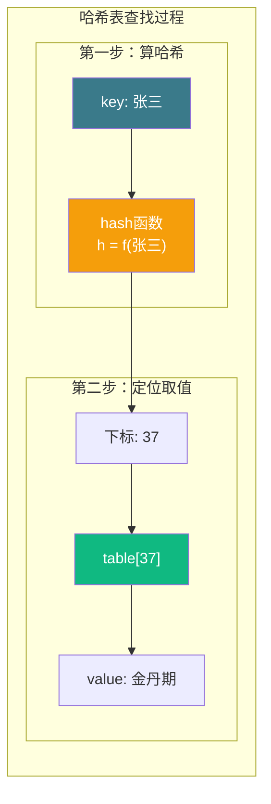
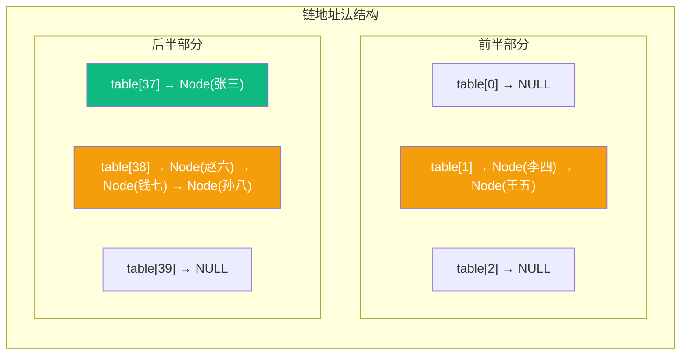
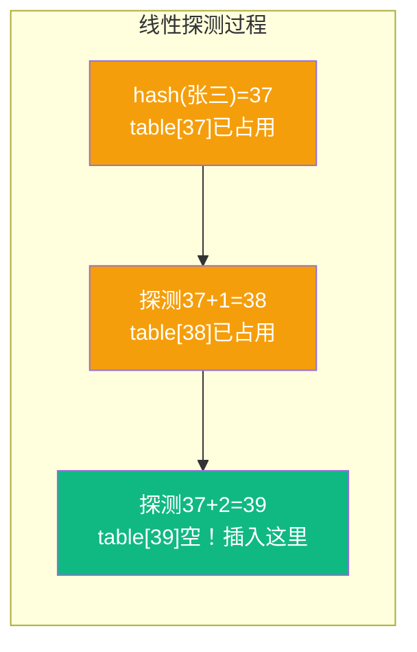
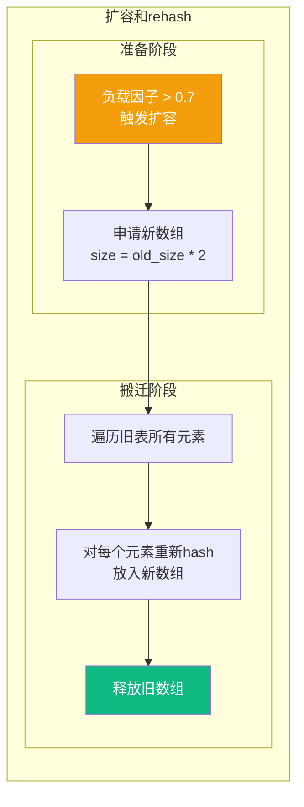
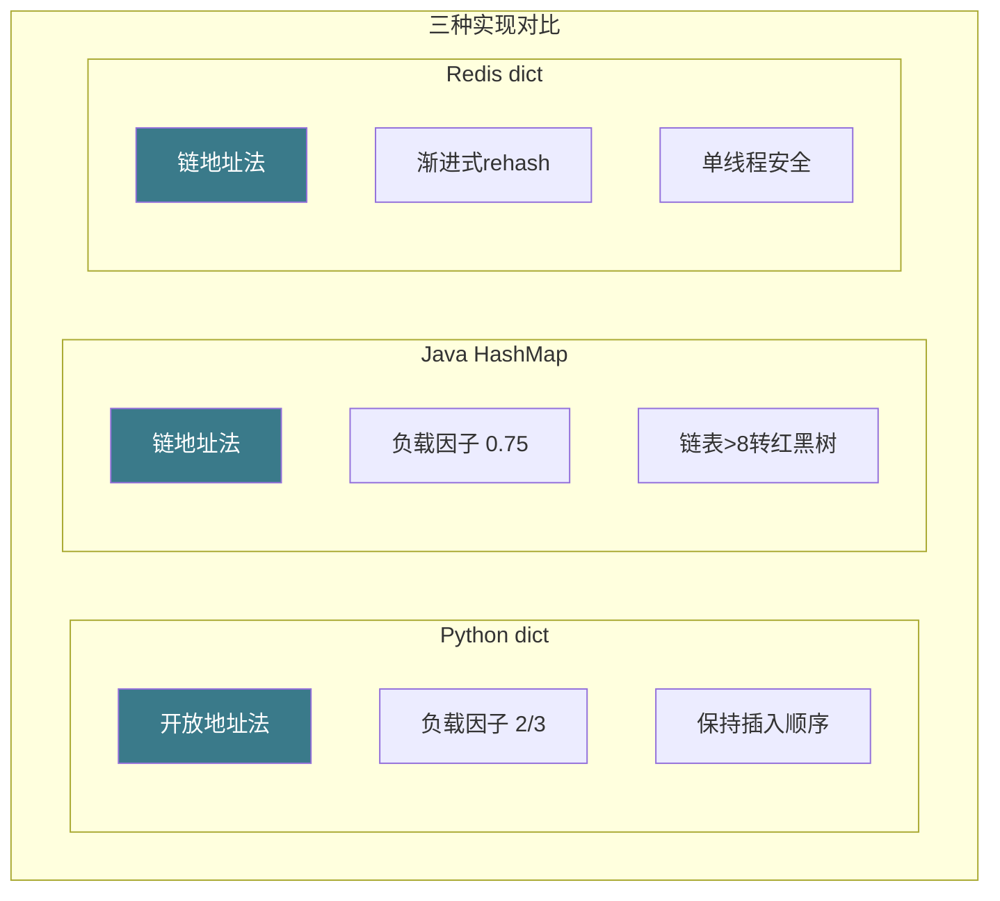

# 【筑基·040】哈希表：用空间换时间

> **码农修仙传 · 筑基期 · 第40篇**
> 我是玄芯散人，带你从炼气修到大乘。

---

## 境界标识

```
╔══════════════════════════════════════╗
║     筑基期 · 第40篇                   ║
║     哈希表：用空间换时间               ║
║     预计阅读：18分钟                   ║
╚══════════════════════════════════════╝
```

---

## 修仙引入

修仙界有一种传送阵，你报出一个洞府编号，阵法立刻把你送过去，不用御剑飞上三天三夜。哈希表就是代码世界里的传送阵：给它一个key，它算出一个数字下标，直接跳到数组对应的位置取数据。不需要从头到尾一个个找，查找速度接近O(1)。

上一篇讲了栈和队列两种受限结构。这一篇讲一种完全不同思路的结构：用空间换时间，用哈希函数把"查找"这件事的成本压到接近零。

---

## 硬核主体

### 一、先说问题：数组查找为什么慢

假设你有一个数组存了1000个修士的名字和修为等级，现在要查"张三"的修为。

```c
typedef struct {
    char name[32];
    int level;
} Cultivator;

Cultivator list[1000];

// 查找张三的修为
int find(const char *name) {
    for (int i = 0; i < 1000; i++) {
        if (strcmp(list[i].name, name) == 0)  // 逐个比较
            return list[i].level;
    }
    return -1;  // 没找到
}
```

最坏情况下要比较1000次，O(n)。如果数组有序，可以用二分查找，O(log n)，1000个元素最多比较10次。但插入和删除需要搬移数据，维护有序的成本很高。

哈希表的思路是：能不能跳过所有比较，直接算出"张三"应该存在数组的第几个位置？

### 二、哈希函数：把key变成下标

哈希函数是一个对应关系：输入任意key，输出一个固定范围的整数（数组下标）。

最简单的哈希函数，对字符串来说，可以把所有字符的ASCII值加起来，再对数组大小取模：

```c
// 简单的字符串哈希函数
int hash(const char *key, int table_size) {
    unsigned long h = 0;
    while (*key) {
        h = h * 31 + (unsigned char)(*key);  // 31是常用乘数
        key++;
    }
    return h % table_size;  // 对应到数组范围内
}
```

有了哈希函数，查找过程变成：算hash(key)得到下标，直接访问数组[hash(key)]。一步到位，O(1)。



但这里有个问题：两个不同的key可能算出相同的哈希值。比如"张三"和"李四"都hash到下标37，这叫哈希冲突。哈希冲突是哈希表必须解决的问题，因为哈希函数把无限可能的key压缩到有限的数组空间里，碰撞不可避免（鸽笼原理）。

### 三、解决冲突：链地址法

链地址法（也叫拉链法）的做法是：数组的每个位置不存单个值，而是存一个链表的头指针。哈希到同一个位置的所有元素都挂在这个链表上。

```c
#include <stdlib.h>
#include <string.h>

typedef struct Node {
    char key[32];
    int value;
    struct Node *next;
} Node;

typedef struct {
    Node **buckets;  // 数组，每个元素是链表头指针
    int size;        // 数组大小
} HashTable;

void ht_init(HashTable *ht, int size) {
    ht->size = size;
    ht->buckets = calloc(size, sizeof(Node *));  // 全部初始化为NULL
}

void ht_put(HashTable *ht, const char *key, int value) {
    int idx = hash(key, ht->size);
    
    // 先查链表里有没有相同的key
    Node *cur = ht->buckets[idx];
    while (cur) {
        if (strcmp(cur->key, key) == 0) {
            cur->value = value;  // key已存在，更新value
            return;
        }
        cur = cur->next;
    }
    
    // 没找到，头插法插入新节点
    Node *node = malloc(sizeof(Node));
    strcpy(node->key, key);
    node->value = value;
    node->next = ht->buckets[idx];
    ht->buckets[idx] = node;
}

int ht_get(HashTable *ht, const char *key) {
    int idx = hash(key, ht->size);
    Node *cur = ht->buckets[idx];
    while (cur) {
        if (strcmp(cur->key, key) == 0)
            return cur->value;
        cur = cur->next;
    }
    return -1;  // 没找到
}
```



查找时先算hash定位到某个桶，然后在该桶的链表上遍历。如果哈希函数分布均匀，每个桶的链表很短，查找基本是O(1)。最坏情况下所有key都hash到同一个桶，退化成O(n)，但这极少发生。

链地址法的优点是实现简单，删除操作也直接。缺点是链表节点分散在堆内存各处，缓存不友好。

### 四、解决冲突：开放地址法

开放地址法不用链表，所有数据都存在数组里。冲突时，按照某种规则找下一个空位。

最常见的策略是线性探测：算出的位置被占了，就往后一个一个找，找到空位为止。

```c
typedef struct {
    char key[32];
    int value;
    int used;  // 0表示空，1表示已用
} Slot;

typedef struct {
    Slot *slots;
    int size;
} OAHashTable;

void oa_put(OAHashTable *ht, const char *key, int value) {
    int idx = hash(key, ht->size);
    
    for (int i = 0; i < ht->size; i++) {
        int probe = (idx + i) % ht->size;  // 线性探测
        
        if (!ht->slots[probe].used) {
            // 找到空位，插入
            strcpy(ht->slots[probe].key, key);
            ht->slots[probe].value = value;
            ht->slots[probe].used = 1;
            return;
        }
        
        if (strcmp(ht->slots[probe].key, key) == 0) {
            // key已存在，更新
            ht->slots[probe].value = value;
            return;
        }
    }
    // 实际生产中应触发rehash扩容，此处简化
}
```



线性探测的问题叫"聚类"：连续被占用的位置会越来越多，后来者要探测更远才能找到空位。改进方案有二次探测（步长是1, 4, 9, 16...而不是1, 2, 3, 4...）和双重哈希（用第二个哈希函数算步长）。

开放地址法的优点是数据全在数组里，缓存友好，访问速度快。缺点是删除比较麻烦，不能直接把slot标记为空（会打断探测链），通常用"墓碑标记"（tombstone）表示已删除但位置不能被跳过。

### 五、负载因子：什么时候该扩容

负载因子 = 已存元素数 / 数组大小。这个值衡量哈希表的拥挤程度。

负载因子为0.5意味着数组有一半是空的，冲突概率低。负载因子到0.9时，开放地址法的探测次数会急剧上升。

链地址法对高负载因子容忍度更高，因为链表可以无限挂。开放地址法超过0.7就该扩容了。

扩容的过程：申请一个更大的数组（通常是原来的2倍），把所有元素重新哈希放进去（rehash）。这个过程是O(n)的，但因为是摊还的（amortized），平摊到每次插入仍然是O(1)。



### 六、为什么哈希表查找是O(1)

严格说，哈希表查找是"平均O(1)，最坏O(n)"。O(1)成立的前提条件：

1. 哈希函数分布均匀，不会让大量key挤到同一个桶
2. 负载因子控制在合理范围内（通常0.5到0.75）
3. 好的冲突解决策略

满足这三个条件，每次查找平均只需要探查1到2次。随着数据量增大，查找时间几乎不变，这就是O(1)的含义。相比之下，有序数组二分查找是O(log n)，100万个元素要比较20次；哈希表还是1到2次。

### 七、哈希表在真实世界中的样子

Python的dict就是哈希表。CPython的实现用的是开放地址法，初始大小8，负载因子超过2/3就扩容。Python 3.7以后dict保证插入顺序，实现上是用两个数组，一个存索引一个存数据，索引数组里用特殊值标记空槽和已删除的槽（墓碑），兼顾了哈希查找和顺序遍历。

Java的HashMap用链地址法，数组加链表。Java 8之后，某个桶的链表长度超过8且数组大小超过64时，链表转成红黑树，防止恶意构造的key导致退化攻击。反过来，当桶内元素减少到6时，红黑树会退回链表。

Redis的字典也是链地址法，扩容时采用渐进式rehash：每次操作时顺便搬几个桶到新表，避免rehash期间服务卡顿。这对单线程的Redis很重要，一次rehash几百万个key会阻塞好几秒。



### 八、哈希表的局限

哈希表不是万能的。它不支持范围查询：你不能像有序数组那样"找出所有level在50到80之间的修士"。哈希表也不保证顺序（Python dict除外，那是额外实现的）。遍历哈希表的元素顺序在多数语言中是未定义的。

如果你需要范围查询，应该用有序结构（二叉搜索树或B+树）。如果你需要按顺序遍历，也要考虑别的结构。哈希表擅长的是精确查找：给定一个key，快速找到对应的value，仅此而已。

---

## 修仙术语对照表

| 修仙术语 | 技术现实 | 本篇位置 |
|---------|---------|---------|
| 传送阵 | 哈希表，输入key直接定位到存储位置 | 修仙引入 |
| 洞府编号 | 哈希函数计算出的数组下标 | 哈希函数 |
| 鸽笼原理 | 有限数组装无限key必然冲突 | 哈希冲突 |
| 同洞府多人 | 哈希冲突，多个key落到同一位置 | 冲突问题 |
| 分支走廊 | 链地址法，每个桶挂一个链表 | 链地址法 |
| 挤一挤挪位置 | 开放地址法，冲突时探测下一个空位 | 开放地址法 |
| 探路步幅 | 线性探测和二次探测的步长策略 | 开放地址法 |
| 洞府拥挤度 | 负载因子，已用/总数比例 | 负载因子 |
| 开辟新洞府群 | 扩容，申请新数组并rehash | 扩容 |
| 搬迁重排 | rehash，所有元素重新计算位置 | 扩容 |
| 传送精度 | O(1)查找成立的三个前提条件 | 为什么O(1) |
| 传送阵变体 | Python dict/Java HashMap/Redis dict的不同实现 | 真实世界 |
| 传送阵不能做的事 | 哈希表不支持范围查询和有序遍历 | 局限性 |

---

## 进阶条件

- [ ] 能用C语言实现链地址法哈希表，包含put和get操作
- [ ] 能解释哈希冲突为什么不可避免（鸽笼原理）
- [ ] 能说出线性探测和二次探测的区别，以及聚类问题是什么
- [ ] 能解释负载因子的含义，知道开放地址法通常超过多少就该扩容（0.7）
- [ ] 能说出rehash的过程，以及为什么扩容后是平均O(1)而不是O(n)
- [ ] 能对比Python dict和Java HashMap和Redis dict三种实现的差异
- [ ] 面对需要范围查询的需求，能判断不该用哈希表而该用有序结构

全部勾掉，哈希表这个"空间换时间"的法器你就真掌握了。下一篇讲树形结构，二叉树怎么演化出红黑树，数据库索引和文件系统都靠它。

---

## 下期预告 + 互动

下一篇：树：二叉搜索树到红黑树。二叉搜索树的查找为什么是O(log n)，AVL树怎么保持平衡，红黑树为什么被Linux内核和Java HashMap选中。

互动问题：你平时用哈希表（dict/HashMap/map）有没有遇到过性能问题？有没有哪次发现哈希表比预期慢很多，后来查出来是哈希冲突太多？评论区聊聊。

我是玄芯散人，带你从炼气修到大乘。

---

*本文是「码农修仙传」系列第40篇。系列导航见 [xren.ren](https://xren.ren)*
