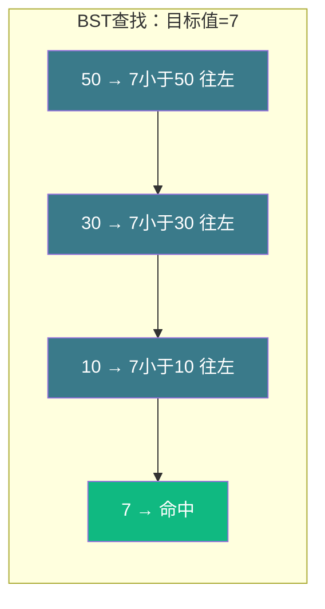
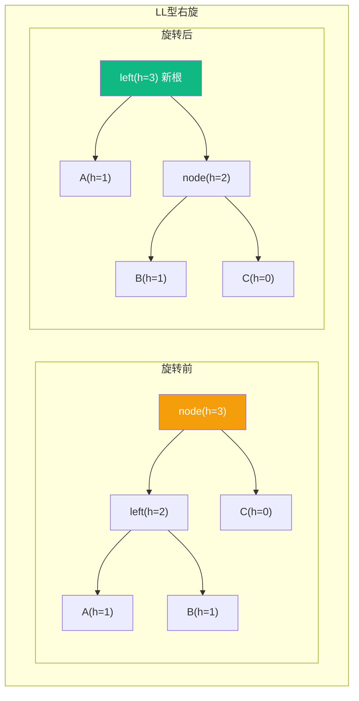
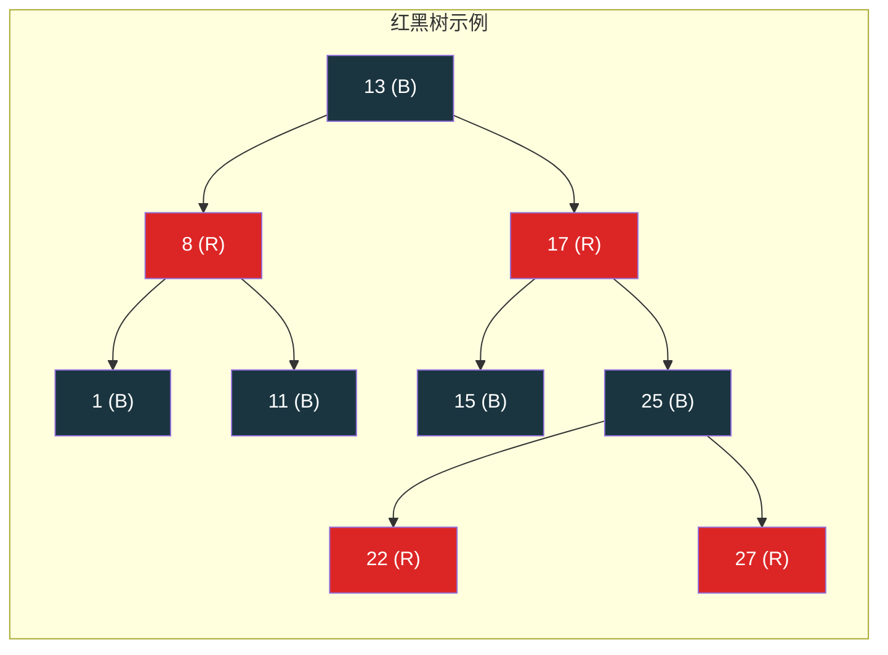
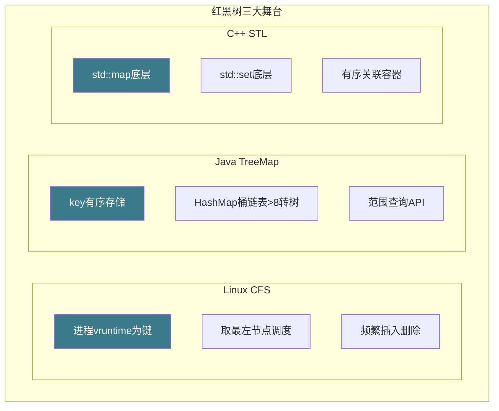

# 【筑基·041】二叉树和红黑树：为什么Linux内核偏爱它

> **码农修仙传 · 筑基期 · 第41篇**
> 我是玄芯散人，带你从炼气修到大乘。

---

## 境界标识

```
╔══════════════════════════════════════╗
║     筑基期 · 第41篇                   ║
║     二叉树和红黑树：为什么Linux内核偏爱它  ║
║     预计阅读：20分钟                   ║
╚══════════════════════════════════════╝
```

---

## 修仙引入

宗门藏经阁有十万卷功法，按编号排成一棵倒挂的树：顶层是总纲，往下分经史子集，再往下分子目录。你找一本书不用一卷卷翻，沿着分支几步就能定位。这种"从根到叶逐层缩小范围"的结构，就是树。

上一篇哈希表的传送阵确实快，O(1)查找碾压一切。但传送阵有个硬伤：不支持范围查询。你要找"修为在50到80之间的所有弟子"，哈希表束手无策。树结构天然有序，范围查询是它的主场。

---

## 硬核主体

### 一、树是什么：倒挂的族谱

树是一种层次结构。最顶上的节点叫根，每个节点下面可以有多个子节点，没有子节点的叫叶。父子关系是单向的，不能形成环。

```
        根(总纲)
       /    \
    经部      史部
   /  \      /  \
卷一 卷二  卷三  卷四
```

树结构在计算机里无处不在：文件系统是树，HTML DOM是树，数据库索引是树，编译器语法树也是树。

二叉树是树的一种特例：每个节点最多两个子节点，分别叫左孩子和右孩子。这篇主要讲二叉树，因为它是后续所有平衡树的基础。

```c
// 二叉树节点的标准定义
typedef struct TreeNode {
    int val;
    struct TreeNode *left;
    struct TreeNode *right;
} TreeNode;

// 创建一个节点
TreeNode *create_node(int val) {
    TreeNode *node = malloc(sizeof(TreeNode));
    node->val = val;
    node->left = NULL;
    node->right = NULL;
    return node;
}
```

### 二、二叉搜索树：自带查找逻辑的树

普通二叉树只是存了数据，查找还得遍历整棵树，跟链表没区别。二叉搜索树（BST）加了一条规则：左子树所有节点的值小于根，右子树所有节点的值大于根。

这条规则让查找变成"猜数字"游戏：大了往左走，小了往右走，每走一步排除掉一半的节点。

```c
// BST查找：像二分查找一样逐层缩小范围
TreeNode *bst_search(TreeNode *root, int target) {
    while (root) {
        if (target == root->val)
            return root;        // 找到了
        else if (target < root->val)
            root = root->left;  // 往左走
        else
            root = root->right; // 往右走
    }
    return NULL;  // 没找到
}

// BST插入：找到空位挂上去
TreeNode *bst_insert(TreeNode *root, int val) {
    if (!root)
        return create_node(val);

    if (val < root->val)
        root->left = bst_insert(root->left, val);
    else if (val > root->val)
        root->right = bst_insert(root->right, val);
    // val相等时不插入（或更新，看需求）

    return root;
}
```

如果树是平衡的，每走一步排除一半，查找是O(log n)。100万个元素，最多走20步。跟二分查找一个量级。



问题来了：BST的形状取决于插入顺序。如果你按1, 2, 3, 4, 5的顺序插入，每个新节点都比前一个大，全走右边，树退化成一条链：

```
1
 \
  2
   \
    3
     \
      4
       \
        5
```

退化成链表的BST，查找回到O(n)，100万个元素最多走100万步。树的优势荡然无存。这就是为什么需要平衡树。

### 三、AVL树：严格平衡的强迫症

AVL树是最早发明的自平衡二叉搜索树（1962年，Adelson-Velsky和Landis发明）。它在每个节点存一个平衡因子：左子树高度减右子树高度。平衡因子的绝对值不能超过1，一旦超过就触发旋转。

旋转是什么？把子树换个根，让高度差回到1以内。有四种情况：

1. 左左（LL）：左孩子的左子树太高，右旋一次解决
2. 右右（RR）：右孩子的右子树太高，左旋一次解决
3. 左右（LR）：左孩子的右子树太高，先左旋左孩子变成LL，再右旋
4. 右左（RL）：右孩子的左子树太高，先右旋右孩子变成RR，再左旋

```c
// 右旋：以node为支点顺时针转
//     node          left
//     /  \          /  \
//   left  C  →     A   node
//   /  \                /  \
//  A    B              B    C
TreeNode *rotate_right(TreeNode *node) {
    TreeNode *left = node->left;
    node->left = left->right;   // B变成node的左孩子
    left->right = node;         // node变成left的右孩子
    update_height(node);
    update_height(left);
    return left;  // left是新根
}

// 左旋：以node为支点逆时针转（对称操作）
TreeNode *rotate_left(TreeNode *node) {
    TreeNode *right = node->right;
    node->right = right->left;
    right->left = node;
    update_height(node);
    update_height(right);
    return right;
}
```



AVL树的高度差严格不超过1，这叫"严格平衡"。好处是查找极快，树高始终在1.44log(n)以内。坏处是插入删除时旋转频繁：每次插入可能触发多级旋转，调整代价高。

适合情况：查找多，插入删除少。比如只读的字典表，建好以后几乎不改动。

### 四、红黑树：工程界的万金油

红黑树是一种弱平衡的BST。它不追求每个节点的高度差都不超过1，而是用五条性质保证树高不超过2log(n+1)。

红黑树的五条性质：

1. 每个节点是红色或黑色
2. 根节点是黑色
3. 叶子节点（NIL空节点）是黑色
4. 红色节点的子节点必须是黑色（不能有连续两个红色节点）
5. 任意节点到其所有叶子节点的路径上，黑色节点数量相同

第4条和第5条配合，保证最长路径不超过最短路径的两倍。因为最短路径全是黑色节点，最长路径黑红交替，黑节点数量相同，红色最多跟黑色一样多，所以最长不超过最短的两倍。



红黑树的插入和删除比AVL树复杂，因为要同时维护颜色规则和BST性质。插入新节点默认是红色（不违反第5条黑节点数量相同的规则），然后通过"变色"和"旋转"修复可能违反的第4条。

插入修复的主干逻辑：看叔叔节点的颜色。叔叔是红色，变色解决（父和叔变黑，祖父变红，然后往上递归）。叔叔是黑色，旋转解决（跟AVL的四种情况类似，但多一步变色）。

```c
// 红黑树插入修复（简化版，展示主干逻辑）
void rb_insert_fixup(RBTree *tree, TreeNode *node) {
    // node是红色，如果父也是红色，违反性质4
    while (node->parent && node->parent->color == RED) {
        TreeNode *parent = node->parent;
        TreeNode *grandpa = parent->parent;
        TreeNode *uncle;

        if (parent == grandpa->left) {
            uncle = grandpa->right;
            if (uncle && uncle->color == RED) {
                // 情况1：叔叔红，变色后往上走
                parent->color = BLACK;
                uncle->color = BLACK;
                grandpa->color = RED;
                node = grandpa;  // 往上检查
            } else {
                if (node == parent->right) {
                    // 情况2：node是右孩子，先左旋变成LL
                    node = parent;
                    rotate_left(tree, node);
                    parent = node->parent;
                }
                // 情况3：node是左孩子，右旋+变色
                parent->color = BLACK;
                grandpa->color = RED;
                rotate_right(tree, grandpa);
            }
        } else {
            // 对称情况：parent是grandpa的右孩子
            // 逻辑完全镜像，省略
        }
    }
    tree->root->color = BLACK;  // 性质2：根永远是黑色
}
```

红黑树和AVL树的取舍：

| 对比项 | AVL树 | 红黑树 |
|------|-------|--------|
| 平衡程度 | 严格（高度差≤1） | 弱（最长≤2倍最短） |
| 查找速度 | 更快（树更矮） | 略慢（树更高） |
| 插入删除旋转次数 | 多（每次都可能多级旋转） | 少（插入≤2次，删除≤3次） |
| 适合情况 | 查找密集 | 读写均衡 |

工程中红黑树用得更多。原因不在查找速度（实际上AVL查找更快），而在修改开销。实际数据频繁增删，AVL的旋转代价盖过了查找优势。

### 五、红黑树在真实世界的三个舞台

红黑树不是教科书里的花瓶，它撑起了几个重量级系统的运转。

第一个：Linux内核CFS调度器。069篇（金丹期）讲过CFS完全公平调度器，它用红黑树管理可运行进程。进程的vruntime作为键，vruntime最小的进程在最左边，调度器直接取最左节点运行。进程运行时vruntime增加，重新插入红黑树。这棵树频繁插入删除，AVL的旋转开销太大，红黑树刚好。

第二个：Java TreeMap和HashMap。Java 8的HashMap在某个桶的链表长度超过8时转红黑树，防止哈希冲突退化攻击。TreeMap底层就是红黑树，所有操作O(log n)，还能做范围查询。TreeMap提供了subMap、headMap等方法来取出某个范围内的数据。

第三个：C++ STL的std::map和std::set。GCC和Clang的STL实现都用红黑树作为map和set的底层结构。每次insert和erase都维持红黑树性质。



### 六、B+树：树往多路走

二叉树每个节点最多两个子节点，树高随数据量增长。100万数据，平衡二叉树高约20。10亿数据，树高约30。看起来不高，但每个节点是一次磁盘IO。磁盘IO比内存操作慢10万倍，30次IO意味着30毫秒，对数据库来说太慢了。

B树把一个节点做大，存多个键值和多个子指针。一个节点能装100个键值，树高立刻降下来。100万数据，B树高可能只有3层。B+树在B树基础上，数据全存在叶子节点，叶子之间用链表串起来，范围查询变成了链表遍历，这就是MySQL InnoDB索引的结构。

B树和B+树的深入留到化神期134篇讲数据库引擎实现。筑基期只需要知道：二叉树是所有树形结构的根，平衡二叉树解决了退化问题，多路搜索树（B树系列）解决了磁盘IO问题。

---

## 修仙术语对照表

| 修仙术语 | 技术现实 | 本篇位置 |
|---------|---------|---------|
| 藏经阁分层目录 | 树形层次结构 | 修仙引入 |
| 倒挂的族谱 | 树的根在顶部叶在底部 | 树是什么 |
| 逐层缩小范围 | BST每走一步排除一半节点 | 二叉搜索树 |
| 猜数字游戏 | BST查找过程类似二分查找 | 二叉搜索树 |
| 树退化成线 | BST插入有序数据退化为链表O(n) | 二叉搜索树 |
| 强迫症平衡 | AVL树严格平衡，高度差≤1 | AVL树 |
| 旋转换根 | AVL树的四种旋转操作 | AVL树 |
| 弱平衡 | 红黑树保证最长路径≤2倍最短 | 红黑树 |
| 五条门规 | 红黑树的五条性质 | 红黑树 |
| 叔叔节点定策略 | 插入修复看叔叔颜色决定变色还是旋转 | 红黑树 |
| 读写折中 | 红黑树查找略慢但插入删除旋转少 | AVL与红黑对比 |
| 宗门调度队列 | Linux CFS用红黑树管理进程 | 三大舞台 |
| 法器底架 | std::map和TreeMap底层用红黑树 | 三大舞台 |
| 一层多键值 | B树/B+树多路搜索降低树高 | B+树预告 |

---

## 进阶条件

- [ ] 能用C语言实现BST的查找和插入，解释为什么最坏情况是O(n)
- [ ] 能说出AVL树平衡因子的定义和触发旋转的阈值（绝对值>1）
- [ ] 能画出LL型右旋前后的树形变化，标注每个节点的高度
- [ ] 能复述红黑树的五条性质，解释第4条和第5条如何保证最长路径不超过最短路径的两倍
- [ ] 能说出红黑树插入新节点默认是什么颜色以及为什么（红色，不违反黑节点数量相同的规则）
- [ ] 能举出红黑树在实际工程中的三个用法（CFS调度、TreeMap/std::map、HashMap桶转树）
- [ ] 能解释为什么AVL树查找更快但工程中红黑树用得更多（旋转开销取舍）

全部勾掉，树形结构这块你就进阶到了"知道该用什么"的层次。下一篇讲图，社交网络和导航最短路径背后的数据结构。

---

## 下期预告 + 互动

下一篇：图：社交网络和导航的最短路径。图的两种表示（邻接数组和邻接表），BFS和DFS两种遍历，Dijkstra最短路径算法怎么在地图App里算路线。

互动问题：你在工作里有没有直接用过红黑树？或者你用的语言里哪个容器底层是红黑树你之前不知道的？评论区聊聊，看看多少人天天用红黑树却没意识到。

我是玄芯散人，带你从炼气修到大乘。

---

*本文是「码农修仙传」系列第41篇。系列导航见 [xren.ren](https://xren.ren)*
