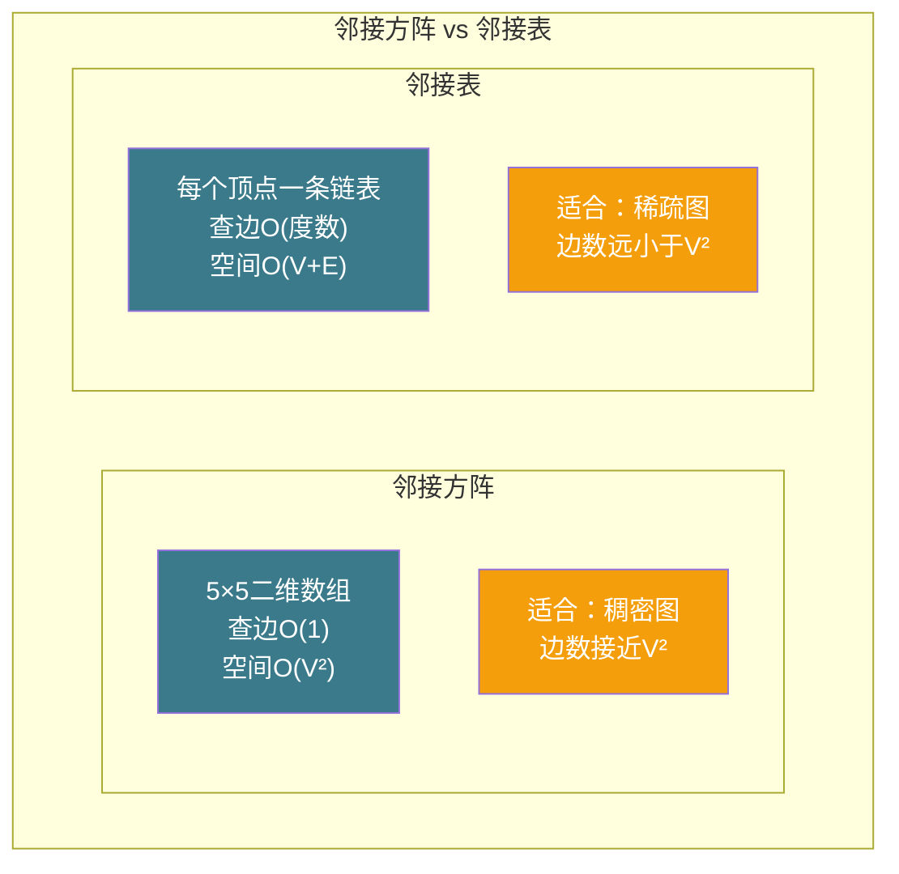
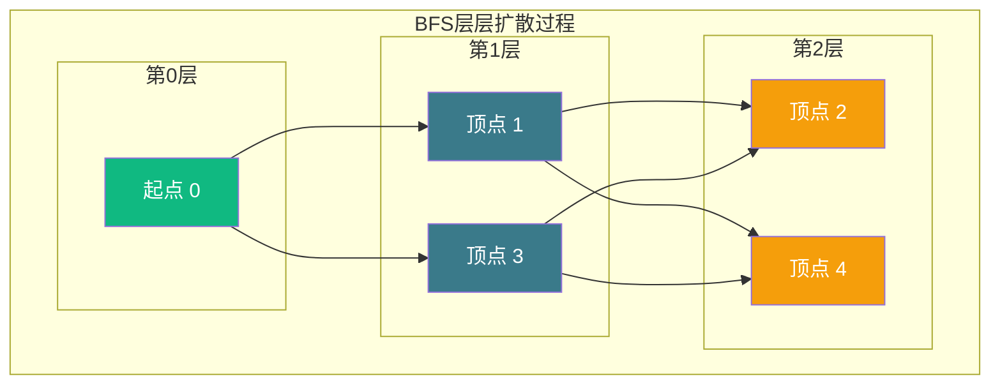
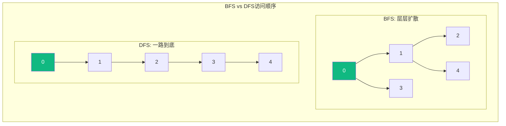
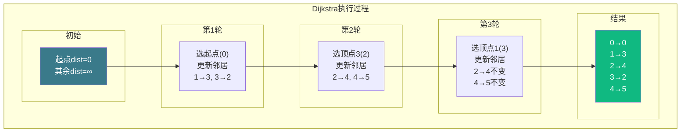
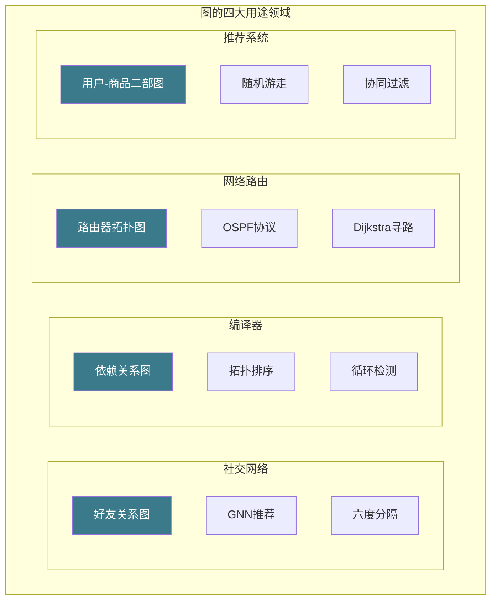

# 【筑基·042】图：社交网络和导航最短路径背后的数据结构

> **码农修仙传 · 筑基期 · 第42篇**
> 我是玄芯散人，带你从炼气修到大乘。

---

## 境界标识

```
╔══════════════════════════════════════╗
║     筑基期 · 第42篇                   ║
║     图：社交网络和导航最短路径          ║
║     预计阅读：22分钟                   ║
╚══════════════════════════════════════╝
```

---

## 修仙引入

修仙界的宗门关系比树复杂多了。树只能表达"师徒传承"这种单向层级，但宗门之间的关系交织成一团，什么结盟仇怨联姻都有。你认识张三，张三认识李四，李四又认识你，这种回路在树里没法表示。

图就是专门处理这种关系网的数据结构。社交网络里谁认识谁，地图导航里城市之间的公路，编译器里代码的依赖关系，底层都是图。这篇讲图的两种存法，再讲BFS和DFS两种遍历，最后讲Dijkstra最短路径算法怎么在导航App里帮你算路线。

---

## 硬核主体

### 一、图是什么：比树多了一条回路

上一篇讲树的时候说，树是单向层级结构，不能有环。图把这条限制取消了：节点之间可以任意连接，有向无向都行，回路也行。

图的基本组成：
- 顶点（Vertex）：图中的节点，比如社交网络里的每个人
- 边（Edge）：连接两个顶点的关系，比如"认识"这条关系

边分两种情况。有向图的边有指向，A指向B不等于B指向A，适合表示"关注"关系。无向图的边没有指向，A和B互相关联，适合表示"好友"关系。

边还可以带权重。地图上两个城市之间的距离，社交网络里两个人的亲密度，都是权重。带权重的图叫加权图，Dijkstra算法就是在加权图上找最短路径。

```c
// 图的顶点定义
typedef struct Vertex {
    int id;            // 顶点编号
    char name[32];     // 顶点名称
} Vertex;

// 边的定义（用于邻接表）
typedef struct Edge {
    int to;            // 目标顶点编号
    int weight;        // 权重（无权图设为1）
    struct Edge *next; // 指向下一条边
} Edge;

// 图的定义
typedef struct {
    Vertex *vertices;  // 顶点数组
    Edge **adj;        // 邻接表（每个顶点的边链表头指针）
    int vcount;        // 顶点数
    int directed;      // 1=有向图，0=无向图
} Graph;
```

### 二、图的两种存法

存图有两种方式，各有适用情况。

邻接方阵用一个V×V的二维数组表示图。`matrix[i][j]`为1表示顶点i和顶点j之间有边，为0表示没有。加权图里把1换成权重值。

```c
// 邻接方阵表示
#define MAX_V 100
int matrix[MAX_V][MAX_V] = {0};

// 添加边：顶点u到顶点v，权重w
void add_edge_matrix(int matrix[][MAX_V], int u, int v, int w, int directed) {
    matrix[u][v] = w;
    if (!directed)
        matrix[v][u] = w;  // 无向图双向都存
}
```

以一个5人社交网络为例，关系如下：0-1, 0-3, 1-2, 1-4, 2-3, 3-4

```
邻接方阵（无向图）：
     0  1  2  3  4
  0 [0  1  0  1  0]
  1 [1  0  1  0  1]
  2 [0  1  0  1  0]
  3 [1  0  1  0  1]
  4 [0  1  0  1  0]
```

邻接方阵的好处是查边特别快，`matrix[i][j]`一步就知道i和j之间有没有边，O(1)。缺点是空间占用V²，不管边多边少都占那么多。10000个顶点的图，方阵就1亿个元素，大部分是0，浪费内存。

邻接表给每个顶点维护一个链表，只存它连出去的边。空间是O(V+E)，V是顶点数，E是边数。稀疏图（边很少）用邻接表省空间。

```c
// 邻接表：添加边
void add_edge_adj(Graph *g, int from, int to, int weight) {
    Edge *e = malloc(sizeof(Edge));
    e->to = to;
    e->weight = weight;
    e->next = g->adj[from];  // 头插法
    g->adj[from] = e;

    if (!g->directed) {
        // 无向图，反方向也加一条
        Edge *e2 = malloc(sizeof(Edge));
        e2->to = from;
        e2->weight = weight;
        e2->next = g->adj[to];
        g->adj[to] = e2;
    }
}
```

同一个5人社交网络，邻接表长这样：

```
顶点0 → 3 → 1 → NULL
顶点1 → 4 → 2 → 0 → NULL
顶点2 → 3 → 1 → NULL
顶点3 → 4 → 2 → 0 → NULL
顶点4 → 3 → 1 → NULL
```



社交网络是典型的稀疏图。你有微信好友几百人，但微信总用户十亿，好友数占总用户的亿分之一都不到。这种图用邻接表存，内存占用比邻接方阵小几个数量级。

### 三、BFS：层层扩散的广度优先搜索

图的遍历就是选一个顶点作为起点，然后访问所有能到达的顶点。BFS（Breadth-First Search）的策略是"层层扩散"：先访问起点，再访问起点的所有邻居，然后访问邻居的邻居，像水波纹一样往外扩。

BFS需要借助队列实现。访问一个顶点后，把它的邻居全放进队列，下次从队列头部取下一个顶点继续。

```c
#include <string.h>

// BFS遍历，从顶点start出发
void bfs(Graph *g, int start) {
    int visited[g->vcount];
    memset(visited, 0, sizeof(visited));

    // 简单的队列实现
    int queue[g->vcount];
    int head = 0, tail = 0;

    queue[tail++] = start;      // 起点入队
    visited[start] = 1;

    while (head < tail) {
        int v = queue[head++];  // 队头出队
        printf("访问顶点: %s\n", g->vertices[v].name);

        // 遍历v的所有邻居
        Edge *e = g->adj[v];
        while (e) {
            if (!visited[e->to]) {
                visited[e->to] = 1;
                queue[tail++] = e->to;  // 邻居入队
            }
            e = e->next;
        }
    }
}
```

BFS有个关键特性：在无权图上，它第一次到达某个顶点时，走的就是最短路径。因为BFS按层扩散，先到的一定比后到的近。

以社交网络为例，你想知道"我跟某个陌生人之间隔了几个人"，BFS以你为起点，第几层扩散到那个人，就隔了几层关系。著名的"六度分隔理论"说任意两个人之间最多隔6个人，用BFS可以验证这个说法。



BFS用邻接表实现时，每个顶点和每条边各访问一次，时间开销是O(V+E)。

### 四、DFS：一条路走到黑的深度优先搜索

DFS（Depth-First Search）的策略跟BFS相反：选一个起点，沿着一条路一直走，走到没路了再回头换条路。就像走迷宫，先一直走到底，死路就退回来换条路走。

DFS用递归实现最自然，递归调用栈就是"回头"的路径。也可以用显式栈来避免递归过深导致栈溢出。

```c
// DFS遍历（递归实现）
void dfs(Graph *g, int v, int visited[]) {
    visited[v] = 1;
    printf("访问顶点: %s\n", g->vertices[v].name);

    Edge *e = g->adj[v];
    while (e) {
        if (!visited[e->to]) {
            dfs(g, e->to, visited);  // 递归深入
        }
        e = e->next;
    }
}

// DFS入口
void dfs_start(Graph *g, int start) {
    int visited[g->vcount];
    memset(visited, 0, sizeof(visited));
    dfs(g, start, visited);
}
```

DFS和BFS都能遍历所有可达顶点，但访问顺序不同。BFS先宽后深，DFS先深后宽。选择哪个取决于你要解决的问题：

- 找最短路径（无权图）用BFS，因为它天然按距离顺序访问
- 找连通分量用DFS，递归写法简洁
- 检测图里有没有环用DFS，记录访问路径中的"回边"就行。无向图用单visited数组够用，有向图需要三色标记（白=未访问，灰=在递归栈中，黑=已完成），遇到灰色节点说明有环
- 拓扑排序用DFS，课程依赖、编译顺序都靠它



### 五、Dijkstra最短路径：导航App背后的算法

BFS能找无权图的最短路径，但现实中的图通常有权重。北京到上海可以走高速（快但远），也可以走国道（近但慢）。带权重的最短路径需要更聪明的算法。

Dijkstra算法的思路是：维护一个"已知最短距离"的表，以起点为基准，每次挑一个距离最近的未访问顶点，更新它邻居的距离。反复执行直到所有顶点都访问过。

```c
// Dijkstra最短路径（邻接表 + 数组版）
#define INF 0x7FFFFFFF

void dijkstra(Graph *g, int start, int *dist) {
    int visited[g->vcount];
    memset(visited, 0, sizeof(visited));

    // 初始化：起点距离0，其余无穷大
    for (int i = 0; i < g->vcount; i++)
        dist[i] = INF;
    dist[start] = 0;

    for (int i = 0; i < g->vcount; i++) {
        // 找当前距离最小的未访问顶点
        int u = -1, min_dist = INF;
        for (int j = 0; j < g->vcount; j++) {
            if (!visited[j] && dist[j] < min_dist) {
                min_dist = dist[j];
                u = j;
            }
        }
        if (u == -1) break;  // 剩余顶点不可达
        visited[u] = 1;

        // 用u更新其邻居的距离
        Edge *e = g->adj[u];
        while (e) {
            int v = e->to;
            // 加守护防止INF溢出
            if (!visited[v] && dist[u] != INF
                && dist[u] + e->weight < dist[v]) {
                dist[v] = dist[u] + e->weight;  // 松弛操作
            }
            e = e->next;
        }
    }
}
```

上面这个"每次找最小距离顶点"用的是线性扫描，O(V)一次，总共V轮，加上遍历所有边，总时间O(V² + E)。对于顶点数少的图够用了。

如果用优先队列（最小堆）替代线性扫描，每次取最小值只要O(log V)，总时间降到O((V + E) log V)。顶点数大的图这个改进很明显。10000个顶点的图，O(V²)是1亿次操作，O((V+E)log V)可能只有几十万次。



Dijkstra有个限制：不能处理负权边。它假设"已访问的顶点距离不会再变小"，负权边会打破这个假设。如果有负权边，需要用Bellman-Ford算法，代价是时间开销变大O(VE)。现实中的导航App几乎不会有负权重（距离和时间都是正数），所以Dijkstra够用。

实际导航App不会对整张全国路网跑Dijkstra，那太慢了。工程上的做法是用A*算法，加一个启发式函数（比如两点直线距离）引导搜索走向，避免往反方向走太远。A*在Dijkstra基础上加了"方向感"，搜索范围小很多，结果一样是最短路径。

### 六、图在真实世界的样子

图在工程中的用途远不止社交网络和导航。

社交网络：Facebook用图存好友关系，LinkedIn用图存职业关系。Graph Neural Network（GNN）是近年热门领域，直接在图结构上做机器学习，推荐好友、检测欺诈账号都用得到。

编译器：源文件的依赖关系是有向图。Makefile里`a.o`依赖`b.h`，`b.h`依赖`c.h`，编译器用拓扑排序决定编译顺序。循环依赖就是图里有环，编译器报错。

网络路由：互联网本身就是一张巨大的图，路由器是顶点，网线是边。OSPF协议用Dijkstra算最短路径，跟导航App用同一个算法。

推荐系统：电商的"买了这个的人还买了"功能，底层是用户和商品构成的二部图。通过图上的随机游走算法发现潜在关联。



---

## 修仙术语对照表

| 修仙术语 | 技术现实 | 本篇位置 |
|---------|---------|---------|
| 宗门关系网 | 图结构，顶点和边构成 | 修仙引入 |
| 师徒传承 | 树结构，单向层级不能有环 | 图是什么 |
| 有向边指向 | 有向图，边有指向 | 图是什么 |
| 亲密度 | 边的权重 | 图是什么 |
| 名册方阵 | 邻接方阵，V×V二维数组 | 两种存法 |
| 关系链表 | 邻接表，每个顶点挂边链表 | 两种存法 |
| 水波纹扩散 | BFS层层扩散访问 | BFS |
| 六度分隔 | BFS在社交网络中验证最短关系链 | BFS |
| 走迷宫不回头 | DFS一条路走到底再回溯 | DFS |
| 回头换路 | DFS递归调用栈的回溯 | DFS |
| 已知最短距离表 | Dijkstra维护的dist数组 | Dijkstra |
| 松弛操作 | dist[u]+w(u,v) < dist[v]时更新 | Dijkstra |
| 负权禁区 | Dijkstra不能处理负权边 | Dijkstra |
| 方向感引导 | A*算法的启发式函数 | Dijkstra |
| 编译顺序 | 拓扑排序，依赖关系图的用途 | 真实世界 |

---

## 进阶条件

- [ ] 能用C语言实现邻接表的建图和遍历，说清楚邻接方阵和邻接表的空间开销分别是O(V²)和O(V+E)
- [ ] 能解释BFS为什么在无权图上能找最短路径（第一次到达时距离最短）
- [ ] 能用BFS判断一张图是否二分图，或者计算社交网络中两人间隔几层关系
- [ ] 能手写DFS递归版本，解释递归调用栈和回溯的关系
- [ ] 能用DFS检测有向图中的环（记录递归栈中的顶点，发现回边即有环）
- [ ] 能说出Dijkstra算法的时间开销：数组版O(V²)，堆改进版O((V+E)log V)
- [ ] 能解释Dijkstra为什么不能处理负权边，知道负权情况要用Bellman-Ford
- [ ] 能举出图在工程中的四个用途领域（社交网络，编译器依赖，网络路由，推荐系统）

全部勾掉，图这个"关系网"的数据结构你就真正入门了。下一篇讲算法复杂度，O(n)到底在说什么，为什么面试官总问你时间复杂度。

---

## 下期预告 + 互动

下一篇：算法复杂度：O(n)到底在说什么。大O表示法的含义，时间复杂度和空间复杂度的区别，常见复杂度等级对比，为什么O(n²)在数据量大时会崩。

互动问题：你有没有在导航App里遇到过路线不合理的情况？比如明明有更近的路但App没推荐，你觉得可能是什么原因？评论区聊聊，看看有多少人被导航坑过。

我是玄芯散人，带你从炼气修到大乘。

---

*本文是「码农修仙传」系列第42篇。系列导航见 [xren.ren](https://xren.ren)*
