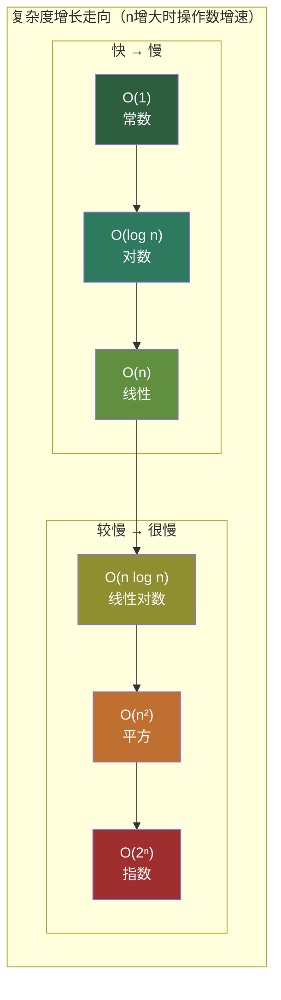
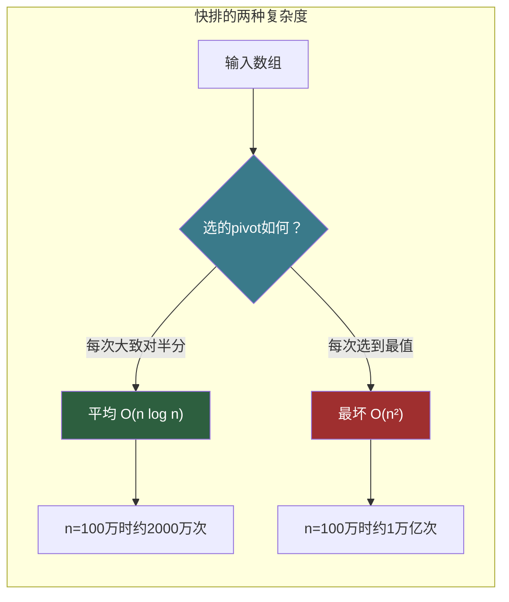

# 【筑基·043】算法复杂度：O(n)到底在说什么

> **码农修仙传 · 筑基期 · 第43篇**
> 我是玄芯散人，带你从炼气修到大乘。

---

## 境界标识

```
╔══════════════════════════════════════╗
║     筑基期 · 第43篇                   ║
║     算法复杂度：O(n)到底在说什么       ║
║     预计阅读：20分钟                   ║
╚══════════════════════════════════════╝
```

---

## 修仙引入

修仙界比武，不比谁修为高，比谁用更少的灵力打出更高的伤害。同样一个"击退敌人"的目标，有人烧了八成灵力，有人只花两成，高下立判。

算法也是一样的道理。同一个问题，不同的解法消耗的资源天差地别。算法复杂度就是衡量"这个算法到底烧多少灵力"的标尺。上一篇讲了图这种数据结构，BFS遍历一个图需要多少步？二分查找为什么比线性查找快，快多少？这些问题都需要一套统一的度量语言来回答。大O表示法就是这套语言。

---

## 硬核主体

### 一、为什么需要一套度量语言

先看一个具体问题：在一个有序数组里找一个数字。

```c
// 方法一：线性查找，从头到尾一个个比
int linear_search(int arr[], int n, int target) {
    for (int i = 0; i < n; i++) {
        if (arr[i] == target)
            return i;  // 找到了，返回下标
    }
    return -1;  // 没找到
}

// 方法二：二分查找，每次砍一半
int binary_search(int arr[], int n, int target) {
    int left = 0, right = n - 1;
    while (left <= right) {
        int mid = left + (right - left) / 2;  // 防溢出写法
        if (arr[mid] == target)
            return mid;
        else if (arr[mid] < target)
            left = mid + 1;   // 目标在右半边
        else
            right = mid - 1;  // 目标在左半边
    }
    return -1;
}
```

数组有1000个元素时，线性查找最坏要比较1000次，二分查找最坏比较10次（因为2^10=1024>1000）。数组有100万个元素时，线性查找最坏100万次，二分查找最坏20次。

差距巨大。但怎么用一套通用语言来描述这种差距？总不能每次都说"一百万个元素的时候一个要一百万次一个要二十次"，太啰嗦。

我们需要一种语言，它能描述"算法的消耗随输入规模增长的走向"，跟硬件和编译器都无关。这就是大O表示法干的事。

### 二、大O表示法：抓住走向，忽略常数

大O记法描述的是：当输入规模n趋近无穷大时，算法运行时间（或空间用量）的增长走向。

它的数学定义是：如果存在正常数c和n0，使得对于所有n > n0，都有f(n) ≤ c·g(n)，则称f(n) = O(g(n))。

不用被数学吓到，实际含义很简单：大O告诉你"当n足够大时，算法消耗大致按什么速率增长"。

几条规则：

第一，忽略常数系数。O(2n)和O(3n)都写成O(n)。因为当n趋向无穷大时，常数倍数不改变增长走向。

第二，只保留最高阶项。O(n² + n)写成O(n²)。因为n²的增长速度远超n，n项在大规模下可忽略。

第三，忽略低阶项和对数的底数。O(n·log₂n)写成O(n log n)，底数2不改变走向。

```c
// 举例：下面这个函数的复杂度是多少？
void example(int n) {
    for (int i = 0; i < n; i++) {       // 外层循环n次
        printf("%d\n", i);               // O(1)操作
    }
    for (int i = 0; i < n; i++) {       // 外层循环n次
        for (int j = 0; j < n; j++) {  // 内层循环n次
            printf("%d\n", i + j);       // O(1)操作
        }
    }
}
// 总操作数 = n + n² = n² + n
// 按规则只保留最高阶项 → O(n²)
```

### 三、常见复杂度等级

从快到慢，几个最常见的复杂度等级：



逐个解释。

O(1)，常数时间。无论输入多大，操作次数固定。数组按下标访问就是O(1)，arr[5]不管数组多大都只要一次访问。

```c
int get(int arr[], int i) {
    return arr[i];  // 一步到位，跟n无关
}
```

O(log n)，对数时间。每一步把问题规模缩小一半（或某个比例）。二分查找是典型代表。n=100万时只需约20步，n=10亿时只需约30步。增长极其缓慢。

```c
// 二分查找每次把搜索范围减半
// n → n/2 → n/4 → ... → 1
// 砍多少次到1？log₂n次
```

O(n)，线性时间。操作次数跟输入规模成正比。遍历数组一次就是O(n)。查找一个无序数组里的元素也是O(n)。

```c
int sum(int arr[], int n) {
    int total = 0;
    for (int i = 0; i < n; i++)  // 循环n次
        total += arr[i];
    return total;
}
```

O(n log n)，线性对数时间。归并排序和快速排序的平均情况就是这个复杂度。比O(n)稍慢，但远好于O(n²)。

O(n²)，平方时间。两层嵌套循环遍历同一个数组。冒泡排序和选择排序就是O(n²)。n=1000时操作100万次，n=1万时操作1亿次，增长很快。

```c
// 冒泡排序：两重循环
void bubble_sort(int arr[], int n) {
    for (int i = 0; i < n - 1; i++) {
        for (int j = 0; j < n - 1 - i; j++) {
            if (arr[j] > arr[j + 1]) {
                int tmp = arr[j];
                arr[j] = arr[j + 1];   // 交换
                arr[j + 1] = tmp;
            }
        }
    }
}
// 操作次数约 n²/2，大O记为 O(n²)
```

O(2ⁿ)，指数时间。n每增加1，操作数翻倍。n=30时已经要10亿次操作，n=50时约1126万亿亿次。实际上n超过40就基本算不动了。暴力枚举所有子集就是这种复杂度。

O(n!)，阶乘时间。全排列暴力枚举。n=10时约363万次，n=15时约1.3万亿，增长极其恐怖。旅行商问题的暴力解法就是O(n!)。

不同复杂度在n增长时的操作数对比：

| n | O(log n) | O(n) | O(n log n) | O(n²) | O(2ⁿ) |
|---|----------|------|------------|-------|--------|
| 10 | 3 | 10 | 33 | 100 | 1024 |
| 100 | 7 | 100 | 664 | 10000 | ≈10³⁰ |
| 1000 | 10 | 1000 | 9966 | 100万 | 天文数字 |
| 100万 | 20 | 100万 | 2000万 | 1万亿 | 宇宙毁灭也算不完 |

这张表说明一个事实：算法选错了，再强的CPU也救不了。一个O(n²)算法在n=100万时需要1万亿次操作，假设CPU每秒执行10亿次操作，需要约1000秒。而O(n log n)算法处理同样规模只需2000万次操作，约0.02秒。差距五万倍。

### 四、空间复杂度

大O不只描述时间，也描述空间。空间复杂度衡量算法运行过程中额外占用的内存大小。

```c
// 空间复杂度 O(1)：只用几个变量，跟n无关
int find_max(int arr[], int n) {
    int max = arr[0];
    for (int i = 1; i < n; i++) {
        if (arr[i] > max)
            max = arr[i];
    }
    return max;
}

// 空间复杂度 O(n)：需要额外开辟一个同样大小的数组
int *copy_array(int arr[], int n) {
    int *new_arr = malloc(n * sizeof(int));  // 额外n个int的空间
    for (int i = 0; i < n; i++)
        new_arr[i] = arr[i];
    return new_arr;
}
```

嵌入式工程师对空间更敏感。MCU可能只有几十KB的RAM，一个O(n)空间的算法在数据量大时直接爆内存。这时候哪怕时间上慢一点，也要选空间占用更小的方案。这就是工程中的取舍。

### 五、运气和底线

同一段代码在不同输入下可能表现不同。线性查找就是典型例子：

```c
int linear_search(int arr[], int n, int target) {
    for (int i = 0; i < n; i++) {
        if (arr[i] == target)
            return i;
    }
    return -1;
}
```

如果target正好是arr[0]，第一步就找到了，这是最好情况，O(1)。如果target在末尾或者不存在，要遍历整个数组，这是最坏情况，O(n)。平均来看，假设target在数组中每个位置的概率相等，平均比较次数是n/2，大O还是O(n)。

通常说到一个算法的复杂度时，默认指最坏情况。因为最坏情况给了你一个"底"，你知道再差也不会超过这个值。有些算法（比如快排）平均复杂度很好但最坏情况很差，实际工程中需要关注。



快排的最坏情况在实际中可以通过调整pivot选取策略来回避。三数取中法（取头、中、尾的中位数）是一种常见做法，让最坏情况出现的概率极低。传统C标准库的qsort确实用快排，不过现代标准库已经普遍改用introsort（内省排序）或Timsort等改进方案，在快排基础上加了退化检测，碰到最坏情况自动切换到堆排或归并排序。

### 六、工程中的实际考量

理论上的大O在工程中需要结合几个因素来理解。

第一，常数因子在小规模时起决定作用。O(n)的算法可能常数因子是100，O(n²)的算法常数因子是1。n=10时，O(n²)需要100次操作，O(n)需要1000次。只有当n足够大（这个例子中n>100），O(n)才会反超。所以小规模数据下，简单算法可能更快。

第二，缓存友好性关系到实际性能。一个O(n)的算法如果访问内存跳跃严重（比如链表遍历），可能比一个O(n²)但访问连续内存的算法慢。CPU缓存预取机制让连续内存访问的吞吐量远高于随机访问。

第三，嵌入式设备对空间和功耗有限制。在资源受限的设备上，即使时间上稍慢。电池续航和内存占用有时候比执行速度更要紧。

```c
// 两种反转数组的方式

// 方式一：双指针交换，O(1)空间
void reverse_inplace(int arr[], int n) {
    int left = 0, right = n - 1;
    while (left < right) {
        int tmp = arr[left];
        arr[left] = arr[right];
        arr[right] = tmp;
        left++;
        right--;
    }
}
// 时间O(n)，空间O(1)，不需要额外内存

// 方式二：开一个新数组，O(n)空间
void reverse_copy(int arr[], int n, int *result) {
    for (int i = 0; i < n; i++)
        result[n - 1 - i] = arr[i];  // 倒着拷贝
}
// 时间O(n)，空间O(n)，需要额外n个int的内存
```

两种方式时间复杂度一样，但空间差一倍。在PC上无所谓，在RAM只有4KB的MCU上，n=1000时方式二需要额外4KB，可能直接超出内存限制。方式一原地反转，不占用额外内存。

工程中没有最好的算法，只有最合适的算法。大O表示法给你一把尺子衡量算法的走向，但最终选型还要看具体情况：数据多大，硬件什么配置，代码好不好维护。

---

## 修仙术语对照表

| 修仙术语 | 技术现实 | 本篇位置 |
|---------|---------|---------|
| 灵力消耗 | 算法运行时占用的CPU时间和内存空间 | 修仙引入 |
| 度量标尺 | 大O表示法，描述算法消耗随n增长的走向 | 修仙引入 |
| 砍一半 | 二分查找，每步将搜索范围减半 | 线性vs二分 |
| 忽略常数倍数 | 大O规则：O(2n)和O(3n)都记为O(n) | 大O规则 |
| 只看最高阶 | 大O规则：n²+n只保留n² | 大O规则 |
| 修炼境界递增 | 复杂度等级O(1)经过O(n)直到O(n!)依次递增 | 常见等级 |
| 一步到位 | O(1)常数时间，跟n无关 | O(1) |
| 砍多少次到一 | O(log n)对数时间，二分查找的步数 | O(log n) |
| 线性增长 | O(n)线性时间，遍历一次 | O(n) |
| 两重循环 | O(n²)平方时间，嵌套遍历 | O(n²) |
| 灵力翻倍 | O(2ⁿ)指数时间，n增加1操作翻倍 | O(2ⁿ) |
| 最好运气 | 最好情况复杂度，第一步就命中 | 最好最坏平均 |
| 最差情况 | 最坏情况复杂度，遍历全程才结束 | 最好最坏平均 |
| 原地翻转 | O(1)空间复杂度，不需额外内存 | 工程考量 |

---

## 进阶条件

- [ ] 能看一段循环代码就说出时间复杂度
- [ ] 能解释为什么O(2n)写成O(n)，为什么n²+n写成O(n²)
- [ ] 能说出O(1)、O(log n)、O(n)、O(n log n)、O(n²)、O(2ⁿ)各对应的典型算法
- [ ] 能推导二分查找的复杂度为什么是O(log n)
- [ ] 能区分最好情况和最坏情况复杂度的差别，知道工程上默认讨论最坏情况
- [ ] 能看一段代码的空间复杂度，知道额外开辟数组是O(n)
- [ ] 能解释为什么小规模数据下O(n²)算法可能比O(n)算法更快（常数因子）

全部勾掉，你就拥有了一把衡量算法优劣的尺子。下一篇讲排序算法，十个排序算法你该会几个，冒泡到快排的复杂度梯度怎么选。

---

## 下期预告 + 互动

下一篇讲排序算法。冒泡排序，选择排序，插入排序，快速排序，归并排序，堆排序，这些排序各自的复杂度是多少，什么时候用哪个，哪些排序是稳定的，哪些不稳定。学了复杂度再学排序，你就能看懂每个排序算法的设计思路。

互动问题：你觉得O(n²)的冒泡排序在什么规模的数据下还能用？如果数组只有10个元素，你会选冒泡还是快排？

我是玄芯散人，带你从炼气修到大乘。

---

*本文是「码农修仙传」系列第43篇。系列导航见 [xren.ren](https://xren.ren)*
