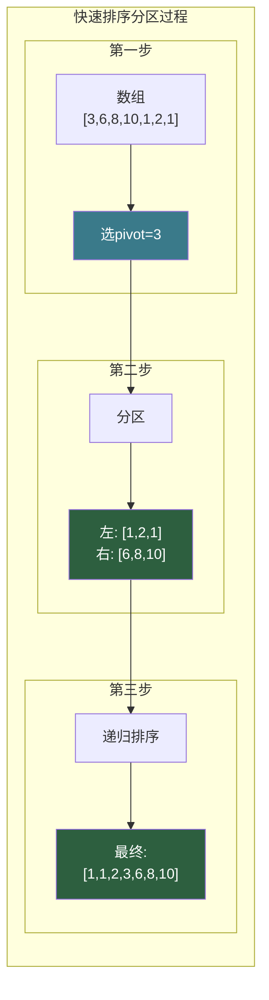
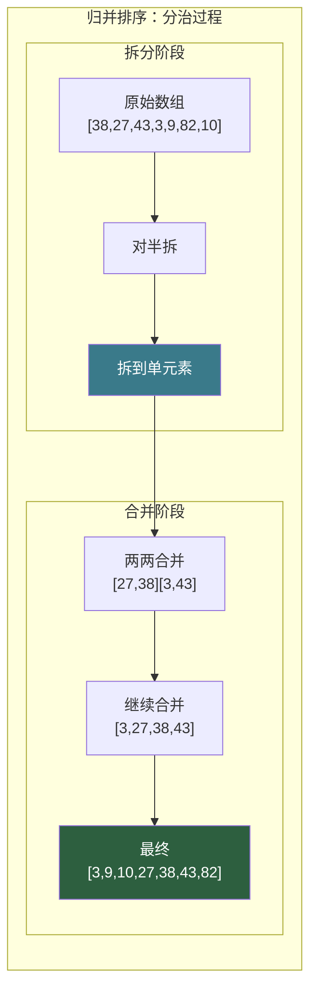
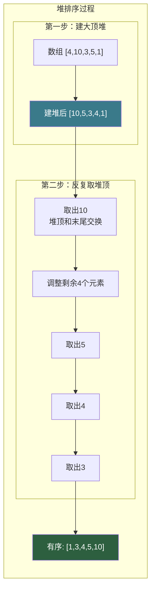

# 【筑基·044】排序算法：十个排序你该会几个

> **码农修仙传 · 筑基期 · 第44篇**
> 我是玄芯散人，带你从炼气修到大乘。

---

## 境界标识

```
╔══════════════════════════════════════╗
║     筑基期 · 第44篇                   ║
║     排序算法：十个排序你该会几个        ║
║     预计阅读：25分钟                   ║
╚══════════════════════════════════════╝
```

---

## 修仙引入

修仙界炼丹，同一炉药材，炼制手法不同，成色天差地别。火候大了药力散尽，火候小了杂质不除。排序算法也是同理，把一堆乱序数据排成有序，不同手法消耗的资源差别巨大。上一篇用大O表示法给了你一把衡量算法消耗的尺子，这篇就拿这把尺子量一量排序算法的优劣。

排序算法有十几个，但筑基期你真正需要吃透的是六个比较型排序：冒泡排序，选择排序，插入排序，快排，归并排序，堆排序。另外提一下计数排序和基数排序这两个非比较型，加上工程中实际用的introsort和Timsort。十个排序的复杂度是多少，什么情况用哪个，哪些排序相等元素的前后顺序不变，哪些会打乱，一篇讲透。

---

## 硬核主体

### 一、排序算法的江湖谱

排序分两大类：比较型排序和非比较型排序。比较型排序通过比较两个元素的大小来决定顺序，不管什么算法花式，只要靠比较来排序，理论下界就是O(n log n)。这个下界可以用决策树证明：n个元素有n!种排列，比较一次能砍掉一半可能性，所以至少要比较log₂(n!)次，根据斯特林公式，log₂(n!) ≈ n log n。

非比较型排序不走比较这条路。计数排序利用值域做桶，基数排序按位拆分，桶排序按区间分配，这些方法可以做到O(n)。但限制也多：计数排序要求值域不能太大，基数排序要求数据可以按位拆分。实际工程中，通用排序函数几乎都是比较型。

这篇只讲比较型排序，因为它们适用于任何可比较的数据类型。

### 二、三个O(n²)的入门排序

冒泡、选择、插入这三个最基础的排序算法，时间复杂度都是O(n²)。初学者觉得它们没用，但小规模数据下它们反而比快排更快（常数因子小），而且代码简单不容易写错。

冒泡排序的思路：每轮遍历比较相邻两个元素，逆序就交换，最大值像气泡一样浮到末尾。

```c
// 冒泡排序：每轮把最大值冒到最后
void bubble_sort(int arr[], int n) {
    for (int i = 0; i < n - 1; i++) {
        int swapped = 0;  // 标记本轮是否发生过交换
        for (int j = 0; j < n - 1 - i; j++) {
            if (arr[j] > arr[j + 1]) {
                int tmp = arr[j];
                arr[j] = arr[j + 1];
                arr[j + 1] = tmp;
                swapped = 1;
            }
        }
        if (!swapped) return;  // 本轮没交换，说明已经有序，提前退出
    }
}
// 最好情况（已有序）：O(n)，只需一轮遍历
// 最坏和平均：O(n²)
```

选择排序的思路：每轮在未排序部分找最小值，放到已排序部分的末尾。

```c
// 选择排序：每轮选最小的放前面
void selection_sort(int arr[], int n) {
    for (int i = 0; i < n - 1; i++) {
        int min_idx = i;
        for (int j = i + 1; j < n; j++) {
            if (arr[j] < arr[min_idx])
                min_idx = j;  // 记录最小值的下标
        }
        if (min_idx != i) {
            int tmp = arr[i];
            arr[i] = arr[min_idx];
            arr[min_idx] = tmp;  // 交换到正确位置
        }
    }
}
// 最好最坏平均都是O(n²)，交换次数最少（最多n-1次）
```

插入排序的思路：像整理扑克牌，把每张牌插到已排序部分的正确位置。

```c
// 插入排序：像打牌一样逐个插入
void insertion_sort(int arr[], int n) {
    for (int i = 1; i < n; i++) {
        int key = arr[i];  // 当前要插入的牌
        int j = i - 1;
        while (j >= 0 && arr[j] > key) {
            arr[j + 1] = arr[j];  // 比key大的往后挪
            j--;
        }
        arr[j + 1] = key;  // 插入正确位置
    }
}
// 最好情况（已有序）：O(n)
// 最坏和平均：O(n²)
// 小规模数据（n<16）时通常比快排快
```

三个O(n²)排序各有特点：冒泡加了提前退出后对近乎有序的数据表现不错；选择排序交换次数最少，适合交换代价高的情形（比如排序大结构体时只排指针）；插入排序在小规模数据和近乎有序的数据上性能最好，很多标准库排序函数在数据量小时会切回插入排序，省去函数调用的开销。

### 三、快速排序：分治的艺术

快速排序（Quicksort）由Tony Hoare在1959年发明，至今仍是应用最广的排序算法之一。它的平均时间复杂度O(n log n)，而且常数因子小，实际运行速度通常比其他O(n log n)排序快。

快排的思路：选一个元素作为基准（pivot），把数组分成两部分，比pivot小的放左边，大的放右边，然后对两部分递归排序。

```c
// 快速排序：选pivot分区，递归排序左右两部分
void quick_sort(int arr[], int left, int right) {
    if (left >= right) return;  // 递归终止：0或1个元素

    // 三数取中法选pivot，避免最坏情况
    int mid = left + (right - left) / 2;
    if (arr[mid] < arr[left]) { int t = arr[left]; arr[left] = arr[mid]; arr[mid] = t; }
    if (arr[right] < arr[left]) { int t = arr[left]; arr[left] = arr[right]; arr[right] = t; }
    if (arr[right] < arr[mid]) { int t = arr[mid]; arr[mid] = arr[right]; arr[right] = t; }
    int pivot = arr[mid];  // 取中位数作为pivot

    // Lomuto分区方案
    int store = left;
    for (int i = left; i < right; i++) {
        if (arr[i] < pivot) {
            int t = arr[store]; arr[store] = arr[i]; arr[i] = t;
            store++;
        }
    }
    int t = arr[store]; arr[store] = arr[right]; arr[right] = t;

    quick_sort(arr, left, store - 1);   // 排序左半部分
    quick_sort(arr, store + 1, right);  // 排序右半部分
}
// 平均：O(n log n)
// 最坏：O(n²)，三数取中后出现概率极低
// 注意：这里用Lomuto分区配合三数取中做教学演示
// 实际工程中Hoare分区（双指针对向扫描）效率更高
```

快排的分区过程用mermaid图表示：



快排最怕的情况是每次pivot都选到最值，导致分区极度不均衡，退化为O(n²)。比如已有序数组用最后一个元素做pivot，每次只分出一个元素。三数取中法取头、中、尾三个元素的中位数做pivot，能让最坏情况出现概率极低。更进一步的方案是introsort（内省排序），在递归层数超过阈值时自动切换到堆排序，彻底消除最坏情况。

### 四、归并排序：先拆后合

归并排序（Merge Sort）的思路完全不同：先把数组对半拆，拆到每个子数组只有一个元素（天然有序），然后两两合并成有序序列。

```c
// 归并排序：先拆后合，合并时按大小排列

// 合并两个有序子数组
void merge(int arr[], int left, int mid, int right, int tmp[]) {
    int i = left, j = mid + 1, k = left;
    while (i <= mid && j <= right) {
        if (arr[i] <= arr[j])   // 注意用<=保持稳定性
            tmp[k++] = arr[i++];
        else
            tmp[k++] = arr[j++];
    }
    while (i <= mid)  tmp[k++] = arr[i++];  // 左半剩余
    while (j <= right) tmp[k++] = arr[j++];  // 右半剩余
    for (i = left; i <= right; i++)
        arr[i] = tmp[i];  // 拷回原数组
}

void merge_sort(int arr[], int left, int right, int tmp[]) {
    if (left >= right) return;
    int mid = left + (right - left) / 2;
    merge_sort(arr, left, mid, tmp);     // 排序左半
    merge_sort(arr, mid + 1, right, tmp); // 排序右半
    merge(arr, left, mid, right, tmp);    // 合并
}
// 时间复杂度：最好最坏平均都是O(n log n)
// 空间复杂度：O(n)，需要额外数组做合并
```

归并排序的拆分合并过程：



归并排序的特点是稳定：最好最坏平均都是O(n log n)，不会退化。代价是需要O(n)额外空间。合并时用`<=`而非`<`比较，就能保证相等元素的相对顺序不变，所以归并排序是稳定排序。

### 五、堆排序：用树结构排序

堆排序（Heap Sort）利用堆这种数据结构来排序。堆是一棵完全二叉树，大顶堆中每个节点的值都大于等于其子节点的值。

堆排序分两步：先建大顶堆，然后反复取出堆顶（最大值）放到数组末尾，再调整堆。

```c
// 堆排序：建堆 + 反复取最大值

// 调整以i为根的子树为大顶堆
void heapify(int arr[], int n, int i) {
    int largest = i;      // 假设根最大
    int left = 2 * i + 1;  // 左子节点下标
    int right = 2 * i + 2; // 右子节点下标

    if (left < n && arr[left] > arr[largest])
        largest = left;
    if (right < n && arr[right] > arr[largest])
        largest = right;

    if (largest != i) {
        int t = arr[i]; arr[i] = arr[largest]; arr[largest] = t;
        heapify(arr, n, largest);  // 递归调整被换下去的子树
    }
}

void heap_sort(int arr[], int n) {
    // 建堆：从最后一个非叶子节点开始，自底向上调整
    for (int i = n / 2 - 1; i >= 0; i--)
        heapify(arr, n, i);

    // 反复取堆顶最大值放到末尾
    for (int i = n - 1; i > 0; i--) {
        int t = arr[0]; arr[0] = arr[i]; arr[i] = t;  // 堆顶换到末尾
        heapify(arr, i, 0);  // 调整剩余部分为大顶堆
    }
}
// 时间复杂度：最好最坏平均都是O(n log n)
// 空间复杂度：O(1)，原地排序
```

堆的结构和排序过程：



堆排序的杀手锏是原地排序，O(1)空间，而且最坏情况也是O(n log n)，不会退化。缺点是缓存不友好：堆操作在数组中跳跃访问（父节点i的子节点在2i+1和2i+2），不像快排那样连续访问内存，实际运行速度通常比快排慢2到3倍。

### 六、稳定性：相等元素会不会换位

稳定排序的含义是：值相等的两个元素排序后相对顺序不变。比如排序前a在b前面，a和b值相等，排序后a仍然在b前面。

这个性质在多级排序中很有用。比如先按年龄排序，再按姓名排序。如果第二次排序是稳定的，相同姓名的人年龄顺序不会乱。如果第二次排序不稳定，相同姓名的人年龄顺序可能被打乱。

六个排序的稳定性：

| 排序算法 | 时间复杂度（平均） | 时间复杂度（最坏） | 空间复杂度 | 稳定性 |
|---------|------------------|------------------|-----------|--------|
| 冒泡排序 | O(n²) | O(n²) | O(1) | 稳定 |
| 选择排序 | O(n²) | O(n²) | O(1) | 不稳定 |
| 插入排序 | O(n²) | O(n²) | O(1) | 稳定 |
| 快速排序 | O(n log n) | O(n²) | O(log n) | 不稳定 |
| 归并排序 | O(n log n) | O(n log n) | O(n) | 稳定 |
| 堆排序 | O(n log n) | O(n log n) | O(1) | 不稳定 |

为什么选择排序不稳定？因为它做的是跨距离交换。比如数组[5a, 5b, 3]，第一轮选出最小值3跟5a交换，变成[3, 5b, 5a]，两个5的顺序反了。

快排不稳定的原因类似：分区时交换可能跨过相等元素。归并排序只要合并时用`<=`而非`<`就能稳定。堆排的交换也跨距离，同样不稳定。

### 七、工程实际用的排序

实际项目里你几乎不需要手写排序。标准库的排序函数经过几十年打磨，性能远超手写版本。

C标准库的qsort函数名字里有个"q"，暗示用快排，但标准并没有规定实现方式。不同C库的实现可能不同，glibc的qsort确实用了快排，但加了改进。

C++的std::sort用的是introsort（内省排序），由David Musser在1997年提出。introsort以快排为主，递归层数超过2·log₂(n)时切换到堆排序，数据量小于16时切到插入排序。三种排序取长补短：快排平均快，堆排序兜底防最坏情况，插入排序在小数据上效率最高。

Python的sorted和list.sort用Timsort，由Tim Peters在2002年为Python设计。Timsort结合归并排序和插入排序，特别擅长处理部分有序的数据（现实中很多数据不是完全随机的）。Java从JDK 7开始对对象数组（Object[]）使用Timsort替换了之前的归并排序，但基本类型数组（如int[]）仍用Dual-Pivot Quicksort，因为基本类型不需要保证稳定性。Android和V8引擎的排序实现也借鉴了Timsort的思想。

这些工业级排序函数的共性是：不迷信单一算法，混合多种排序，根据数据特征自适应切换。你写业务代码时直接调用就行。但理解底层原理，才能在面试和性能调优时做出正确判断。

### 八、怎么选排序算法

给几个实用建议：

n小于16，用插入排序。代码简单，常数因子小，小数据量下通常最快。

n中等规模（几十到几千），数据随机分布，用快速排序。平均性能最好。

要求稳定排序，用归并排序。或者用Timsort（Python/Java标准库自带）。

内存紧张（嵌入式设备，RAM只有几KB），用堆排序或原地快排。归并排序需要O(n)额外空间，在内存受限时可能不可行。

数据近乎有序，用插入排序或带提前退出的冒泡排序。O(n)的最好情况不是吹的。

不知道用什么，用标准库。std::sort已经帮你做了最优选择。

---

## 修仙术语对照表

| 修仙术语 | 技术现实 | 本篇位置 |
|---------|---------|---------|
| 炼丹手法 | 排序算法，不同的排序策略 | 修仙引入 |
| 灵力消耗 | 时间复杂度，排序的比较次数 | 修仙引入 |
| 度量尺子 | 大O表示法 | 修仙引入 |
| 气泡浮顶 | 冒泡排序，最大值逐轮冒到末尾 | 冒泡排序 |
| 选最小放前 | 选择排序，每轮选最小值放到已排序末尾 | 选择排序 |
| 整理扑克牌 | 插入排序，逐个插入到已排序部分正确位置 | 插入排序 |
| 分治分区 | 快速排序，选pivot分区后递归 | 快排 |
| 三数取中 | pivot选取策略，取头中尾的中位数 | 快排 |
| 先拆后合 | 归并排序，拆到单元素再两两合并 | 归并 |
| 大顶堆 | 完全二叉树，每个节点大于等于子节点 | 堆排 |
| 取堆顶换末尾 | 堆排序的取出步骤，堆顶最大值换到数组末尾 | 堆排 |
| 相等不换位 | 稳定排序，值相等的元素相对顺序不变 | 稳定性 |
| 跨距离交换 | 不稳定排序的根因，交换跨过相等元素 | 稳定性 |
| 内省切换 | introsort在快排退化时切到堆排 | 工程排序 |
| 自适应切换 | Timsort根据数据特征混合多种排序 | 工程排序 |

---

## 进阶条件

- [ ] 能手写冒泡排序、插入排序、选择排序三种O(n²)排序，知道各自的最好最坏复杂度
- [ ] 能手写快速排序的分区函数，理解pivot选取对最坏情况的作用
- [ ] 能解释归并排序的分治过程，知道为什么它需要O(n)额外空间
- [ ] 能画出堆的结构，理解heapify的调整过程，知道堆排为什么是O(1)空间
- [ ] 能说出六个排序算法各自的稳定性，理解选择排序和快排为什么不稳定
- [ ] 知道std::sort用的是introsort，能解释为什么混合三种排序比单一排序好
- [ ] 面对具体需求（稳定/原地/小数据/近乎有序）能选出合适的排序算法

全部勾掉，筑基期的数据结构与算法这一组就通关了。下一篇进入计算机组成原理，看看一行C代码在CPU里到底跑了哪些步骤。

---

## 下期预告 + 互动

下一篇开始筑基期第三组：计算机组成原理。第一篇从int a=1+2入手，看看这行代码在CPU里到底跑了哪些步骤。键盘输入一行C代码，编译后CPU怎么执行：取指令，解码操作码，执行运算，访问内存，最后写回寄存器。

互动问题：你所在的项目里有没有遇到过排序性能问题？最后怎么解决的？是换了排序算法，还是减少了数据量，还是直接用标准库的sort就够了？

我是玄芯散人，带你从炼气修到大乘。

---

*本文是「码农修仙传」系列第44篇。系列导航见 [xren.ren](https://xren.ren)*
