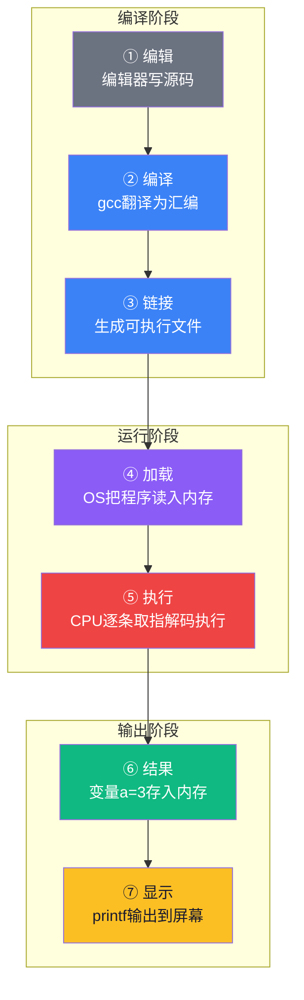
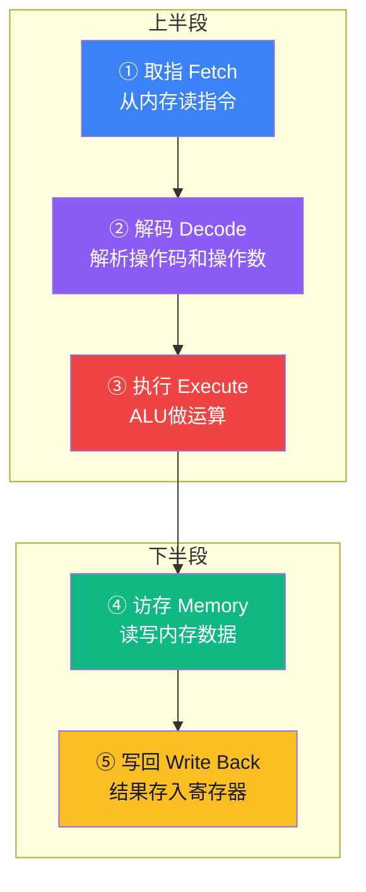
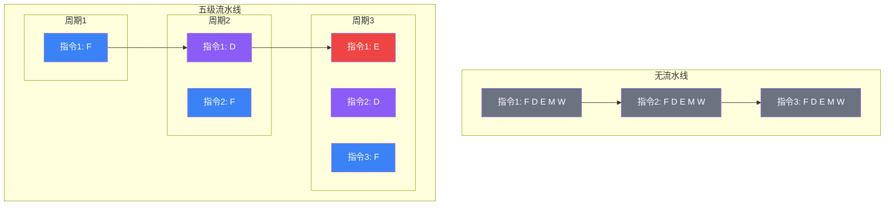

# 【筑基·045】int a=1+2在CPU里跑了几步

> **码农修仙传 · 筑基期 · 第45篇**
> 我是玄芯散人，带你从炼气修到大乘。

---

## 境界标识

```
╔══════════════════════════════════════╗
║     筑基期 · 第45篇                   ║
║     int a=1+2在CPU里跑了几步          ║
║     预计阅读：18分钟                   ║
╚══════════════════════════════════════╝
```

---

## 修仙引入

筑基期的数据结构与算法告一段落，现在进入计算机组成原理。第一刀就切在最朴素的一行代码上：`int a = 1 + 2;`。面试官如果问你"这行代码在CPU里跑了几步"，你能答上来吗？你在编辑器里敲完这行，按回车，不到一毫秒变量 a 就变成了 3。但如果你能在那一刻按下时间暂停，往CPU里面看一眼，会发现这行代码经历了编译、加载、取指、解码、执行、访存、写回一整套工序。

修真小说里筑基之后要修内视，就是用神识看清体内灵气的来龙去脉。编程的内视就是搞清楚一行代码在硬件上到底跑了哪些步骤。上一篇排序算法解决了数据怎么排的问题，这一篇换个视角：CPU拿到你的代码以后，到底做了什么。

---

## 硬核主体

### 一、一行C代码的编译产物

先看源码，就一行：

```c
int a = 1 + 2;
```

编译器拿到这行代码后做的事情比你想的多。它先把 `1 + 2` 当成常量表达式，在编译期直接算出来等于 3。这个过程叫常量折叠。所以你写的加法运算，到机器码这一层可能就不存在了。编译器比你先算完了。

但为了讲清楚指令在CPU里怎么跑，我们假设编译器没做这个优化，让 `1 + 2` 真的变成几条机器指令。编译器生成的 ARM64 汇编大概长这样：

```asm
; 编译器生成的ARM64汇编（-O0无优化）
mov  w0, #1          ; 把立即数1放进寄存器w0
mov  w1, #2          ; 把立即数2放进寄存器w1
add  w2, w0, w1      ; w2 = w0 + w1，ALU做加法
str  w2, [sp, #4]    ; 把结果存到栈上变量a的位置
```

你写一行C代码，CPU实际跑了四条汇编指令。每一条汇编指令最终会被编码成固定长度的二进制机器码。ARM64每条指令固定4字节，x86-64的指令长度不固定，1字节到15字节都有可能。

你可以用 `gcc` 自己验证这个过程：

```bash
# 把C代码编译成汇编，不做任何优化
gcc -O0 -S test.c -o test.s

# 或者直接看目标文件的机器码
gcc -O0 -c test.c -o test.o
objdump -d test.o
```

`objdump -d` 的输出里你会看到类似 `0x52800020` 这样的十六进制数，那就是 `mov w0, #1` 这条指令在ARM64下的二进制编码。CPU不认识 `mov` 这个助记符，它只认这串二进制。

### 二、代码执行的全链路

代码不是凭空跑起来的。你敲完 `int a = 1 + 2;` 到看到变量 a 等于 3，中间过了好几道工序。用一张图把整个链路画出来：



编译阶段只发生一次。编译完以后，可执行文件就安静地躺在硬盘上。你每次运行程序，走的是运行阶段和输出阶段。OS把可执行文件加载到内存，CPU才开始一条一条取指令执行。

这个链路里最耗时的是哪一步？编译可能要几秒到几十秒（大项目更久），加载只要几毫秒，CPU执行那四条指令不到一百纳秒。你感觉不到延迟是因为这些步骤太快了，但量级差了六七个数量级。

### 三、指令周期：一条指令在CPU里走五步

现在重点看上图的第⑤步。CPU拿到内存里的机器码以后，每条指令都要走一遍指令周期。经典的RISC指令周期分五个阶段：



逐步拆解。

取指（Fetch）：CPU把程序计数器（PC）里的地址送到地址总线上，内存返回该地址处存储的指令编码。取回来以后放进指令寄存器（IR）。取完之后PC自动更新，ARM64每条指令4字节，所以PC加4指向下一条。取指这一步要跟内存打交道，内存比CPU慢很多，所以现代CPU有指令缓存来减少这个等待。

解码（Decode）：控制单元从IR里读取指令编码，拆解出操作码和操作数。操作码告诉CPU这条指令要干什么，操作数告诉它参与运算的数据在哪里。比如 `add w2, w0, w1` 这条指令，编码里包含了ADD操作码和三个寄存器编号。解码阶段控制单元还要从寄存器组里把w0和w1的当前值读出来，准备送入ALU。

执行（Execute）：ALU拿到操作码和操作数做实际运算。ADD就把两个数相加，AND就按位与，MOV只是搬数据不经过ALU。跳转指令在这一步计算目标地址。整数加减法和位操作通常一个时钟周期搞定，乘除法要多个周期。

访存（Memory）：如果指令需要读写内存，这一步通过地址总线访问内存数据。LDR指令加载内存数据到寄存器，STR指令把寄存器数据存到内存。纯计算指令比如ADD不需要访存，这一步空转。访存也是耗时大户，如果数据在缓存里还好，不在缓存就要等内存返回。

写回（Write Back）：把ALU的运算结果或者从内存读来的数据写回目标寄存器。`add w2, w0, w1` 的结果在这一步写入w2寄存器。

### 四、追踪四条指令的逐步执行

现在把这四条汇编指令挨个拆开，看每条指令分别走了指令周期的哪几步。

第一条 `mov w0, #1`：
- 取指：从PC指向的地址取出mov指令编码，放入IR
- 解码：控制单元解析出这是立即数传送指令，目标是w0，数值是1
- 执行：把立即数1送入ALU的输入端（或者直接走数据通路，不经过ALU，取决于具体微架构）
- 访存：不需要，跳过
- 写回：把1写入w0寄存器

第二条 `mov w1, #2`：和第一条一模一样的流程，只是数值换成2，目标换成w1。

第三条 `add w2, w0, w1`：
- 取指：从PC指向的地址取出add指令编码
- 解码：解析出ADD操作码，目标寄存器w2，源寄存器w0和w1，从寄存器组读出w0=1和w1=2
- 执行：ALU计算1+2=3
- 访存：不需要，跳过
- 写回：把3写入w2寄存器

第四条 `str w2, [sp, #4]`：
- 取指：从PC指向的地址取出str指令编码
- 解码：解析出STR操作码，源寄存器w2，目标地址是sp寄存器的值加偏移量4
- 执行：ALU计算目标地址 sp+4
- 访存：把w2的值（3）写入内存地址 sp+4 处
- 写回：str指令通常没有寄存器写回操作，因为结果已经直接写进内存了

四条指令跑完，变量a的值3已经存到了栈上对应内存位置。你用printf("%d", a)去读这个变量时，CPU再发一条LDR指令把那个内存地址的值读回来。

### 五、流水线：让CPU同时处理多条指令

上面讲的是单条指令串行执行的情况。一条指令走五步花五个时钟周期，四条指令就要二十个周期。这也太慢了。

流水线的思路是：不要等一条指令走完全部五步再开始下一条。当前指令进入解码阶段时，取指阶段空出来了，让第二条指令开始取指。当前指令进入执行阶段时，解码阶段空出来了，第三条开始解码，第二条进入执行，第四条开始取指。



流水线以后，四条指令不再需要二十个周期，大约八个周期就能跑完。指令越多，流水线的吞吐优势越大。理想情况下，五级流水线的IPC（每周期指令数）接近1，也就是说每个周期能完成一条指令。

但流水线不是万能的。如果第三条指令是条件跳转，CPU不知道该取第五条还是第八条，只能猜。猜对了接着跑，猜错了流水线要清空重来。这就是分支预测失败，代价大约等于流水线级数个周期。五级流水线大约损失5个周期，现代CPU的深流水线（十几级到二十级）可能损失15个周期以上。你写的if/else嵌套太多，分支预测命中率下降，CPU就会卡。

用汇编指令验证一下编译器到底怎么处理条件跳转：

```asm
; C代码
; if (a > 0) b = 1; else b = 2;

; ARM64汇编（-O0）
cmp  w0, #0          ; 比较a和0
ble  .Lelse          ; a <= 0则跳转到else分支
mov  w1, #1          ; b = 1
b    .Lend           ; 跳到结尾
.Lelse:
mov  w1, #2          ; b = 2
.Lend:
```

CPU执行到 `ble .Lelse` 时，PC有两个可能的方向：继续往下执行 `mov w1, #1`，或者跳转到 `.Lelse` 执行 `mov w1, #2`。CPU必须在下一拍取指之前决定取哪条路径。这就是分支预测器要解决的问题。现代CPU的分支预测准确率能到95%以上，但剩下那5%猜错的代价不小。

### 六、程序员视角：什么代码让CPU跑得快

了解指令周期和流水线以后，你能站在CPU的视角看代码效率。几个实用的结论：

减少分支嵌套。每个if都是一个分支预测点，嵌套越多预测越难。编译器有时候会把if/else翻译成条件传送指令（ARM64的CSEL，x86的CMOV），这种指令不跳转，没有预测失败的风险。

让数据紧凑。CPU加载内存数据时一次加载一整块（通常是64字节的缓存行），而不是逐字节读取。如果你访问的数据在同一块缓存行里，命中缓存，速度快。如果分散在内存各处，每次都要重新加载，速度慢。这就是数组按行访问比按列访问快的原因。

减少内存读写。寄存器访问零延迟，缓存访问几纳秒，内存访问上百纳秒。能放在寄存器里的数据不要反复读写内存。编译器会帮你做寄存器分配，但如果你的变量太多太散，编译器也只能把它们倒腾到内存里。

这些结论在后续计算机组成原理的篇目里会展开讲。现在你只需要知道：CPU执行你的代码不是黑盒，它有明确的步骤和约束，你写的代码结构会直接左右CPU的执行效率。

---

## 修仙术语对照表

| 修仙术语 | 技术现实 | 本篇位置 |
|---------|---------|---------|
| 内视 | 理解代码在硬件上的执行过程 | 修仙引入 |
| 功法口诀 | C语言源代码 | 编译产物部分 |
| 天地规则 | 机器指令的二进制编码 | 编译产物部分 |
| 符文 | 汇编指令的助记符 | 编译产物部分 |
| 灵脉流动 | CPU从内存读指令放入IR | 取指阶段 |
| 辨识灵气属性 | 控制单元解码操作码和操作数 | 解码阶段 |
| 运功炼化 | ALU执行算术逻辑运算 | 执行阶段 |
| 进出丹府 | 通过总线读写内存数据 | 访存阶段 |
| 灵力归丹田 | 运算结果写回寄存器 | 写回阶段 |
| 周天循环 | 指令周期五步循环 | 指令周期部分 |
| 经脉并行 | 流水线让多条指令重叠执行 | 流水线部分 |
| 天道预判 | 分支预测器猜测跳转方向 | 流水线冒险部分 |
| 丹府仓库 | 主内存 | 数据访问部分 |

---

## 进阶条件

- [ ] 能用 `gcc -O0 -S` 和 `objdump -d` 看到C代码对应的汇编和机器码
- [ ] 能说出指令周期五步每步在做什么（取指、解码、执行、访存、写回）
- [ ] 能跟踪一条 `add w2, w0, w1` 指令在CPU里走完五步的过程
- [ ] 能解释流水线为什么能让CPU吞吐量提高，而不是单条指令变快
- [ ] 能说出分支预测失败为什么会清空流水线，代价是十几个周期
- [ ] 能解释常量折叠为什么让 `1 + 2` 在编译期就消失了
- [ ] 能从CPU效率角度解释为什么减少分支嵌套和让数据紧凑能让性能变好

全部勾掉，下一篇就要往CPU内部看了。

---

## 下期预告 + 互动

下一篇进入CPU内部结构。CPU盖子底下有什么？控制单元怎么发信号，ALU怎么算，寄存器组怎么存。流水线冒险有哪三种，各自怎么解决。还会聊到超标量和乱序执行这些现代CPU的提速手段。

互动问题：你有没有用 `objdump` 或者反汇编工具看过自己写的代码编译后长什么样？第一次看到汇编是什么感觉？欢迎评论区聊聊。

我是玄芯散人，带你从炼气修到大乘。

---

*本文是「码农修仙传」系列第45篇。系列导航见 [xren.ren](https://xren.ren)*
