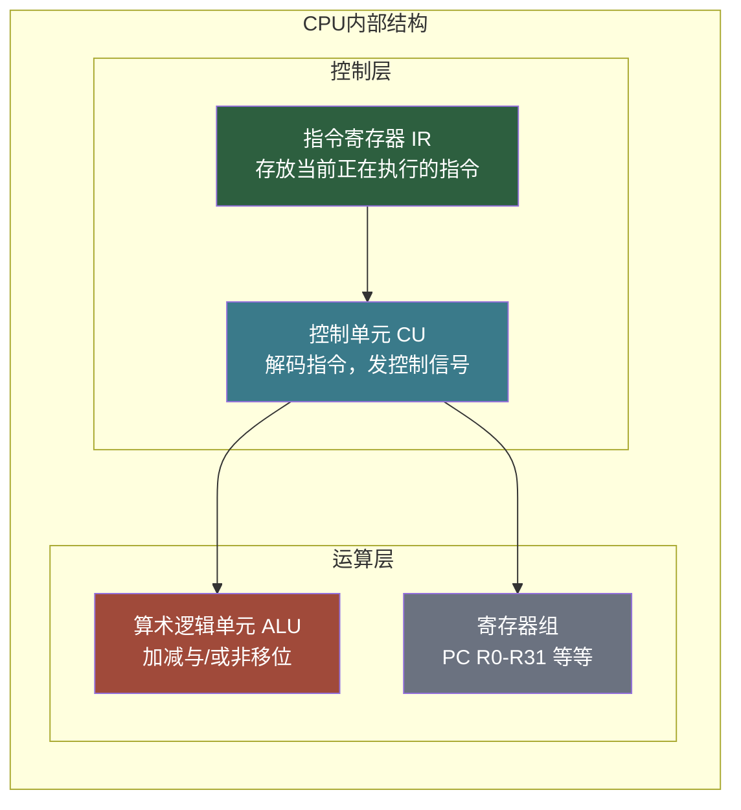
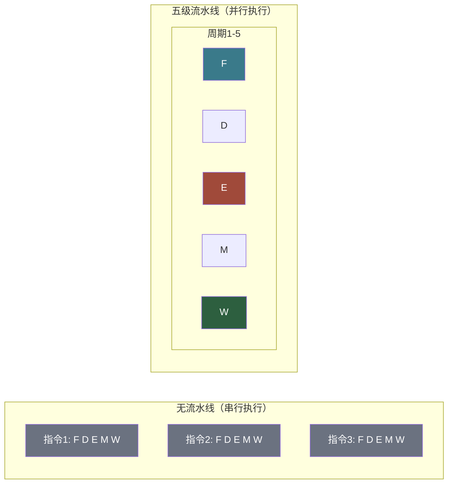
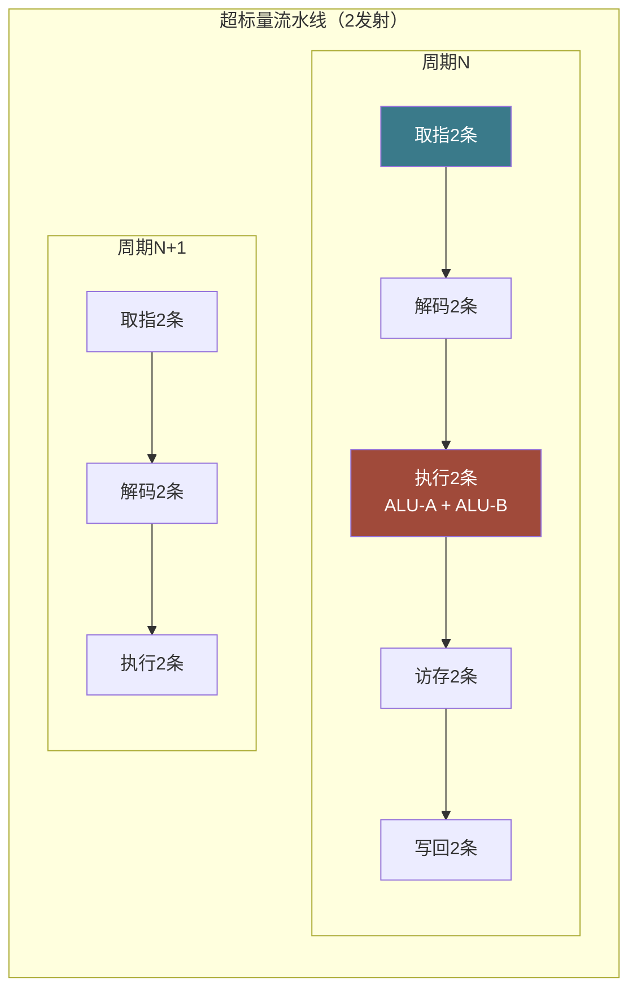

# 【筑基·046】CPU是怎么工作的：取指解码执行

> **码农修仙传 · 筑基期 · 第46篇**
> 我是玄芯散人，带你从炼气修到大乘。

---

## 境界标识

```
╔══════════════════════════════════════╗
║     筑基期 · 第46篇                   ║
║     CPU是怎么工作的：取指解码执行      ║
║     预计阅读：25分钟                   ║
╚══════════════════════════════════════╝
```

---

## 修仙引入

上一篇你跟着 `int a = 1 + 2;` 跑了一整圈，看清了代码编辑器到屏幕那十站旅程。但那次只是路过CPU门口看了一眼，知道它走了取指解码执行访存写回这五步。CPU里面长什么样？指令进去以后怎么被一步步处理？为什么流水线能让CPU快几倍，又为什么猜错一次分支要罚几十个周期？

筑基期的内视修炼，这一篇要往CPU内部再走深一层。不碰微架构的寄存器重命名和重排序缓冲区那些化神期的东西，但寄存器组加上ALU加上控制单元加上流水线冒险这些概念，你得看清楚。

---

## 硬核主体

### 一、CPU内部的四件法器

打开CPU的盖子（当然是比喻），里面有四大部件：



控制单元（Control Unit，CU）是CPU的指挥中枢。它拿到指令寄存器（IR）中的指令编码，解析出这条指令要做什么操作，操作数在哪里来，结果写到哪里去，然后向ALU和寄存器组发出对应的控制信号。CU自己不做运算，它只发号施令。

算术逻辑单元（Arithmetic Logic Unit，ALU）是真正干活的。加减法，按位的与或非异或，移位操作，都在ALU里完成。给它两个操作数和一个操作码，它输出一个结果。ALU内部是一堆逻辑门的组合，加法器是其中的主角。

寄存器组是CPU内部最快的存储。ARM64有31个通用寄存器（R0到R30），x86-16个（RAX到R15）。除了通用寄存器，还有几个特殊寄存器：

程序计数器（Program Counter，PC，x86里叫RIP）记录下一条要取的指令地址。CPU每取完一条指令，PC自动加4（ARM64每条指令固定4字节）或加2（Thumb模式）。跳转指令就是直接修改PC。

指令寄存器（Instruction Register，IR）存放当前正在解码和执行的那条指令。内存取来的指令编码先放在IR里，控制单元再从中读取并解码。

还有一个不太常提到但同样需要的寄存器叫程序状态字（Program Status Register，PSR，x86里叫RFLAGS）。它记录CPU的当前状态：上一条指令运算有没有进位，结果是正还是负，是不是零，有没有溢出。条件跳转指令就是读PSR里的标志位来决定跳不跳。

### 二、一条指令在CPU里的五步

上一篇你已经知道指令周期有五步：取指（Fetch），解码（Decode），执行（Execute），访存（Memory），写回（Write Back）。现在把这五步拆开看每一步具体在CPU内部做了什么。

取指：CPU把PC的值送到地址总线上，内存返回该地址处存储的指令编码，CPU把它装入IR。取指完成后PC自动更新，指向下一条指令。这个过程涉及CPU和内存之间的总线交互，是五步中耗时最长的之一，因为内存比CPU慢很多。

解码：控制单元从IR中读取指令编码，拆解出操作码（opcode）和操作数。操作码告诉CU这条指令要做什么，操作数告诉CU参与运算的数据在哪里。比如ARM64的 `ADD W0, W1, W2`，编码里包含一个ADD操作码，后面跟着三个寄存器编号。解码阶段CU还要读取寄存器组，把W1和W2的当前值取出来，准备送入ALU。

执行：ALU拿到操作码和操作数，做实际运算。ADD就把两个数相加，AND就按位与，MOV只是把数据搬运不经过ALU。跳转指令在这一步计算目标地址。执行阶段的时间取决于操作类型，整数加减法和位操作通常一个周期完成，乘除法需要多个周期。

访存：如果指令需要读写内存（比如LDR加载、STR存储），这一步通过地址总线访问内存。纯计算指令（如ADD）不需要访存，这一步空转。访存也是耗时大户，如果数据在缓存里还好，不在缓存就要等内存返回。

写回：把ALU的运算结果或者从内存读来的数据写回目标寄存器。ADD W0, W1, W2 的结果在这一步写入W0。

来看一段C代码和它对应的ARM64汇编，跟踪每条指令的五步：

```c
// C代码：计算 c = a + b，然后存到内存
int a = 10, b = 20, c;
c = a + b;
```

编译器生成ARM64汇编（简化版）：

```asm
mov  w0, #10         ; w0 = 10 (a=10)
mov  w1, #20          ; w1 = 20 (b=20)
add  w2, w0, w1       ; w2 = w0 + w1 (c=a+b)
str  w2, [sp, #8]     ; 把w2的值存到栈上c的位置
```

第一条 `mov w0, #10` 的五步：取指拿到mov指令编码，解码发现是立即数传送，执行阶段把10送入w0，不需要访存，写回把10写入w0寄存器。

第三条 `add w2, w0, w1` 的五步：取指拿到add指令编码，解码后从寄存器组读出w0（10）和w1（20）的值，执行阶段ALU计算10+20=30，不需要访存，写回把30写入w2寄存器。

### 三、流水线：不是算得快，是吞吐高

一条指令要走五步，如果串行执行，每条花5个周期。10条指令要50个周期。这也太慢了。

流水线的思路很简单：不要等一条指令走完全部五步再开始下一条。当前指令进入解码阶段时，取指阶段空出来了，那就让第二条指令开始取指。当前指令进入执行阶段时，解码阶段空出来了，第三条指令开始解码，第二条进入执行，第四条开始取指。



流水线的时间线（每列是一个周期，每行是一条指令）：

```
周期:  1   2   3   4   5   6   7   8   9
指令1: F   D   E   M   W
指令2:     F   D   E   M   W
指令3:         F   D   E   M   W
指令4:             F   D   E   M   W
指令5:                 F   D   E   M   W
```

看这个时间线，5条指令在9个周期内完成。串行方式要25个周期。流水线把吞吐量提高了将近5倍（流水线填满后接近1条指令/周期）。

注意一个需要注意的概念：流水线不缩短单条指令的执行时间。一条指令仍然要5个周期才能走完五步。但多条指令重叠执行后，整体吞吐量接近1条/周期。好比工厂流水线，单个产品通过整条产线的时间没变，但产线填满后每秒产出一个产品。

### 四、流水线冒险：三条经脉打架

流水线看起来很美，但三条指令在不同阶段同时跑，会互相打架。这就是流水线冒险（Pipeline Hazard），分三类。

第一类叫数据冒险（Data Hazard）。后一条指令需要前一条指令的结果，但前一条还没到写回阶段。

```asm
add  w0, w1, w2   ; w0 = w1 + w2，结果在第5周期写回
sub  w3, w0, w4   ; w3 = w0 - w4，第3周期就要读w0，但w0还没写回！
```

sub指令在第3周期解码阶段要读w0，但add指令要到第5周期才把结果写回w0。sub读到的就是旧值，算出来是错的。

解决方案叫数据前递（Forwarding，也叫Bypass）。CPU内部加一条旁路，把ALU的输出直接接到下一条指令的ALU输入端，不经过寄存器组写回再读取。这样add在第3周期执行完毕，结果立刻通过旁路送给sub的第3周期解码，sub在第4周期就能用上新值。

如果实在来不及递过去，就插入一个气泡（Stall，也叫NOP），让流水线停一拍等待。性能损失一个周期，但数据正确。

第二类叫控制冒险（Control Hazard）。遇到跳转指令时，CPU不知道接下来该取哪条指令。顺序取的下一条可能压根不是要执行的。

```asm
cmp  w0, w1       ; 比较w0和w1
b.eq L1           ; 如果相等，跳转到L1
add  w2, w3, w4   ; 如果不跳，执行这条
L1:
sub  w2, w3, w4   ; 跳转后执行这条
```

b.eq跳转指令在第2周期解码时，CPU还不知道跳不跳，因为cmp的比较结果要到第3周期执行完才出来。但取指单元已经在第2周期取了add指令。如果最后确实跳转了，add就是白取的，流水线要清空重来。

这就是分支预测（Branch Prediction）要解决的问题。CPU赌一把：跳还是不跳。赌对了继续执行，赌错了清空流水线。现代CPU的分支预测器准确率能到95%以上，用历史跳转记录来预测当前跳转行为。预测正确的代价为零，预测错误要冲刷流水线，损失等于流水线级数的周期数。五级流水线错误预测损失约5个周期，级数更多的CPU损失可能15-20个周期。

第三类叫结构冒险（Structural Hazard）。两条指令同时要用同一个硬件部件。比如取指阶段和访存阶段都要访问内存，如果内存只有一条总线，就要排队等。现代CPU通过分离的L1指令缓存和L1数据缓存（哈佛结构）避免了最常见的结构冒险。

### 五、流水线再进一步：超标量

五级流水线填满后吞吐量是1条指令/周期。还能更快吗？

超标量（Superscalar）的思路是给每个流水线阶段配多套硬件。取指单元一个周期取2条指令，解码单元一个周期解码2条，ALU配2个，一个周期执行2条。这样IPC（Instructions Per Cycle）能到2甚至更高。

现代高性能CPU的IPC普遍在3到4之间，有些测试能到6。但这是理想情况，实际代码因为数据依赖和分支预测失败，平均IPC通常在1到2之间。



超标量跟流水线不是一回事。流水线是不同指令的不同阶段重叠，超标量是同一阶段同时处理多条指令。两者叠加起来，现代CPU才能做到一个周期实际执行好几条指令。

再往前一步是乱序执行（Out-of-Order Execution）。前面说的都是指令按程序顺序流过流水线。但如果后面一条指令的数据已经准备好，前面一条指令还在等内存，CPU可以先把后面那条执行了。好比排队买饭，前面那个人还在纠结菜单，后面的人已经选好了，那就先给后面的人打饭。

乱序执行需要复杂的硬件支持（寄存器重命名、重排序缓冲区等），这些属于化神期的内容了。筑基期你知道这个概念就行：CPU不老实按顺序执行指令，它会看谁的数据先到就先算谁，算完再按原来的顺序把结果提交回去。

---

## 修仙术语对照表

| 修仙术语 | 技术现实 | 本篇位置 |
|---------|---------|---------|
| 四件法器 | CPU四大部件：控制单元加上ALU加上寄存器组加上内部总线 | CPU内部结构 |
| 指挥中枢 | 控制单元CU，解码指令并发出控制信号 | CPU内部结构 |
| 干活的锤子 | ALU，执行加减与或非移位等实际运算 | CPU内部结构 |
| 灵识指针 | 程序计数器PC，指向下一条指令的地址 | 寄存器组 |
| 当前口诀 | 指令寄存器IR，存放正在执行的指令编码 | 寄存器组 |
| 状态铭文 | 程序状态字PSR，记录运算标志位 | 寄存器组 |
| 五步炼化 | 取指解码执行访存写回五级指令周期 | 一条指令五步 |
| 灵力流水 | 流水线，多条指令的不同阶段重叠执行 | 流水线 |
| 气泡停顿 | Stall，流水线插入空泡等待数据 | 数据冒险 |
| 灵力旁通 | Forwarding/Bypass，ALU结果直接递给下一条指令 | 数据冒险 |
| 天道赌局 | 分支预测，赌跳不跳，猜错清空流水线 | 控制冒险 |
| 双炉齐炼 | 超标量，一个周期处理多条指令 | 超标量 |
| 插队打饭 | 乱序执行，数据先到先算，结果按序提交 | 乱序执行 |

---

## 进阶条件

- [ ] 能画出CPU内部四大部件的关系图，说出CU加上ALU加上寄存器组各自的职责
- [ ] 能默写PC加上IR加上PSR这三个特殊寄存器的名称和用途
- [ ] 能把一条ARM64汇编指令的五步（取指解码执行访存写回）逐一描述出来
- [ ] 能画出五级流水线的时间线图，解释为什么吞吐量接近1条/周期
- [ ] 能说出数据冒险加上控制冒险加上结构冒险这三类流水线冒险的成因
- [ ] 知道数据前递和分支预测分别解决哪类冒险
- [ ] 能区分流水线（阶段重叠）和超标量（同时处理多条）的不同

全部勾掉，CPU内部的工作原理你就看清楚了。下一篇往存储层次走，看看寄存器到硬盘之间为什么差了那么多层。

---

## 下期预告 + 互动

下一篇【筑基·047】内存hierarchy：寄存器到硬盘的速度差。CPU内部算得飞快，但数据在内存里，每取一次要等几十到几百个周期。为了弥补这个差距，CPU和内存之间塞了L1加上L2加上L3这三级缓存。为什么是三级不是两级？缓存行是什么？为什么按行访问比按列访问快？下一篇讲透存储层次。

互动问题：你在项目里有没有遇到过CPU缓存相关的性能问题？比如遍历二维数组按行和按列速度差很多，或者多线程访问同一缓存行导致性能下降？评论区说说你的经历。

我是玄芯散人，带你从炼气修到大乘。

---

*本文是「码农修仙传」系列第46篇。系列导航见 [xren.ren](https://xren.ren)*
