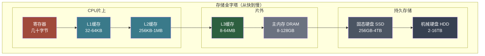
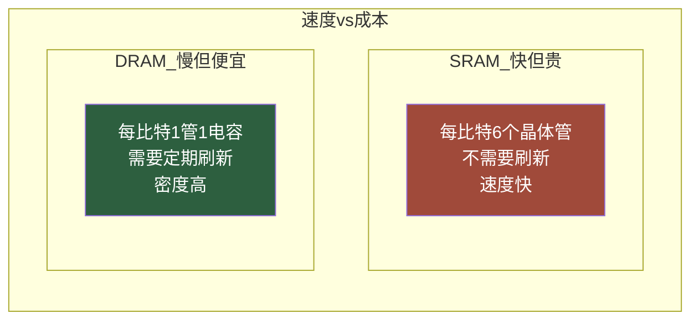
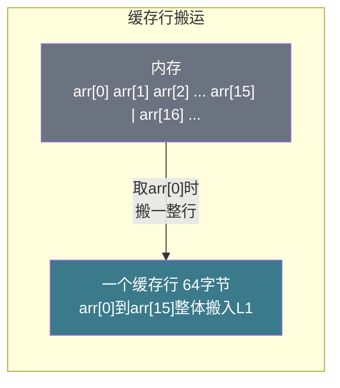
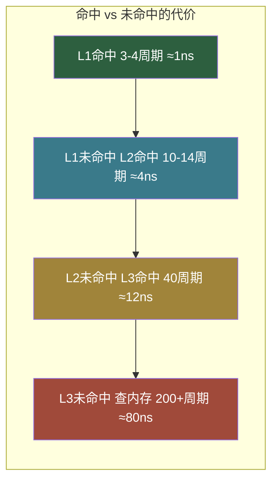

# 【筑基·047】内存Hierarchy：寄存器到硬盘的速度差

> **码农修仙传 · 筑基期 · 第47篇**
> 我是玄芯散人，带你从炼气修到大乘。

---

## 境界标识

```
╔════════════════════════════════════════╗
║     筑基期 · 第47篇                     ║
║     内存Hierarchy：寄存器到硬盘的速度差   ║
║     预计阅读：20分钟                     ║
╚════════════════════════════════════════╝
```

---

## 修仙引入

上一篇你钻进CPU内部看了取指解码执行的流水线。但CPU算得再快，数据不在手里也白搭。寄存器里存着的数，一个周期就能拿到。可数据要是在内存里，CPU得等几十上百个周期。要是数据在硬盘上，那就更夸张了，等几百万个周期都算快的。

这就像修仙者身上的储物戒指，腰间挂的储物袋，洞府里的药柜，宗门的藏经阁。越贴身的装得越少但拿得越快，越远的装得越多但跑一趟要好半天。CPU和存储设备之间也是同样的道理，一层层排列下来，这就是存储层次结构（Memory Hierarchy）。

---

## 硬核主体

### 一、存储金字塔

计算机的存储设备是一座金字塔。塔尖最快最小最贵，塔底最慢最便宜。



这座金字塔的每一层都在做同一件事：用较大较慢的存储给较小较快的存储当后盾。CPU需要数据时先查寄存器，不在就查L1，不在就查L2，依次往下。越往下查，等的时间越长。

### 二、各层延迟和容量

光说"快"和"慢"太模糊，拿数字说话。下表列出各层存储的典型延迟和容量（2024年主流桌面/服务器平台的数据）：

| 层级 | 典型容量 | 访问延迟 | CPU周期数（3GHz） |
|------|---------|---------|-------------------|
| 寄存器 | 几十字节 | <1ns | 1个周期 |
| L1缓存 | 32-64KB | ~1ns | 3-4个周期 |
| L2缓存 | 256KB-1MB | ~4ns | 10-14个周期 |
| L3缓存 | 8-64MB | ~12ns | 40个周期 |
| 主内存DRAM | 8-128GB | ~80ns | 200+个周期 |
| SSD（NVMe） | 256GB-4TB | ~10-100μs | 3万-30万个周期 |
| HDD | 2-16TB | ~5-10ms | 1500万-3000万个周期 |

一个周期不到1纳秒，内存访问要80纳秒，硬盘访问要5毫秒。把这个差距换算成人类能感知的时间：如果寄存器访问相当于你从口袋掏手机（1秒），那内存访问相当于走一趟楼下便利店（3分钟），SSD访问相当于坐高铁去隔壁城市取个快递（几小时），HDD访问相当于坐飞机出国办一趟差（几天）。

CPU花在等待数据上的时间，往往比花在计算上的时间多得多。这就是为什么需要在CPU和内存之间塞好几层缓存。

### 三、为什么是分层而不是一层大存储

有人会问：既然寄存器最快，为什么不把内存做成寄存器那么快？直接搞一个几十GB的超快内存，省得来回倒腾？

答案是钱。速度越快的存储技术，每字节成本越高。寄存器用的是SRAM（静态随机存取存储器），每个比特需要6个晶体管，速度快但占面积大。主内存用的是DRAM（动态随机存取存储器），每个比特只需要1个晶体管加1个电容，密度高但慢。电容会漏电，需要每隔约64毫秒刷新一次，否则数据就丢了。一块几MB的SRAM和一块几十GB的DRAM，价格可能差不多。



分层是一个工程上的折中：用少量SRAM做缓存，放在离CPU最近的地方，存放最常用的数据。用大量DRAM做主内存，放不那么常用的数据。用更便宜的闪存做硬盘，存放所有持久化数据。每一层都是"上一层的高速缓存"，用很小的成本获得接近最快存储的体验。

这背后有一个统计规律在撑腰：局部性原理（Principle of Locality），缓存能起作用的条件。

### 四、局部性原理：缓存能起作用的条件

缓存能起作用的前提是程序访问内存不是随机的。如果每条指令访问的内存地址都是完全随机的，那缓存毫无用处，每次都要去内存取。但真实的程序有很强的规律，分为两种局部性。

时间局部性（Temporal Locality）：一个内存地址被访问过之后，短时间内很可能再次被访问。循环变量 `i` 在整个循环过程中被反复读写，这就是时间局部性。缓存把最近访问过的数据留着，下次再访问时直接命中，不用再去内存取。

空间局部性（Spatial Locality）：一个内存地址被访问后，它附近的地址很可能马上也被访问。数组遍历是典型的例子，`arr[0]` 访问完紧接着访问 `arr[1]`，`arr[2]`，它们在内存里是挨着的。缓存利用这一点，每次从内存取数据时不只取那一个字节，而是取一整块（缓存行），把附近的数据一起搬进缓存。
来看一段代码，感受两种局部性：

```c
// 循环变量i体现时间局部性：同一个变量被反复访问
// 数组遍历体现空间局部性：相邻元素被依次访问
int sum = 0;
for (int i = 0; i < 1000; i++) {
    sum += arr[i];  // arr[i]和arr[i+1]在内存中相邻
}
```

`i` 在1000次循环中每次都要读，时间局部性极强，它几乎一直待在寄存器或L1里。`arr` 数组的元素按地址顺序排列，访问 `arr[0]` 后马上访问 `arr[1]`，空间局部性也很强。这段代码跑起来缓存命中率会非常高。

### 五、缓存行：数据搬运的最小包裹

CPU和内存之间搬数据以缓存行（Cache Line）为单位整体搬运，也叫缓存块（Cache Block）。主流现代x86和ARM Cortex-A处理器的缓存行大小都是64字节。

也就是说，当你用 `arr[0]` 读取一个4字节的int时，CPU实际上把 `arr[0]` 到 `arr[15]` 这64个字节（16个int）全部搬进了L1缓存。接下来你访问 `arr[1]` 到 `arr[15]`，全都在缓存里，不用再去内存取。



这个设计是空间局部性的直接应用。但反过来看，如果你的访问模式跟缓存行对着干，性能就会塌掉。

### 六、缓存友好代码 vs 缓存不友好代码

来看一个经典的例子：二维数组按行遍历和按列遍历。

```c
#define N 4096
int matrix[N][N];

// 方式A：按行遍历（缓存友好）
for (int i = 0; i < N; i++) {
    for (int j = 0; j < N; j++) {
        matrix[i][j] = 0;  // 内层循环沿行方向走
    }
}

// 方式B：按列遍历（缓存不友好）
for (int j = 0; j < N; j++) {
    for (int i = 0; i < N; i++) {
        matrix[i][j] = 0;  // 内层循环沿列方向走
    }
}
```

C语言中二维数组按行存储（Row-Major），`matrix[0][0]` 和 `matrix[0][1]` 在内存中是相邻的。方式A内层循环沿行走，每次访问的地址是连续的，一个缓存行64字节能装16个int，意味着每16次访问才需要去内存取一次数据。缓存命中率极高。

方式B内层循环沿列走，`matrix[0][0]` 的下一个是 `matrix[1][0]`，两者在内存中隔了 `4096 × 4 = 16384` 字节，约256个缓存行的距离。每次访问都落在一个新的缓存行里，几乎每次都是缓存未命中（Cache Miss），得去内存取。

实测下来，N=4096的二维数组清零，按行遍历比按列遍历快好几倍到十几倍（具体数值因CPU而异）。同样的运算量，同样的指令，唯一区别就是访问顺序。

再看一个跟缓存行有关的坑：伪共享（False Sharing）。

```c
// 两个线程各跑一个计数器
// counter[0]和counter[1]在同一缓存行里
int counter[2];  // 两个int，共8字节，在一个64字节缓存行内

// 线程1
for (int i = 0; i < 10000000; i++) {
    counter[0]++;  // 改了缓存行的数据
}

// 线程2
for (int i = 0; i < 10000000; i++) {
    counter[1]++;  // 也改了同一个缓存行的数据
}
```

两个线程写的是不同的变量，逻辑上互不干扰。但因为两个变量恰好在同一个缓存行里，线程1改了 `counter[0]` 会让整个缓存行失效，线程2的缓存里那份就作废了，得重新加载。反过来线程2改 `counter[1]` 又让线程1的缓存失效。两个线程互相把对方的缓存踢来踢去，性能比单线程还差。

解决方法是用 `__attribute__((aligned(64)))` 或类似手段让两个变量各占一个缓存行。这种问题在多核编程中很常见，等金丹期讲并发的时候会详细讨论。

### 七、缓存命中率决定程序速度

一个程序的缓存命中率直接决定它的运行速度。把存储层次各层的延迟再整理一遍，换一种方式感受：



L1命中只要几个周期，L3未命中要两百多个周期。如果一段代码频繁访问的数据不在缓存里，CPU的大部分时间就花在干等数据上。这就是为什么数据结构的布局和访问模式这些看似"底层"的东西，实际上左右着你写的每一行代码的运行速度。

筑基期你不需要深入看MESI协议和缓存一致性这些金丹期的话题。但你要知道一件事：你写的代码不是只给CPU看的，也是给缓存看的。顺缓存而行，代码就快。逆缓存而行，代码就慢。这是计算机的物理规律，不是调优小技巧。

---

## 修仙术语对照表

| 修仙术语 | 技术现实 | 本篇位置 |
|---------|---------|---------|
| 储物戒指 | 寄存器，CPU内部最快最小的存储 | 存储金字塔 |
| 储物袋 | L1/L2缓存，贴身但容量有限 | 存储金字塔 |
| 洞府药柜 | L3缓存，多核共享的中间层 | 存储金字塔 |
| 宗门藏经阁 | 主内存DRAM，容量大但取一趟慢 | 存储金字塔 |
| 灵宝塔 | 存储层次结构Memory Hierarchy整体 | 存储金字塔 |
| SRAM六管阵 | SRAM每个比特用6个晶体管，快但贵 | 速度vs成本 |
| DRAM一管一容 | DRAM每个比特用1管1电容，密但慢 | 速度vs成本 |
| 就近取材 | 局部性原理，程序访问内存的规律性 | 局部性原理 |
| 时间回响 | 时间局部性，访问过的数据近期还会再访问 | 局部性原理 |
| 空间相邻 | 空间局部性，访问某地址后附近地址也会被访问 | 局部性原理 |
| 灵力包裹 | 缓存行Cache Line，64字节的数据搬运单位 | 缓存行 |
| 顺脉而行 | 缓存友好代码，访问模式符合局部性 | 缓存友好代码 |
| 逆脉而行 | 缓存不友好代码，访问模式违背局部性 | 缓存友好代码 |
| 误伤同袍 | 伪共享False Sharing，多核互相踢缓存行 | 缓存友好代码 |
| 命中即得 | 缓存命中Cache Hit，数据在当前层找到 | 缓存命中率 |

---

## 进阶条件

- [ ] 能默写存储金字塔的七层名称，说出每一层的典型容量和延迟量级
- [ ] 能解释SRAM和DRAM的区别（晶体管数量、是否需要刷新、速度差异、密度差异）
- [ ] 能用自己的话讲清楚时间局部性和空间局部性，各举一个代码例子
- [ ] 知道缓存行是64字节，能解释为什么取一个int会连带搬15个邻居进缓存
- [ ] 能写出行优先和列优先遍历二维数组的代码，解释为什么前者快后者慢
- [ ] 能说出伪共享的成因（同一缓存行内的不同变量被多核频繁写）
- [ ] 理解缓存命中率对程序性能的左右能力，知道"等内存"比"算数"慢两个数量级

全部勾掉，存储层次的底子就筑好了。下一篇从存储转向运算，讲嵌入式工程师天天打交道的位运算。

---

## 下期预告 + 互动

下一篇【筑基·048】位运算：嵌入式工程师的基本功。与或非异或这些操作，C语言课上都学过。但位运算不只是语法练习，在嵌入式里它是操作寄存器的基本手段，在算法里它是位图和布隆过滤器的地基。左移一位等于乘二，右移一位等于除二，这些技巧背后的原理是什么？什么时候位运算能加速，什么时候不能？下一篇讲透。

互动问题：你在项目里有没有踩过缓存相关的坑？比如遍历大数组慢到离谱，或者多线程共享变量性能反而比单线程差？评论区说说你怎么排查和解决的。

我是玄芯散人，带你从炼气修到大乘。

---

*本文是「码农修仙传」系列第47篇。系列导航见 [xren.ren](https://xren.ren)*
