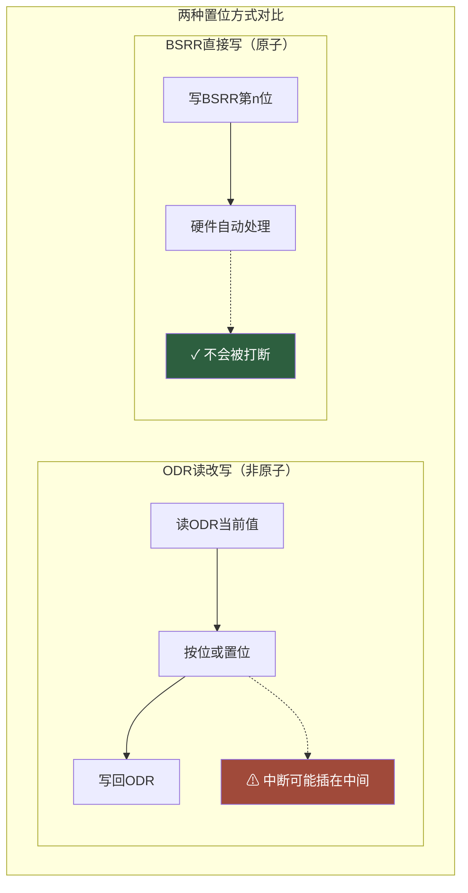
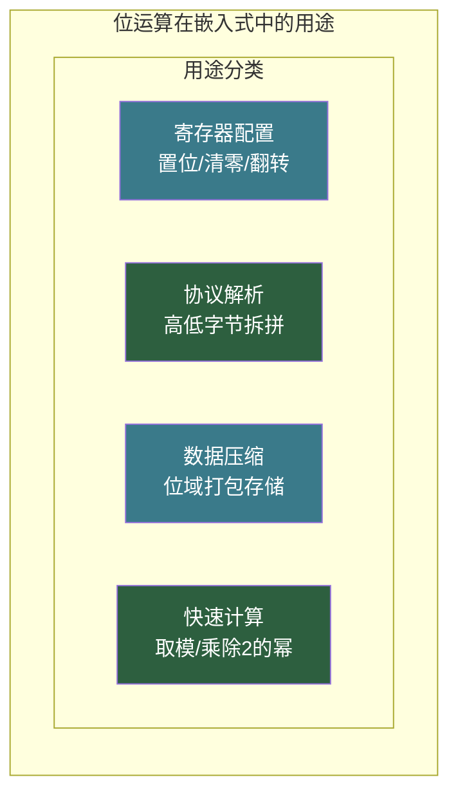

# 【筑基·048】位运算：嵌入式工程师的基本功

> **码农修仙传 · 筑基期 · 第48篇**
> 我是玄芯散人，带你从炼气修到大乘。

---

## 境界标识

```
╔════════════════════════════════════════╗
║     筑基期 · 第48篇                     ║
║     位运算：嵌入式工程师的基本功          ║
║     预计阅读：18分钟                     ║
╚════════════════════════════════════════╝
```

---

## 修仙引入

上一篇讲完存储层次结构，你知道了CPU取数据有多不容易。但有些操作不需要取一大堆数据来回搬，直接在二进制粒度动手脚就行。一个int有32个比特，每个比特都能单独拨弄，这种操作叫位运算。

修仙者炼丹时控火候，一根火芯、一个风门地调，精准到毫厘。位运算就是这种粒度的操控力，直接在比特位上动手脚，快得离谱，省得夸张。嵌入式工程师天天跟寄存器打交道，寄存器里每一位都管一个开关，不会位运算等于不会开灯。

---

## 硬核主体

### 一、六种位运算符

C语言提供了六种位运算符，操作对象是整数类型的二进制位。

| 运算符 | 名称 | 说明 |
|--------|------|------|
| `&` | 按位与 | 两个位都为1，结果才为1 |
| `\|` | 按位或 | 两个位只要有一个为1，结果就为1 |
| `^` | 按位异或 | 两个位不同时为1，相同时为0 |
| `~` | 按位取反 | 0变1，1变0，一元运算符 |
| `<<` | 左移 | 所有位向左移，低位补0 |
| `>>` | 右移 | 所有位向右移，高位补符号位（有符号数）或补0（无符号数） |

为了方便理解，拿一个8位无符号数 `0b10110011`（十进制179）举例。跟 `0b00001111`（十进制15）做按位与：

```c
uint8_t a = 0b10110011;  // 179
uint8_t b = 0b00001111;  // 15
uint8_t c = a & b;       // 0b00000011 = 3

// 按位与：逐位比较，两个都为1才出1
//   10110011
// & 00001111
// -----------
//   00000011
```

这个操作把高4位全部清零，只留下低4位。`0b00001111` 就像一个筛子，只放低4位通过，高位全部挡住。这个筛子有个名字叫掩码（Mask）。

### 二、掩码：位运算的灵魂

位运算一大半的实用技巧都围绕掩码展开。掩码就是一个特定的比特模式，用来选取、清除或翻转数据中的某些位。

设定一个目标：你有一个8位寄存器值 `reg = 0b11010110`，想单独看第3位（从0开始数）是0还是1。

```c
uint8_t reg = 0b11010110;

// 构造掩码：第3位为1，其余为0
uint8_t mask = (1 << 3);  // 0b00001000

// 按位与：如果结果非零，说明第3位是1
if (reg & mask) {
    // 第3位是1
}

// 如果要判断第3位是否为0，取反再与
if (~(reg >> 3) & 1) {
    // 第3位是0
}
```

掩码操作有四把常用板斧，记住这四个模式，日常开发够用：

```c
// 假设reg是某个寄存器值，bit n表示第n位（从0开始）

// 1. 置位（把某位设为1）：用按位或
reg |= (1 << n);     // 第n位变1，其余不变

// 2. 清零（把某位设为0）：用按位与 + 取反
reg &= ~(1 << n);    // 第n位变0，其余不变

// 3. 翻转（把某位取反）：用按位异或
reg ^= (1 << n);     // 第n位翻转，0变1或1变0

// 4. 读取（看某位是0还是1）：用按位与
val = (reg >> n) & 1;  // 取出第n位的值
```

这四把板斧的逻辑很好记。置位用或，因为 `x | 1 = 1`，不管原来是啥，跟1做或一定变1。清零用与加取反，因为 `x & 0 = 0`，跟0做与一定变0，而取反刚好把那一位变成0其余变成1。翻转用异或，因为 `x ^ 1 = ~x`，异或1等于取反。读取用与加移位，先移到最低位再跟1做与，把那一位单独拎出来。

来个实际例子。STM32的GPIO有一个寄存器叫BSRR，端口置位复位寄存器。低16位负责置位（写1使对应引脚输出高电平），高16位负责清零（写1使对应引脚输出低电平）。想让PA5输出高电平：

```c
// BSRR低16位对应置位，第5位置1就是让PA5输出高
GPIOA->BSRR = (1 << 5);  // 原子操作，不会被打断

// 想让PA5输出低电平，往高16位的对应位写1
GPIOA->BSRR = (1 << (5 + 16));  // 高16位第5位
```

BSRR的设计很巧妙，你不需要读出来改完再写回去，直接写就行，硬件保证这个操作不会被中断打断。如果用普通的 `ODR` 寄存器做 `ODR |= (1<<5)`，中间有个读改写的过程，如果恰好在读和写之间来了中断，中断里也改了ODR，回去写的旧值就会把中断的修改覆盖掉。BSRR绕过了这个问题。



### 三、异或的奇妙性质

六种位运算里最反直觉的是异或。但异或有一组数学性质，让它在某些情况下特别好使。

性质一：任何数跟自己异或等于0。`a ^ a = 0`。因为每个位跟自己比，相同为0。

性质二：任何数跟0异或等于自己。`a ^ 0 = a`。因为0跟任何位比，结果就是那个位本身。

性质三：异或满足交换律和结合律。`a ^ b ^ a = a ^ a ^ b = 0 ^ b = b`。

利用这几条，可以做到不用临时变量就交换两个数：

```c
void swap(int *x, int *y) {
    *x ^= *y;  // x = x ^ y
    *y ^= *x;  // y = y ^ (x ^ y) = x
    *x ^= *y;  // x = (x ^ y) ^ x = y
}

// 注意：x和y不能指向同一个地址！
// 如果x == y，第一步x^=y之后x变成0，后面全废了
```

这个写法看起来很酷，但实际项目里几乎不用。为什么？可读性差，编译器对临时变量交换的改进已经做得很好，性能没有差别，而且还有那个同地址的坑。了解原理就行，别在正经代码里炫技。

异或更实际的用途是简单加密。把数据和密钥异或一遍就加密了，再异或一遍就解密了，因为 `(data ^ key) ^ key = data`。


```c
uint8_t encrypt(uint8_t data, uint8_t key) {
    return data ^ key;
}

uint8_t decrypt(uint8_t data, uint8_t key) {
    return data ^ key;  // 同样的操作，异或两次还原
}
```

### 四、移位的妙用

左移一位相当于乘2，右移一位相当于除2（对无符号数或非负有符号数）。这比乘除法快，虽然现代编译器会自动把乘除2的幂常量改成移位，但理解原理很有必要。

```c
int x = 5;
int a = x << 1;  // 10，等价于 x * 2
int b = x << 2;  // 20，等价于 x * 4
int c = x << 3;  // 40，等价于 x * 8

int d = x >> 1;  // 2，等价于 x / 2（向下取整）
```

移位做乘法有个坑：溢出。左移超过类型的位宽，高位直接丢掉，不会报错。一个32位int左移32位以上是未定义行为，不同编译器结果可能不一样。

```c
int32_t val = 0x40000000;  // 2^30
int32_t r = val << 2;      // 理论上2^32，但int32装不下，溢出
// 结果是未定义行为，不同编译器或优化等级可能给出不同结果
```

移位另一个常见用途是拼数据和拆数据。比如一个16位数据要存进两个8位寄存器：

```c
uint16_t data = 0xABCD;
uint8_t high = (data >> 8) & 0xFF;  // 0xAB
uint8_t low  = data & 0xFF;         // 0xCD

// 反过来，从两个8位拼回16位
uint16_t combined = (high << 8) | low;  // 0xABCD
```

这种高低字节拆拼在嵌入式通信协议里天天见。I2C读16位寄存器时，设备先返回高字节再返回低字节，你得自己拼起来。SPI传输16位数据时，有些设备要求先发高字节，有些要求先发低字节，也是移位拼接的活。

### 五、位域：结构体里的比特级打包

有时候你需要在结构体里定义几个很小的字段，每个字段只占几个比特，不想浪费整字节。C语言提供了位域（Bit-field）语法。

```c
struct Flags {
    uint8_t enable   : 1;  // 1 bit
    uint8_t mode     : 3;  // 3 bits，可表示0-7
    uint8_t priority : 2;  // 2 bits，可表示0-3
    uint8_t reserved : 2;  // 2 bits，凑满1字节
};

struct Flags f;
f.enable = 1;
f.mode = 5;        // 二进制101
f.priority = 2;    // 二进制10
f.reserved = 0;
```

整个结构体只占1个字节，编译器帮你把这几个字段塞进同一个字节里。读写时编译器自动做移位和掩码操作，你写 `f.mode = 5` 看起来跟普通赋值一样，底层实际是在做按位操作。

位域用起来方便，但有几个坑要注意。

坑一：内存布局跟编译器和字节序有关。C标准没有规定位域在字节内的排列顺序，有的编译器从高位开始排，有的从低位开始排。大端和小端机器上同样的位域定义，内存布局可能不一样。所以位域定义要跟硬件寄存器的位排列核对，不能想当然。

坑二：不能对位域取地址。`&f.mode` 编译报错，因为位域没有独立的地址，它是字节内部的几位。

坑三：跨平台不可移植。不同编译器对位域的实现细节有差异，如果代码要跑在多个平台上，用位域访问硬件寄存器是有风险的。很多嵌入式项目宁可用宏定义加移位操作，也不用位域。

```c
// 用宏代替位域，可移植性更好
#define FLAG_ENABLE_Pos   0
#define FLAG_ENABLE_Msk   (1 << FLAG_ENABLE_Pos)
#define FLAG_MODE_Pos     1
#define FLAG_MODE_Msk     (0x7 << FLAG_MODE_Pos)  // 3 bits

// 设置mode为5
reg = (reg & ~FLAG_MODE_Msk) | (5 << FLAG_MODE_Pos);
```

这种写法比位域啰嗦，但行为确定，不依赖编译器实现。STM32的CMSIS库里大量使用这种 `Pos` 和 `Msk` 宏组合，每个寄存器位都有对应定义。

### 六、实用技巧合集

几个日常开发中经常遇到的位运算技巧，记住能省不少事。

判断奇偶。最低位是1就是奇数，是0就是偶数：

```c
if (n & 1) {
    // 奇数
} else {
    // 偶数
}
```

计算2的幂次方的取模。如果n是2的幂，`x % n` 等价于 `x & (n - 1)`：

```c
// n = 8，二进制1000，n-1 = 0111
int x = 37;
int r = x & 7;  // 等价于 x % 8，结果5
```

这个技巧在实现环形缓冲区时特别常用。缓冲区大小设成2的幂，索引取模直接用按位与，不需要除法。

判断一个数是不是2的幂。2的幂的二进制只有一个1：

```c
// 2的幂：n > 0 且 n的二进制只有一个1
// n & (n-1) 会把最低位的1清掉，如果结果为0说明原来只有一个1
int is_power_of_two(int n) {
    return (n > 0) && ((n & (n - 1)) == 0);
}
```

统计二进制中1的个数（Brian Kernighan算法）：

```c
int count_ones(uint32_t n) {
    int count = 0;
    while (n) {
        n &= (n - 1);  // 每次清掉最低位的1
        count++;
    }
    return count;
}

// n & (n-1) 的效果：把n最低位的1变成0
// 比如n = 0b101100，n-1 = 0b101011
// n & (n-1) = 0b101000，最低位的1被清掉了
```

循环次数等于1的个数，不是总位数，效率比逐位检查高。

### 七、位运算的性能优势

位运算在CPU上是单周期指令，与加减法同级，比乘除法快很多。虽然现代编译器很聪明，能自动把 `x * 2` 改成 `x << 1`，但有些情况编译器不敢随便动，这时候手动写位运算就有价值。

更关键的是，位运算直接对应机器指令，行为确定可控。当你需要精确控制寄存器的每一位时，位运算是唯一的选择。嵌入式开发中配置寄存器，通信协议中拼接帧头校验位，驱动开发中操作硬件标志位，都离不开位运算。



---

## 修仙术语对照表

| 修仙术语 | 技术现实 | 本篇位置 |
|----------|---------|---------|
| 炼丹控火候 | 位运算精确操控比特位 | 修仙引入 |
| 拨一根火芯 | 置位某一位 | 修仙引入 + 掩码四板斧 |
| 堵一个风门 | 清零某一位 | 修仙引入 + 掩码四板斧 |
| 筛子 | 掩码Mask，选取指定位 | 按位与讲解 |
| 火芯翻转 | 异或翻转位状态 | 掩码四板斧 + 异或性质 |
| 同源相消 | 异或性质 `a^a=0` | 异或性质一 |
| 密信加封 | 异或简单加密 | 异或加密用途 |
| 倍增缩地 | 左移乘2，右移除2 | 移位妙用 |
| 储物格分格 | 位域在字节内打包字段 | 位域讲解 |
| 格规不一 | 位域布局依赖编译器 | 位域坑一 |
| 取丹计数 | Brian Kernighan统计1的个数 | 实用技巧 |
| 环形回廊 | 环形缓冲区按位与取模 | 取模技巧 |
| 须弥芥子 | 一个字节存多个标志位 | 位域 |
| 原子一击 | BSRR原子操作 | GPIO寄存器实例 |

---

## 进阶条件

- [ ] 能默写掩码四板斧：置位用或，清零用与加取反，翻转用异或，读取用与加移位
- [ ] 能解释 `reg &= ~(1 << n)` 每一步在做什么，为什么能清零
- [ ] 能用位运算把16位数据拆成高低字节，再拼回来
- [ ] 理解异或的三条性质，能推导不用临时变量交换的原理
- [ ] 能说出位域至少两个坑：不能取地址、布局依赖编译器
- [ ] 能用 `n & (n-1)` 统计二进制中1的个数，并解释原理
- [ ] 理解为什么环形缓冲区大小要设成2的幂

满足这些条件，你就能在寄存器粒度自如操控每一个比特。下一篇我们把视角拉到另一边，看看浮点数在内存里到底怎么存的，为什么0.1加0.2不等于0.3。

---

## 下期预告 + 互动

下一篇：**【049】浮点数怎么存的：IEEE 754标准**。你以为 `float x = 0.1` 存的就是精确的0.1？错了。0.1在二进制里是无限循环小数，存进float之后已经丢精度了。我们会拆开IEEE 754的32位浮点数格式，看符号位和指数位和尾数位各自负责什么，然后亲手验证0.1+0.2到底等于多少。

互动问题：你写过的代码里，哪个位运算技巧让你觉得最精妙？或者哪个位运算的坑把你坑得最惨？评论区聊聊。

我是玄芯散人，带你从炼气修到大乘。

---

*本文是「码农修仙传」系列第48篇。系列导航见 [xren.ren](https://xren.ren)*
