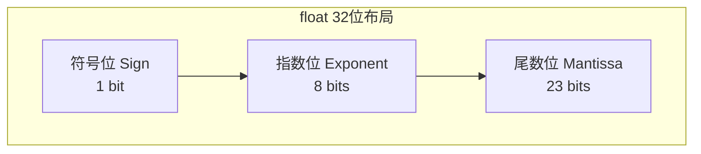
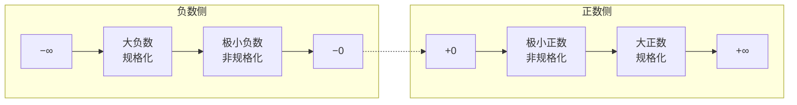
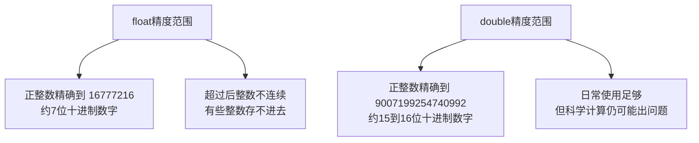

# 【筑基·049】浮点数怎么存的：IEEE 754标准

> **码农修仙传 · 筑基期 · 第49篇**
> 我是玄芯散人，带你从炼气修到大乘。

---

## 境界标识

```
╔════════════════════════════════════════╗
║     筑基期 · 第49篇                     ║
║     浮点数怎么存的：IEEE 754标准          ║
║     预计阅读：15分钟                     ║
╚════════════════════════════════════════╝
```

---

## 修仙引入

上一篇讲位运算，你在比特粒度上拨弄0和1。但有一个问题一直被刻意回避：整数在内存里怎么存，你心里有数了，可小数呢？你在代码里写 `float x = 0.1;`，这0.1存进32个比特之后到底变成了什么？

修仙者炼制灵液，灵液装在瓶子里，瓶子有固定容积。3.14升灵液倒进一个只能装整数的瓶子，多出来的部分怎么办？要么截断，要么四舍五入。浮点数的存储也是这个困境，只不过"瓶子"的设计比你想的精巧得多，也坑得多。

---

## 硬核主体

### 一、整数存的什么，浮点数存的什么

整数好办，十进制转二进制，直接放进去。`int a = 5;` 存的是 `00000000 00000000 00000000 00000101`，一目了然。

浮点数不行。3.14的二进制表示是 `11.00100011110101110000101...`，小数部分是无限循环的。32个比特塞不下无限循环的东西，怎么办？

IEEE 754标准给出的方案是"科学记数法"。你写十进制科学记数法的时候，`3.14 = 3.14 × 10⁰`，`0.0015 = 1.5 × 10⁻³`。IEEE 754干的事情一模一样，只不过进制换成2。

一个浮点数被拆成三部分存放：



- 符号位：1位，0表示正数，1表示负数
- 指数位：8位（float）或11位（double），存的是指数的值加上一个偏移量
- 尾数位：23位（float）或52位（double），存的是小数点后面的部分

十进制里 `3.14 × 10⁰`，在二进制里变成 `1.10010001111... × 2¹`。那个 `1.1001000...` 是尾数，`1` 是指数。符号位管正负，指数位管小数点移动几位，尾数位管精度数字。

### 二、单精度float的32位拆解

float占4个字节，共32位。布局是这样：

| 符号位(1bit) | 指数位(8bits) | 尾数位(23bits) |
|:---:|:---:|:---:|
| S | EEEEEEEE | MMMMMMMMMMMMMMMMMMMMMMM |

拿一个具体数字来拆。`float x = 5.75;`，5.75的二进制是什么？

整数部分5 = `101`。小数部分0.75 = 0.5 + 0.25 = `0.11`。拼起来：`101.11`。

科学记数法规格化，让小数点前面只有一位且为1：`1.0111 × 2²`。

现在三部分各存什么：
- 符号位 S = 0（正数）
- 指数 = 2，IEEE 754存储时加上偏移量127，存入 `2 + 127 = 129`，二进制 `10000001`
- 尾数 = `0111`，后面补零到23位：`01110000000000000000000`

拼起来：`0 10000001 01110000000000000000000`。

```c
#include <stdio.h>
#include <string.h>

void print_bits(float f) {
    unsigned int bits;
    memcpy(&bits, &f, sizeof(bits));  // 取出float的原始比特（type punning，依赖内存布局）
    
    printf("float %f 的二进制：", f);
    printf("%d ", (bits >> 31) & 1);          // 符号位
    for (int i = 30; i >= 23; i--)            // 指数位8位
        printf("%d", (bits >> i) & 1);
    printf(" ");
    for (int i = 22; i >= 0; i--)             // 尾数位23位
        printf("%d", (bits >> i) & 1);
    printf("\n");
}

int main() {
    print_bits(5.75f);
    print_bits(1.0f);
    print_bits(0.1f);
    return 0;
}
```

运行这段代码你会看到：
- `5.750000` → `0 10000001 01110000000000000000000`
- `1.000000` → `0 01111111 00000000000000000000000`（指数127即0，尾数全零）
- `0.100000` → `0 01111011 10011001100110011001101`（注意尾数在循环）

### 三、那个127是什么东西

指数位存的值经过偏移处理，实际指数等于存储值减去偏移量。float的偏移量是127，double的偏移量是1023。

为什么要加偏移量？因为指数有正有负，用补码存符号在比较时麻烦。IEEE 754选择无符号存储，统一加上偏移量，这样指数位越大，实际指数就越大，硬件比较大小直接比无符号整数即可，不用管符号。

float的8位指数，能表示0到255。但0和255被留作特殊用途，正常指数范围是1到254，对应实际指数-126到+127。

| 指数位 | 含义 |
|-------|------|
| 全零 (0) | 特殊：零或非规格化数 |
| 1~254 | 正常：实际指数 = E - 127 |
| 全一 (255) | 特殊：无穷大或NaN |

### 四、规格化与非规格化

正常的浮点数叫规格化数，小数点前那一位固定是1。既然固定是1，就不用存了，省一个比特。所以尾数位虽然只有23位，实际精度是24位，那个隐含的1是白送的。

但当数值非常接近0的时候，这套机制就出问题了。假设你要存 `1.0 × 2⁻¹²⁷`，实际指数-127，加上偏移量后是0，但指数位全零被留作特殊用途了。这时候IEEE 754引入非规格化数：指数位全零，小数点前面不再是隐含的1而是0，实际指数固定为-126（float）。

非规格化数允许表示非常小的数值，代价是精度逐渐降低（靠近0精度越低）。这个设计叫"渐进下溢"（gradual underflow），比突然变成0要优雅得多。



### 五、特殊值：零，无穷大，NaN

IEEE 754预留了几个特殊编码：

```c
#include <stdio.h>
#include <math.h>

int main() {
    float zero = 0.0f;
    float neg_zero = -0.0f;
    float inf = INFINITY;
    float neg_inf = -INFINITY;
    float nan_val = NAN;
    
    printf("0.0 == -0.0: %d\n", zero == neg_zero);  // 1，正零和负零比较相等
    printf("inf == inf: %d\n", inf == inf);          // 1，无穷大相等
    printf("nan != nan: %d\n", nan_val != nan_val);  // 1，NaN和自己不相等
    
    // NaN的判断方法：只有NaN不等于自己
    if (nan_val != nan_val) {
        printf("这是NaN\n");
    }
    return 0;
}
```

特殊编码对应关系：

| 指数位 | 尾数位 | 含义 |
|-------|------|------|
| 全零 | 全零 | ±0（符号位决定正零负零） |
| 全零 | 非零 | 非规格化数（极小值） |
| 全一 | 全零 | ±∞（无穷大） |
| 全一 | 非零 | NaN（Not a Number） |

NaN在嵌入式开发里经常碰到。两个float做除法，0.0除以0.0结果就是NaN。NaN的特殊之处在于它不等于任何值，包括自己。所以判断一个数是不是NaN，最可靠的方法就是 `if (x != x)`。

### 六、为什么0.1加0.2不等于0.3

这个问题是浮点数面试经典。现在你有了基础，我们来拆解。

0.1的十进制写成二进制是多少？0.1 × 2 = 0.2（整数0），0.2 × 2 = 0.4（整数0），0.4 × 2 = 0.8（整数0），0.8 × 2 = 1.6（整数1），0.6 × 2 = 1.2（整数1），0.2 × 2 = 0.4（整数0）……循环了。

所以0.1的二进制是 `0.0001100110011001100110011...`，无限循环。float只有23位尾数，存不下无限循环，必然截断。截断之后就不再是精确的0.1了。

```c
#include <stdio.h>

int main() {
    float a = 0.1f;
    float b = 0.2f;
    float c = a + b;
    
    printf("0.1f = %.20f\n", a);  // 0.10000000149011611938
    printf("0.2f = %.20f\n", b);  // 0.20000000298023223877
    printf("a+b = %.20f\n", c);   // 0.30000001192092895508
    printf("0.3f = %.20f\n", 0.3f); // 0.30000001192092895508
    
    // float下碰巧相等？试试double
    double da = 0.1;
    double db = 0.2;
    double dc = da + db;
    printf("\ndouble:\n");
    printf("0.1+0.2 = %.17f\n", dc); // 0.30000000000000004
    printf("0.3    = %.17f\n", 0.3); // 0.29999999999999999
    printf("equal? %d\n", dc == 0.3); // 0，不相等
    
    return 0;
}
```

在float里0.1+0.2恰好等于0.3f（因为截断的舍入一致），但在double里就不等了。这就是为什么金融系统从不用浮点数算钱，要么用整数（分），要么用Decimal类型。

### 七、精度到底有多差

float有23位尾数，加上隐含的1是24位精度。2²⁴ = 16777216，所以float能精确表示的最大整数是16777216。超过这个数，整数就不连续了。

```c
#include <stdio.h>

int main() {
    float a = 16777216.0f;  // 2^24
    float b = 16777217.0f;  // 2^24 + 1
    
    printf("16777216.0f == 16777217.0f: %d\n", a == b);  // 1！相邻整数相等
    
    // 16777217存不进去，被截断成16777216
    printf("a = %.0f\n", a);  // 16777216
    printf("b = %.0f\n", b);  // 16777216（不是16777217！）
    
    return 0;
}
```

16777216能存，16777217存不了，因为23位尾数装不下它。这就是浮点数的精度天花板。double有52位尾数，精度到2⁵³ ≈ 9×10¹⁵，对大多数用途足够了，但也不是无限精确。



### 八、嵌入式开发中的浮点坑

嵌入式工程师遇到浮点数的机会不多，但碰到了坑通常很深。几个常见问题：

第一，MCU没有FPU（浮点运算单元）。Cortex-M0和M3没有硬件浮点，`float`运算靠软件模拟，一次乘法可能耗上百个时钟周期。Cortex-M4F和M7有FPU，但要在编译器里正确开启FPU选项才行。

第二，等号判断浮点数。`if (x == 0.3)` 基本永远不会成立，因为0.3的存储值不精确。正确做法是判断差值是否在允许范围内：

```c
// 错误写法
float target = 0.3f;
if (val == target) { ... }  // float和double下都几乎不可能相等

// 正确写法
#include <math.h>
#define EPSILON 1e-6f
if (fabsf(val - target) < EPSILON) {
    // 差值在允许范围内，认为相等
}
```

第三，不同编译器或不同编译级别下，浮点中间结果可能用不同精度。x86上有80位扩展精度寄存器（x87 FPU），中间计算可能比最终存储精度高，换编译器或换编译级别后结果就不一样了。这叫"超额精度"问题，在GCC里用 `-ffloat-store` 可以强制每次运算都存储到内存，但会降低性能。

---

## 修仙术语对照表

| 修仙术语 | 技术现实 | 本篇位置 |
|----------|---------|---------|
| 灵液装瓶 | 浮点数用有限比特存无限小数 | 修仙引入 |
| 截断 | 尾数位不够，丢弃多余比特 | 修仙引入 |
| 炼丹分三味 | 符号位加指数位加尾数位三部分 | float布局 |
| 灵力刻度 | 指数位8位，偏移量127 | 指数偏移 |
| 拨动小数点 | 指数决定小数点位置 | 科学记数法 |
| 隐丹不显 | 规格化数隐含的最高位1，不存省空间 | 规格化数 |
| 稀薄灵气 | 非规格化数，靠近0精度降低 | 非规格化 |
| 渐散不灭 | 渐进下溢，精度逐渐降低而非突然归零 | 非规格化 |
| 灵虚 | NaN，非法运算结果 | 特殊值 |
| 灵极 | 无穷大，溢出结果 | 特殊值 |
| 正负归零 | +0和-0，符号位不同但比较相等 | 特殊值 |
| 炼丹精度 | float约7位十进制，double约15位 | 精度上限 |
| 瓶颈刻度 | 2^24=16777216，float精确整数上限 | 精度差 |
| 无器炼丹 | 没有FPU靠软件模拟浮点运算 | 嵌入式坑 |

---

## 进阶条件

- [ ] 能画出float的32位布局，说出三部分各占几位
- [ ] 能把5.75手动转换成IEEE 754二进制，说出三部分各存的什么
- [ ] 能解释指数偏移量为什么是127而不用补码存符号
- [ ] 能说出规格化数隐含的最高位1为什么省了，精度24位怎么来的
- [ ] 能用代码验证0.1+0.2在float和double下分别是否等于0.3，并解释原因
- [ ] 知道判断NaN的正确方法是 `x != x`，不写 `x == NaN`
- [ ] 能解释为什么浮点数不能用 == 直接判断相等，能写出带epsilon的判断代码
- [ ] 知道Cortex-M0没有FPU，浮点运算靠软件模拟会慢

满足这些条件，你对浮点数在内存里的存储方式就有了扎实的认识。下一篇我们把视角拉远到宏观，看看逻辑门怎么拼成一块CPU。

---

## 下期预告 + 互动

下一篇：**【050】从逻辑门到CPU：概念总览**。三种基本逻辑门，拼出加法器，拼出寄存器，拼出整个CPU。我们不讲晶体管级细节（那是元婴期的事），只把"开关怎么变成能跑程序的芯片"这条链路串一遍，给你一个宏观认知。

互动问题：你在项目里遇到过最隐蔽的浮点数bug是什么？有没有被0.1+0.2这种问题坑过？评论区说说。

我是玄芯散人，带你从炼气修到大乘。

---

*本文是「码农修仙传」系列第49篇。系列导航见 [xren.ren](https://xren.ren)*
