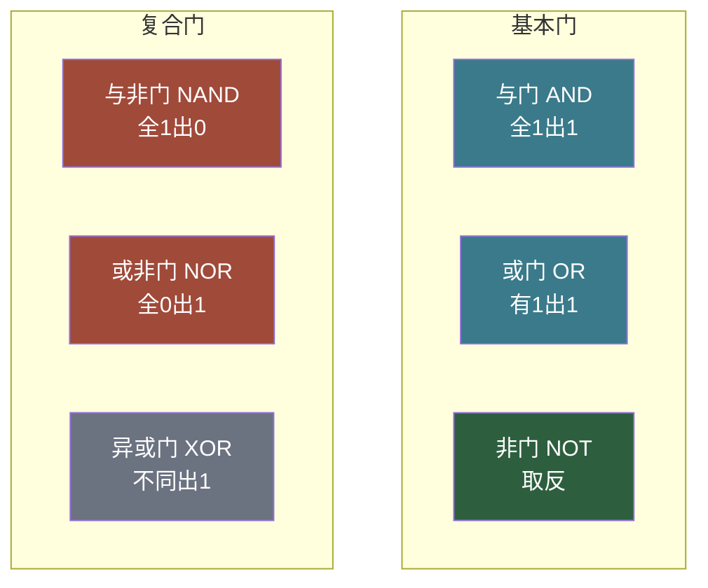
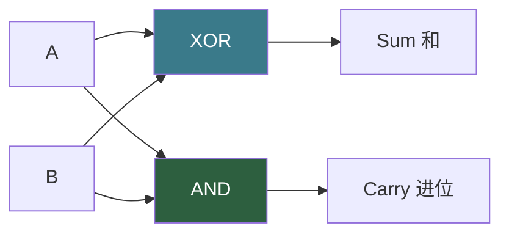
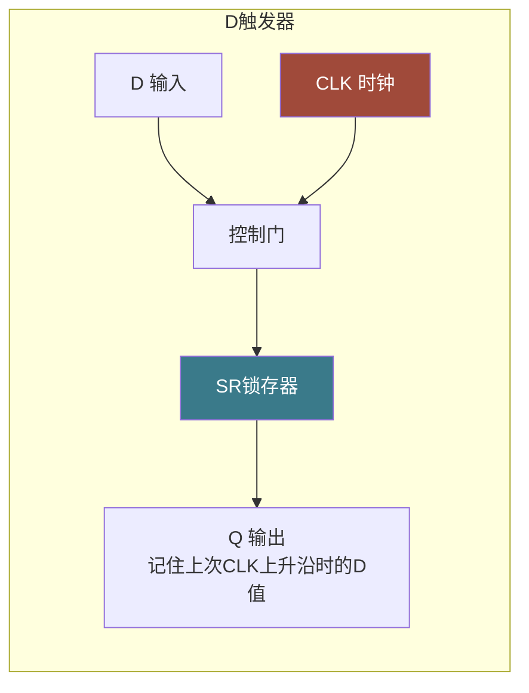
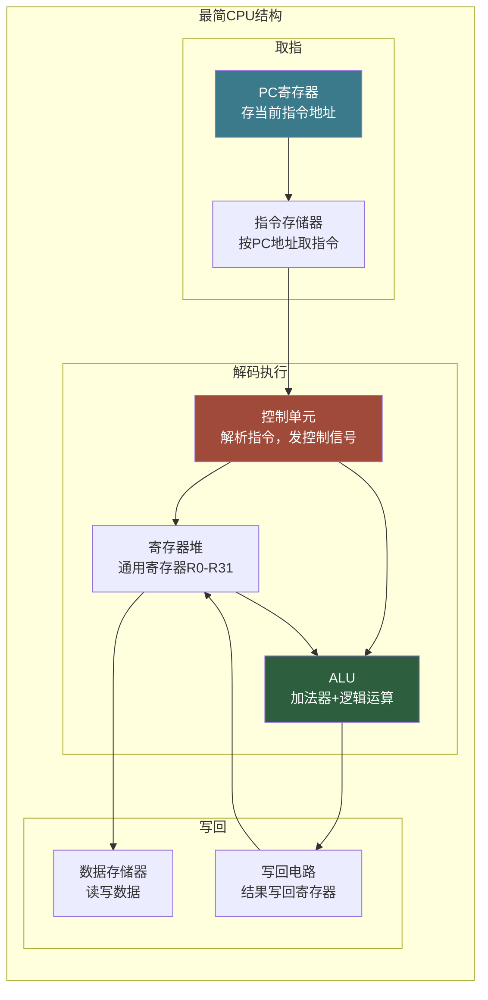

# 【筑基·050】从逻辑门到CPU：概念总览

> **码农修仙传 · 筑基期 · 第50篇**
> 我是玄芯散人，带你从炼气修到大乘。

---

## 境界标识

```
╔══════════════════════════════════════╗
║     筑基期 · 第50篇                   ║
║     从逻辑门到CPU：概念总览            ║
║     预计阅读：20分钟                   ║
╚══════════════════════════════════════╝
```

---

## 修仙引入

上一篇你把浮点数的存储拆得明明白白，知道了0.1加0.2为什么鬼使神差地不等于0.3。可回头一想，那些0和1到底在哪跑的？你写 `int a = 1 + 2;`，CPU怎么就算出了3？

这得退到最远处看。一块CPU里有几十亿个晶体管，但万丈高楼平地起，它们都是同几种基础积木搭起来的。这篇把开关到能跑程序的芯片这条链路串一遍，不碰晶体管级细节（留给元婴期），只让你看清积木怎么一层层拼上去，最终变成你每天用的CPU。

---

## 硬核主体

### 一、三种基本逻辑门

计算机里只有0和1。用电压高低表示：高电平是1，低电平是0。逻辑门就是一个小电路，接收若干个0或1的输入，输出一个0或1。最基础的三种：

与门（AND）：两个输入全为1，输出才是1。否则输出0。逻辑表达式 `Y = A · B`。

或门（OR）：两个输入只要有一个为1，输出就是1。逻辑表达式 `Y = A + B`。

非门（NOT）：输入1输出0，输入0输出1。逻辑表达式 `Y = Ā`。

把这三种门组合，能造出任何逻辑函数。这不是夸张，后面会解释为什么。

还有几种常用复合门，由基本门搭出来：

与非门（NAND）：先与后非，全1出0，否则出1。`Y = ¬(A · B)`

或非门（NOR）：先或后非，全0出1，否则出0。`Y = ¬(A + B)`

异或门（XOR）：输入不同输出1，输入相同输出0。`Y = A ⊕ B`



### 二、NAND万能性：一种门搭出一切

刚才说三种基本门能造任何逻辑，其实更狠：单独一个NAND门就够了。

用NAND搭NOT：把NAND的两个输入接在一起，`NAND(A, A) = ¬(A·A) = ¬A`。

用NAND搭AND：两个NAND串联，第一个NAND的输出接第二个NAND的两个输入。`NAND(NAND(A,B), NAND(A,B)) = ¬(¬(A·B)) = A·B`。

用NAND搭OR：先给两个输入各取反，再喂进NAND。`NAND(¬A, ¬B) = ¬(¬A·¬B) = A+B`（德摩根定律）。

```c
// 用C语言验证NAND的万能性
// 假设只有nand(a,b)可用，搭出not/and/or
int nand(int a, int b) {
    return !(a && b);  // 与非门
}

int not_gate(int a) {
    return nand(a, a);  // NOT = NAND(a,a)
}

int and_gate(int a, int b) {
    return not_gate(nand(a, b));  // AND = NOT(NAND(a,b))
}

int or_gate(int a, int b) {
    return nand(not_gate(a), not_gate(b));  // OR = NAND(NOT(a), NOT(b))
}
```

这就是NAND叫"万能门"的原因。实际芯片制造中，NAND门用晶体管搭出来只需要4个管子（CMOS工艺），比AND门还简单，所以很多芯片内部直接用NAND搭一切。

### 三、加法器：逻辑门拼出来的算术

有了逻辑门，就能做加法。

一位二进制加法，输入A和B，有两种结果：和（Sum）和进位（Carry）。

- 0+0=0，和0，进位0
- 0+1=1，和1，进位0
- 1+0=1，和1，进位0
- 1+1=10，和0，进位1

仔细看，和这一列就是XOR的真值表，进位这一列就是AND的真值表。所以一位加法器只需要一个XOR加一个AND：



这叫半加器（Half Adder）。为什么叫"半"？因为它只考虑了两个输入相加，没有考虑低位传上来的进位。

实际做加法时，中间位要加上低位进来的进位。三个输入（A、B、低位进位Cin）相加，输出和以及向高位的进位Cout。这叫全加器（Full Adder），用两个半加器加一个或门拼：

```c
// 全加器逻辑
int half_adder_sum(int a, int b) {
    return a ^ b;        // 和 = XOR
}

int half_adder_carry(int a, int b) {
    return a && b;       // 进位 = AND
}

// 全加器：a + b + cin = sum + cout
int full_adder_sum(int a, int b, int cin) {
    return a ^ b ^ cin;  // 两次XOR
}

int full_adder_cout(int a, int b, int cin) {
    return (a && b) || (a && cin) || (b && cin);  // 任意两个为1就进位
}
```

把32个全加器串起来，低位进位接高位输入，就是32位加法器。这就是ALU（算术逻辑单元）里加法电路的基础。减法也不神秘，补码制下 A-B 等于 A + (~B) + 1，把B取反加1再走加法器就行。

### 四、存储元件：让逻辑门记住状态

到这里为止，上面的电路有个问题：算完就忘，没法存结果。逻辑门是组合电路，输入变了输出立刻变，没有记忆。

要记住东西，得让输出绕回去喂给自己。这叫反馈。

最简单的记忆元件叫锁存器（Latch）。用两个NAND门交叉连接，一个输入叫Set（置位），一个叫Reset（复位）：

- Set=0时，输出Q变成1并保持
- Reset=0时，输出Q变成0并保持
- 两个都为1时，Q保持上次的值不变

这就是一位的存储。SR锁存器记住一个比特。

但锁存器有个问题：它是电平触发的，输入一变它就变。CPU需要的是"等我说更新的时候你再更新"的元件。于是有了D触发器（D Flip-Flop）：在锁存器前面加一个控制门，只有CLK信号0变1的一瞬间（上升沿），输入D才打进触发器，其他时候输出不变。



把8个D触发器并在一起，共用一个时钟线，就是8位寄存器。输入端接8根数据线，时钟一跳，8个比特同时打进8个触发器，寄存器就"记住"了一个字节。32个D触发器并起来就是32位寄存器。

CPU内部的寄存器堆、PC寄存器、IR寄存器，底层都是触发器阵列。上千个触发器排列起来，加上选择电路，就是CPU内部的寄存器堆。

### 五、拼装CPU：三大部件合体

有了能算的加法器，能存的寄存器，再加一个知道当前该干什么的控制电路，就能拼出最简单的CPU。



整个过程跑起来是这样：

PC里存着指令地址。时钟一跳，指令存储器按这个地址取出指令编码，放进IR。

控制单元读取IR里的指令编码，拆出操作码和操作数。如果是ADD，控制单元向寄存器堆发读信号，把源寄存器的值送到ALU输入端，同时向ALU发"做加法"的控制信号。

ALU算出结果，控制单元发写回信号，结果写回目标寄存器。PC加4指向下一条指令。下一个时钟周期重复以上过程。

一条ARM64的 `ADD W0, W1, W2` 指令，在硬件层面就是这样走的：取指令，解码出ADD操作码和三个寄存器编号，读W1和W2的值，ALU做加法，结果写进W0。

### 六、时钟：驱动一切的心跳

你可能注意到了，上面反复提到"时钟一跳"。CPU里所有动作都由时钟信号同步。

时钟就是一个方波信号，在高电平和低电平之间来回跳。电平上升的跳变叫上升沿，电平下降叫下降沿。D触发器在上升沿更新数据，其他时间保持不变。这样所有触发器同时更新，数据像流水一样一拍一拍往前走。

时钟频率决定了CPU跑多快。1GHz意味着每秒10亿次上升沿，理论上每拍执行一条指令（流水线填满后）。实际因为流水线冒险和分支预测失败，平均到不了1条/周期，但现代CPU通过超标量和乱序执行，IPC能到3到4。

为什么不能无限提速时钟？因为信号在导线上传播需要时间，逻辑门输入信号变化后输出稳定需要时间（门延迟）。一个时钟周期内，信号必须经过若干级门到达下一个触发器并稳定。周期太短，信号还没稳定就被下一拍采样，数据就错了。这就是为什么芯片制程缩小能提速：晶体管更小，门延迟更短，能跑更高频率。

### 七、回到现实

但骨架就这些。逻辑门搭出运算和存储，时钟驱动数据流动，控制单元解析指令指挥调度。你手机里的A18芯片和服务器里的霄龙，底层原理跟上面画的图没有区别，只是规模差了几个数量级。

实际上现代CPU远不止这些。缓存分L1 L2 L3三层，分支预测器赌跳转方向，TLB加速地址翻译，乱序执行引擎打乱指令顺序提升吞吐，SIMD单元一条指令处理多个数据。这些都是在这个骨架上加的。

1980年代的8051单片机有约6万个晶体管。今天的苹果M3有250亿个。规模涨了四十多万倍，但基本积木没变：与门、或门、非门加上触发器，搭出来的。区别只在于数量和连接方式。

---

## 修仙术语对照表

| 修仙术语 | 技术现实 | 本篇位置 |
|---------|---------|---------|
| 灵气二元 | 0和1，用高低电平表示 | 逻辑门 |
| 三味真火 | 与门或门非门三种基本逻辑门 | 基本逻辑门 |
| 万能丹方 | NAND万能门，一种门搭出所有逻辑 | NAND万能性 |
| 炼丹一次 | 半加器，XOR加AND实现一位加法 | 加法器 |
| 连环炼丹 | 全加器，串联多个实现多位加法 | 加法器 |
| 灵力回环 | 反馈，输出绕回去喂给自己实现记忆 | 锁存器 |
| 定魂锁 | SR锁存器，记住一个比特 | 锁存器 |
| 心跳节拍 | 时钟信号CLK，驱动所有触发器同步更新 | D触发器 |
| 顿悟时刻 | 时钟上升沿，数据打入触发器 | D触发器 |
| 炼丹阵列 | 寄存器，多个D触发器并联 | 存储元件 |
| 三器合体 | 控制单元加ALU加寄存器堆拼成CPU | 拼装CPU |
| 灵脉节律 | 时钟频率，决定CPU运行速度 | 时钟 |
| 回到现实 | 基本积木不变，规模和连接方式变化 | 回到现实 |

---

## 进阶条件

- [ ] 能画出与门或门非门三种基本逻辑门的真值表
- [ ] 能用NAND搭出NOT和AND，说出连接方式
- [ ] 能解释半加器为什么用XOR算和、AND算进位
- [ ] 知道全加器比半加器多了什么输入（低位进位Cin）
- [ ] 能说出D触发器和锁存器的区别（边沿触发vs电平触发）
- [ ] 能画出最简CPU的三大部件（控制单元加ALU加寄存器堆）关系图
- [ ] 能解释时钟频率为什么不能无限提高（门延迟和信号传播时间）
- [ ] 知道8051约6万晶体管和现代CPU几十亿晶体管底层积木相同

全部勾掉，逻辑门到CPU的概念链路你就通了。下一篇进入操作系统和网络，看看进程和线程到底什么关系。

---

## 下期预告 + 互动

下一篇：**【051】操作系统是天道规则**。CPU能算能存了，可谁来管谁先跑、谁后跑？多个程序同时运行时，内存怎么分？为什么你的程序不能直接读写别人的内存？操作系统怎么做到给每个进程都造一个"独占4GB"的幻觉？下一篇讲操作系统的基本概念。

互动问题：你有没有想过，手机里那颗几十亿晶体管的芯片，底层就是跟与非门一样的积木？你对"简单积木拼出复杂系统"这件事有什么感受？评论区聊聊。

我是玄芯散人，带你从炼气修到大乘。

---

*本文是「码农修仙传」系列第50篇。系列导航见 [xren.ren](https://xren.ren)*
