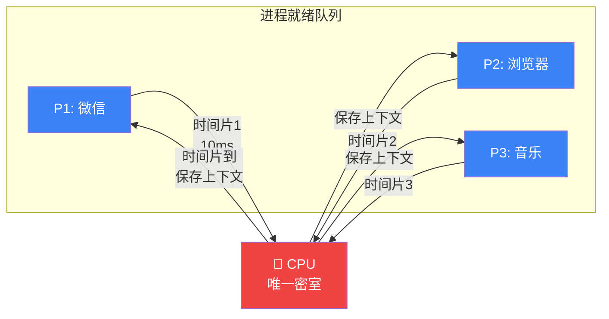
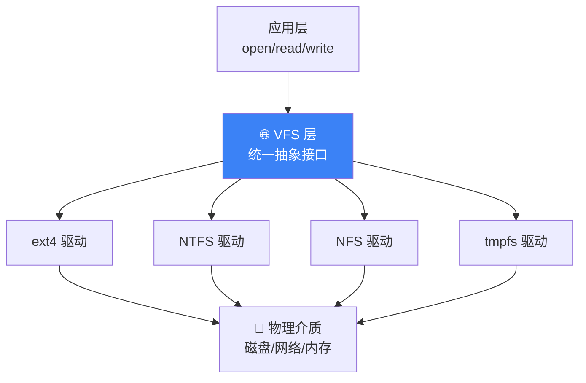
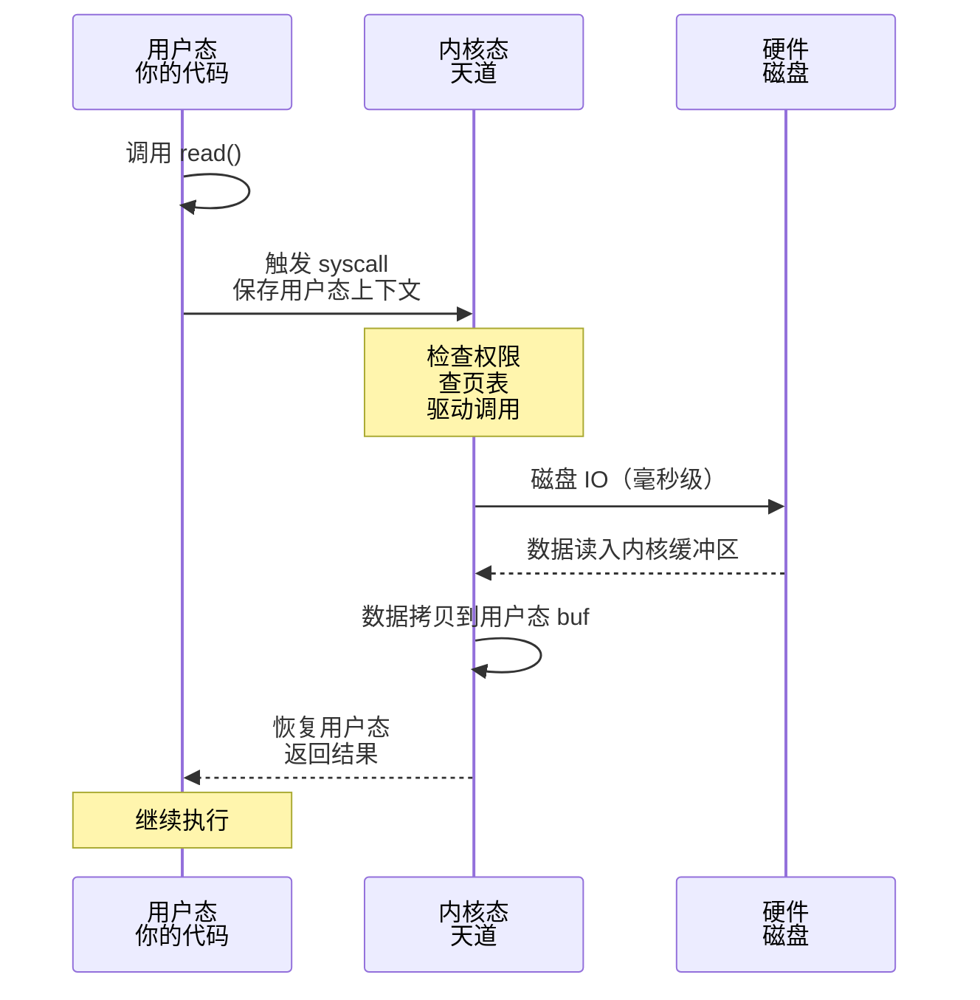

# 【筑基·51】操作系统是天道规则

> **码农修仙传 · 筑基期 · 第7篇**
> 我是玄芯散人，带你从炼气修到大乘。

---

## 境界标识

```
╔══════════════════════════════════╗
║     筑基期 · 第7篇               ║
║     操作系统是天道规则            ║
║     预计阅读：12分钟              ║
╚══════════════════════════════════╝
```

---

## 修仙引入

你写了一行 `open("file.txt")`，文件就打开了。

你觉得理所当然？不。是"天道"在帮你。

修仙世界里，天道是看不见但无处不在的规则——灵气怎么流动、功法怎么生效、生死轮回怎么运转，全都受天道约束。没人能绕过天道，也没人能看透天道。操作系统，就是计算机世界的天道。

你的程序做的一切，看似自由，实则全部要经过天道的允许。你分配内存？天道点头。你打开文件？天道准许。你同时开 100 个标签页？天道按规则给你排时间片。你以为你在"自由地"敲代码，其实你一直在一个宏大的规则体系里活动——只是这个体系太安静，安静到大多数码农一辈子都感觉不到它的存在。

这一篇，我们来感知天道。

筑基期的第二座地基（上一篇我们立过四座地基的纲），就是操作系统。它不像数据结构那么有形，也不像网络那么直观——它是规则本身。理解了它，你写代码会突然多出一层"原来如此"的通透感；不理解它，你就会一直被各种诡异问题折磨：程序偶尔卡死、内存莫名其妙爆掉、文件明明存在却读不到——这些都源于你不懂天道。

下面我们从五个面把这套规则看清楚：操作系统在管什么、进程怎么调度、内存怎么分配、文件怎么组织、系统调用怎么发生。

---

## 硬核主体

### 2.1 天道的本质——操作系统到底在管什么

操作系统（OS）有三大职责：

1. **管理硬件资源**——CPU、内存、磁盘、网卡，所有物理设备都得有人调度，不然就是一团乱战
2. **提供抽象接口**——把复杂的硬件操作封装成简单的 API（系统调用），让你不用懂磁盘扇区也能写文件
3. **隔离保护进程**——多个程序同时跑不能互相破坏，进程 A 不能读写进程 B 的内存

对应到修仙世界，就是宗门的三件大事：

| 天道职责 | 修仙类比 | 现实映射 |
|---------|---------|---------|
| 管理硬件资源 | 管理天地灵脉、矿脉、丹炉 | CPU/内存/磁盘的分配调度 |
| 提供抽象接口 | 给修仙者提供功法接口（招式标准化） | 系统调用（syscall） |
| 隔离保护 | 护宗大阵隔离各个洞府 | 虚拟内存隔离各个进程 |

理解这张表，你就理解了操作系统存在的意义——把混乱的物理世界变成有序的逻辑世界。

#### 用户态 vs 内核态：凡人和长老的区别

操作系统内部有一个非常重要的概念：**特权级**。CPU 在执行指令时分两种模式：

- **用户态（User Mode）**：受限模式。你只能执行普通指令，不能直接操作硬件、不能访问别的进程内存。你写的所有应用代码，默认都跑在用户态。
- **内核态（Kernel Mode）**：特权模式。可以执行任何指令，可以直接读写硬件、可以访问任意内存。操作系统内核代码跑在这里。

类比修仙界：

- 外门弟子 = 用户态。可以修炼功法，但不能调动宗门灵脉，不能进入禁地。你以为的"普通开发者"就是外门弟子。
- 内门长老 = 内核态。可以调动灵脉、可以开启护宗大阵、可以调用宗门所有资源。操作系统内核就是内门长老。

每次你的程序从用户态进入内核态执行（这叫**系统调用**或 **trap**），都要经历一次"权限提升"——从外门弟子变成内门长老，代价是要穿过护宗大阵。这就是下文要讲的"系统调用开销"。在高并发场景下，频繁的上下文切换就是性能杀手。

---

### 2.2 天道规则一：进程调度——谁的灵力在运转

你双击了微信，微信启动了。你又打开了浏览器，浏览器也启动了。同时，你后台可能还跑着杀毒软件、下载工具、音乐播放器……一台电脑，同时跑几十个程序，CPU 却只有几个核心。

谁在调度？天道。操作系统负责决定"这一刻，CPU 该执行哪个程序"。

#### 进程 vs 线程

先澄清两个最常被搞混的概念：

- **进程（Process）**：运行中的程序实例。每个进程有自己独立的内存空间（独立的丹田）。
- **线程（Thread）**：进程内的执行单元。一个进程可以有多个线程，它们共享进程的内存空间。

修仙类比：

- 进程 = 一个修炼者在闭关修炼，每个人有独立的丹田（内存空间）、独立的识海（文件句柄）
- 线程 = 一个修炼者分出多条灵识，同一修炼者的灵识分身，共享同一个丹田

```python
# 进程 vs 线程：Python 示例
import multiprocessing, threading

# 进程：独立的修炼者，各自独立的丹田（内存空间）
p = multiprocessing.Process(target=meditate)
p.start()  # 启动一个新修炼者

# 线程：同一修炼者的灵识分身，共享丹田
t = threading.Thread(target=meditate)
t.start()  # 派出一个分身
```

进程之间天然隔离——一个进程崩溃不会影响另一个进程；线程之间共享内存——所以线程通信方便，但也更容易出错（多个灵识同时改一处丹田会冲突）。

#### 时间片轮转

调度最经典的算法叫"时间片轮转"。想象每个修炼者只能用修炼密室一炷香的时间（一个时间片，比如 10ms），到了就换下一个人进来：



**上下文切换（Context Switch）开销**：每次换人，都要保存当前修炼者的修炼进度（寄存器、程序计数器 PC、栈指针），再加载下一个修炼者的进度。这一来一回是有成本的——CPU 要花时间做"交接班"，不会真正执行你的代码。

在 Linux 上，一次上下文切换大约 1-10 微秒。在高并发服务里，上下文切换次数可能是百万级、千万级——开销累积起来非常可观。这也是为什么 Node.js 用单线程事件循环、Go 用 Goroutine，减少上下文切换就是减少天道开销。

---

### 2.3 天道规则二：虚拟内存——独占灵山的障眼法

每个程序都"觉得"自己有 4GB 内存可用（在 64 位系统上是天文数字的 TB 级）。

但你的电脑总共才 16GB 内存，同时开了 Chrome、VSCode、微信、Postman 几十个进程……谁在骗谁？

#### 虚拟内存的本质

操作系统对每个进程施加了"你独占整个灵山"的幻术。你以为你从地址 0x00000000 到 0xFFFFFFFF 全归你，其实这只是虚拟地址。真实的物理内存远没那么大，操作系统用一张**页表（Page Table）** 做了地址翻译：

```mermaid
flowchart LR
    subgraph "进程A的幻象"
        VA1[虚拟地址<br/>0x00001000]
    end

    subgraph "进程B的幻象"
        VA2[虚拟地址<br/>0x00001000]
    end

    PT[📜 页表<br/>天道翻译官]

    subgraph "物理内存（真实世界）"
        PM1[物理页框: 0x7F00]
        PM2[物理页框: 0x8A00]
        PM3[物理页框: 0x9C00]
        DISK[💾 硬盘<br/>未被换入的页]
    end

    VA1 -->|查页表| PT
    VA2 -->|查页表| PT
    PT --> PM2
    PT --> PM1
    PT -.缺页中断.<| DISK
```

页表 = 天道翻译官：把你"以为"的地址翻译成"真实"的物理地址。

看图你就懂了——进程 A 和进程 B 都用了虚拟地址 `0x00001000`，但页表把它们映射到了不同的物理页框。两个进程读写同一个虚拟地址不会冲突，因为它们活在两个不同的幻象里，互不干扰。

#### 缺页中断（Page Fault）

有的时候，进程去访问一个虚拟地址，页表一看：这页不在物理内存里，在硬盘上！

这时候 OS 会触发**缺页中断**——天道从硬盘把那页调入内存（如果内存满了，还要把别的页换出到硬盘，这就是"swap"）。整个过程：

1. 程序访问虚拟地址 → 触发缺页异常
2. 内核态接管（又一次上下文切换！）
3. 从硬盘读取缺失的页面到物理内存
4. 更新页表
5. 程序恢复执行

**缺页中断代价很大**：硬盘 IO 慢（毫秒级，相比内存纳秒级差了百万倍），而且每次都要切内核态。所以程序要尽量减少随机内存访问、增加局部性——因为天道帮你换页要钱。

#### OOM（Out of Memory）

如果物理内存耗尽、硬盘也装不下了，天道会怎么办？

直接把你的修炼中断——这就是 OOM Killer，Linux 会在内存耗尽时选择杀进程。Docker 默认 OOM 行为、`-m 512m` 限制 JVM 堆大小，本质都是在和天道谈判："给我多少灵脉？"

---

### 2.4 天道规则三：文件系统——灵脉的存储

你想读一个文件，文件在哪？在磁盘上。但"磁盘上的文件"不是连续的——它可能是分散在磁盘不同扇区的数据块。

#### 文件的真相

文件 = 一组数据块 + 一份元数据（inode）

- **inode**：文件的"鉴定文书"，记录文件大小、权限、创建时间、数据块指针（指向磁盘上真实存储位置）
- 目录：本质上也是一个文件，里面存的是"文件名 → inode 编号"的映射
- 数据块（Block）：磁盘上真正存数据的地方

修仙类比：

- 磁盘 = 灵脉矿藏（物理存储，未开采）
- 文件 = 从矿脉中开采出的一块灵石
- inode = 灵石的鉴定文书（记录大小、品质、存放位置）
- 目录 = 灵石仓库的目录索引

#### VFS：统一抽象

Linux 为什么能同时支持 ext4、NTFS、FAT、tmpfs、网络文件系统（NFS）？因为有个 **VFS（Virtual File System）** 层在背后做统一抽象。



VFS = 不管灵石来自哪个矿脉，统一的鉴定和使用标准。你调用 `open()` 不用关心底层是 ext4 还是 NFS——这是 OS 又一次抽象胜利。

这也解释了为什么 `/dev/null`、`/proc/*`、`/sys/*` 都能像普通文件一样读写——在 Linux 里，一切皆文件。这是 VFS 给你的统一幻象。

---

### 2.5 天道规则四：系统调用——凡人请求天道

最关键的概念：系统调用（syscall）。

你以为你在"直接"读文件？实际上每次操作都在"祈祷天道"：

```c
// 你以为你在直接读文件
int fd = open("file.txt", O_RDONLY);   // 打开文件
read(fd, buf, 1024);                    // 读 1024 字节

// 实际上：
// open() → 触发 syscall → 用户态切到内核态 → VFS 找文件
//         → inode 查权限 → 磁盘驱动读元数据 → 返回 fd
// read() → 触发 syscall → 内核态定位数据块 → 复制到内核缓冲区
//         → 拷贝到用户态 buf → 返回字节数
```

每一次 `open`、`read`、`write`、`malloc`、`printf` 都会触发 syscall。每次 syscall 都要：



这条链路的成本：

- 两次上下文切换（用户态 → 内核态 → 用户态）：1-10 微秒
- 磁盘 IO：毫秒级（如果是 SSD 是微秒级，但比内存慢一万倍以上）
- 数据在内核和用户态之间拷贝

因为所有高级语言的文件 I/O、网络 I/O 性能优化，说到底都是在减少 syscall 次数：

- 用 `read(fd, buf, 4096)` 而不是 `read(fd, buf, 1)` —— 一次 syscall 多读点
- 用 `mmap()` 把文件映射到内存，省去内核-用户态拷贝
- 用 `sendfile()` 让数据直接从磁盘 → 网卡，不过用户态
- 用 `io_uring` 异步 I/O，批量提交 syscall

你看到 Nginx、Redis、Netty 这些高性能服务器的调优技巧，本质都是在和天道谈判，减少向天道祈祷的次数。

#### 常见 syscall 一览

| syscall | 作用 | 类比 |
|---------|------|------|
| `open` / `close` | 打开/关闭文件 | 申请/归还灵石仓库钥匙 |
| `read` / `write` | 读/写文件或设备 | 从仓库取/存灵石 |
| `fork` / `exec` | 创建新进程 / 加载新程序 | 召生新弟子 / 给弟子换功法 |
| `mmap` | 内存映射文件 | 把灵石仓库映射成随身空间 |
| `exit` / `kill` | 终止进程 | 修炼者兵解 |
| `socket` / `connect` | 网络通信 | 架设传送阵 |

看到没？你写的每一行代码的底层，都在和天道打招呼。

---

### 修仙界的"逆天"

理解了天道，就懂了为什么以下行为很危险：

- 绕过 OS 直接操作硬件（root/内核态裸跑）= 逆天。能做，但一旦出错就是**天劫**——内核 panic、蓝屏、不可恢复的硬件故障
- C/C++ 直接指针操作 = 半逆天。没有天道的经脉保护，越界就是段错误（Segmentation Fault）
- Java/Python 的 JVM/解释器 = 全程在天道庇护下。你的指针都是"软"的，越界不会立即崩溃，天道会帮你抛异常

越高级的语言，离天道越近，安全但慢；越低级的语言，离硬件越近，快但危险。C 是"逆天派"，Java 是"守正派"，这是两种修炼之道。

---

## 修仙术语对照表

| 修仙术语 | 技术现实 | 本篇详解 |
|---------|---------|---------|
| 天道 | 操作系统内核 | 全篇主线 |
| 天道规则 | OS 核心机制（进程/内存/IO/syscall） | §2.1-2.5 |
| 管理天地灵脉 | 管理 CPU/内存/磁盘等硬件资源 | §2.1 |
| 护宗大阵 | 进程隔离（虚拟内存） | §2.1 / §2.3 |
| 外门弟子 | 用户态程序 | §2.1 |
| 内门长老 | 内核态代码 | §2.1 / §2.5 |
| 修炼密室时间 | CPU 时间片 | §2.2 |
| 上下文切换（换人） | Context Switch，保存恢复寄存器 | §2.2 |
| 独占灵山幻术 | 虚拟内存 | §2.3 |
| 页表（翻译官） | 虚拟地址 → 物理地址映射 | §2.3 |
| 缺页中断 | Page Fault，从磁盘换页 | §2.3 |
| OOM（灵脉耗尽） | Out of Memory，杀进程 | §2.3 |
| 灵石鉴定文书 | inode（文件元数据） | §2.4 |
| 矿脉（物理存储） | 磁盘硬件 | §2.4 |
| VFS 统一标准 | 虚拟文件系统抽象层 | §2.4 |
| 向天道祈祷 | 系统调用（syscall） | §2.5 |
| 逆天 | 绕过 OS 直接操作硬件 / 裸指针 | §2.5 |
| 天劫 | 段错误 / 内核 panic | §2.5 |

---

## 突破条件

如果你能勾完这五条，操作系统这座地基就筑成了：

- [ ] 能用一句话解释进程和线程的区别（独立内存空间 vs 共享内存空间）
- [ ] 理解虚拟内存为什么是"虚拟"的——它是 OS 给进程的幻术
- [ ] 能说出至少 3 个常见的 syscall（open/read/write/fork/exec/mmap 任选 3 个）
- [ ] 理解用户态 vs 内核态 的区别，以及 syscall 为何有开销
- [ ] 能讲出打开一个文件的完整流程：用户态 open() → syscall → 内核态查 inode → 权限检查 → 返回 fd

最后一条是最重要的——当你能流畅地画出"打开文件"这条链路时，你对操作系统的理解就超过了 80% 的应用开发者。

筑基丹：

- 《操作系统导论》（OSTEP）——免费在线，最通透
- 《深入理解计算机系统》（CSAPP）——第 1-10 章是 OS 部分
- Linux man page（`man 2 syscalls`）——最权威的 syscall 列表

---

## 下期预告 + 互动

> 下一篇：【筑基·08】网络是传送阵——TCP/IP 是怎样设计出来的
>
> 你的程序不是孤岛。两台计算机如何通信？网络协议是怎么分层设计的？
> 传送阵的搭建规则就是 TCP/IP——为什么握手要三次？为什么断开要四次？
> 一次 HTTP 请求走完，经历了哪些"传送阵节点"？

现在问你：

> 🎮 修为自测：你能在不看书的情况下，画出 `read()` 调用的完整链路吗？（从用户态 `read()` 调用开始，到数据返回用户态结束，中间经过了几次态切换？哪些步骤是必须的？）
>
> 💬 话题：你在工作中遇到过哪些"诡异问题"，最后发现是 OS 层面的锅？（页表、文件描述符耗尽、OOM……来评论区聊聊你的踩坑故事）
>
> 🔔 关注玄芯散人，筑基不迷路。下一篇带你打通传送阵。

我是玄芯散人，带你从炼气修到大乘。

*本文是「码农修仙传」系列第51篇。系列导航见 [xren.ren](https://xren.ren)*
