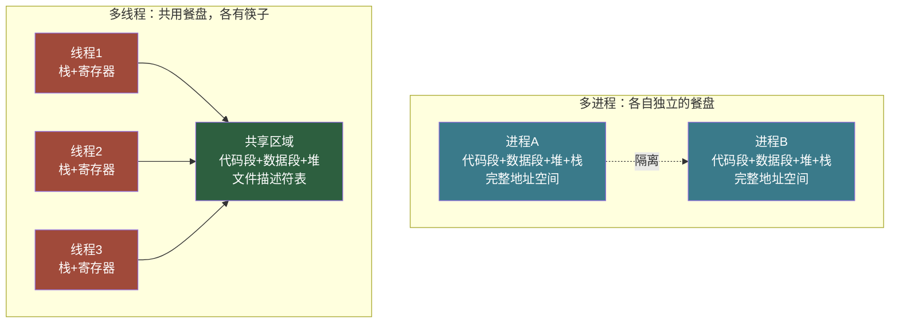
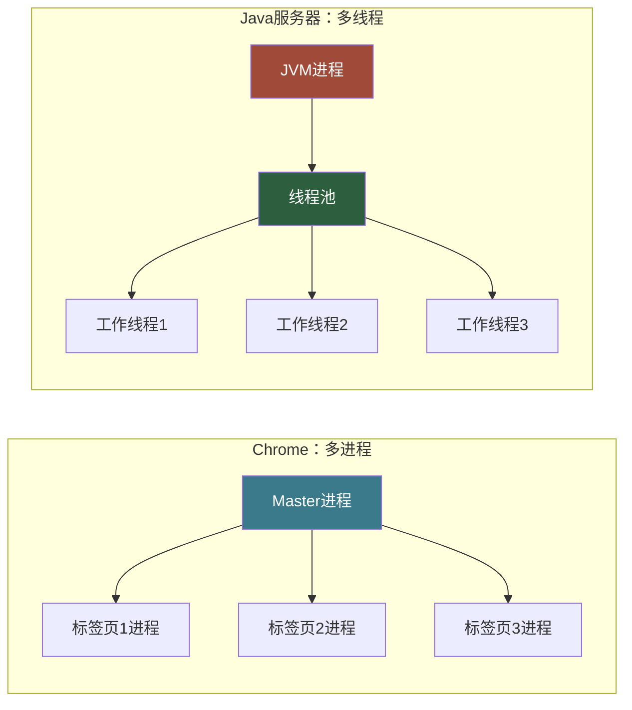

# 【筑基·052】进程vs线程：一个汉堡和十个人吃

> **码农修仙传 · 筕基期 · 第52篇**
> 我是玄芯散人，带你从炼气修到大乘。

---

## 境界标识

```
╔══════════════════════════════════════╗
║     筑基期 · 第52篇                   ║
║     进程vs线程：一个汉堡和十个人吃      ║
║     预计阅读：15分钟                   ║
╚══════════════════════════════════════╝
```

---

## 修仙引入

一个汉堡，十个人想吃。方案一：给每个人发一个独立餐盘，各自排队去取餐。方案二：十个人共用一个餐盘，但每人有自己的筷子。

方案一安全但慢。餐盘多，桌子大，切换起来麻烦。方案二省资源但容易抢同一块肉，得定规矩。

这个汉堡就是CPU。餐盘是内存空间。筷子是栈和寄存器。方案一叫多进程，方案二叫多线程。

上一篇讲操作系统天道规则时，我们顺带提过进程和线程的概念。这一篇把这两个概念拆透：它们到底差在哪，为什么有了进程还要发明线程，什么时候该用哪个。搞清楚这个问题，你对并发编程的理解就过了第一道关。

---

## 硬核主体

### 一、进程：程序运行的容器

你在终端敲 `./hello`，操作系统干了什么？它把硬盘上的程序读进内存，分配一块独立的地址空间，创建一个叫PCB（Process Control Block）的数据结构来记录这个程序的一切信息，然后给它排个号，等着上CPU跑。

这个运行中的程序实例，就是进程。

进程有四个要素：
- PID（进程ID），操作系统给每个进程的唯一编号
- 独立的虚拟地址空间，从0x00000000开始的完整内存布局
- 一套文件描述符表，记录打开了哪些文件和socket
- 一个执行流（主线程），包含程序计数器和栈

修仙类比：进程就是一个修炼者。修炼者有自己的丹田（内存空间），自己的储物袋（文件描述符），自己的灵识（执行流）。一个修炼者和另一个修炼者天然隔离，互不干扰。

```c
#include <stdio.h>
#include <unistd.h>
#include <sys/wait.h>

int main() {
    pid_t pid = fork();  // 分身术：创建子进程
    if (pid == 0) {
        // 子进程：独立的修炼者，有自己的丹田
        printf("子进程 PID=%d，我的变量在另一个地址空间\n", getpid());
    } else if (pid > 0) {
        // 父进程
        printf("父进程 PID=%d，子进程是%d\n", getpid(), pid);
        wait(NULL);  // 等子进程修炼结束
    }
    return 0;
}
```

`fork()` 是Unix系统创建进程的方式。调用一次，返回两次：在父进程里返回子进程的PID，在子进程里返回0。两个进程各有各的内存空间，一个改了变量，另一个看不见。

### 二、线程：容器里的执行者

进程有个问题：太重了。创建一个进程要拷贝页表，要分配新的地址空间，要复制文件描述符表。如果你的服务要同时处理1000个请求，开1000个进程，光创建开销就能把CPU吃掉一大半。

于是线程被发明出来。

线程是进程内的执行单元。同一个进程里可以有多个线程，它们共享进程的内存空间（代码段，数据段，堆），但每个线程有自己独立的栈和寄存器状态。

修仙类比：线程是修炼者的灵识分身。一个修炼者分出多条灵识，所有灵识共用同一个丹田（内存），但每条灵识有自己的念头流（栈）。

```c
#include <stdio.h>
#include <pthread.h>

void* meditate(void* arg) {
    int id = *(int*)arg;
    printf("线程%d：我和兄弟们共享同一个丹田\n", id);
    return NULL;
}

int main() {
    pthread_t t1, t2;
    int id1 = 1, id2 = 2;
    pthread_create(&t1, NULL, meditate, &id1);  // 分出灵识1
    pthread_create(&t2, NULL, meditate, &id2);  // 分出灵识2
    pthread_join(t1, NULL);  // 等灵识1归来
    pthread_join(t2, NULL);  // 等灵识2归来
    return 0;
}
```

两个线程跑在同一个进程里。它们共享堆内存，共享全局变量，共享文件描述符。一个线程改了全局变量，另一个线程立刻能看到。这既是优势（通信方便），也是隐患（同时改一个变量会出事，后面细说）。

### 三、内存：餐盘和筷子

进程和线程的差异，说到底是内存模型的差异。看这张图：



进程的内存布局包含代码段（存编译后的指令），数据段（存全局变量），堆（malloc分配的内存），栈（函数调用链和局部变量）。每个进程的这些段在各自的虚拟地址空间里，互相看不见。

线程呢？同一个进程内的所有线程，共享代码段，数据段，堆。但每个线程有自己独立的栈（默认8MB，Linux下可通过ulimit调整）。栈是线程私有的，存自己的函数调用链和局部变量。

这意味着什么？线程A在函数里写 `int x = 10;`，这个x在线程A的栈上，线程B看不到。但如果线程A写 `static int y = 10;`，这个y在数据段里，线程B能看到。如果线程A用 `malloc` 分配了一块内存，线程B也能访问，因为堆是共享的。

### 四、创建开销：修炼者vs灵识分身

创建一个进程，操作系统要干这些事：

1. 分配新的进程控制块（PCB）
2. 创建独立的虚拟地址空间（建页表）
3. 拷贝父进程的内存（写时复制COW机制，但页表本身要拷）
4. 拷贝文件描述符表
5. 分配新的内核栈
6. 加入调度队列

创建一个线程，操作系统只需要：

1. 分配线程控制块（TCB）
2. 分配用户态栈（8MB虚拟内存，不实际分配物理页）
3. 分配内核栈
4. 初始化执行上下文（程序计数器指向线程入口函数，栈指针指向新栈）
5. 加入调度队列

页表不用建（共享进程的），文件描述符表不用拷（共享进程的），内存不用拷（共享进程的）。所以线程创建比进程创建快得多。

在Linux上，创建一个进程大约需要几十微秒到上百微秒。创建一个线程大约几微秒到十几微秒。差了一个数量级。

这还只是创建。运行中的切换开销也有差距。进程切换时，操作系统要切换页表（让CPU的MMU指向新的地址空间），这会导致TLB（地址翻译缓存）全部失效，后续的内存访问都要重新查页表。线程切换不用换页表，TLB保持有效，所以线程切换比进程切换便宜。

当然，这只是筑基期的概念认知。到了金丹期讲锁和并发时，你会发现线程切换的隐性开销远不止寄存器保存恢复，缓存局部性被破坏的代价才是大头。
### 五、通信方式：写信vs喊话

进程之间内存隔离，要通信必须通过操作系统提供的IPC机制（Inter-Process Communication）。常见的有：

- 管道（pipe）：单向的字节流，父进程写，子进程读
- 信号（signal）：发一个信号通知对方，比如SIGKILL
- 共享内存（shm）：两个进程把同一块物理内存对应到各自的虚拟地址空间，这是最快的IPC方式
- 消息队列：内核维护的链表，进程往里面塞消息、取消息
- socket：网络通信也可以用于本机进程间通信

线程之间呢？共享内存，直接读写就行。线程A把数据写到全局变量，线程B直接读。快得像喊话，不用写信。

但方便是有代价的。看这段代码：

```c
#include <stdio.h>
#include <pthread.h>

int counter = 0;  // 全局变量，所有线程共享

void* add(void* arg) {
    for (int i = 0; i < 100000; i++) {
        counter++;  // 看似一行，实际是三步：读counter、加1、写回counter
    }
    return NULL;
}

int main() {
    pthread_t t1, t2;
    pthread_create(&t1, NULL, add, NULL);
    pthread_create(&t2, NULL, add, NULL);
    pthread_join(t1, NULL);
    pthread_join(t2, NULL);
    printf("counter = %d\n", counter);  // 你以为会输出200000？大概率不会
    return 0;
}
```

两个线程各加10万次，你期望结果是20万。但实际跑出来可能是153428，可能每次还不一样。

为什么？因为 `counter++` 不是一步完成的。CPU先把counter的值读到寄存器，寄存器加1，再写回内存。如果线程A读到0，还没写回，线程B也读到0，两个都加1写回1。本来应该到2，结果只到1。

这就是数据竞争（Data Race）。多个线程同时读写同一块共享内存，没有同步保护，结果不可预测。

解决办法是加锁。锁的具体用法和坑，留到金丹期再讲（073到079篇专门讲）。筑基期你只需要知道：线程通信方便，但共享内存是一把双刃剑，用不好就是bug工厂。

进程通信麻烦，但天然隔离，一个进程的bug不会把另一个进程的数据搞乱。线程通信方便，但一个线程的bug可能污染整个进程的所有线程。

### 六、什么时候用进程，什么时候用线程

工程实践中没有标准答案，但有几条经验法则：

选进程的场景：
- 需要高稳定性。一个模块崩了不能拖垮其他模块。Chrome每个标签页就是一个独立进程，一个标签页崩了，其他不受影响。
- 安全隔离要求高。比如服务器上的不同用户进程，不能互相读内存。
- 数据不需要频繁共享。进程间通信开销大，如果模块之间数据交换少，进程的隔离优势更大。

选线程的场景：
- 需要高频共享数据。比如一个图像处理软件，多个线程需要同时访问同一张图片的像素数据。用进程的话每次共享都要拷贝，用线程直接读写。
- 并发量高。Web服务器同时处理上千个连接，每个连接一个线程比一个进程轻量得多。
- 创建频繁。需要频繁创建和销毁执行单元，线程的开销远小于进程。

现实中大量软件用混合模式：Nginx是多进程模型（一个master进程加多个worker进程），每个worker内部用异步I/O处理多个连接，不额外开线程。Redis是单进程单线程（6.0之后引入多线程处理I/O，但命令执行仍单线程），靠事件驱动实现高并发。Java应用通常是单进程多线程，用线程池管理并发。



没有银弹。选进程还是选线程，取决于你的软件在稳定性，性能，通信频率这几个维度之间怎么权衡。

### 七、Linux的一个真相：进程和线程是同一个东西

如果你在Linux上写过程序，可能发现一个有趣的现象：用 `top` 命令看到的线程，有时候叫进程，有时候叫轻量级进程（LWP）。

这不是显示bug。Linux内核里，进程和线程的实现方式是一样的。内核里没有专门的"线程"概念，只有"任务"（task_struct）。创建进程用 `fork()` 系统调用，创建线程用 `clone()` 系统调用。区别在于 `clone()` 可以选择共享哪些资源：

```c
// 简化示意：clone的参数决定共享什么（实际还有更多标志）
// clone(函数指针, 栈指针, 共享标志, 参数)

// fork的效果：什么都不共享
clone(func, stack, SIGCHLD, arg);

// pthread_create的效果：共享内存、文件描述符、信号处理
clone(func, stack, CLONE_VM | CLONE_FS | CLONE_FILES | CLONE_SIGHAND, arg);
```

`CLONE_VM` 让两个任务共享同一套页表（虚拟内存），`CLONE_FILES` 共享文件描述符表，`CLONE_SIGHAND` 共享信号处理函数。如果全部共享，你得到的就是线程。如果全不共享，你得到的就是进程。

所以Linux上的线程又叫轻量级进程。从内核视角看，线程就是"共享了大量资源的进程"。调度器一视同仁地调度它们。

这个设计很优雅，但容易让初学者困惑。你只要记住：从用户视角看，进程和线程是不同的抽象（独立内存vs共享内存）；从Linux内核视角看，它们都是task，只是共享程度不同。

---

## 修仙术语对照表

| 修仙术语 | 技术现实 | 本篇位置 |
|---------|---------|---------|
| 修炼者 | 进程，拥有独立地址空间 | §一 |
| 丹田 | 虚拟地址空间（内存空间） | §一 |
| 储物袋 | 文件描述符表 | §一 |
| 灵识 | 执行流（线程） | §一 |
| 灵识分身 | 线程，共享丹田但各有念头流 | §二 |
| 分身术 | fork()系统调用 | §一 |
| 念头流 | 线程的栈（函数调用链） | §二 |
| 独立餐盘 | 进程的独立内存空间 | §三 |
| 共用餐盘 | 线程共享的堆和数据段 | §三 |
| 筷子 | 线程的私有栈和寄存器 | §三 |
| 写信通信 | 进程间通信IPC | §五 |
| 喊话通信 | 线程间共享变量通信 | §五 |
| 同时抢一块肉 | 数据竞争Data Race | §五 |
| 护宗大阵 | 进程隔离保护 | §六 |
| 轻量级修炼者 | Linux轻量级进程LWP（线程） | §七 |

---

## 突破条件

- [ ] 能用自己的话说出进程和线程在内存模型上的区别（独立地址空间 vs 共享地址空间+私有栈）
- [ ] 能解释为什么线程创建比进程创建快（不拷贝页表和文件描述符表）
- [ ] 能写出fork()返回两次的代码，并解释为什么父进程和子进程拿到不同的返回值
- [ ] 能说出进程切换比线程切换贵的一个原因（TLB失效）
- [ ] 能列举至少3种进程间通信方式（管道/信号/共享内存/消息队列/socket任选3个）
- [ ] 能解释counter++为什么在多线程下不是原子操作（读-改-写三步）
- [ ] 能说出Chrome用多进程而Java服务器用多线程的一个原因

下一篇我们离开操作系统，去看另一个方向。你的程序不是孤岛，两台计算机怎么通信？网络协议怎么分层？为什么TCP握手要三次？传送阵的搭建规则，下一篇见。

---

## 下期预告 + 互动

> 下一篇：【筑基·053】网络是传送阵
>
> 你的程序要和另一台机器说话，中间隔着网线，隔着路由器，隔着DNS服务器。TCP/IP四层模型怎么搭起来的？为什么建立连接要三次握手？为什么断开要四次挥手？你在浏览器输入URL后看到页面的过程中，数据走过了哪些传送阵节点？

现在问你：

> 🎮 修为自测：在你电脑上打开任务管理器（或Linux下跑 `ps -eLf | grep 你的程序名`），数一数你的浏览器开了多少个进程、多少个线程。想想为什么Chrome要开这么多进程，而不是用一个进程加一堆线程？
>
> 💬 话题：你在写多线程代码时踩过什么坑？变量值莫名其妙变了？程序偶尔死锁？来评论区聊聊你的并发编程踩坑故事。

我是玄芯散人，带你从炼气修到大乘。

*本文是「码农修仙传」系列第52篇。系列导航见 [xren.ren](https://xren.ren)*
