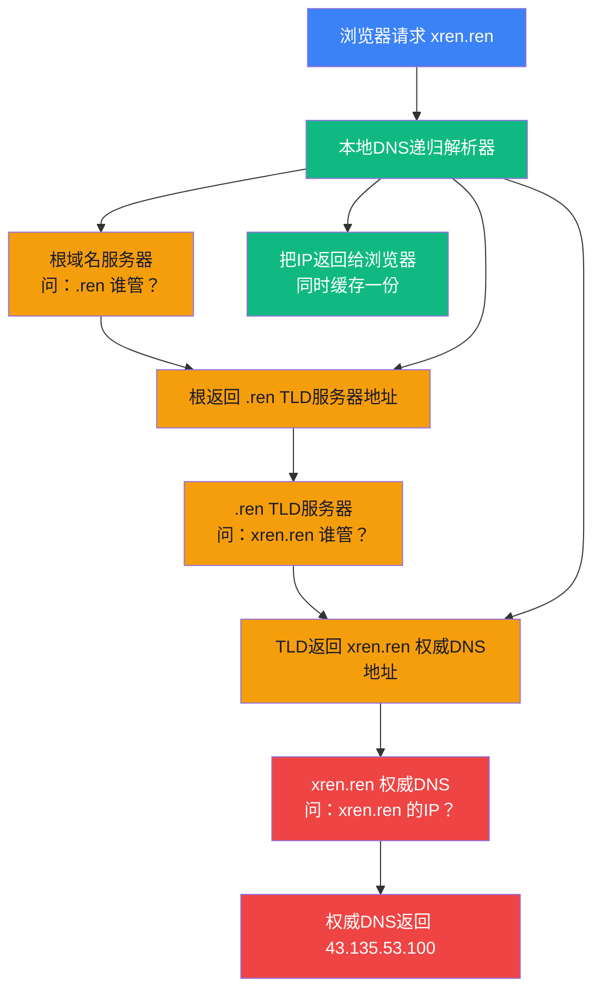
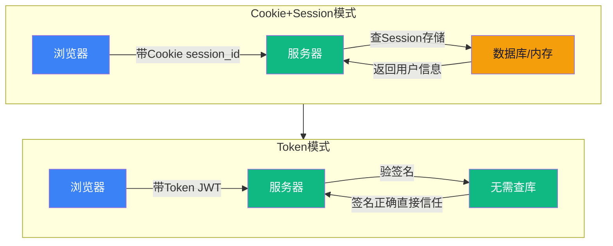

# 【筑基·054】HTTP和DNS：浏览器到服务器的对话

> **码农修仙传 · 筑基期 · 第54篇**
> 我是玄芯散人，带你从炼气修到大乘。

---

## 境界标识

```
╔══════════════════════════════════╗
║     筑基期 · 第54篇              ║
║     HTTP和DNS                    ║
║     预计阅读：15分钟              ║
╚══════════════════════════════════╝
```

---

## 修仙引入

上一篇讲了网络传送阵的四层结构。你知道了TCP负责可靠传输，IP负责寻址路由。但有一个问题没回答：你在浏览器输入 `xren.ren` 这几个字母，TCP怎么知道要连哪个IP？

这就像你知道朋友叫"张三"，但传音符需要坐标才能传。你不知道张三在哪座城哪条街，怎么办？找个"知情人"问。DNS就是互联网的户籍处，专门干"报名字查地址"的事。而HTTP是你和服务器之间的对话语言，规定了你该怎么说、对方该怎么回。

筑基期网络地基最后一篇，讲清楚DNS查地址的全过程，HTTP请求和响应的格式，状态码的含义，以及Cookie和Session怎么维持登录状态。

---

## 硬核主体

### DNS：互联网的户籍处

DNS（Domain Name System）干的事情很简单：把人类记得住的域名翻译成机器认得的IP地址。`xren.ren` 翻译成 `43.135.53.100`，浏览器拿到IP才能发起TCP连接。

这个过程比你想的复杂。输入 `xren.ren` 后，DNS查询的全链路是这样的：

```text
1. 浏览器缓存：先查本地有没有存过这个域名的IP
   有 → 直接用，查询结束（大多数重复访问走这条路）
   无 → 下一步

2. 系统缓存：操作系统也有DNS缓存
   有 → 返回
   无 → 下一步

3. 本地hosts文件：/etc/hosts 或 C:\Windows\System32\drivers\etc\hosts
   有 → 返回（这个优先级比DNS服务器高）
   无 → 下一步

4. 本地DNS服务器（递归解析器）：你配的 8.8.8.8 或 114.114.114.114
   它帮你跑完后面所有步骤，把最终IP返回给你
```

本地DNS服务器拿不到答案时，会自己去做迭代查询。迭代查询就是"一级一级往上问"：



这里有两组概念容易混：递归查询和迭代查询。

递归查询是"你帮我查到底，查到给我结果"。浏览器对本地DNS服务器的请求就是递归的，你不管中间过程，只要一个IP。

迭代查询是"你告诉我下一步该问谁，我自己去问"。本地DNS服务器对根的请求，对TLD的请求，对权威DNS的请求，都是迭代的。每一步对方只给"下一步该找谁"的线索，DNS服务器自己挨个问过去。

DNS记录类型不止IP地址这一种。常见的有：

```text
A记录    域名 → IPv4地址        xren.ren → 43.135.53.100
AAAA记录 域名 → IPv6地址        xren.ren → 2001:xxx::xxx
CNAME    域名 → 另一个域名       www.xren.ren → xren.ren
MX       邮件服务器              xren.ren → mail.xren.ren
TXT      任意文本记录            域名验证、SPF记录
NS       这个域名由谁管          xren.ren → ns1.dnspod.net
```

CNAME在前文提过，这里展开说一句：你访问 `www.xren.ren`，DNS先查到CNAME记录指向 `xren.ren`，然后再查 `xren.ren` 的A记录拿到IP。多了一跳，但好处是你改IP只需要改一处。

### HTTP：浏览器和服务器的对话语言

拿到IP之后，浏览器跟服务器建立TCP连接（三次握手，上一篇讲过），然后开始说HTTP。

HTTP（HyperText Transfer Protocol）是一种请求-响应协议。浏览器发请求，服务器回响应，一来一回。就这么简单。

一个HTTP请求长这样：

```http
GET /docs/ HTTP/1.1
Host: xren.ren
User-Agent: Mozilla/5.0 (Macintosh; Intel Mac OS X 10_15_7)
Accept: text/html
Accept-Language: zh-CN
Connection: keep-alive

```

第一行叫请求行，分成方法（GET），路径（/docs/），版本（HTTP/1.1）三块。
后面一堆叫请求头，每行一个键值对。
最后空一行，表示头结束了。如果是POST请求，空行后面跟请求体。

服务器返回的HTTP响应：

```http
HTTP/1.1 200 OK
Content-Type: text/html; charset=utf-8
Content-Length: 2048
Cache-Control: max-age=3600

<!DOCTYPE html>
<html>...
```

第一行叫状态行，包含版本和状态码。后面是响应头，空行之后是响应体，就是你看到的网页内容。

HTTP是纯文本协议。你拿telnet或nc手写HTTP请求，服务器一样认。不需要什么特殊客户端，能发TCP数据就能说HTTP。

### GET vs POST：不只是参数位置不同

最常见的两种HTTP方法。很多教程说"GET用于查询，POST用于提交"，这话对但不全。

```text
GET    参数在URL里    /search?q=hello&page=2
POST   参数在请求体里  URL不变，参数在空行后面
```

但它们的设计意图有更深一层的区别：

GET是幂等的。意思是同一个GET请求发一次和发十次，服务器状态不变。GET只读不写。浏览器因此可以缓存GET响应，可以前进后退不报错。

POST不幂等。提交一次表单就下一笔订单，提交十次就下十笔。浏览器因此会拦你："确认重新提交表单？"，因为重复提交有副作用。

PUT也是幂等的。PUT /user/1 设成"张三"，发多少次结果都是"张三"。DELETE同理，删一次和删十次效果一样（第二次删已经不存在的东西，状态不变）。

筑基期不深入RESTful设计，记住这个原则就行：GET用来获取资源，POST用来创建或修改资源，PUT用来更新，DELETE用来删除。方法本身就是语义。

### 状态码：服务器在说什么

每次HTTP响应第一行都有个三位数状态码。分五类：

```text
1xx 信息    请求收到了，继续处理
2xx 成功    请求处理完了
3xx 重定向  要去别的地方拿
4xx 你错了  客户端这边有问题
5xx 我错了  服务器这边有问题
```

常见的几个：

```text
200 OK          请求成功，响应体里有你要的东西
301 永久重定向  URL换了，以后别来这了，去新地址
302 临时重定向  暂时换了，下次可能还来这
304 Not Modified  你缓存的版本还能用，不用重新下载
400 Bad Request  请求格式不对，服务器看不懂
401 Unauthorized  没登录，先认证
403 Forbidden     登录了但没权限
404 Not Found     这个路径不存在
500 Internal Server Error  服务器内部出错了
502 Bad Gateway   网关收不到上游服务器的响应
503 Service Unavailable  服务器暂时不可用，过会再来
```

301和302的区别值得多说一句。301是"永久搬家"，浏览器会缓存这个跳转，下次直接去新地址不问旧的。302是"临时出差"，浏览器下次还来旧地址问。

304在性能调优里值得注意。服务器返回304表示"你本地缓存的版本没过期，直接用"。省了传输响应体的带宽，页面加载更快。

401和403的区别也好理解。401是"你是谁？"，服务器不知道你的身份。403是"我知道你是谁，但你不能进这里"。

### Cookie和Session：服务器怎么记住你

HTTP有个设计上的特点：无状态。每个请求都是独立的，服务器处理完就忘了你是谁。这对浏览网页没问题，但对登录场景就很麻烦。你登录了，下一个请求服务器又不知道你是谁了。

Cookie解决了这个问题。服务器在响应头里塞一个Set-Cookie，浏览器自动保存，之后每次请求自动带上Cookie。

```text
# 服务器响应
Set-Cookie: session_id=abc123; Path=/; HttpOnly; Secure; SameSite=Lax

# 浏览器后续请求
Cookie: session_id=abc123
```

服务器第一次见到你，给你发一个session_id。你之后每次请求带着这个id，服务器就能认出你是之前那个人。服务器那边用这个id查到你的登录状态、购物车内容之类。这就叫Session。

Cookie存在浏览器端，Session存在服务器端。Cookie是"通行证"，Session是"登记簿"。服务器发的通行证上写个编号，服务器自己有个登记簿记录每个编号对应谁。

但纯Cookie+Session有个问题：session_id就是个字符串，谁拿到就能冒充谁。这就有了Token机制。

Token的思路是把状态搬到客户端。服务器不发一个随机id，而是发一个签名的令牌（比如JWT），里面包含你的身份信息加上服务器签名。你下次请求带Token来，服务器验签名，签名对了就信任里面的身份信息。服务器不需要存Session，省了存储。



Cookie有几个安全属性需要注意。HttpOnly让JavaScript读不到Cookie，防止XSS攻击偷session。Secure让Cookie只在HTTPS下传输。SameSite控制跨站请求是否带Cookie，防止CSRF攻击。这三个属性在面试里常问，在实际项目里必须配。

### HTTP协议演进：1.0到3.0

HTTP/1.0时代，每个请求都要新建一个TCP连接。你打开一个网页有20张图片，就建20次TCP连接，每次三次握手四次挥手，开销巨大。

HTTP/1.1引入了keep-alive，一个TCP连接可以发多个请求。但有个限制：同一时刻一个连接上只能处理一个请求，前一个响应回来才能发下一个。浏览器为了加速，会同时开约6个连接并行请求。

HTTP/1.1还有个问题叫"队头阻塞"。虽然1.1支持pipelining（管道化，允许连续发多个请求不等响应），但服务器必须按请求顺序返回响应。第一个请求慢了，后面的响应全排队等着。

HTTP/2解决了这个问题。引入了多路复用，一个TCP连接上可以同时跑多个请求和响应，互不阻塞。还加了头部压缩（HPACK算法）和服务器推送。

HTTP/3更激进，直接把TCP换成UDP。用QUIC协议在UDP上自己实现可靠传输。好处是连接建立更快（1-RTT甚至0-RTT），网络切换不断线（手机从WiFi切4G不丢连接）。代价是实现复杂，部署还不多。

```text
HTTP/1.0   每请求一个连接           慢
HTTP/1.1   keep-alive + 管道        好一些，有队头阻塞
HTTP/2     多路复用 + 头部压缩       快，但TCP层还有队头阻塞
HTTP/3     QUIC over UDP            最快，解决TCP层队头阻塞
```

筑基期不需要深入QUIC的拥塞控制细节，知道每一代都在减少连接开销和等待时间就行。

### 一次全链路的网页加载过程

把今天讲的串起来，看浏览器输入 `xren.ren` 后到底发生了什么：

```text
1. DNS查询：xren.ren → 43.135.53.100
   浏览器缓存 → 系统缓存 → hosts → 本地DNS → 根 → TLD → 权威DNS

2. TCP三次握手：浏览器 → 43.135.53.100:443

3. TLS握手（如果HTTPS）：协商加密算法，交换证书和密钥

4. HTTP请求：
   GET / HTTP/1.1
   Host: xren.ren
   Cookie: session_id=abc123

5. 服务器处理：查路由 → 查数据库 → 渲染HTML → 返回响应

6. HTTP响应：
   HTTP/1.1 200 OK
   Content-Type: text/html
   Set-Cookie: session_id=abc123

7. 浏览器解析HTML，发现CSS/JS/图片资源，重复步骤4-6

8. 页面渲染完成
```

这8步在几百毫秒内完成。你感觉到的"打开网页"，背后是DNS，TCP，TLS，HTTP四层协议配合的结果。

---

## 修仙术语对照表

| 修仙术语 | 技术现实 | 本篇位置 |
|---------|---------|---------|
| 户籍处 | DNS系统 | DNS章节 |
| 报名字查地址 | 域名解析为IP | DNS查询链路 |
| 递归查询 | DNS服务器帮你查到底 | 浏览器请求本地DNS |
| 迭代查询 | 一级一级问，每步给线索 | 本地DNS查根/TLD/权威 |
| 对话语言 | HTTP协议 | HTTP章节 |
| 传信格式 | HTTP报文（请求行+头+体） | 请求响应格式 |
| 传信方式 | GET/POST/PUT/DELETE方法 | 方法语义 |
| 回信暗号 | HTTP状态码 | 状态码章节 |
| 永久搬家 | 301重定向 | 3xx状态码 |
| 暂时出差 | 302重定向 | 3xx状态码 |
| 通行证 | Cookie | Cookie和Session |
| 登记簿 | Session（服务端存储） | Cookie和Session |
| 签名令牌 | JWT Token | Token机制 |
| 传送阵升级 | HTTP/1.0→1.1→2→3 | 协议演进 |

---

## 突破条件

- [ ] 能画出DNS查询的全链路，分清递归和迭代的区别
- [ ] 手写一个HTTP GET请求的报文（含请求行和至少3个头）
- [ ] 说出GET和POST在幂等性上的区别，能解释为什么浏览器拦POST重复提交
- [ ] 看到401和403能区分是"没登录"还是"没权限"
- [ ] 说清楚Cookie和Session的关系：谁在客户端谁在服务端
- [ ] 列出Cookie的HttpOnly，Secure，SameSite三个安全属性各防什么攻击
- [ ] 能用一句话说清HTTP/1.1队头阻塞是什么，HTTP/2怎么解决的

筑基网络四篇到此结束。你掌握了TCP/IP四层模型，DNS查询流程，HTTP报文格式，常见状态码。下一篇进入TCP和UDP的对比，理解可靠和快速的取舍。

---

## 下期预告 + 互动

下一篇：TCP vs UDP：可靠和快速的取舍。

TCP三次握手四次挥手大家都背过，但为什么是三次不是两次？UDP不要握手不要确认，为什么视频直播和游戏都用它？TCP的流量控制是怎么做到不压垮接收方的？

留两个问题：
1. 你打开一个网页加载了20张图片，HTTP/1.1和HTTP/2在TCP连接数上有什么区别？
2. 你登录一个网站后关浏览器再打开，有的网站还保持登录，有的要重新登录，跟Cookie的什么属性有关？

我是玄芯散人，带你从炼气修到大乘。

---

*本文是「码农修仙传」系列第054篇。系列导航见 [xren.ren](https://xren.ren)*
