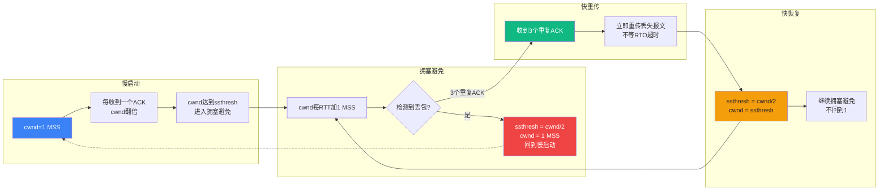

# 【筑基·055】TCP vs UDP：可靠和快速的取舍

> **码农修仙传 · 筑基期 · 第55篇**
> 我是玄芯散人，带你从炼气修到大乘。

---

## 境界标识

```
╔══════════════════════════════════╗
║     筑基期 · 第55篇              ║
║     TCP vs UDP                   ║
║     预计阅读：16分钟              ║
╚══════════════════════════════════╝
```

---

## 修仙引入

上一篇讲了HTTP和DNS。你知道了浏览器拿到IP之后要跟服务器建立TCP连接，然后才能收发HTTP报文。但有个问题一直绕过去了：TCP凭什么说自己是"可靠的"？可靠是怎么做到的？

更奇怪的是，UDP明显比TCP简单，不握手不确认不重传，但视频直播和在线游戏和DNS查询全在用它。不可靠的协议凭什么扛起了互联网一半的流量？

这篇就把TCP和UDP放在一起对比，讲清楚TCP的可靠性机制是怎么一层层叠上去的，以及UDP在什么情况下反而比TCP更合适。

---

## 硬核主体

### TCP三次握手：为什么是三次

TCP（Transmission Control Protocol）在发送数据之前，双方要先建立连接。建立连接的过程叫三次握手（Three-Way Handshake）。

```text
客户端                         服务器
  |                              |
  | --- SYN, seq=x ------------> |   第1次：客户端说"我想连"
  |                              |
  | <--- SYN+ACK, seq=y, ack=x+1 |   第2次：服务器说"我收到了，也想连"
  |                              |
  | --- ACK, ack=y+1 -----------> |   第3次：客户端说"我确认你的确认"
  |                              |
  |     连接建立，可以发数据了      |
```

三次握手的过程大家背得滚瓜烂熟。但为什么是三次，不是两次或者四次？

两次不够。假设只有两次：客户端发SYN，服务器回SYN+ACK，然后直接开始传数据。问题在于客户端发的第一个SYN可能在网络里堵了很久才到服务器。客户端以为超时了已经放弃，服务器却收到这个"幽灵SYN"，回了SYN+ACK，然后傻等数据。服务器资源白白浪费在一个压根不会来的客户端身上。

第三次握手解决了这个问题。客户端收到服务器的SYN+ACK后，再回一个ACK。如果客户端根本不想连了（那个SYN是旧的），它不会回ACK，服务器等不到就释放连接。三次握手说白了就是双方都确认了对方的接收能力。

四次没必要。TCP是全双工的，双方都能发数据。但你仔细看，第二次握手服务器把SYN和ACK合并成一条发了，所以只需要三次，不需要四次。

### 四次挥手：为什么断开比连接多一次

TCP断开连接叫四次挥手（Four-Way Handshake），比建立连接多一次。

```text
客户端                          服务器
  |                               |
  | --- FIN, seq=u -------------> |   第1次：客户端说"我发完了"
  |                               |
  | <--- ACK, ack=u+1 ----------- |   第2次：服务器说"收到了，但我还有数据要发"
  |                               |
  | <--- FIN, seq=v ------------- |   第3次：服务器说"我也发完了"
  |                               |
  | --- ACK, ack=v+1 -----------> |   第4次：客户端说"收到，再见"
  |                               |
  |     等待 2MSL 后关闭           |
```

为什么断开要四次？因为TCP是全双工的。建立连接时，双方同时准备好，所以SYN和ACK可以合并。断开时，客户端说"我不发了"，但服务器可能还有数据要发，所以先回ACK，等自己的数据发完了再发FIN。FIN和ACK不能合并，因为中间隔了"服务器还在发数据"这段时间。

挥手之后客户端要等2MSL（Maximum Segment Lifetime，报文最大生存时间）才真正关闭。这是因为最后一个ACK可能丢，如果丢了服务器会重发FIN，客户端得留时间来响应。不等就关闭，服务器就永远等不到回应了。

### TCP的可靠性：四个机制叠在一起

TCP说自己是可靠传输，不是空口白话。可靠性是四个机制叠出来的：

第一，序列号和确认号。TCP发的每个字节都有编号。接收方收到数据后回一个ACK，告诉发送方"我收到了到第N个字节，下一个该发第N+1个了"。发送方就知道哪些数据到了哪些没到。

第二，重传机制。发送方发出数据后启动一个定时器（RTO，Retransmission Timeout）。定时器到了还没收到ACK，就重发。这就是TCP处理丢包的方式。

第三，校验和。每个TCP报文头里有个校验和字段，接收方算一遍如果不匹配就丢弃，当没收到。数据在传输中被篡改了也能发现。

第四，按序到达。TCP给每个字节编了号，接收方根据序列号把乱序到达的报文重新排序再交给上层。UDP不管这个，先到的先交，后到的后交，上层自己处理顺序。

这四个机制加在一起，TCP就能保证数据不丢（靠重传），不错（靠校验和），不乱（靠序列号排序），不重（靠去重）。

### 滑动窗口：流量控制怎么做

TCP保证可靠了，但还有个问题：发送方发得快，接收方处理得慢，接收方的缓冲区会溢出。

TCP用滑动窗口（Sliding Window）做流量控制。接收方在ACK报文里带一个窗口大小（Window Size），告诉发送方"我还能接收多少字节"。发送方根据这个值控制发送速度。

```text
发送窗口（Window Size = 4000）
┌──────────────────────────────────────┐
│  已确认   │  已发未确认  │  可以发  │ 不能发 │
│ 1000字节  │   2000字节   │ 2000字节 │  ...   │
└──────────────────────────────────────┘
                         ↑
                    窗口右边界

窗口随ACK左移，窗口大小随接收方反馈调整
```

窗口会滑动。发送方收到ACK后，已确认的部分移出窗口，窗口右移，新的数据可以发了。接收方处理完数据腾出缓冲区后，会把窗口调大告诉发送方。

如果接收方缓冲区满了，会在ACK里把窗口设为0。发送方收到零窗口通知就停止发送，定期发窗口探测报文，等接收方腾出空间。

### 拥塞控制：不只照顾接收方

流量控制照顾的是接收方。但网络中间的路由器也可能堵。如果所有发送方都不管网络状态猛发，路由器队列溢出，丢包率飙升，所有人的速度都往下掉。

TCP的拥塞控制有四个阶段：



慢启动（Slow Start）：连接刚建立时，TCP不知道网络能承受多快的速度，所以从1个MSS（Maximum Segment Size，最大报文段长度）开始。每收到一个ACK，拥塞窗口（cwnd）翻倍。1变2，2变4，4变8。增长很快但不是无限增长，到慢启动阈值（ssthresh）后进入拥塞避免阶段。

拥塞避免（Congestion Avoidance）：cwnd从指数增长改为线性增长，每个RTT（Round-Trip Time，往返时间）加1个MSS。增长慢了，但还在探测网络的极限。

快重传（Fast Retransmit）：等RTO超时再重传太慢。如果发送方连续收到3个重复ACK，说明那个报文大概率丢了，不等超时直接重传。

快恢复（Fast Recovery）：快重传后不回到慢启动的cwnd=1，而是把cwnd设为当前值的一半，ssthresh也设为一半，然后继续拥塞避免。这是AIMD（Additive Increase, Multiplicative Decrease）策略：加性增长，乘性减少。增长慢慢加，一旦发现拥塞立刻砍一半。

### UDP：什么都不要，只要快

UDP（User Datagram Protocol）的设计哲学完全相反。TCP花了一堆机制保证可靠，UDP把这些全扔了。

UDP报文头只有8个字节。TCP头部至少20字节。UDP不建连接，不握手，不确认，不重传，不排序，不流控。发就完了，到不到不管。

```text
UDP头部（8字节）
┌──────────┬──────────┐
│ 源端口    │ 目的端口  │
├──────────┼──────────┤
│ 长度      │ 校验和    │
└──────────┴──────────┘

TCP头部（20字节起）
┌──────────┬──────────┐
│ 源端口    │ 目的端口  │
├──────────┼──────────┤
│ 序列号               │
├──────────────────────┤
│ 确认号               │
├──────────┬──────────┤
│数据偏移|  │ 标志位    │
├──────────┼──────────┤
│ 窗口大小  │ 校验和    │
├──────────┼──────────┤
│ 紧急指针              │
└──────────────────────┘
```

UDP这么"简陋"，为什么还有一堆场景用它？

DNS查询用UDP。一个域名解析请求就一个报文，一来一回。用TCP得三次握手再发数据再四次挥手，为了一个512字节（UDP标准限制）的查询建个连接，太浪费了。

视频直播用UDP。直播画面丢几帧没人注意，但延迟300毫秒观众要骂人。TCP丢了重传，重传到了已经过时了，不如丢了就丢了。UDP发出去不管，接收方收到什么播什么，延迟最低。

在线游戏用UDP。你打游戏时角色位置每秒更新几十次，丢一两个位置包不影响游戏体验，但延迟200毫秒你可能就被人打了。TCP的重传机制在这里帮倒忙。

DHCP用UDP。设备刚开机没有IP地址，需要通过DHCP获取。这时候连IP都没有，TCP的三次握手无从谈起，只能用不需要建立连接的UDP。

### TCP vs UDP：不是谁替代谁

很多人觉得TCP比UDP"高级"，这是个误区。它们解决不同的问题：

```text
         TCP                    UDP
连接      面向连接               无连接
可靠性    保证到达               不保证
顺序      按序到达               不保证顺序
速度      慢（有握手和确认）       快（直接发）
头部      20字节起               8字节
流量控制  有（滑动窗口）          无
拥塞控制  有（AIMD）             无
适用      网页/邮件/文件传输      视频/游戏/DNS/IoT
```

TCP适合需要可靠传输的场合。你下载一个文件，少一个字节都打不开，必须用TCP。你发一封邮件，内容不能丢不能错，必须用TCP。你打开一个网页，HTML少一行标签整个页面布局就乱了，也得用TCP。

UDP适合实时性要求高且容忍丢包的场合。视频通话偶尔花屏可以接受，延迟太大没法交流。游戏位置同步丢一两帧无所谓，卡顿半秒操作全废。DNS查一个域名，TCP握手的时间够UDP查三遍了。

### QUIC：UDP的逆袭

上一篇讲HTTP/3时提过一句：HTTP/3底层换了QUIC协议。这里展开说为什么。

HTTP/3底层用的不是TCP，是QUIC（Quick UDP Internet Connections）协议。QUIC跑在UDP上面。

这个选择看起来很反直觉。HTTP/1.1和HTTP/2都跑在TCP上，为什么HTTP/3要换成UDP？

TCP有个固有的问题：队头阻塞（Head-of-Line Blocking）。TCP保证按序到达，如果一个报文丢了，后面到达的报文只能等在缓冲区里，不能交给应用。HTTP/2在一条TCP连接上多路复用多个流，一个流的数据丢了，所有流都被阻塞。

QUIC在UDP上自己实现了可靠传输和拥塞控制，但每个流独立。一个流丢了包，其他流不受牵连继续跑。

另一个好处是连接迁移。TCP用四元组标识连接，包括源IP地址和源端口和目的IP地址和目的端口。你手机WiFi换成4G，IP变了，TCP连接就断了，要重新握手。QUIC用连接ID标识连接，IP变了连接不断，无缝切换。

QUIC还把三次握手和TLS握手合并了，建连速度比TCP+TLS快不少。Google在Chrome里用了多年QUIC，目前互联网上超过四分之一的流量跑在QUIC上。

---

## 修仙术语对照表

| 修仙术语 | 技术现实 | 本篇位置 |
|---------|---------|---------|
| 传音符建链 | 三次握手 | TCP三次握手 |
| 幽灵传信 | 旧SYN延迟到达 | 为什么三次不是两次 |
| 断链四步 | 四次挥手 | 四次挥手 |
| 等待散灵 | 2MSL等待 | TIME_WAIT |
| 传信编号 | 序列号 | 可靠性机制 |
| 回执 | 确认号ACK | 可靠性机制 |
| 丢失重发 | 重传机制 | 可靠性机制 |
| 灵力缓冲窗 | 滑动窗口 | 流量控制 |
| 零窗静默 | 零窗口通知 | 流量控制 |
| 探路慢行 | 慢启动 | 拥塞控制 |
| 稳步推进 | 拥塞避免 | 拥塞控制 |
| 拥堵即半 | AIMD乘性减少 | 拥塞控制 |
| 无链直传 | UDP无连接 | UDP设计 |
| 多流不堵 | QUIC独立流 | QUIC协议 |
| 链不随形迁 | 连接迁移 | QUIC协议 |

---

## 突破条件

- [ ] 能画出三次握手的时序图，解释为什么两次不够
- [ ] 能画出四次挥手的时序图，解释为什么比握手多一次
- [ ] 说出TCP可靠性的四个机制（序列号和重传和校验和和按序到达）
- [ ] 用自己的话解释滑动窗口怎么防止接收方被压垮
- [ ] 说出慢启动和拥塞避免的区别（指数增长vs线性增长）
- [ ] 能列出至少三个UDP的典型用途，每个解释为什么不用TCP
- [ ] 说清楚QUIC为什么选择UDP而不是TCP

筑基网络五篇到这里讲完了。你掌握了TCP/IP四层体系和DNS查询流程和HTTP报文格式和TCP可靠性机制和UDP的适用情况。下一篇进入数据库的世界。

---

## 下期预告 + 互动

下一篇：数据库是藏经阁：SQL增删改查到B+树索引。

TCP保证你的数据可靠到达，但数据到了之后怎么存？怎么查？怎么保证一万个人同时写不冲突？数据库的索引为什么能让查询快几百倍？B+树到底长什么样？下一篇讲数据库的基本概念。

留两个问题：
1. 你看直播时，画面偶尔卡顿但声音正常，可能是TCP重传还是UDP丢包造成的？
2. DNS查询用UDP，但DNS响应超过512字节时会自动切换到TCP，你知道为什么吗？

我是玄芯散人，带你从炼气修到大乘。

---

*本文是「码农修仙传」系列第055篇。系列导航见 [xren.ren](https://xren.ren)*
