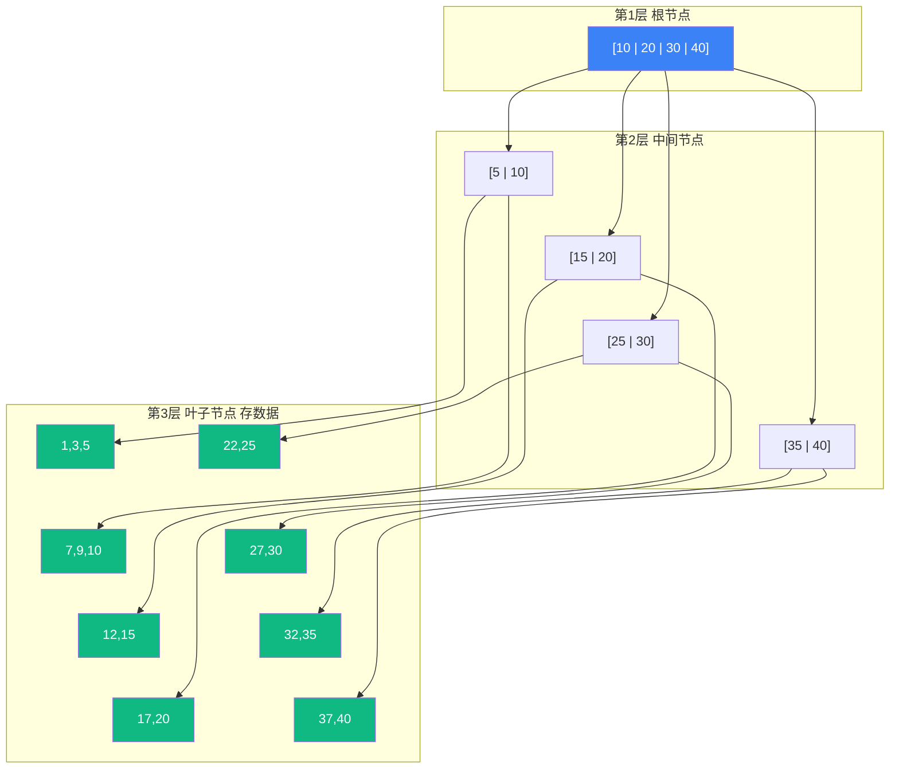

# 【筑基·056】数据库是藏经阁：SQL增删改查到B+树索引

> **码农修仙传 · 筑基期 · 第56篇**
> 我是玄芯散人，带你从炼气修到大乘。

---

## 境界标识

```
╔══════════════════════════════════╗
║     筑基期 · 第56篇              ║
║     数据库是藏经阁                ║
║     预计阅读：18分钟              ║
╚══════════════════════════════════╝
```

---

## 修仙引入

修仙门派有一座藏经阁，里面存着万卷功法典籍。弟子找一本功法，不能一层一层逐本翻阅，那是蠢办法。藏经阁有目录，有编号，按类别分了架子，找到书的位置直接去拿。

数据库就是计算机世界的藏经阁。你的程序在内存里跑得飞快，但内存断电就没了。数据要持久化，要存到硬盘上，还要能快速查到，能同时给一万个人读写，还不能写错。数据库就是帮你管这些的。

这篇讲数据库的基本概念：SQL怎么写，索引为什么能让查询快几百倍，事务的ACID到底在保证什么，还有NoSQL为什么能占一块地盘。

---

## 硬核主体

### 数据库就是个管文件的管家

你当然可以自己用文件存数据。写一个`users.txt`，每行一个用户，逗号分隔。读的时候逐行扫描，写的时候追加到文件末尾。没什么不能跑的。

但很快你会遇到这些问题：

一，查询太慢。你的用户表有1000万行，要查`age > 25`的用户。你只能逐行扫描，把每一行读出来比较。1000万行全部读一遍，磁盘I/O要几秒甚至几十秒。

二，并发写冲突。用户A在修改第100行，用户B同时也在修改第100行。谁先写谁后写？后写的人把前一个人的数据覆盖了怎么办？

三，部分更新失败。转账操作要扣A的余额加B的余额。如果扣了A的钱之后机器断电了，B没加上，钱就蒸发了。

数据库就是来解决这些问题的。它帮你管索引（解决查询慢），管锁（解决并发冲突），管事务（解决部分更新失败）。你只管写SQL，剩下的交给数据库引擎。

### SQL基础：增删改查四件套

SQL（Structured Query Language，结构化查询语言）是跟关系型数据库打交道的语言。MySQL也好PostgreSQL也好SQLite也好，SQL的语法大同小异。

数据存在表（Table）里，表有行和列。每一列有数据类型，比如整数或者字符串或者日期，每一行是一条记录。

建表：

```sql
-- 创建用户表
-- 语法以SQLite为例，MySQL用AUTO_INCREMENT，PostgreSQL用SERIAL
CREATE TABLE users (
    id      INTEGER PRIMARY KEY AUTOINCREMENT,  -- 主键，自增
    name    TEXT NOT NULL,                      -- 名字，不能为空
    age     INTEGER DEFAULT 18,                 -- 年龄，默认18
    email   TEXT UNIQUE                         -- 邮箱，唯一
);
```

增（INSERT）：

```sql
-- 插入一条记录
INSERT INTO users (name, age, email)
VALUES ('张三', 25, 'zhangsan@example.com');
```

删（DELETE）：

```sql
-- 删除年龄小于18的用户
DELETE FROM users WHERE age < 18;

-- 不加WHERE会删全表，千万别忘
DELETE FROM users;  -- 危险！清空整张表
```

改（UPDATE）：

```sql
-- 修改张三的年龄
UPDATE users SET age = 26 WHERE name = '张三';
```

查（SELECT），这是用得最多的：

```sql
-- 查所有年龄大于20的用户，按年龄降序
SELECT name, age FROM users
WHERE age > 20
ORDER BY age DESC;

-- 统计每个年龄有多少人
SELECT age, COUNT(*) AS cnt
FROM users
GROUP BY age
ORDER BY cnt DESC;
```

SQL语法就这么多花样。写SQL跟写代码不一样，你告诉数据库要什么，不告诉它怎么拿。怎么拿是数据库引擎的事，它会自己决定用哪个索引，先扫哪张表，用什么连接策略。

### 索引：全表扫描为什么慢，B+树为什么快

这是本篇最需要搞懂的道理。

没有索引的时候，你查`WHERE age = 25`，数据库只能逐行扫描，把每一行读出来比较。1000万行，读1000万次磁盘。这叫全表扫描（Full Table Scan）。

加了索引之后，查询快几百倍。怎么做到的？

你想想字典。字典按拼音排序，你查"张"，直接翻到Z开头的区域，不用逐页翻。索引就是这个思路：把某一列的值排好序，查找时用二分法快速定位。

但数据库的索引不是简单排个序。排序后的数据存在硬盘上，硬盘的特点是顺序读快，随机读慢。如果用普通的二叉搜索树，1000万条数据树高约24层，查一个值要24次磁盘随机读取，还是太慢。

数据库用的是B+树（B+ Tree）。B+树是一种多路搜索树，每个节点有几十到几百个子节点，树很矮。1000万条数据，B+树大概3到4层就够了。查一个值只要3到4次磁盘读取。



B+树有两个特点值得记住：

第一，所有数据都存在叶子节点。中间节点只存索引项的值，不存实际数据。这意味着中间节点可以塞更多索引项，树更矮。

第二，叶子节点之间用链表连起来。你查`WHERE age BETWEEN 25 AND 35`，在根节点找到25所在的位置，然后顺着链表往右走，走到35为止。范围查询效率很高。

```sql
-- 给age列加索引
CREATE INDEX idx_age ON users(age);
```

索引不是万能的。索引加速了查询，但拖慢了写入。每次INSERT或UPDATE或DELETE，数据库改数据之外还要更新索引树。索引越多，写入越慢。一张表建5个索引，写一次数据要更新5棵B+树。

什么时候该建索引？查得多写得少的列建索引。用户表的id和email查得多，建索引。日志表写入频繁但很少按某列查，就别建太多索引。

### 事务：ACID到底在保证什么

事务（Transaction）是一组操作，要么全部成功，要么全部回滚。经典例子是转账：A给B转100块，扣A余额加B余额，两步必须一起成功或一起失败。

事务用四个特性来保证，简称ACID：

A（Atomicity，原子性）：事务里的操作要么全做要么全不做。扣了A的钱没加B的钱，事务会回滚，A的钱退回去。

C（Consistency，一致性）：事务执行前后数据是合法的。A和B的钱加起来在转账前后应该一样。这个一致性由程序代码保证，数据库只保证约束（比如外键、唯一约束）不被破坏。

I（Isolation，隔离性）：多个事务同时跑，互相不干扰。A在修改某行的时候，B看不到修改中的中间状态。

D（Durability，持久性）：事务提交之后，数据就持久化到磁盘了。即使断电也不丢。

隔离性是最复杂的。数据库有四种隔离级别，隔离级别越高，并发性能越低：

```sql
-- 事务的基本用法
BEGIN TRANSACTION;

UPDATE accounts SET balance = balance - 100 WHERE name = 'A';
UPDATE accounts SET balance = balance + 100 WHERE name = 'B';

COMMIT;  -- 两条都成功了，提交

-- 如果中间出错了
-- ROLLBACK;  -- 回滚，A的余额退回去
```

四种隔离级别从低到高是：读未提交（Read Uncommitted），读已提交（Read Committed），可重复读（Repeatable Read），串行化（Serializable）。

读未提交：A事务改了数据还没提交，B事务就能读到改后的值。如果A回滚了，B读到的就是脏数据。这叫脏读（Dirty Read）。

读已提交：B事务只能读到A事务提交后的数据。解决了脏读，但有个问题：B事务里两次读同一行，中间A事务改了并提交了，B两次读到的值不一样。这叫不可重复读（Non-repeatable Read）。

可重复读：同一事务里多次读同一行结果一样。MySQL的InnoDB引擎默认用这个级别。但还有一种现象叫幻读（Phantom Read）：B事务第一次查到3行，A事务插入了1行并提交，B再查变成4行。

串行化：事务排队执行，一个跑完另一个才跑。没有并发问题，但性能最差。生产环境基本不用。

MySQL默认隔离级别是可重复读，PostgreSQL默认是读已提交。选哪个取决于你对一致性和性能的权衡。

### NoSQL：什么时候不用SQL

关系型数据库用表存数据，用SQL操作，用ACID保证一致性。这套方案统治了数据库领域几十年。但互联网规模大了之后，有些情况SQL处理起来力不从心。

NoSQL（Not Only SQL）不是一个具体的数据库，是一类非关系型数据库的统称。常见几种：

键值数据库（如Redis）：数据就是key-value对，查询只有按key取value，没有条件查询没有排序没有聚合。但极快，数据在内存里，微秒级响应。做缓存用。

文档数据库（如MongoDB）：数据用JSON格式存，一条记录可以嵌套，不需要预先定义表结构。博客文章有个标题和正文还有评论列表，评论又嵌套了用户信息，一个文档全存下来，不用JOIN多张表。

列族数据库（如HBase）：按列族存储，适合写多读少且列特别多的用途。大数据领域用得多。

图数据库（如Neo4j）：存节点和边，适合关系密集的数据。社交网络里A认识B，B认识C，查A的朋友的朋友，图数据库一步到位，关系型数据库要多次JOIN。

NoSQL通常放弃了部分ACID来换取性能或扩展性。比如MongoDB早期版本连事务都不支持（后来4.0加了）。Redis默认是最终一致性。你用NoSQL换来了性能，代价是一致性弱了，你需要在程序代码里自己处理。

选SQL还是NoSQL看你的需求。你做银行系统，转账操作必须严格ACID，用MySQL。你做排行榜，数据频繁更新但要的是速度，用Redis。你做内容平台，文章结构灵活，用MongoDB。很多公司的系统是混用的，关系型数据库存交易数据，Redis做缓存，Elasticsearch做全文检索。

---

## 修仙术语对照表

| 修仙术语 | 技术现实 | 本篇位置 |
|---------|---------|---------|
| 藏经阁 | 数据库 | 修仙引入 |
| 藏经阁目录 | 数据库索引 | 索引部分 |
| 功法编号 | 主键PRIMARY KEY | SQL建表 |
| 查阅典籍 | SELECT查询 | SQL增删改查 |
| 录入新典 | INSERT插入 | SQL增删改查 |
| 修订典籍 | UPDATE更新 | SQL增删改查 |
| 焚毁残卷 | DELETE删除 | SQL增删改查 |
| 目录索引树 | B+树索引 | 索引部分 |
| 叶子架链 | 叶子节点链表 | B+树特点 |
| 全阁翻找 | 全表扫描 | 索引部分 |
| 一笔交易 | 事务Transaction | 事务ACID |
| 银钱不灭 | 持久性Durability | ACID |
| 同阁不扰 | 隔离性Isolation | ACID |
| 隔绝等阶 | 隔离级别 | 事务隔离 |
| 藏经分支 | NoSQL数据库 | NoSQL概览 |

---

## 进阶条件

- [ ] 写出增删改查四条SQL语句，语法正确
- [ ] 解释B+树为什么比普通二叉搜索树矮（多路子节点）
- [ ] 说出B+树叶子节点链表的用途（范围查询快）
- [ ] 说出ACID四个字母分别代表什么
- [ ] 能区分脏读和不可重复读和幻读
- [ ] 列出至少两种NoSQL数据库，各说出一个合适的地方
- [ ] 解释为什么索引越多写入越慢（每次写要更新多棵B+树）

筑基期到这里，数据结构与算法，计算机组成，操作系统和网络，数据库，四座地基都立起来了。下一篇讲Git版本控制，进入工程工具的学习。

---

## 下期预告 + 互动

下一篇：Git代码时光机：版本控制入门到分支管理。

你写代码的时候有没有想过，如果改完发现改错了，能不能回到昨天的版本？如果三个人同时改同一个文件，怎么合在一起不冲突？Git就是解决这些问题的工具。下一篇讲版本控制的基本概念和Git的常用操作。

留两个问题：
1. 你觉得数据库的索引应该建在哪些列上？什么列不该建索引？
2. 银行转账必须用事务，那发朋友圈点赞要不要用事务？为什么？

我是玄芯散人，带你从炼气修到大乘。

---

*本文是「码农修仙传」系列第056篇。系列导航见 [xren.ren](https://xren.ren)*
