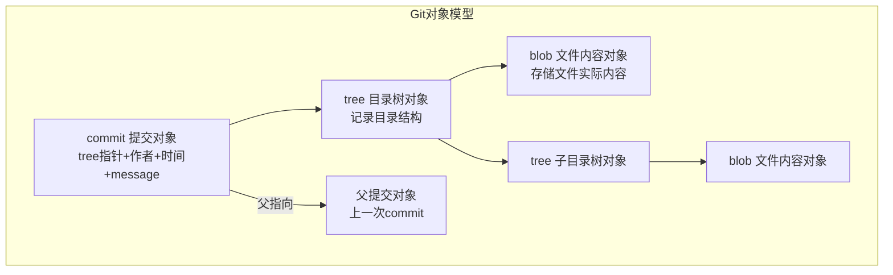
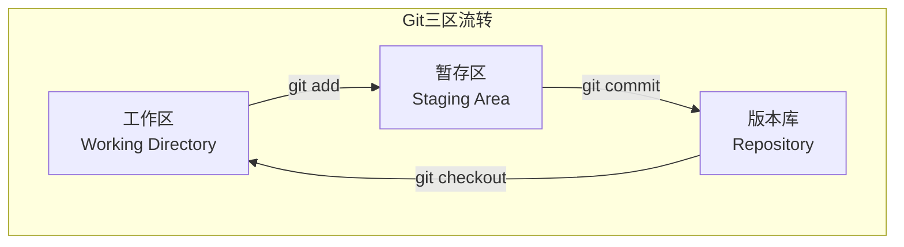
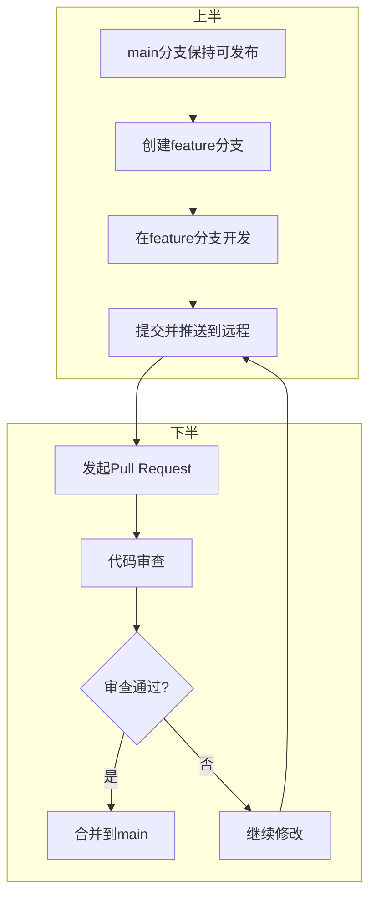

# 【筑基·057】Git代码时光机：版本控制入门到分支管理

> **码农修仙传 · 筑基期 · 第57篇**
> 我是玄芯散人，带你从炼气修到大乘。

---

## 境界标识

```
╔══════════════════════════════════╗
║     筑基期 · 第57篇              ║
║     Git代码时光机                 ║
║     预计阅读：16分钟              ║
╚══════════════════════════════════╝
```

---

## 修仙引入

修仙者修炼功法，每进阶一个小境界都要记录心得。有人用玉简，有人用竹简，有人直接刻在洞府墙壁上。问题来了：你刻了三百行功法心得，第二天发现改错了想退回昨天的版本，但墙壁上已经被你涂改得面目全非。你拿什么退？

Git就是程序员的玉简刻录术。它记录你代码的每一次修改，随时能回到任何一个历史版本，还能让多个人同时修炼同一套功法再合到一起。Linus Torvalds在2005年用两周时间写出了Git的初版，因为之前用的商业版本控制系统BitKeeper收回了免费授权。Linux一怒之下自己造了个轮子，结果造出了全世界最流行的版本控制工具。

这篇讲Git的基本原理和常用操作：版本控制为什么不能靠复制粘贴，Git内部怎么存数据，分支怎么开怎么合，rebase和merge到底选哪个。

---

## 硬核主体

### 为什么不能存U盘

你写代码的时候大概率干过这种事：

```
project_v1.c
project_v2.c
project_final.c
project_final_真的最后版.c
project_final_不改了.c
```

手动改文件名来区分版本，看着挺合理。但你很快会遇到这些问题：

一，不知道每个版本改了什么。你打开`project_final_真的最后版.c`和`project_v2.c`，肉眼对比三百行代码找出差异，眼睛看花了还漏。

二，多人协作时互相覆盖。同事拿你的文件改了几个函数发回来，你同时也改了同一个文件，他的版本覆盖了你的修改，你那行精心调了半小时的代码没了。

三，没法回退到特定版本。你三天前改了一处逻辑，今天发现那个改动是错的，但中间已经改了二十多个版本，你已经回不去三天前那个状态。

版本控制系统（Version Control System，VCS）就是解决这些问题的。它记录文件的每一次修改，你可以查看任意两个版本之间的差异，可以回到历史任意版本，多人可以同时修改同一个文件然后合并。

版本控制系统分两类。集中式（Centralized VCS）如SVN，有一个中央服务器存所有版本，每个人从服务器取代码改完推回去。分布式（Distributed VCS）如Git，每个人本地都有全量的版本历史，不依赖中央服务器也能看历史提交和切版本。Git是分布式，这是它和SVN最大的区别。

### Git内部怎么存数据

很多人用了三年Git还以为Git存的是文件差异。不是。Git存的是快照（snapshot）。

每次你commit，Git把你当前所有文件的状态拍一张快照存下来。如果某个文件没改，Git不会重新存一份，而是指向上一次存的那份。这样既节省空间也方便恢复到任意一个版本。

Git内部有四种对象：blob存文件内容，tree存目录结构，commit存提交记录，还有tag对象。打tag有两种：轻量标签（lightweight tag）只是指向commit的指针，不创建新对象；含注解标签（annotated tag）会创建一个tag对象，记录打标签的人和时间和说明信息，可选GPG签名，专门用于发布版本。`git tag -a v1.0 -m "Release 1.0"`就是创建含注解标签。



每种对象用一个40字符的SHA-1哈希值标识。比如一个blob对象，内容是`hello world\n`，Git计算它的哈希是`3b18e512dba79e4c8300dd08aeb37f8e728b8dad`。只要内容一样，哈希就一样，Git就不会重复存。

commit对象记录了：哪个tree对象是这次提交的根目录，父提交是谁，作者是谁，提交时间，提交信息。这样每次提交串成一条链，你顺着父提交指针往回走就能看到所有历史。

理解这个内部结构对后面学分支有帮助，因为后面的分支和合并都是在操作这些指针，不是在复制文件。

### 基本操作：init和add和commit

创建一个Git仓库：

```bash
# 在项目目录初始化Git仓库
git init                # 生成.git隐藏目录，存所有版本数据

# 查看当前状态
git status              # 哪些文件改了哪些没跟踪
```

Git有三个区域：工作区（你实际编辑的文件），暂存区（staged，准备提交的文件），版本库（committed，已经提交的快照）。



```bash
# 把文件加入暂存区
git add main.c           # 暂存单个文件
git add .                # 暂存所有改动

# 提交到版本库
git commit -m "修复串口接收buffer溢出bug"  # -m后面是提交信息

# 查看提交历史
git log --oneline        # 每条提交一行显示
git log --oneline --graph # 带分支图的历史
```

`git add`把工作区的改动放进暂存区，`git commit`把暂存区的内容拍一张快照存进版本库。为什么要有暂存区这一步？因为你可能改了五个文件，但只想把其中三个提交，剩下两个还没写完。暂存区让你选哪些改动进这次提交。

提交信息的写法有讲究。好的提交信息第一行不超过50个字符，简短说明这次提交干了什么。空一行后写详细描述。例如：

```
修复串口接收buffer溢出bug

DMA接收时缓冲区大小设成了64字节，
实际数据包最大72字节，超出部分写到了相邻内存。
改为128字节缓冲区，增加长度校验。
```

### 分支：平行修炼

分支是Git最常用的功能。你在一个分支上写新功能，不会干扰主干分支的稳定代码。写完测试通过再合并回主干。

Git的分支非常轻量。一个分支就是一个指向某个commit对象的指针，40个字符，不是复制一份代码。创建分支就是新建一个指针：

```bash
# 创建分支并切换过去
git checkout -b feature/uart-driver   # 创建并切换到feature/uart-driver分支

# 等价于Git 2.23+的写法
git switch -c feature/uart-driver

# 查看所有分支
git branch                # *号标记当前所在分支

# 切回主干
git checkout main         # 或 git switch main

# 合并分支（先切到目标分支再合并源分支）
git checkout main         # 切到main
git merge feature/uart-driver  # 把feature分支合进main

# 删除已合并的分支
git branch -d feature/uart-driver
```

### merge vs rebase：合并的两种姿势

合并分支有两种方式：merge和rebase。很多人用了一年Git也分不清区别。

假设你的提交历史是这样的：

```
      A---B---C  feature
     /
D---E---F  main
```

feature分支在E点切出来，有A、B、C三个提交。main分支在E之后又有F提交。现在要把feature合进main。

merge方式：

```bash
git checkout main
git merge feature
```

Git会找两个分支的公共祖先E，然后把E到C和E到F的差异做一次三方合并（three-way merge），生成一个新的合并提交（merge commit）：

```
      A---B---C
     /         \
D---E---F------M  main
```

M是一个合并提交，有两个父提交C和F。好处是保留了全部分支历史，你能看出哪些提交是在feature分支上做的。缺点是历史记录有分叉和合并，看起来比较乱。

rebase方式：

```bash
git checkout feature
git rebase main           # 把feature的提交挪到main最新提交后面
git checkout main
git merge feature         # fast-forward合并
```

rebase把feature分支的A、B、C三个提交"挪"到F后面，变成A'、B'、C'（内容一样但哈希变了，因为父提交变了）：

```
D---E---F  main
          \
           A'---B'---C'  feature
```

然后main合并feature时是fast-forward（快进）合并，main指针直接移到C'，不需要产生合并提交：

```
D---E---F---A'---B'---C'  main, feature
```

rebase的好处是历史记录是线性的，干净。缺点是改写了提交历史，如果feature分支是多人共用的，rebase会让别人已经拉取的提交失效，这是一个需要注意的地方。

选择原则：自己在用的本地分支可以rebase保持历史干净，多人共用的分支用merge避免改写历史。这是社区约定，记住不会出事。

### 远程仓库：clone和push和pull

Git是分布式的，你本地有全量历史。但多人协作需要一个共享的中转站，这就是远程仓库（remote）。GitHub和GitLab和Gitee都是托管远程仓库的平台。

```bash
# 克隆远程仓库到本地
git clone https://github.com/zhouge94/project.git

# 查看远程仓库
git remote -v             # 显示远程仓库地址

# 推送本地提交到远程
git push origin main      # 把main分支推到origin

# 拉取远程更新到本地
git pull origin main      # = git fetch + git merge
```

`git pull`其实是两步：先`git fetch`把远程的新提交下载到本地，再`git merge`把它们合并到当前分支。如果远程有人改了你也在改的文件，pull的时候可能产生冲突。

### .gitignore：不该跟踪的文件

不是所有文件都该进版本库。编译产物和IDE配置文件和密钥文件都不该提交。在项目根目录建一个`.gitignore`文件：

```gitignore
# 编译产物
*.o
*.elf
*.bin
*.hex

# IDE配置
.vscode/
.idea/

# 依赖目录
node_modules/

# 环境变量和密钥
.env
*.pem
```

`.gitignore`里列的文件`git add .`时不会加进去。如果你已经提交了一个文件然后才加到`.gitignore`，需要先`git rm --cached 文件名`把它从版本库里移除，`.gitignore`才会生效。

### Git工作流：feature分支模式

团队协作时怎么用分支？最常见的是feature分支模式：



每个人从main拉一个feature分支干活，写完推到远程发起Pull Request（PR），别人审完代码同意合并。main分支永远保持可发布的状态。这个流程下一篇会详细讲。

---

## 修仙术语对照表

| 修仙术语 | 技术现实 | 本篇位置 |
|---------|---------|---------|
| 玉简刻录 | Git版本控制 | 修仙引入 |
| 留影存照 | 快照snapshot | Git内部结构 |
| 玉简编号 | SHA-1哈希值 | Git内部结构 |
| 灵识暂存 | 暂存区staging area | 基本操作 |
| 刻入玉简 | git commit提交 | 基本操作 |
| 翻阅玉简 | git log查看历史 | 基本操作 |
| 分身修炼 | 分支branch | 分支 |
| 合体归一 | merge合并 | merge vs rebase |
| 重订前尘 | rebase变基 | merge vs rebase |
| 传音玉简 | 远程仓库remote | 远程仓库 |
| 灵讯互通 | git push/pull | 远程仓库 |
| 封印禁制 | .gitignore忽略文件 | .gitignore |
| 分身历练 | feature分支开发 | Git工作流 |
| 归宗验证 | Pull Request审查 | Git工作流 |
| 林怒造轮 | Linus创造Git | 修仙引入 |

---

## 进阶条件

- [ ] 说出Git和SVN的一个区别（分布式vs集中式）
- [ ] 说出Git存的是快照而不是文件差异
- [ ] 说出Git四种对象类型（blob/tree/commit/tag）
- [ ] 用git add和git commit完成一次提交流程
- [ ] 创建分支，在上面修改文件，然后merge回主干
- [ ] 说出merge和rebase各保留什么样的提交历史
- [ ] 写一个合理的.gitignore文件，至少包含编译产物和密钥文件
- [ ] 解释git pull等于git fetch加上git merge

筑基期的工程工具修炼从这里开始。下一篇讲Git协作工作流，多人同时改代码怎么解决冲突，Pull Request流程怎么走。

---

## 下期预告 + 互动

下一篇：Git协作工作流：冲突解决和PR流程。

一个人用Git很简单，三个人同时改同一个项目就复杂了。两个人改了同一个文件的同一行，Git不知道留谁的版本，这就是冲突（conflict）。解决冲突是团队协作的日常，也是新人最容易卡住的地方。下一篇讲冲突怎么解，Pull Request流程怎么走，rebase和merge在协作中怎么选。

留两个问题：
1. 你觉得提交信息应该写多详细？一行够不够？
2. 如果你已经把feature分支push到远程了，这时候rebase会有什么后果？别人pull时会发生什么？

我是玄芯散人，带你从炼气修到大乘。

---

*本文是「码农修仙传」系列第057篇。系列导航见 [xren.ren](https://xren.ren)*
