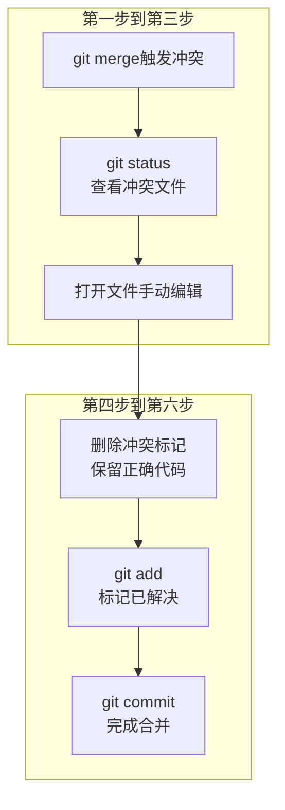
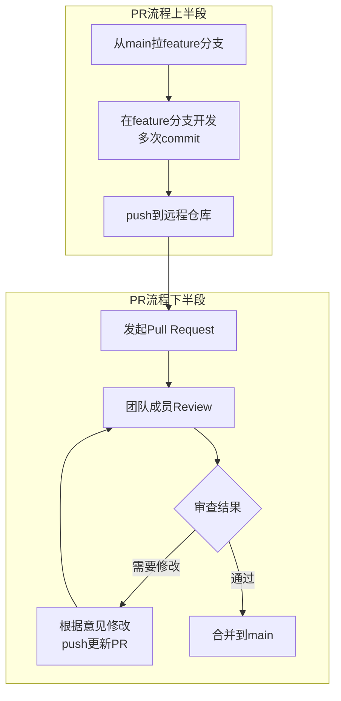

# 【筑基·058】Git协作工作流：冲突解决和PR流程

> **码农修仙传 · 筑基期 · 第58篇**
> 我是玄芯散人，带你从炼气修到大乘。

---

## 境界标识

```
╔══════════════════════════════════╗
║     筑基期 · 第58篇              ║
║     Git协作工作流                 ║
║     预计阅读：15分钟              ║
╚══════════════════════════════════╝
```

---

## 修仙引入

上篇讲了一个人的玉简刻录术。一个人修炼，想怎么改怎么改，反正只有你一个人在动。但宗门修炼不是一个人的事。三个弟子同时修编同一本功法，你改了第三章，他改了第三章的另一段，另一个师弟也改了第三章。三份改动合到一起的时候，谁留谁删？

这就是冲突。解决冲突不是靠吵架，是靠规矩。这篇讲多人协作时冲突怎么解，Pull Request流程怎么走，rebase和merge在团队协作中怎么选，还有Git LFS处理大文件的用法。

---

## 硬核主体

### 冲突是怎么产生的

Git合并分支时，会对比两个分支对同一文件的修改。如果两个分支改的是同一个文件的不同位置，Git能自动合并。但如果两个分支改了同一行代码（或者同一区域的代码），Git不知道留哪个版本，就会报冲突（conflict）。

产生冲突的典型情况：

```bash
# 场景：两个人同时改了main.c的同一行
# Alice在feature/login分支改了第42行
# Bob在feature/uart分支也改了第42行
# 先合并Alice的分支，没问题
git checkout main
git merge feature/login          # 顺利合并，没冲突

# 再合并Bob的分支，冲突了
git merge feature/uart
# Auto-merging main.c
# CONFLICT (content): Merge conflict in main.c
# Automatic merge failed; fix conflicts and then commit the result.
```

Git告诉你冲突在哪个文件。你打开文件，会看到这样的标记：

```c
int baud_rate = 9600;
<<<<<<< HEAD
// Alice改的：默认波特率改为115200
int baud_rate = 115200;
=======
// Bob改的：默认波特率改为57600
int baud_rate = 57600;
>>>>>>> feature/uart
```

`<<<<<<< HEAD`和`=======`之间是当前分支（main，已经合并了Alice的改动）的版本。`=======`和`>>>>>>> feature/uart`之间是Bob分支的版本。两个版本都在，Git不会帮你选。

### 解决冲突的步骤

解决冲突就是手动编辑文件，决定保留哪些内容：

```bash
# 第一步：查看哪些文件有冲突
git status                        # 显示unmerged paths

# 第二步：打开冲突文件，手动编辑
# 把 <<<<<<< ======= >>>>>>> 标记删掉
# 保留你想要的代码，或者把两边的改动合并到一起
# 比如最终决定用115200（Alice的方案）：
# int baud_rate = 115200;

# 第三步：标记冲突已解决
git add main.c                    # add就是告诉Git这个文件搞定了

# 第四步：完成合并
git commit -m "合并feature/uart，解决波特率冲突"
# Git会自动生成合并提交
```



解决冲突有几个实用命令：

```bash
# 放弃合并，回到合并前的状态
git merge --abort

# 用对方的版本解决冲突（完全用Bob的版本）
git checkout --theirs main.c

# 用自己的版本解决冲突（完全用自己的版本）
git checkout --ours main.c

# 查看冲突文件的diff
git diff                          # 显示冲突内容
```

`--theirs`和`--ours`要小心用。它们是完全丢弃一方的改动。如果两个人改了同一行但各有道理，你得手动把两边的逻辑合到一起，不能简单选一边。

### 合并冲突的常见类型

不是所有冲突都是同一行代码被改了。实际开发中有几种常见冲突：

第一种，直接冲突。两个人改了同一行，Git报冲突。这种最常见也最简单。

第二种，间接冲突。一个人删了一行代码，另一个人改了同一行。Git也会报冲突，因为你不能同时删掉和修改同一行。解决时判断该删掉还是保留修改。

第三种，文件重命名冲突。一个人改了文件名，另一个人在旧文件名下改了内容。Git的rename detection能识别大多数重命名，但如果同时改名又改内容就可能冲突。

```bash
# 查看Git的rename detection配置
git config diff.renames           # 默认true，会检测重命名
```

### rebase时的冲突

rebase也会产生冲突，但处理方式略有不同。rebase是把你的提交一个个重放到目标分支上，每重放一个都可能冲突：

```bash
git checkout feature/uart
git rebase main
# 如果第一个提交冲突了
# Git会暂停，让你解决冲突

# 解决完冲突后
git add main.c
git rebase --continue             # 继续rebase，不是git commit

# 如果实在搞不定，放弃rebase
git rebase --abort                # 回到rebase前的状态

# 跳过当前提交（不推荐，会丢改动）
git rebase --skip
```

rebase冲突和merge冲突的区别在于：merge解决一次冲突就够了，rebase可能要解决多次（每个提交都可能冲突一次）。所以rebase冲突更繁琐，但好处是rebase完历史是线性的。

### Pull Request流程

Pull Request（PR）是GitHub和GitLab上的协作功能。你在一个分支上写完代码，发起PR请求把你的分支合并到目标分支。其他人审查你的代码，提意见，你修改，最终同意合并。



完整流程的命令操作：

```bash
# 1. 从最新的main拉分支
git checkout main
git pull origin main               # 确保main是最新的
git checkout -b feature/uart-dma   # 拉一个新分支

# 2. 在feature分支上开发
# 写代码，测试...
git add .
git commit -m "添加UART DMA接收模式"
git add .
git commit -m "修复DMA中断标志清除时机"

# 3. 推送到远程
git push origin feature/uart-dma

# 4. 在GitHub网页上发起Pull Request
# 选择feature/uart-dma -> main
# 填写PR描述：改了什么，为什么改，怎么测试的

# 5. 如果Review有意见，继续在feature分支修改
git add .
git commit -m "根据review意见修改DMA缓冲区大小"
git push origin feature/uart-dma    # push后PR自动更新

# 6. 审查通过，在GitHub上点Merge按钮
# 或者命令行合并
git checkout main
git pull origin main
git merge --no-ff feature/uart-dma  # --no-ff保留分支记录
git push origin main

# 7. 删除feature分支
git branch -d feature/uart-dma      # 删本地
git push origin --delete feature/uart-dma  # 删远程
```

### PR描述怎么写

好的PR描述让Reviewer快速理解你改了什么。PR描述模板：

```markdown
## 改了什么
UART接收增加DMA模式，减少CPU在中断里的时间

## 为什么改
原来用中断逐字节接收，波特率115200时CPU占用30%，
DMA模式下CPU占用降到3%

## 怎么测试
- [x] 9600波特率测试通过
- [x] 115200波特率连续接收1小时无丢字节
- [x] DMA半传输中断和传输完成中断都正常触发

## 注意事项
DMA接收缓冲区大小设为256字节，大于最大数据包的200字节
```

### rebase和merge在协作中怎么选

上一篇讲了rebase和merge的技术区别。在团队协作中，选择有约定俗成的规矩：

本地feature分支，push之前可以rebase到最新main上，保持历史干净。但一旦push到远程且别人可能已经在你的分支上工作，就不要rebase了。

合并PR时，三种方式：

```bash
# 方式一：Merge commit（默认）
# 保留全部分支历史，有合并提交
git merge --no-ff feature/uart-dma

# 方式二：Squash and merge
# 把feature分支的多个提交压缩成一个
git merge --squash feature/uart-dma
git commit -m "添加UART DMA接收模式"
# 适合feature分支提交记录比较乱的情况

# 方式三：Rebase and merge
# 把feature分支的提交重放到main后面，线性历史
git rebase main feature/uart-dma    # 先rebase
git checkout main
git merge feature/uart-dma          # fast-forward合并
```

GitHub的Merge按钮旁边有三个选项对应这三种方式。团队可以约定默认用哪种。一般推荐：小改动用Squash，大功能用Merge commit，要求线性历史的用Rebase。

### Git LFS：大文件怎么处理

Git设计之初是存文本文件的。二进制文件（图片或视频或编译产物）每次改一点，Git存一份全量快照，仓库会越来越大。Git LFS（Large File Storage）解决这个问题：它在Git仓库里只存一个指针，实际文件存在LFS服务器上。

```bash
# 安装Git LFS（GitHub Desktop自带，手动安装各平台不同）
git lfs install                    # 每台机器执行一次

# 指定哪些文件用LFS跟踪
git lfs track "*.png"             # 跟踪所有png图片
git lfs track "*.pdf"             # 跟踪所有pdf文件

# .gitattributes文件被自动创建，需要提交
git add .gitattributes
git commit -m "配置Git LFS跟踪规则"

# 正常add和commit，LFS自动处理
git add design.png
git commit -m "添加架构设计图"
git push origin main
```

Git LFS的免费额度：GitHub免费账户1GB存储和1GB/月带宽。超了要买额外配额。嵌入式项目如果有原理图PDF或PCB Gerber文件，用LFS比较合适。

### 常见协作陷阱

陷阱一，不要直接往main推代码。main分支应该只通过PR合并，保证每个改动都有Review记录。GitHub可以设置分支保护规则，禁止直接push到main。

陷阱二，feature分支太久不合并。你在feature分支上写了两个星期，期间main已经改了很多。合并时冲突会非常多。建议每天rebase一次到最新main，小步合并。

陷阱三，提交信息太随意。`git commit -m "fix"`这种信息在团队协作中无法接受。Reviewer看你PR的时候，每个提交的信息都是理解你改动的线索。

陷阱四，force push到公共分支。`git push --force`会覆盖远程历史。如果别人已经基于这个分支工作，他的本地仓库会和远程不一致。force push只能用于自己的feature分支且确认没人也在用。

```bash
# 危险操作：force push到main
git push --force origin main        # 绝对不要这样做

# 相对安全：force push到自己的feature分支
git push --force-with-lease origin feature/my-branch
# --force-with-lease比--force安全一点
# 如果远程分支有别人的新提交，会拒绝push
```

`--force-with-lease`比`--force`更安全，它在push前检查远程分支是否有你不知道的新提交，如果有就拒绝。养成用`--force-with-lease`的习惯。

---

## 修仙术语对照表

| 修仙术语 | 技术现实 | 本篇位置 |
|---------|---------|---------|
| 同修争功 | 合并冲突conflict | 冲突是怎么产生的 |
| 辨识留删 | 解决冲突标记 | 解决冲突的步骤 |
| 弃合还原 | git merge --abort | 解决冲突的步骤 |
| 取彼之长 | git checkout --theirs | 解决冲突的步骤 |
| 保留己道 | git checkout --ours | 解决冲突的步骤 |
| 重订冲突 | rebase冲突 | rebase时的冲突 |
| 续行重订 | git rebase --continue | rebase时的冲突 |
| 归宗验证 | Pull Request审查 | PR流程 |
| 压缩归一 | Squash and merge | rebase和merge协作选择 |
| 线性归宗 | Rebase and merge | rebase和merge协作选择 |
| 玉简封箱 | Git LFS大文件存储 | Git LFS |
| 正道禁制 | 分支保护规则 | 常见协作陷阱 |
| 长期分身 | feature分支太久不合并 | 常见协作陷阱 |
| 覆写前尘 | git push --force | 常见协作陷阱 |
| 谨慎覆写 | git push --force-with-lease | 常见协作陷阱 |

---

## 进阶条件

- [ ] 手动制造一次冲突（两个分支改同一行），然后解决它
- [ ] 说出`<<<<<<< HEAD`和`=======`和`>>>>>>>`三段标记各代表什么
- [ ] 用`git merge --abort`放弃一次合并
- [ ] 走完一次PR流程：拉分支，开发，push，发PR，Review，合并
- [ ] 写一个包含"改了什么/为什么改/怎么测试"的PR描述
- [ ] 说出Squash merge和Rebase merge各保留什么样的历史
- [ ] 配置Git LFS跟踪一种二进制文件类型
- [ ] 说出`--force`和`--force-with-lease`的区别

筑基期工程工具修炼接近尾声。下一篇讲Linux命令行入门，工程师在终端里怎么干活。

---

## 下期预告 + 互动

下一篇：Linux命令行入门：工程师的操作系统。

图形界面到命令行，是每个工程师的必经之路。Linux命令行不是装酷用的，是真正干活效率高。ls看文件，grep找内容，ps查进程，管道把命令串起来做复杂操作。下一篇讲工程师日常最常用的Linux命令和管道重定向。

留两个问题：
1. 你的团队用Merge commit还是Squash merge合并PR？为什么选这种？
2. 你遇到过最头疼的合并冲突是什么情况，怎么解决的？

我是玄芯散人，带你从炼气修到大乘。

---

*本文是「码农修仙传」系列第058篇。系列导航见 [xren.ren](https://xren.ren)*
