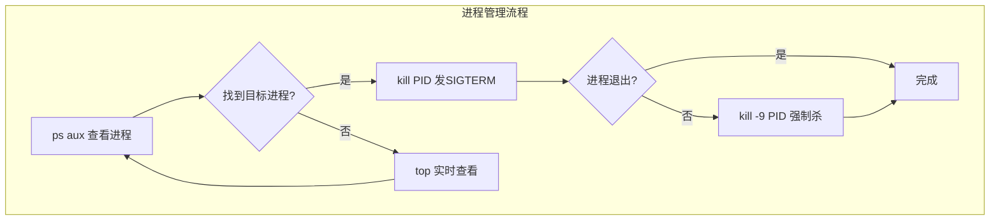

# 【筑基·059】Linux命令行入门：工程师的操作系统

> **码农修仙传 · 筑基期 · 第59篇**
> 我是玄芯散人，带你从炼气修到大乘。

---

## 境界标识

```
╔══════════════════════════════════╗
║     筑基期 · 第59篇              ║
║     Linux命令行入门              ║
║     预计阅读：15分钟              ║
╚══════════════════════════════════╝
```

---

## 修仙引入

修仙界有句话：法器再好，不如自身修为扎实。你在Windows下点鼠标能干的事，Linux下一行命令就能搞定，而且快十倍。但很多炼气期毕业的弟子，进了筑基期还是离不开图形界面，看到黑色终端就发怵。

Linux命令行不是什么高深功夫，它就是一套和操作系统对话的语言。你跟系统说"列出这个目录的文件"，系统就列给你看。你说"把含error的行找出来"，系统就帮你找。学会这套语言之后，你干各种工程的效率都会上一个台阶。这篇讲Linux命令行最常用的那些命令，覆盖文件操作和文本搜索，然后讲进程管理、管道重定向，最后说权限管理。

---

## 硬核主体

### 为什么工程师必须会命令行

你在公司写的代码，最终跑在服务器上。服务器没有显示器，没有鼠标，没有桌面环境。你通过SSH连上去，面前就是一个黑色窗口加一个光标。你不会命令行，等于上了战场没带武器。

命令行还有个好处：可复制可脚本化。你在终端敲了十条命令搞定了一次部署，把这十条命令写到一个文件里就是脚本，下次一键执行。鼠标点十次没法复用，命令行可以。

### 文件操作：ls和cd和cp和mv和rm

`ls`列出目录内容，是你敲得最多的命令：

```bash
ls                    # 列出当前目录文件
ls -l                 # 长格式，显示权限/大小/时间
ls -a                 # 显示隐藏文件（以.开头的文件）
ls -lh                # -h把文件大小显示成人类可读格式（K/M/G）
ls -lt                # 按修改时间排序，最新的在最前面
```

`cd`切换目录：

```bash
cd /home/project      # 切到指定目录（绝对路径）
cd ..                 # 回上一级目录
cd ~                  # 回用户主目录
cd -                  # 回上次所在的目录，很实用
```

`cp`复制文件，`mv`移动或重命名，`rm`删除：

```bash
cp main.c main_backup.c      # 复制文件
cp -r src/ src_backup/       # -r递归复制整个目录
mv old_name.c new_name.c     # 重命名
mv log.txt /var/log/         # 移动文件到其他目录
rm temp.o                    # 删除文件，删了就没了，没有回收站
rm -rf build/                # -r递归删目录 -f强制不确认，这组合要小心
```

`mkdir`创建目录：

```bash
mkdir project               # 创建一个目录
mkdir -p a/b/c              # -p递归创建多层目录
```

### 文本搜索：grep和find

`grep`在文件内容里搜索，是工程师每天用得最多的命令之一：

```bash
grep "error" log.txt           # 在log.txt里找含error的行
grep -i "error" log.txt        # -i忽略大小写，Error也匹配
grep -n "error" log.txt        # -n显示行号
grep -r "TODO" src/            # -r递归搜索整个目录
grep -v "debug" log.txt        # -v反向匹配，找不含debug的行
grep -c "error" log.txt        # -c只统计匹配了多少行
```

`find`按文件名或属性搜索文件：

```bash
find . -name "*.c"             # 在当前目录下找所有.c文件
find /home -name "*.log"       # 在/home下找所有.log文件
find . -name "*.o" -delete     # 找到所有.o文件并删除
find . -size +10M              # 找大于10MB的文件
find . -mtime -1               # 找最近1天内修改过的文件
```

grep搜的是文件内容，find搜的是文件名和属性。两者经常配合管道一起用。

### 进程管理：ps和kill和top

`ps`查看当前运行的进程：

```bash
ps                     # 只看当前终端的进程
ps aux                 # 看系统所有进程，a所有用户 u详细 x无终端的
ps aux | grep python   # 配合管道找python进程
```

`top`实时看进程和系统资源占用，类似Windows的任务管理器但更详细。按q退出。`htop`是top的增强版，有颜色和交互界面，大部分Linux发行版需要单独安装。

```bash
top                    # 实时监控，CPU内存占用一览
htop                   # 增强版，更好看更好用
```

`kill`发信号给进程，最常用的就是终止进程：

```bash
kill 1234              # 给PID 1234发SIGTERM，优雅退出
kill -9 1234           # 发SIGKILL，强制杀掉，进程没机会清理
killall python3        # 按名字杀所有python3进程
```

SIGTERM是请进程自己退出，进程可以捕获这个信号做清理工作再退出。SIGKILL是内核直接把进程干掉，进程拦不住。先试SIGTERM，不行再SIGKILL。



### 管道：把命令串起来

管道符`|`把前一个命令的输出当作后一个命令的输入。这是Unix哲学的精华：每个命令只做一件事，通过管道组合出复杂功能。

```bash
# 找所有含error的行，然后统计有多少行
grep "error" log.txt | wc -l

# 列出所有.c文件，只看前5个
find . -name "*.c" | head -5

# 查看进程，过滤python相关的
ps aux | grep python

# 查看端口号被哪个进程占用
netstat -tlnp | grep 8080
```

没有管道的话，你得把第一个命令的输出存到文件里，再对文件跑第二个命令。有了管道，一条链搞定。

### 重定向：控制输入输出去向

重定向符`>`和`>>`把命令输出写到文件而不是显示在屏幕上：

```bash
echo "hello" > file.txt       # 写入file.txt，覆盖原有内容
echo "world" >> file.txt      # 追加到file.txt末尾
ls -l > listing.txt           # 把目录列表存到文件
grep "error" log.txt > errors.txt   # 把搜索结果存到文件
```

`<`把文件内容作为命令的输入：

```bash
sort < unsorted.txt          # 把文件内容排序后输出
```

`2>`重定向错误输出。Linux里每个进程有三个标准流：标准输入（stdin，编号0），标准输出（stdout，编号1），标准错误（stderr，编号2）。

```bash
# 正常输出和错误输出都存到文件
command > all.txt 2>&1

# 只丢弃错误信息
command 2>/dev/null           # /dev/null是黑洞，写进去的数据消失

# 丢弃所有输出
command >/dev/null 2>&1
```

```mermaid
graph LR
    subgraph 三大标准流
        direction LR
        A[stdin 0<br/>标准输入] --> CMD[命令/程序]
        CMD --> B[stdout 1<br/>标准输出]
        CMD --> C[stderr 2<br/>标准错误]
    end
    B -->|> file| D[写入文件]
    B -->|>> file| E[追加到文件]
    B -->|\| next| F[传给下个命令]
    C -->|2> file| G[错误写入文件]
    C -->|2>/dev/null| H[丢弃]
```

### 权限管理：chmod和chown

Linux是多用户系统，每个文件和目录都有权限控制。用`ls -l`看到的权限大概长这样：

```
-rwxr-xr-- 1 zhouge staff 2048 Sep  2 10:30 main.c
```

第一列那十个字符就是权限信息。第一个字符是文件类型，`-`是普通文件，`d`是目录，`l`是符号链接。后面九个字符分三组，每组三个：

- 第一组`rwx`：文件所有者（owner）的权限
- 第二组`r-x`：同组用户（group）的权限
- 第三组`r--`：其他用户（others）的权限

其他各列含义：第二列是硬链接数，第三列是所有者用户名，第四列是组名，第五列是文件大小（字节），第六列是修改时间，第七列是文件名。

`r`是读（read），`w`是写（write），`x`是执行（execute）。对目录来说，`x`表示能否进入这个目录（cd进去），不是执行。

`chmod`修改权限，有两种方式：字母方式和数字方式。

```bash
# 字母方式：u所有者 g组 o其他 a所有人
chmod u+x script.sh         # 给所有者加执行权限
chmod g-w file.txt          # 去掉组的写权限
chmod a+r file.txt          # 所有人可读
chmod ugo+rwx file.txt      # 所有人可读可写可执行

# 数字方式：r=4 w=2 x=1，加起来就是权限值
chmod 755 script.sh         # rwxr-xr-x，所有者全权限，其他人可读可执行
chmod 644 file.txt          # rw-r--r--，所有者可读写，其他人只读
chmod 777 file.txt          # rwxrwxrwx，所有人全权限，生产环境别这么干
```

数字方式的计算：7=4+2+1（rwx），5=4+0+1（r-x），4=4+0+0（r--），6=4+2+0（rw-）。

`chown`修改文件所有者：

```bash
sudo chown user:group file.txt    # 改所有者和组
sudo chown user file.txt          # 只改所有者
sudo chown :group file.txt        # 只改组
```

### 一些救命命令

`man`查看命令手册。不记得某个命令怎么用，`man grep`就能看到grep的所有参数说明。按q退出。

`sudo`以管理员权限执行命令。装软件，改系统文件，绑定1024以下端口，这些操作都需要sudo。sudo不是万能的，它只是让你临时获得root权限执行一条命令。

`df -h`查看磁盘使用情况，`du -sh`查看某个目录占多大空间。服务器磁盘满了先敲这俩命令排查。

`tail -f log.txt`实时看日志文件新增内容。程序跑着你在看日志，新日志一行行出来，这就是tail -f干的事。`Ctrl+C`退出。

---

## 修仙术语对照表

| 修仙术语 | 技术现实 | 本篇位置 |
|---------|---------|---------|
| 法器 | 图形界面工具 | 修仙引入 |
| 自身修为 | 命令行操作能力 | 修仙引入 |
| 黑色终端 | terminal/SSH终端 | 修仙引入 |
| 战场 | 服务器环境 | 文件操作前 |
| 武器 | 命令行技能 | 文件操作前 |
| 御物术 | 文件操作命令ls/cp/mv/rm | 文件操作 |
| 搜魂术 | grep文本搜索 | 文本搜索 |
| 追踪术 | find文件搜索 | 文本搜索 |
| 御灵术 | 进程管理ps/kill | 进程管理 |
| 灵脉传输 | 管道\| | 管道 |
| 传送阵 | 重定向>/>>/< | 重定向 |
| 三脉 | stdin/stdout/stderr三大标准流 | 重定向 |
| 黑洞 | /dev/null | 重定向 |
| 洞府禁制 | 文件权限rwx | 权限管理 |
| 掌门令牌 | sudo管理员权限 | 救命命令 |

---

## 进阶条件

- [ ] 不看参考资料能说出`ls -la`每个输出列的含义
- [ ] 能用grep配合管道从日志文件中统计某种错误出现的次数
- [ ] 能用find命令查找指定目录下所有某后缀文件并删除
- [ ] 理解`kill`和`kill -9`的区别，知道什么时候用哪个
- [ ] 能解释`chmod 755`对应什么权限，以及数字怎么算出来的
- [ ] 能用`>`和`>>`把命令输出存到文件，知道覆盖和追加的区别
- [ ] 能用`tail -f`实时查看日志，知道`Ctrl+C`退出

下一篇讲Shell脚本入门。命令行用熟了你会发现，每次部署都敲同样十条命令很烦。把那十条命令写成一个.sh文件，一键执行，这就是Shell脚本。摆脱重复劳动实现自动化，是筑基期工程能力上台阶的标志。

---

## 下期预告 + 互动

下一篇：【筑基·060】Shell脚本入门：自动化你的重复劳动

讲Shell脚本的基本语法：变量怎么定义，条件怎么判断，循环怎么写，函数怎么用，然后写一个能用的自动化脚本。把你在命令行里重复敲的东西变成一个文件，以后跑一行命令就行。

互动问题：你刚开始用Linux命令行时踩过什么坑？有没有`rm -rf`删错东西的经历？评论区聊聊，让后来人少走弯路。

我是玄芯散人，带你从炼气修到大乘。

---

*本文是「码农修仙传」系列第59篇。系列导航见 [xren.ren](https://xren.ren)*
