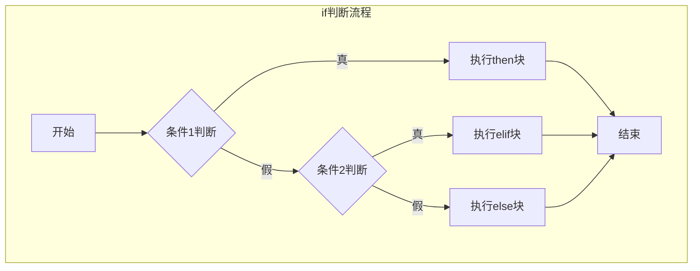
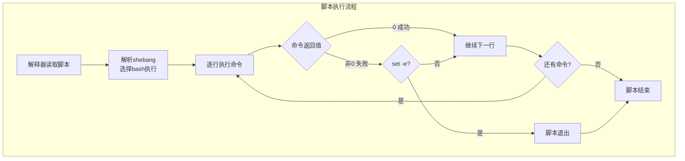

# 【筑基·060】Shell脚本入门：自动化你的重复劳动

> **码农修仙传 · 筑基期 · 第60篇**
> 我是玄芯散人，带你从炼气修到大乘。

---

## 境界标识

```
╔══════════════════════════════════╗
║     筑基期 · 第60篇              ║
║     Shell脚本入门                ║
║     预计阅读：15分钟              ║
╚══════════════════════════════════╝
```

---

## 修仙引入

上一篇你学会了Linux命令行，能敲ls、grep、find这些常用命令了。但你有没有发现一个事：每次部署代码，你都要手动敲一遍拉代码，然后装依赖，然后编译，最后重启服务，手都能敲出茧来。修仙界有句话，重复施法不如炼成符箓。你把那十条命令写到一张"符纸"上，需要的时候催动一次就行。这张符纸，就是Shell脚本。

Shell脚本是筑基期工程能力的分水岭。不会写脚本的人，每次干重复活都要手动操作，费时还容易出错。会写脚本的人，把重复劳动封装成一个文件，一行命令搞定。这篇讲Shell脚本最基本的语法，包括shebang怎么写，变量怎么定义，条件怎么判断，循环怎么转，函数怎么封装，最后写一个能直接用的自动化脚本。

---

## 硬核主体

### 第一个脚本：shebang是什么

打开终端，新建一个文件叫hello.sh，写入以下内容：

```bash
#!/bin/bash
# 这是一个最简单的Shell脚本
echo "Hello, Shell!"
```

第一行`#!/bin/bash`叫shebang，告诉系统用哪个解释器来执行这个脚本。`#!`是固定写法，后面跟解释器的路径。`/bin/bash`是Bash的路径，大部分Linux发行版的默认Shell。

你可能见过`#!/bin/sh`，跟`#!/bin/bash`有什么区别？`/bin/sh`是POSIX标准Shell，语法更精简。在Ubuntu和Debian上，`/bin/sh`其实指向dash而不是bash，有些Bash特有语法在sh下跑不了。初学者用`#!/bin/bash`就好，不用担心兼容性问题。

写完之后，给文件加上执行权限，然后运行：

```bash
chmod +x hello.sh    # 给脚本加执行权限
./hello.sh          # 执行脚本，输出 Hello, Shell!
```

也可以用`bash hello.sh`直接运行，不需要执行权限，但习惯上加权限再执行更规范。

### 变量：赋值和引用

Shell变量定义有个坑：等号两边不能有空格。

```bash
#!/bin/bash
# 变量定义和引用
NAME="玄芯散人"        # 正确：等号两边不能有空格
AGE=30                 # 数字也不需要引号
PATH_DIR="/home/project"  # 用大写或下划线区分，避免和系统变量冲突

echo "我叫$NAME"        # 双引号里可以用变量，输出：我叫玄芯散人
echo '我叫$NAME'        # 单引号里不解析变量，输出：我叫$NAME
echo "年龄: ${AGE}"    # ${}花括号写法更安全，推荐
```

单引号和双引号的区别是Shell里高频踩坑点。单引号里写什么就输出什么，变量不解析。双引号里变量会被替换成值。记不住的话，用双引号就行，大部分情况够用了。

变量名有个规矩：只能用字母、数字和下划线，不能以数字开头。还有，别用系统已有的变量名，比如`PATH`、`HOME`、`USER`，覆盖了会导致各种奇怪问题。

### 命令替换：把命令结果存进变量

```bash
#!/bin/bash
# 命令替换：$() 或反引号
CURRENT_DIR=$(pwd)              # 推荐用$()，清晰
FILE_COUNT=`ls | wc -l`        # 反引号也行，但不推荐，容易和单引号混淆
TODAY=$(date +%Y-%m-%d)        # 获取今天日期

echo "当前目录: $CURRENT_DIR"
echo "文件数量: $FILE_COUNT"
echo "今天日期: $TODAY"
```

`$()`把命令的输出结果赋值给变量，这叫命令替换。你在脚本里经常需要拿某个命令的结果来用，比如获取当前日期拼日志文件名，或者统计文件数量做判断。

### 条件判断：if语句

```bash
#!/bin/bash
# if条件判断
SCORE=85

if [ $SCORE -ge 90 ]; then
    echo "优秀"
elif [ $SCORE -ge 60 ]; then
    echo "及格"
else
    echo "挂了"
fi
```

`[ ]`是test命令的简写，注意方括号两边必须有空格。数字比较用`-eq`表示等于，`-ne`表示不等于，`-gt`表示大于，`-ge`表示大于等于，`-lt`表示小于，`-le`表示小于等于。

字符串比较用`=`和`!=`：

```bash
#!/bin/bash
# 字符串和文件判断
STR="hello"

if [ "$STR" = "hello" ]; then
    echo "匹配"
fi

# 文件判断
if [ -f /etc/passwd ]; then    # -f 文件存在且是普通文件
    echo "文件存在"
fi

if [ -d /tmp ]; then           # -d 目录存在
    echo "目录存在"
fi

if [ -x hello.sh ]; then       # -x 文件可执行
    echo "有执行权限"
fi
```

注意`"$STR"`两边加双引号的习惯，防止变量为空时语法报错。如果`$STR`是空的，`[ $STR = "hello" ]`变成`[ = "hello" ]`，shell会报错。加了双引号`[ "" = "hello" ]`就没问题。

Bash还提供了`[[ ]]`双括号，功能更强，支持正则匹配和逻辑运算符`&&`、`||`：

```bash
#!/bin/bash
# [[ ]] 比 [ ] 更强大
if [[ $STR == h* ]]; then       # 通配符匹配
    echo "以h开头"
fi

if [[ -f file.txt && $COUNT -gt 0 ]]; then   # 逻辑与
    echo "文件存在且计数大于0"
fi
```



### 循环：for和while

for循环遍历列表：

```bash
#!/bin/bash
# for循环
for file in *.c; do            # 遍历当前目录所有.c文件
    echo "编译: $file"
done

for I in 1 2 3 4 5; do         # 遍历数字
    echo "第 $I 次"
done

# C风格for循环
for ((i=0; i<5; i++)); do
    echo "i = $i"
done
```

while循环在条件为真时持续执行：

```bash
#!/bin/bash
# while循环
COUNT=0
while [ $COUNT -lt 5 ]; do
    echo "Count: $COUNT"
    COUNT=$((COUNT + 1))       # 算术运算用$(())
done

# 读文件每一行
while IFS= read -r LINE; do
    echo "行内容: $LINE"
done < input.txt
```

`IFS= read -r`这个写法看起来复杂，其实是有道理的。`IFS=`防止行首尾空格被截掉，`-r`防止反斜杠被当转义符。这是读文件行的标准写法，记住照抄就行。

### 函数：把代码封装起来

```bash
#!/bin/bash
# 函数定义和调用
say_hello() {                  # 定义函数，不需要function关键字
    echo "Hello, $1!"         # $1是函数的第一个参数
}

say_hello "玄芯散人"           # 调用函数，输出 Hello, 玄芯散人!
say_hello "道友"               # 再次调用，不同参数

# 带返回值的函数
is_file_exist() {
    if [ -f "$1" ]; then
        return 0              # return返回状态码，0是成功
    else
        return 1              # 非0是失败
    fi
}

if is_file_exist "/etc/passwd"; then
    echo "文件存在"
fi
```

Shell函数的`return`只能返回0到255的整数状态码，不能返回字符串。如果需要返回字符串，用全局变量或者命令输出：

```bash
#!/bin/bash
# 用命令输出返回字符串
get_today() {
    date +%Y-%m-%d
}

TODAY=$(get_today)            # 捕获函数输出
echo "今天是 $TODAY"
```

### 特殊变量：脚本参数

脚本可以接收命令行参数，靠的是特殊变量：

```bash
#!/bin/bash
# 特殊变量演示
echo "脚本名: $0"            # $0 脚本路径
echo "第一个参数: $1"        # $1 第一个参数
echo "第二个参数: $2"        # $2 第二个参数
echo "参数个数: $#"         # $# 参数总数
echo "所有参数: $@"         # $@ 所有参数列表
echo "上一条命令返回值: $?" # $? 上条命令退出码，0成功非0失败
echo "当前进程PID: $$"      # $$ 当前进程ID
```

执行`./test.sh foo bar`，`$1`就是foo，`$2`就是bar。`$@`是所有参数，经常在for循环里遍历：

```bash
#!/bin/bash
for ARG in "$@"; do
    echo "参数: $ARG"
done
```

### 调试技巧：set -e和set -x

脚本写多了，迟早会碰到"明明应该报错但脚本继续往下跑"的问题。`set -e`让脚本在任何命令返回非0时立刻退出：

```bash
#!/bin/bash
set -e                        # 任何命令失败就退出
cd /nonexistent_dir           # 目录不存在，cd失败，脚本立即退出
echo "这行不会执行"
```

`set -x`在执行每条命令前把命令打印出来，调试时非常有用：

```bash
#!/bin/bash
set -x                        # 打开调试模式
NAME="test"
echo "Hello, $NAME"
```

执行后你会看到每行命令加号前缀的输出：
```
+ NAME=test
+ echo 'Hello, test'
Hello, test
```



### 实战：写一个能用的自动化脚本

把前面学的全串起来，写一个项目部署脚本。这个脚本做四件事。先拉代码，再装依赖，然后编译，最后重启服务。如果任何一步失败就退出并报错。

```bash
#!/bin/bash
# deploy.sh - 项目一键部署脚本
# 用法: ./deploy.sh [分支名]
set -e                        # 出错即退出

# 定义变量
BRANCH=${1:-main}             # 第一个参数，默认main分支
PROJECT_DIR="/home/zhouge/myapp"
LOG_FILE="/var/log/myapp/deploy_$(date +%Y%m%d_%H%M%S).log"

# 函数：打印带时间戳的日志
log() {
    echo "[$(date '+%H:%M:%S')] $1"
}

# 函数：清理旧日志
cleanup() {
    find /var/log/myapp/ -name "deploy_*.log" -mtime +7 -delete
    log "清理7天前的旧日志"
}

log "开始部署，分支: $BRANCH"
log "项目目录: $PROJECT_DIR"

# 切到项目目录
cd "$PROJECT_DIR"

# 拉最新代码
log "拉取代码..."
git pull origin "$BRANCH"

# 安装依赖
log "安装依赖..."
npm install --production

# 编译
log "编译项目..."
npm run build

# 重启服务
log "重启服务..."
sudo systemctl restart myapp

cleanup
log "部署完成！"
```

这个脚本用到了前面讲的所有知识点。shebang指定解释器，变量存配置，默认参数`${1:-main}`处理可选输入，命令替换`$(date)`生成带时间戳的日志文件名，函数封装日志输出，条件判断控制流程。`set -e`保证任何一步失败就不会往下走，避免代码没拉下来就开始编译这种灾难。

保存之后加执行权限：

```bash
chmod +x deploy.sh
./deploy.sh dev             # 部署dev分支
./deploy.sh                 # 不带参数，默认部署main分支
```

---

## 修仙术语对照表

| 修仙术语 | 技术现实 | 本篇位置 |
|---------|---------|---------|
| 符箓 | Shell脚本 | 修仙引入 |
| 催动符箓 | 执行脚本 ./script.sh | 修仙引入 |
| 符纸 | .sh脚本文件 | 修仙引入 |
| 符文格式 | shebang #!/bin/bash | 第一个脚本 |
| 灵力注入 | 变量赋值 | 变量 |
| 天眼术 | 命令替换 $() | 命令替换 |
| 审判符 | if条件判断 | 条件判断 |
| 轮回阵 | for/while循环 | 循环 |
| 封印术 | 函数封装 | 函数 |
| 传音符 | 特殊变量 $1 $@ $? | 特殊变量 |
| 护身符 | set -e 出错即退出 | 调试技巧 |
| 照妖镜 | set -x 调试模式 | 调试技巧 |
| 大阵 | 部署脚本deploy.sh | 实战 |

---

## 进阶条件

- [ ] 能写出包含shebang和变量以及if判断和for循环的可用脚本
- [ ] 理解单引号和双引号的区别，知道什么时候用哪个
- [ ] 能用`$()`做命令替换，把命令结果存进变量
- [ ] 能用函数封装重复逻辑，知道`return`只能返回状态码
- [ ] 理解`$1`、`$#`、`$@`、`$?`这些特殊变量的含义
- [ ] 能用`set -e`和`set -x`调试脚本
- [ ] 能独立写一个超过20行的实用自动化脚本

筑基期到这里就结束了。筑基三十篇你学完了C语言基础，学完了数据结构和算法，学完了计算机组成原理，学完了操作系统和网络概念，最后学了Linux命令行和Shell脚本。这些是CS的基本功，有了这些底子，接下来进入金丹期，开始理解系统运行的原理。下一篇讲编译器对你代码做了什么，看看你写的C代码是怎么一步步变成可执行文件的。

---

## 下期预告 + 互动

下一篇：【金丹·061】编译器对你代码做了什么

进入金丹期。你写了那么多C代码，敲了gcc main.c，然后出来一个a.out。但中间到底发生了什么？预处理器先跑，然后编译器把C代码翻译成汇编，汇编器再把汇编转成机器码，最后链接器把各部分拼到一起。四个阶段各自干了什么？为什么有时候报错说"undefined reference"，有时候说"头文件找不到"？金丹期第一篇，拆开编译器看看。

互动问题：你有没有写过Shell脚本自动化什么工作？或者有什么重复劳动想自动化但不知道怎么写脚本？评论区聊聊，也许能帮到你。

我是玄芯散人，带你从炼气修到大乘。

---

*本文是「码农修仙传」系列第60篇。系列导航见 [xren.ren](https://xren.ren)*
