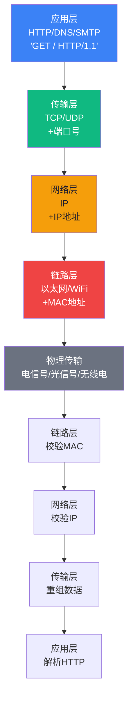
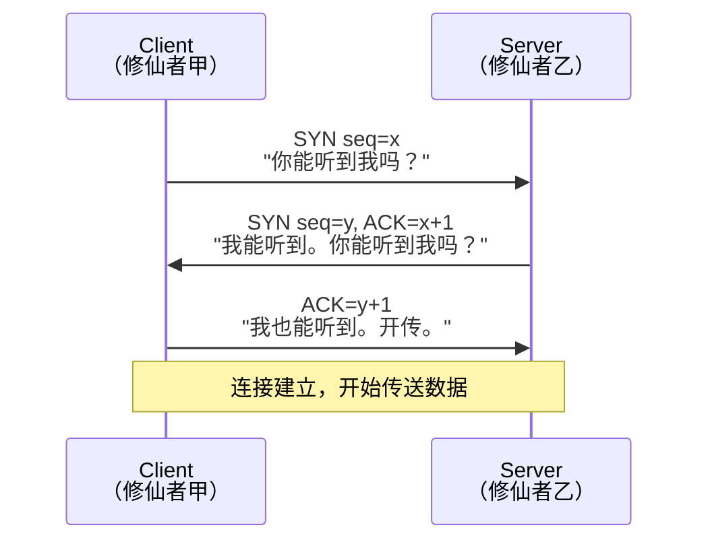
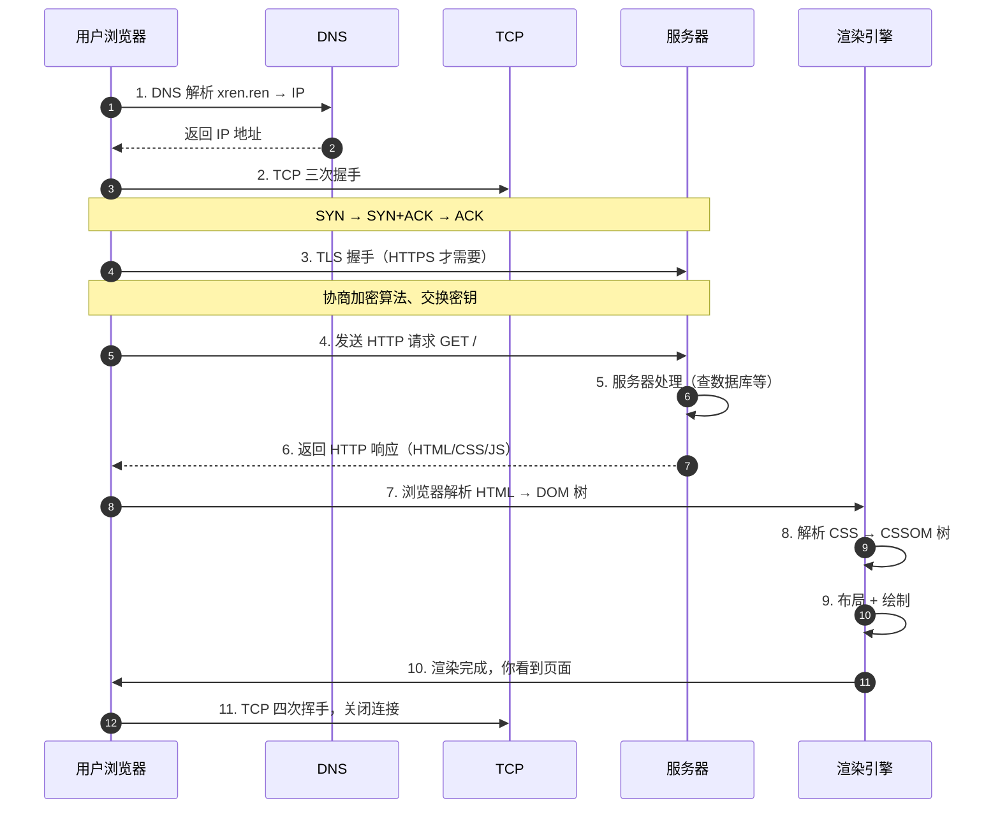

# 【筑基·08】网络是传送阵

> **码农修仙传 · 筑基期 · 第8篇**
> 我是玄芯散人，带你从炼气修到大乘。

---

## 境界标识

```
╔══════════════════════════════════╗
║     筑基期 · 第8篇               ║
║     网络是传送阵                  ║
║     预计阅读：12分钟              ║
╚══════════════════════════════════╝
```

---

## 修仙引入

你在浏览器输入 `xren.ren`，回车，0.3 秒后页面亮起。

这 0.3 秒里，你的电脑和千里之外的服务器完成了一次「传送」。

修仙世界里有传送阵——甲地阵法上灵力一催动，人就到了乙地。但传送从来不是瞬间完成的，它需要阵纹、坐标、灵气、驿站四样东西配合。网络就是计算机世界的传送阵，TCP/IP 就是阵纹，IP 是坐标，数据包是灵气，路由器是驿站。

今天讲清楚这套传送阵到底怎么工作——为什么输入一个网址就能看到页面，为什么「三次握手」是三次而不是两次，为什么 HTTPS 比 HTTP 安全。筑基四座地基最后一座：**计算机网络**。

---

## 硬核主体：传送阵的全套阵法

### 2.1 传送阵的四层结构——TCP/IP 模型

要修传送阵，先得懂阵法分层。

TCP/IP 模型把网络通信分成四层，每层各司其职，层层封装。修仙者可以把每一层理解为一道独立的法阵：

| 层级 | 修仙类比 | 技术现实 | 职责 |
|------|---------|---------|------|
| 应用层 | 传信内容（写什么信） | HTTP、DNS、SMTP | 定义传输的内容格式 |
| 传输层 | 传信方式（挂号/平信） | TCP、UDP | 决定可靠还是求快 |
| 网络层 | 传送路线（送到哪个城） | IP、路由协议 | 跨网络寻址和路径选择 |
| 链路层 | 实际搬运（驿站接力） | 以太网、WiFi | 物理层面的位传输 |

为什么要分层？因为分层才能解耦。应用层只想知道「我要发什么」，不关心「怎么送过去」；链路层只想知道「怎么把这一段送出去」，不关心「送给谁」。各管各的，互不干涉。

数据发送时是层层**封装**，接收时是层层**解封装**。你发一个「Hello」，实际传输是这样的：

```text
你发送 "Hello" →
  应用层：HTTP 报文 "GET / HTTP/1.1\r\n..."
  传输层：TCP 段 [源端口|目标端口|序号|"GET /..."]
  网络层：IP 包 [源IP|目标IP|TTL|TCP段]
  链路层：以太网帧 [源MAC|目标MAC|IP包|CRC]
  → 网线/WiFi 发出

对方接收 ←
  链路层剥掉 MAC 头 → 网络层剥掉 IP 头 →
  传输层剥掉 TCP 头 → 应用层拿到原始报文
```

每一层都套上了一层「信封」，信封上写着这一层需要的地址信息。四层信封全剥掉，里面就是你真正要传的内容。



这四层就像四道嵌套的法阵——你站在外面只看到外圈，但每一圈都有自己的阵纹和功能。修网络先把这四层搞清楚，后面所有协议都在这四层框架上长出来的。

---

### 2.2 TCP 三次握手——为什么是三次

TCP 是传输层最常用的协议，要用它传送数据前，得先和对方建立连接。建立连接的过程就是 TCP 三次握手。

为什么叫「三次」？因为要交换三个报文才能确认双方收发能力都没问题：

| 步骤 | 修仙类比 | TCP 报文 |
|------|---------|---------|
| 第一次 | 「你能听到我吗？」 | Client → SYN → Server |
| 第二次 | 「我能听到。你能听到我吗？」 | Server → SYN+ACK → Client |
| 第三次 | 「我也能听到。开传吧。」 | Client → ACK → Server |

看着像废话，但每次握手都有明确目的：

- 第一次：Client 发 SYN，问「你在线吗？我要和你建立连接」。
- 第二次：Server 回 SYN+ACK，说「我在。我也想和你建立连接」。
- 第三次：Client 回 ACK，说「好，连接建立」。



关键问题：为什么不是两次？

假设只用两次：Client 发「你能听到吗？」→ Server 回「能」→ 直接开始传数据。但这个「你能听到吗」可能是上次延迟到达的旧报文！网络环境复杂，IP 包可能走不同的路径，到达顺序完全没保证。

如果是旧报文，Client 早就想断开连接了，但 Server 还以为是新连接，回了「能」，就开始传送数据——结果 Client 根本没在接收，这数据就丢了。

第三次握手就是为了排除「历史报文」的干扰：Server 在收到第三次 ACK 之前，不进入「已连接」状态，不分配资源，不开始传数据。只有第三次 ACK 到达，Server 才确认「对方现在确实想和我连接」。

至于为什么不是四次——三次已经能同时确认「Client 能发、Server 能收、Server 能发、Client 能收」四个能力。四次纯属浪费灵气，没有额外信息。

实战经验：大厂的 TCP 三次握手相关面试题常考的不是背诵，而是「为什么」——为什么不是两次、为什么 TIME_WAIT 要等 2MSL、半连接队列是什么。这些「为什么」都跟修真世界的资源分配有关：连接是稀缺资源，不验证清楚就分配，资源很快耗尽，传送阵就废了。

---

### 2.3 DNS——域名解析就是查传送阵地址簿

传送阵只知道灵脉坐标（IP 地址），不知道宗门名字（域名）。但你只记得 `xren.ren`，不记得 `1.2.3.4` 这种 IP。

DNS（Domain Name System）就是传送阵地址簿——把宗门名字翻译成灵脉坐标。

查询过程是分层递进的：

1. **本地缓存**：先问本机的 DNS 缓存（之前查过的）——驿站记录本
2. **本地 DNS 服务器**：问运营商提供的 DNS——本地驿站长
3. **根 DNS**：问全球 13 组根 DNS——京城总驿
4. **顶级域 DNS**：根 DNS 告诉你「.ren 的事去问 .ren 顶级域」——.ren 省驿
5. **权威 DNS**：.ren 顶级域告诉你「xren.ren 的事去问 xren.ren 的权威 DNS」——xren 宗门驿
6. 拿到 IP：权威 DNS 返回 IP 地址，并被各级缓存下来


为什么这么麻烦？因为全球有几万亿个域名，不可能存在一个中心数据库。分层的好处是每层只管自己范围的事——根 DNS 不必知道所有域名，只知道顶级域在哪儿；顶级域不必知道所有主机，只知道权威 DNS 在哪儿。

缓存是性能的关键。有了缓存，第二次访问 `xren.ren` 时，本机 DNS 缓存直接返回 IP，整个查询过程不到 1 毫秒。这也是为什么改 DNS 记录要等几小时全球生效——各级缓存要逐步过期。

```python
# 用 Python 实际查一次 DNS（dig 工具的简化版）
import socket

def resolve_dns(domain):
    """域名解析：把宗门名翻译成灵脉坐标"""
    try:
        ip = socket.gethostbyname(domain)
        return f"{domain} 的灵脉坐标是 {ip}"
    except socket.gaierror:
        return f"查无此域名：{domain}"

# 试一下
print(resolve_dns("xren.ren"))  # 输出灵脉坐标
print(resolve_dns("github.com"))
```

---

### 2.4 HTTP——传信的格式和礼仪

DNS 把域名翻译成 IP，TCP 三次握手建立了可靠通道，现在终于可以传「信」了。HTTP 就是这封信的格式和礼仪。

HTTP 是**无状态协议**：服务器不会记住你上次来过。每次请求都是独立的，像每次传信都是新的一次，天道不记得上回说过什么。

那怎么保持登录状态？用 Cookie 和 Session。客户端登录后，服务器给你一个「身份令牌」（Session ID），存到 Cookie 里。下次请求带上这个令牌，服务器一看就知道「哦，是上次那个用户」。

HTTP 请求和响应的格式是这样的：

```http
# HTTP 请求 = 一封标准格式的信
GET /index.html HTTP/1.1     ← 请求方法 路径 协议版本
Host: xren.ren               ← 收信地址（域名）
User-Agent: Mozilla/5.0      ← 你是谁（浏览器身份）
Cookie: session=abc123       ← 身份令牌
Accept: text/html             ← 你能接收什么格式

# HTTP 响应 = 回信
HTTP/1.1 200 OK               ← 状态行：200 表示成功
Content-Type: text/html       ← 信的内容格式
Set-Cookie: session=xyz789    ← 给你一个新令牌
Content-Length: 12345          ← 信多长

<html>...</html>               ← 真正的内容
```

HTTP vs HTTPS：HTTPS = HTTP + TLS 加密层。HTTP 是明信片，路上谁都看得见；HTTPS 是火漆封口的密信，外人截获也看不懂。在修真世界里就是「传音 vs 加密传音」的区别——传音可能被截听，加密传音只有收信人能解密。

```python
# 用 Python 发起一个真实的 HTTP 请求
import urllib.request

def fetch_page(url):
    """传信：从传送阵另一端取回页面内容"""
    try:
        # urllib 默认会做 DNS 解析 + TCP 握手 + 发 HTTP 请求
        response = urllib.request.urlopen(url, timeout=5)
        status = response.status           # HTTP 状态码（200/404/500）
        content_type = response.headers.get('Content-Type')  # 内容类型
        body = response.read().decode('utf-8')  # 真正的内容
        return f"状态：{status}\n类型：{content_type}\n长度：{len(body)}"
    except Exception as e:
        return f"传信失败：{e}"

print(fetch_page("https://xren.ren"))
```

HTTP 状态码要记牢几个常用的：

- `200 OK`：成功
- `301/302`：重定向（信被转到别处了）
- `404 Not Found`：信没找到（路径错了）
- `500 Internal Server Error`：对方宗门出内乱了

---

### 2.5 从输入 URL 到页面渲染——传送阵全流程

现在把前面四节串起来。输入 `https://xren.ren` 回车后，0.3 秒里发生了什么：



每一步都可能成为性能瓶颈：

- DNS 慢：检查 `/etc/hosts` 配置、本地 DNS 缓存命中率
- TCP 慢：长连接复用（HTTP keep-alive）能省掉重复握手
- TLS 慢：TLS 1.3 比 TLS 1.2 快，Session Ticket 能恢复会话
- HTTP 慢：HTTP/2 多路复用、HTTP/3 基于 QUIC
- 服务器处理慢：数据库慢查询、应用代码逻辑
- 渲染慢：DOM 太深、JS 阻塞、CSS 选择器太复杂

实战心法：排查性能问题先看 Network 面板，定位到具体步骤再深挖。很多人以为「页面慢 = 服务器慢」，其实很多时候是前端渲染慢或者 DNS 配置错。

筑基期你不需要记住每个协议的所有字段，但要能在脑子里跑通这个完整链路。这是网络地基的核心：知道一次请求从哪儿出发、经过哪些驿站、怎么到达目的地。

---

## 修仙术语对照表

| 修仙术语 | 技术现实 | 本篇详解 |
|---------|---------|---------|
| 传送阵 | 网络协议族（TCP/IP 等） | 全篇主线 |
| 四层法阵 | TCP/IP 四层模型 | §2.1 |
| 四层信封 | 数据封装/解封装 | §2.1 |
| 传音通道 | TCP 连接 | §2.2 |
| 传音三次确认 | TCP 三次握手 | §2.2 |
| 历史报文干扰 | 网络中延迟到达的旧 SYN 包 | §2.2 |
| 传送阵地址簿 | DNS 域名解析系统 | §2.3 |
| 京城总驿/省驿/宗门驿 | 根 DNS / 顶级域 DNS / 权威 DNS | §2.3 |
| 传信格式 | HTTP 协议 | §2.4 |
| 身份令牌 | Cookie / Session | §2.4 |
| 火漆密信 | HTTPS（HTTP + TLS 加密） | §2.4 |
| 传信全流程 | 从 URL 输入到页面渲染 | §2.5 |
| 状态码 | HTTP Status Code（200/404/500） | §2.4 |

想查全系列术语？看 [术语词典](/glossary)。

---

## 突破条件

筑基第四座地基（计算机网络）筑成标准：

- [ ] 能画出 TCP/IP 四层模型，并说出每层职责
- [ ] 能解释 TCP 三次握手为什么不是两次（答：防历史报文干扰）
- [ ] 能描述 DNS 解析的完整流程（本地缓存 → 根 → 顶级域 → 权威）
- [ ] 知道 HTTP 请求/响应的基本格式（请求行/状态行、Header、Body）
- [ ] 能说清 Cookie / Session / Token 的区别和使用场景
- [ ] 能描述从输入 URL 到页面渲染的完整链路（至少 7 个步骤）

> 最后一条是关键。当你被问到「这个接口为什么慢」时，能从 DNS、TCP、TLS、HTTP、服务器处理、TCP 关闭六个层面逐一排查——恭喜，网络地基彻底筑成。

四座地基都筑完（数据结构与算法、操作系统、数据库、计算机网络），筑基圆满。下一篇进入**金丹期**——从「懂各部分原理」到「理解各部分怎么串起来」。

---

## 下期预告 + 互动

> 下一篇：【金丹·09】编译器对你代码做了什么——从源码到机器语言的「功法翻译」
>
> 你写的 `int x = 1 + 2`，CPU 不认识。CPU 只认识 0 和 1。
> 编译器怎么把人类语言翻译成机器语言？词法分析、语法分析、语义分析、中间代码、优化、目标代码生成——这是金丹期的入门必修。
>
> 编译过程就是修真世界的「功法翻译」——从功法典籍（高级语言）翻译成灵气运行的微操指令（机器码）。

现在问你：

> 🎮 修真考你：你能完整说出输入 `https://xren.ren` 后，浏览器做了什么吗？试试从 DNS 开始一步步写到页面渲染，评论区打卡，看谁的链路最完整。
>
> 💬 话题：你在面试/工作中遇到过哪些「网络相关」的问题？最让你懵的是哪道？比如「TIME_WAIT 为什么等 2MSL」「HTTPS 握手比 HTTP 慢多少」——评论区分享，一起拆招。
>
> 🔔 关注玄芯散人，修炼不迷路。下一篇带你看编译器怎么「翻译功法」。

> 我是玄芯散人，带你从炼气修到大乘。

---

*本文是「码农修仙传」系列第8篇。系列导航见 [xren.ren](https://xren.ren)*