# 【渡劫·28】修炼体系全景图

> **码农修仙传 · 渡劫期 · 第28篇**
> 我是玄芯散人，带你从炼气修到大乘。

---

## 境界标识

```
╔══════════════════════════════════╗
║     渡劫期 · 第28篇               ║
║     修炼体系全景图                 ║
║     预计阅读：10分钟               ║
╚══════════════════════════════════╝
```

---

## 修仙引入

写到第28篇，你已经跟了我从"Hello World"走到了图灵机。

回头看，码农修仙传一共30篇，分六大境界，从炼气到大乘。这是整个系列的总纲——一张图、一张表，把你走过的路、正在走的路、即将走的路全部摆出来。

为什么第28篇才给全景图？因为渡劫期的视角本身就在"高处"。渡劫是什么？是修为到了极限要跨越的坎——是从"理解技术"到"重新定义技术"的认知跃迁。站在这个位置回头看，整个修炼体系才看得清楚。

今天这篇不教你新东西，但给你一张**永远不忘的修炼地图**。以后任何时候迷茫了，回来翻这张图——从凡人到飞升，一共就这六大境界。

---

## 硬核主体

### 一、六大境界是什么

码农修仙传把程序员的成长分成六个境界，对应六个认知层级：

| 境界 | 修仙定位 | 技术定位 | 一句话 |
|------|---------|---------|--------|
| 炼气期 | 引气入体 | 会写代码 | 第一次让电脑执行自己的指令 |
| 筑基期 | 内功初成 | 懂原理 | 从"能跑"到"知道为什么能跑" |
| 金丹期 | 道心通明 | 系统级理解 | 能讲清技术方案的"为什么" |
| 元婴期 | 神识外放 | 穿透到硬件 | 从软件追到晶体管翻转 |
| 化神期 | 自创天地 | 创造技术 | 能设计语言、操作系统、框架 |
| 渡劫/大乘 | 飞升成道 | 改变行业 | 定义计算的本质、定义行业方向 |

**核心递进逻辑**：每一级不是"会更多技能"，是"看到的东西不一样"。

- 炼气期看到的是**代码**
- 筑基期看到的是**原理**（数据结构、算法、OS、网络、数据库）
- 金丹期看到的是**系统**（编译原理、内核、体系结构）
- 元婴期看到的是**硬件**（指令集、CPU微架构、驱动）
- 化神期看到的是**规则**（语言设计、操作系统设计、框架设计）
- 渡劫期看到的是**本质**（什么是计算、什么是可计算、计算边界在哪）

这就是为什么很多工作十年的程序员还在"炼气"——他不是不努力，是他的**认知层级**没上去，技能再多也只是"会更多炼气期的招式"。

---

### 二、修炼主路线图

一张图看完从凡人到飞升的完整路径：

```mermaid
flowchart TD
    Start([🧑 凡人<br/>只会用App]):::fanji
    Start -->|写第一个print| L1

    subgraph L1_3["🔥 炼气期 · 01-03"]
        L1[炼气初期<br/>会变量print]:::lianqi1
        L2[炼气中期<br/>会循环函数]:::lianqi2
        L3[炼气后期<br/>会小项目]:::lianqi3
        L1 --> L2 --> L3
    end

    subgraph L4_8["🏗️ 筑基期 · 04-08"]
        L4[筑基初期<br/>懂数据结构算法]:::zhuji1
        L5[筑基中期<br/>懂OS/数据库/网络]:::zhuji2
        L6[筑基后期<br/>懂全栈原理]:::zhuji3
        L4 --> L5 --> L6
    end

    subgraph L9_14["💎 金丹期 · 09-14"]
        L7[金丹初期<br/>懂编译原理]:::jindan1
        L8[金丹中期<br/>懂OS内核]:::jindan2
        L9[金丹后期<br/>懂系统架构]:::jindan3
        L7 --> L8 --> L9
    end

    subgraph L15_20["👶 元婴期 · 15-20"]
        L10[元婴初期<br/>懂指令集]:::yuanying1
        L11[元婴中期<br/>懂CPU微架构]:::yuanying2
        L12[元婴后期<br/>懂驱动开发]:::yuanying3
        L10 --> L11 --> L12
    end

    subgraph L21_25["🌟 化神期 · 21-25"]
        L13[化神初期<br/>会造编程语言]:::huashen1
        L14[化神中期<br/>会造操作系统]:::huashen2
        L15[化神后期<br/>会造框架]:::huashen3
        L13 --> L14 --> L15
    end

    subgraph L26_30["⚡ 渡劫/大乘 · 26-30"]
        L16[渡劫初期<br/>懂冯诺依曼]:::dujie1
        L17[渡劫中期<br/>懂图灵机]:::dujie2
        L18[渡劫后期<br/>懂计算本质]:::dujie3
        L19([✨ 大乘<br/>改变行业]):::dacheng
        L16 --> L17 --> L18 --> L19
    end

    L3 -->|理解底层原理| L4
    L6 -->|理解系统串联| L7
    L9 -->|穿透软件抽象| L10
    L12 -->|从用到创造| L13
    L15 -->|重新定义规则| L16
    L18 -->|定义行业方向| L19

    classDef fanji fill:#6b7280,color:#fff,stroke:#374151,stroke-width:2px
    classDef lianqi1 fill:#fbbf24,color:#1a1a2e
    classDef lianqi2 fill:#fb923c,color:#fff
    classDef lianqi3 fill:#ef4444,color:#fff
    classDef zhuji1 fill:#93c5fd,color:#1a1a2e
    classDef zhuji2 fill:#60a5fa,color:#fff
    classDef zhuji3 fill:#3b82f6,color:#fff
    classDef jindan1 fill:#c4b5fd,color:#1a1a2e
    classDef jindan2 fill:#a78bfa,color:#fff
    classDef jindan3 fill:#8b5cf6,color:#fff
    classDef yuanying1 fill:#f9a8d4,color:#1a1a2e
    classDef yuanying2 fill:#f472b6,color:#fff
    classDef yuanying3 fill:#ec4899,color:#fff
    classDef huashen1 fill:#fde68a,color:#1a1a2e
    classDef huashen2 fill:#fbbf24,color:#1a1a2e
    classDef huashen3 fill:#f59e0b,color:#fff
    classDef dujie1 fill:#a5f3fc,color:#1a1a2e
    classDef dujie2 fill:#22d3ee,color:#1a1a2e
    classDef dujie3 fill:#06b6d4,color:#fff
    classDef dacheng fill:#fef3c7,color:#7c2d12,stroke:#dc2626,stroke-width:3px
```



**这张图怎么读**：

- **从下到上是六大境界**，每个境界有自己的色系
- **每个境界是一个 subgraph**，里面有3个阶段（初/中/后期），对应文章编号 01-30
- **箭头是突破条件**——从 L3 到 L4 是从炼气到筑基，要满足"理解底层原理"
- **大乘是终极目标**——图灵奖级别所在的位置

**视觉语言**：颜色的递进就是修为的递进。浅色是初期，深色是后期。从炼气（暖黄→橙红）→ 筑基（浅蓝→深蓝）→ 金丹（淡紫→深紫）→ 元婴（粉红→玫红）→ 化神（金黄→琥珀）→ 渡劫（青蓝→青色）→ **大乘（金色镶红边——终点的颜色）**。

---

### 三、每个境界的标志性判断题

每境界都有"低境界回答 vs 高境界回答"的区别。给你五个最经典的判断题，测你真实境界：

**判断一：写出第一个程序到能独立做项目，差距在哪？**

- 炼气期回答：多写多练就懂了
- 筑基期回答：从语法到工程——文件组织、模块拆分、版本管理、调试技巧
- 金丹期回答：从个人到系统——架构设计、可扩展性、可维护性、技术选型

**判断二：进程和线程的区别？**

- 炼气期回答：进程大，线程小
- 筑基期回答：进程是资源分配单位，线程是CPU调度单位；进程隔离，线程共享
- 金丹期回答：从内核调度器讲——PCB、TCB、上下文切换代价、线程池设计、协程的本质

**判断三：为什么TCP要三次握手？**

- 炼气期回答：保证连接可靠
- 筑基期回答：防止已失效的连接请求又传到服务器，造成错误
- 金丹期回答：从ISN序列号、SYN Flood攻击、半连接队列讲清楚

**判断四：CPU执行一行 `a = a + 1` 到底发生了什么？**

- 炼气期回答：变量加一
- 筑基期回答：从源码到机器码，CPU执行指令
- 金丹期回答：编译器优化、指令流水线、寄存器分配、Cache命中率、分支预测
- 元婴期回答：从晶体管翻转、ALU、寄存器堆、PC指针，讲到CPU微架构层面

**判断五：什么是可计算？**

- 炼气期回答：能用代码写的
- 筑基期回答：算法能在有限时间内解决问题的
- 金丹期回答：图灵可计算的——任何图灵机能在有限步内停机并给出结果的问题
- 渡劫期回答：可计算性有边界——停机问题不可判定、不可判定问题、计算复杂性理论

**这五个判断题，就是六大境界的阶梯**。你能答到哪一层，就在哪个境界。

---

### 四、渡劫期的位置——为什么第28篇是总纲

渡劫期在修仙体系里是"飞升前最后一道关"。对应到程序员，是"重新定义技术规则、定义行业方向"的层级——比如图灵定义了"什么是可计算"，冯·诺依曼定义了"现代计算机的架构"，Dijkstra定义了"结构化编程"，Knuth定义了"算法分析"。

**渡劫期的特征**：

- 不再关心"具体技术"，关心"技术的本质"
- 不再解决"业务问题"，思考"行业问题"
- 不再使用"已有规则"，定义"新规则"

**修真界有几位真实人物已经飞升**。**图灵** 在 1936 年那篇划时代论文里定义了"什么是可计算"——他不是在写代码，是在定义代码的边界。**冯·诺依曼** 在 1945 年的 EDVAC 报告中规定了"程序存储、顺序执行"的现代计算机骨架，至今我们用的每一台电脑都跑在他的框架里。**Dennis Ritchie** 在贝尔实验室觉得汇编太低效，从零造了 C 语言，又和 Ken Thompson 一起造了 Unix——这是从"用工具"到"造工具"的化神级飞跃。**Dijkstra** 提出"goto 有害论"，用一篇短文重新定义了"什么是好的代码"，奠定了结构化编程的根基——这不是写代码，是在重新定义规则。

每一个飞升者，都不是"会更多技能"，是"看到了别人看不到的维度"。这就是渡劫期的本质：**视野的跃迁**。

**为什么第28篇是全景图而不是某个新知识点？**

因为渡劫期的视角本身就是"全"。当你站在山顶，所有走过的路都在脚下——炼气期的 Hello World、筑基期的四座地基、金丹期的系统串联、元婴期的硬件穿透、化神期的造物能力——都是你渡劫的工具。

第28篇给你的是**全局视角**：你现在走的路在哪、前面还有什么路、每段路的判断标准是什么。读完整篇，你应该能在脑中画出从"凡人"到"大乘"的完整地图，然后知道自己在哪、要去哪、怎么去。

---

### 五、用代码看一眼整条修炼路径

如果把六大境界写成一段代码，它就是这样的——每一境界是一个函数，函数之间的 return 就是突破条件：

```python
# 六大境界的代码化表达 —— 你现在在哪一层？

def lianqi():     # 炼气期
    return "会写 Hello World"

def zhuji():      # 筑基期
    return "懂数据结构、算法、OS、数据库、网络"

def jindan():     # 金丹期
    return "懂编译、内核、体系结构，能做系统级判断"

def yuanying():   # 元婴期
    return "从代码追到晶体管，能在软硬件之间切换"

def huashen():    # 化神期
    return "造过语言、操作系统或框架"

def dujie():      # 渡劫期
    return "重新定义计算边界 —— 图灵奖级别"

# 你的修炼路径，就是依次实现这些函数
# 当前修为 = max([已实现且理解深刻的境界])
your_realm = lianqi()  # 大多数人在这里
# 目标：next_realm(your_realm) -> zhuji() -> ... -> dujie()
```

注意最后一行——**修真没有跳过键**。你不可能跳过筑基直达金丹。每个境界都要实打实地修，"理解"和"以为理解"是两回事。能独立写出上面的六个函数，并且每个函数都对应着扎实的实战和认知，才算真正走完了这条路。

---

## 修仙术语对照表

| 修仙概念 | 技术现实 | 一句话解释 |
|---------|---------|-----------|
| 灵气 | 代码 | 程序员的根本能量，驱动一切修炼 |
| 功法 | 编程语言 | 不同修炼路线（C/Python/Java/Go/Rust） |
| 灵根 | 入门语言选择 | 木灵根=Python、金灵根=C、火灵根=JS |
| 法器 | 数据结构 | 程序操作数据的工具（数组、链表、树、图、哈希） |
| 招式 | 算法 | 解决问题的具体方法（排序、查找、DP、贪心） |
| 筑基丹 | 学习资源 | 经典教材与课程（CSAPP、OSTEP、算法导论） |
| 天道规则 | 操作系统内核 | 所有程序运行的基本法则（进程、内存、IO、调度） |
| 传送阵 | 计算机网络 | 连接不同系统的通道（TCP/IP、HTTP、DNS） |
| 天地法则 | CPU指令集 | 硬件执行指令的底层规则（x86/ARM/RISC-V） |
| 灵脉 | 总线与接口 | 数据流通的物理通道（PCIe、USB、DDR） |
| 宗门 | 开源社区 | Linux社区、Apache、Python社区、React生态 |
| 秘境 | 源码精读 | 内核源码、RFC、协议实现 |
| 走火入魔 | 选型失误 | 架构设计错误、技术债累积 |
| 心魔 | 不懂原理滥用框架 | 表面能跑，底层不稳 |
| 渡劫 | 认知跃迁 | 从会用到理解到创造到定义 |
| 飞升 | 改变行业 | 图灵奖级别，重新定义技术边界 |

---

## 突破条件

渡劫期 → 大乘的突破，看的不是工作年限，看这五条：

- [ ] 能从"代码"穿透到"硬件"，再从"硬件"穿透到"计算本质"
- [ ] 对至少一个技术领域有"造物"能力（造语言、造系统、造框架、造理论）
- [ ] 能定义"什么是好的技术方案"，而不是只评价"哪个技术方案好"
- [ ] 开始思考"计算的边界"、"技术的边界"、"工程的边界"等元问题
- [ ] 有持续十年的深度积累，对某个方向的研究深度超过99%的同行

> 大乘不是终点，是新起点。飞升之后，开宗立派——把修炼心得写成典籍、开山收徒，让后来者少走弯路。这正是码农修仙传系列在做的事。

五条全勾，就是真正的大乘——也是图灵奖、Dijkstra奖、ACM Fellow 所在的位置。

---

## 下期预告 + 互动

> **下一篇：【渡劫·29】计算机科学的终极之问**
>
> 第29篇探讨计算的根本边界：什么是可计算的、什么是不可计算的、停机问题为什么不可判定、计算的极限在哪里。
> 这是渡劫期的最后一道关——跨过去就是大乘。

现在问你：

> 🗺️ **境界自测**：读完这篇，你觉得自己在哪？对照上面的判断题，你能答到哪一层？
>
> 💬 **路线规划**：你现在卡在哪个境界？评论区报上"境界+卡点"，我帮你看看下一步怎么走。
>
> 🔔 **关注玄芯散人，修炼不迷路**。第29篇带你看计算机科学的终极边界。

> 我是玄芯散人，带你从炼气修到大乘。

---

*本文是「码农修仙传」系列第28篇。系列导航见 [xren.ren](https://xren.ren)*