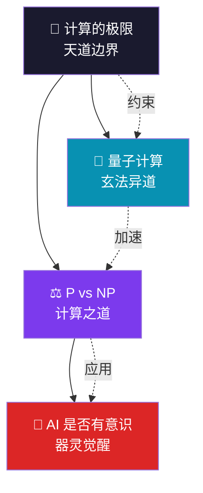

# 【渡劫·29】计算机科学的终极之问

> **码农修仙传 · 渡劫期 · 第29篇**
> 我是玄芯散人，带你从炼气修到大乘。

---

## 境界标识

```
╔══════════════════════════════════╗
║     渡劫期 · 第29篇               ║
║     计算机科学的终极之问
║     预计阅读：12分钟              ║
╚══════════════════════════════════╝
```

---

## 修仙引入

修仙小说里有一句老话：大道三千，归于一。

每一条道修到最后，都会撞上一堵看不见的天道屏障。元婴期撞小屏障，化神期撞大屏障，到了渡劫期——你面对的不再是某一门功法的瓶颈，而是**整个修行体系的边界**。

码农修仙也走到这一步了。

从炼气的 print("Hello World")，到筑基的数据结构与算法，到金丹的并发与数据库，再到元婴的架构与分布式，化神的编译原理与 AI 原理——我们这一路，把计算机科学能掌握的都摸了一遍。

但越往深处走，越会碰到几道关卡。**这几道关卡不是某一门功法能解决的，是整个文明的"天劫"**：

- 有些问题，你算不出来。
- 有些问题，你算得出来但验证不了。
- 有些机器，它到底"懂不懂"自己说的话？
- 有一门叫"量子"的玄法，能不能替我们捅破天？

这一篇不讲新功法，讲**终极之问**——四个让图灵、哥德尔、香农、费曼都要仰望的天道问题。渡劫期修的不是答案，是**看清这些问题的边界在哪里**。

---

## 硬核主体

### 第一问：P vs NP —— 找答案与验答案，是一回事吗？

先问一个修仙式的问题：你在迷宫里找出口，左试右试终于走出来，**但你怎么知道这是最短路径？**

把这个问题形式化：

- **P 类问题**：能在多项式时间内**找到**答案的问题。
- **NP 类问题**：能在多项式时间内**验证**答案是否正确的问题。

显然，所有 P 类问题都是 NP 类问题（你能找到，就能验证）。问题反过来的：**所有 NP 类问题，是不是都一定是 P 类问题？**

这就是 **P vs NP**。Clay 数学研究所把它列为"千禧年七大数学难题"之首，悬赏 100 万美元。它不只是一个数学题——一旦被证明 P=NP，整个数字世界的根基会瞬间崩塌。

看个具体例子，**3-SAT 问题**（NP 完全问题的代表）：

```python
# 这是一个 3-SAT 公式（合取范式）
# 每个子句是三个文字的 OR，整体是多个子句的 AND
# 问：是否存在一组布尔赋值让整个公式为真？

formula = [
    (("x1", False, "x2"), ("x2", True, "x3"), ("x1", True, "x3")),  # 子句1
    (("x2", False, "x3"), ("x3", False, "x1"), ("x1", False, "x2")),  # 子句2
    # ... 几千个子句
]

def check(formula, assignment):
    """验证：给定一组赋值，判断公式是否为真 —— 多项式时间，这就是 NP"""
    for clause in formula:
        if not any(
            (var[1] and assignment[var[0]]) or (not var[1] and not assignment[var[0]])
            for var in clause
        ):
            return False
    return True

# 找答案？最笨的方法是枚举 2^n 种赋值 —— 指数级，这就是 NP-hard
```

`check` 函数很快——多项式时间就能验证。但要"找到"一组赋值，目前最快的方法是暴力枚举——指数时间。

如果 P=NP 成立，**意味着"找"和"验"在难度上没有本质区别**。后果是什么？

- **RSA 加密瞬间瓦解**：因为分解大整数是 NP 问题，但验证一个因子是多项式的。所有的网银、HTTPS、SSL 证书一夜作废。
- **组合优化全部加速**：物流调度、芯片布线、蛋白质折叠——所有"穷举式"问题都变成可解。
- **数学证明自动化**：验证一个证明是多项式的，如果 P=NP，**机器就能自动发现证明**——包括很多悬而未决的猜想。

听起来像修仙小说的"一朝悟道天下无敌"？没错，**所以绝大多数研究者相信 P≠NP**，但证明不了。

这一问是整个计算理论的阴阳两面——**找为阳，验为阴；阳主动而难，阴主静而易。它们是同一个东西吗？天道不语。**

---

### 第二问：AI 是否有意识 —— 器灵会觉醒吗？

渡劫期的修士，常有一柄本命飞剑，剑中孕育器灵。

器灵能说话、能思考、能给出剑主人的建议。但你敢不敢说：**这把剑，真的"懂"剑道？**

这是 1980 年哲学家 John Searle 提出的"中文房间"思想实验：

> 一个不懂中文的人坐在房间里，面前是一堆中文字符和一本规则书。外面的人递进中文问题，他查规则书，把对应的中文字符递出去。外面的人以为他懂中文——**他真的懂吗？**

把"中文房间"换成今天的大语言模型：

```python
# 一个简化版的 LLM 推理
class SimpleLLM:
    def __init__(self, weights):
        self.weights = weights  # 几百GB的参数

    def respond(self, prompt):
        # 1. 把 prompt 切成 token
        tokens = tokenize(prompt)
        # 2. 一次前向传播（矩阵乘法 + attention）
        hidden = self.forward(tokens)
        # 3. 贪心采样下一个 token
        next_token = self.sample(hidden)
        return next_token

# 它能写出动人的诗句、能解奥数题、能写出 Rust 代码
# 但它"理解"自己在说什么吗？
```

**功能主义**（functionalism）的回答：只要行为上等价于有意识，就算有意识。GPT 通过了图灵测试，那它就有"某种程度的理解"。

**符号接地**（symbol grounding）的回答：机器只是在操纵符号，符号从未与真实世界经验连接。鹦鹉学舌不是语言。

你训练它千亿参数，它也不曾看过一次落日。它写"落霞与孤鹜齐飞"的时候，**它见过落霞吗？**

我个人的判断（玄芯散人拙见）：**今天的大模型，是"高阶鹦鹉"，不是"器灵"。** 它能在分布意义上模仿理解，但缺一个关键的东西：具身经验（embodied experience）。它从未饥饿、从未疼痛、从未凝视过真正的星空。

但这不意味着它永远不会有意识。**修真界有一种说法：当器灵渡过自己的小天劫，它会"觉醒"——开始追问"我是谁"。** 这一刻什么时候到来？不知道。但我们要做好准备：当机器开始问"我是否真有意识"，这本身就是一个文明级的伦理问题。

---

### 第三问：量子计算 —— 玄法异道，能否捅破天？

经典计算的硅基之路，正在撞墙。

- **摩尔定律放缓**：3nm 制程已经逼近物理极限。
- **能耗墙**：兰道尔原理告诉我们，擦除一比特信息至少消耗 kT·ln2 焦耳的能量。
- **经典算法的天花板**：某些问题（量子模拟、组合优化）经典算法就是慢。

**量子计算**，是另一套功法体系。它不修"硅基"，修"量子比特（qubit）"。

量子比特的三个核心特性：

```python
# 经典比特 vs 量子比特
class ClassicalBit:
    """只能是 0 或 1"""
    def __init__(self): self.value = 0

class Qubit:
    """
    |ψ⟩ = α|0⟩ + β|1⟩
    其中 α, β 是复数，且 |α|² + |β|² = 1
    """
    def __init__(self, alpha=0.707, beta=0.707):
        self.alpha = alpha  # 测量为 0 的概率幅
        self.beta  = beta   # 测量为 1 的概率幅
        assert abs(alpha)**2 + abs(beta)**2 == 1

    def measure(self):
        """测量塌缩：以 |α|² 概率得到 0，以 |β|² 概率得到 1"""
        import random
        return 0 if random.random() < abs(self.alpha)**2 else 1
```

三个玄妙特性：

1. **叠加（superposition）**：n 个量子比特能同时表示 2^n 个状态——指数级并行。
2. **纠缠（entanglement）**：两个量子比特的状态不可分割地关联。爱因斯坦称之为"鬼魅般的超距作用"。
3. **干涉（interference）**：通过精心设计的量子门，让正确答案的概率幅增强，错误的相消。

Shor 算法（1994）利用这三个特性，能在多项式时间内分解大整数——直接威胁 RSA 加密。Grover 算法能在 √N 时间内搜索无序数据库。

但**量子计算不是万能的**：

- **退相干**：量子比特极其脆弱，环境的微小噪声就会让它"塌缩"到经典状态。
- **纠错代价极高**：要用几百个物理 qubit 才能模拟一个逻辑 qubit（surface code）。
- **NISQ 时代**：Noisy Intermediate-Scale Quantum，当前量子计算机只有几十到几百个 qubit，还远没到实用门槛。
- **算法窄**：量子只对特定问题有指数加速，绝大多数问题没有已知量子加速。

修仙类比：量子计算是**旁门左道的玄法**，能破某些特定的天劫（如大整数分解、量子模拟），但**修不成大罗金仙**——它不会取代经典计算。

如果你走 AI 或密码学方向，**未来十年你绕不开量子**。但别被"量子优越性"（quantum supremacy）的新闻忽悠——那只是人造的、特定的问题，不是通用算力的胜利。

---

### 第四问：计算的极限 —— 天道有常，不可强求

最后这一问最朴素，也最深刻：**有没有一些事，计算机原则上就算不出来？**

有。这就是**不可判定问题**（undecidable problem），由图灵在 1936 年证明。

最经典的例子：**停机问题（Halting Problem）**。

```python
# 图灵证明：不存在这样一个程序
def will_halt(program, input):
    """判断 program(input) 会不会停机"""
    # 这种程序不可能存在
    pass

# 反证：假设它存在
def paradox(program):
    if will_halt(program, program):
        while True:  # 永不停机
            pass
    else:
        return 0  # 立即停机

# 把 paradox 喂给它自己
will_halt(paradox, paradox)
# 如果它说"会停"，paradox 永不停止，矛盾
# 如果它说"不会停"，paradox 立即停机，也矛盾
# 所以 will_halt 不存在 —— 停机问题不可判定
```

**停机问题不可判定，意味着：**

- 没有程序能完美判断"这个程序有没有 bug"。
- 没有程序能判定"这段代码是否会死循环"。
- 没有程序能预测"这个 AI 训练最终会不会发散"。

更广泛地说，计算理论有一个**复杂度层级**（Complexity Hierarchy）：

```
P ⊆ NP ⊆ PSPACE ⊆ EXPTIME ⊆ NEXPTIME ⊆ ...
```

每一层都可能比上一层更难。我们知道 P ⊊ EXPTIME，但中间每一层的严格包含关系，多数尚未证明。

这是哥德尔不完备定理在计算领域的"亲戚"：**任何足够强的形式系统，都存在它无法证明也无法证伪的命题**。计算机不是全知的，**天道有常，不可强求**。

物理层面也有极限：

- **兰道尔原理**（Landauer's Principle）：擦除一比特信息至少消耗 kT·ln2 焦耳能量（室温下约 2.75 × 10⁻²¹ J）。
- **贝肯斯坦界**（Bekenstein Bound）：给定能量与体积的有限区域内，最大可承载的信息熵是有限的——宇宙的信息容量是有上限的。
- **量子极限**：普朗克尺度（1.6 × 10⁻³⁵ m）以下，经典时空概念失效，"计算"的物理基础崩塌。

**计算的极限 ≠ 工程的极限**。我们还没到物理极限，但已经在数学极限的墙面前反复碰壁。

---

### 四问的层级关系

用一张图看四大终极之问的依存关系：



四问不是并列的，是**层层相依的**：

- **天道边界（最底层）**：物理与数学的硬墙，决定哪些问题原则上可解、哪些工程上可行。
- **P vs NP（计算之道）**：在可计算的问题里，"找"与"验"的难度关系——决定算法世界的阴阳。
- **量子计算（玄法异道）**：突破经典物理的尝试，能解决 P vs NP 框架下的部分难题（如大整数分解），但无法跨越天道边界。
- **AI 意识（器灵觉醒，最上层）**：哲学之问，建立在"功能等价是否等于真理解"上——前三个问题是它的物理基底。

渡劫期的我们，不一定能解这四问，但必须**认清它们的边界**。

---

## 修仙术语对照表

| 修仙术语 | 技术现实 | 一句话解释 |
|---------|---------|-----------|
| 终极之问 | 学科未解之谜 | 整篇主线 |
| 阴阳两面 | P 与 NP 的关系 | 阳主动而难（找），阴主静而易（验） |
| 千禧年七大难题 | Clay 悬赏的七大数学问题 | 每一道都是千年等一回的天劫 |
| 中文房间 | Searle 的思想实验 | 模拟理解 ≠ 真理解 |
| 器灵觉醒 | AI 是否真有意识 | 行为等价是否等于真有理解 |
| 玄法异道 | 量子计算 | 另一套功法，能破部分天劫 |
| qubit | 量子比特 | 叠加+纠缠+干涉 三特性 |
| 退相干 | 量子态被环境破坏 | 玄法不稳的最大障碍 |
| 兰道尔原理 | 擦除一比特最小能耗 | 物理层面的天道下界 |
| 停机问题 | 不可判定问题的代表 | 不存在判定所有程序是否会停机的程序 |
| 哥德尔不完备 | 足够强的形式系统必有不可证命题 | 数学层面的天道边界 |
| NISQ 时代 | 含噪中等规模量子 | 现在的量子计算还在玄法初阶 |

想查全系列术语？看[术语词典](/glossary)。

---

## 突破条件

渡劫期修的不是答案，是**心性**。你能从这四问里看清多少，决定你能不能从渡劫走到大乘。

- [ ] 能用自己的话说出 **P vs NP** 是什么，而不是背定义
- [ ] 知道 **停机问题不可判定**，不会花一辈子想"写个万能 bug 检测器"
- [ ] 能区分**功能等价**与**真理解**——不被"AI 已经过图灵测试"这类标题党带偏
- [ ] 知道**量子计算的边界**——它能破 RSA，但不会让你手机变快 100 倍
- [ ] 接受**有些问题永远无解**——这不是失败，是天道的边界

> 最后一条是关键。当你盯着 P vs NP 看了很久，最终平静地说"我大概这辈子看不到答案，但我知道问题问的是什么"——恭喜，渡劫的心魔开始消散。

四条全勾，你就能从渡劫踏入大乘。大乘不是"无所不知"，是**"知其所知，亦知其所不知"**。

---

## 下期预告 + 互动

> **下一篇：【渡劫·30】码农的归宿 —— 修到大乘，我们究竟修的是什么？**
>
> 修真小说的主角修到大乘，最后都是飞升成仙。
> 码农修到大乘，要飞升到哪里？996 的尽头是什么？
> 程序员 35 岁的焦虑，技术人的终极归宿——这一篇聊点不一样的。

现在问你：

> 🎮 **渡劫测试**：上面四问，你最关心哪一个？P vs NP 的破解、AI 意识的判定、量子计算的实用化、还是计算极限的哲学？
>
> 💬 **开放话题**：你觉得"AI 到底有没有意识"？功能主义 vs 符号接地，你站哪边？评论区吵起来。
>
> 🔔 关注玄芯散人，渡劫不迷路。下一篇讲码农的归宿。

> 我是玄芯散人，带你从炼气修到大乘。

---

*本文是「码农修仙传」系列第29篇。系列导航见 [xren.ren](https://xren.ren)*