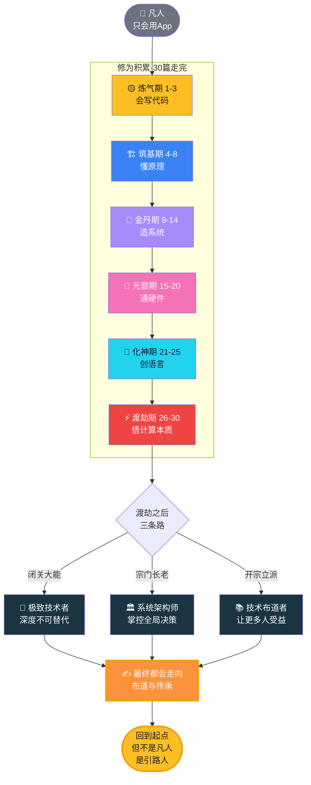

# 【渡劫·30】码农修仙者的归宿

> **码农修仙传 · 渡劫期 · 第30篇**
> 我是玄芯散人，带你从炼气修到大乘。

---

## 境界标识

```
╔══════════════════════════════════╗
║     渡劫期 · 第30篇（系列收官）   ║
║     码农修仙者的归宿              ║
║     预计阅读：15分钟              ║
╚══════════════════════════════════╝
```

---

## 修仙引入

写完第29篇，我坐在书房里想了很久。

三十篇。从炼气期的 `print("Hello World")` 一路写到渡劫期的图灵机、冯诺依曼、计算机科学的终极之问。回头看，这是一个程序员从"会写代码"到"理解计算机本质"的完整旅程。

但旅程的尽头不是某个更高的境界。

**修仙小说的结尾，几乎所有大能最终都选择飞升或传道——把毕生所学传给后人，而不是继续追求更强的法术。**

码农修仙也是。

炼气期你追求"我会写代码"，筑基期你追求"我懂原理"，金丹期你追求"我能造系统"，元婴期你追求"我能直接和硬件对话"，渡劫期你追求"我看透了计算的边界"。每突破一重境界，都以为下一境界就是终点。

等你真的修到大乘，回头看——**真正的归宿，从来不是更深的修为。**

是让更多人能修上来。

这一篇，是整个系列的收官。讲清楚：码农修仙者的三条归宿路线、每条路要修到什么才算圆满、以及为什么说"布道"才是修仙的真正归宿。

---

## 硬核主体

### 三种归宿——技术、架构、布道

渡劫之后，码农修仙者的路其实只剩三条。不是继续突破，是选择方向。

我用修仙术语给它们命名，再对应到现实：

| 归宿 | 修仙类比 | 技术现实 | 一句话定义 |
|------|---------|---------|-----------|
| **极致技术者** | 闭关大能 | Kernel Hacker、AI 研究员、性能优化专家 | 在某一极深领域修到不可替代 |
| **系统架构师** | 宗门长老 | Tech Lead、Principal Engineer、CTO | 把控整个系统的方向与边界 |
| **技术布道者** | 开宗立派 | 写书、开源、写博客、办社区、做培训 | 把毕生修为传出去，让更多人受益 |

**注意：这不是三条并列的路，而是一条时间轴上的三段。**

大部分码农修仙者的归宿路径是：**先极致，再架构，最终走向布道。** 但顺序不绝对。有人一辈子停在"极致"，也很圆满。有人从架构转身布道，跳过了"极致"的某些深井。

我们一个一个拆开看。

---

### 第一种归宿：极致技术者——闭关大能

修仙小说里有一种角色，从不参与宗门纷争，躲在洞府里一修就是几百年。修到最后，他的某一门功法无人能敌——比如炼丹、比如阵法、比如剑道。

码农世界里的对应人物：**Kernel Hacker、AI 研究员、编译器作者、数据库内核工程师**。

这些人有个共同点：**他们写代码不为"功能"，为"突破极限"**。他们的代码往往不是给人用的，是给自己玩的——或者给世界上那几百个同行看的。

举几个真实的例子：

```c
// Linux 内核里的 RCU 读侧——极致技术者的"闭关功法"
// 这段代码在 Linux kernel/sched/rcutree.h 里
// 普通码农一辈子不会写，也不需要写
static inline void rcu_read_lock(void)
{
    __rcu_read_lock();       // 一条指令，禁止编译器重排序
    // 没有锁，没有原子操作，没有内存屏障
    // 极致优化：读侧零开销，并发性能拉满
}
```

这段代码没有任何业务逻辑。但写它的人，**对 CPU 缓存一致性协议（MESI）了如指掌，对内存屏障、对编译器乱序、对流水线停顿，都门清**。

这就是"极致技术者"的境界——**不为产品写代码，为计算本身写代码**。

**要修到什么程度才算圆满？**

- 在某一极深领域（比如编译器、数据库内核、分布式一致性、深度学习框架），你能独立设计并实现关键模块
- 你能读懂这个领域最难的源码（比如 Linux kernel、PostgreSQL、PyTorch 内核）
- 你在这个领域有一两个能拿出手的代表作（不一定是大项目，可以是一个 5000 行但极度精巧的实现）

**这条路的天花板最高，下限也最低。** 修不成很容易沦为"高不成低不就"——既不如普通工程师能干活，又不如顶尖大能有成果。

如果你选了这条路，**关键不是一直闭关，而是偶尔下山看看世间的需求**——否则你的极致，可能修错了方向。

---

### 第二种归宿：系统架构师——宗门长老

第二种归宿，是码农修仙界最常见的"成功路径"。

**系统架构师不是写最多代码的人，是做最多决策的人。**

他们的核心工作不是实现，是**判断**——这个功能该不该做？用什么方案做？用什么技术栈？系统的边界在哪里？哪些性能可以牺牲，哪些绝不能妥协？

来看一段架构师的核心产出——**不是代码，是决策文档**：

```python
# 架构决策记录（ADR）模板
# 架构师的"宗门议事录"

## 决策：订单系统从 MySQL 迁移到 TiDB
- 状态：已通过
- 日期：2025-08-17
- 决策人：玄芯散人（首席架构师）

## 背景
- 单表数据量已达 8 亿行
- 每日新增 3000 万行
- 现有 MySQL 分库分表方案运维成本极高

## 决策
- 迁移到 TiDB 5.x
- 保留 MySQL 用于强一致性场景（如资金）

## 后果
- 运维复杂度下降 60%
- 跨分片 JOIN 性能提升 5 倍
- 但 OLTP 场景延迟略增（+15ms）
- 团队需要 2 个月培训学习 TiDB

## 替代方案
- 继续 MySQL 分库分表：成本继续上升，否决
- 迁移到 PolarDB：生态绑定太深，否决
```

**架构师的修为体现在哪里？** 不是写多么精妙的代码，是在数十个方案里，挑出那个"两害相权取其轻"的方案。

这种修为怎么修？**靠的不是闭关，是广度。**

- 横向：要懂前端、后端、数据库、运维、安全、性能
- 纵向：要在至少一个领域（比如数据库或缓存）有深度
- 软实力：要懂业务、懂人、能写文档、能说服别人

**要修到什么程度才算圆满？**

- 能独立设计一个支撑千万级用户的系统架构
- 能用 5 分钟讲清楚一个复杂系统的核心权衡（不是细节，是权衡）
- 你的架构决策能让 100 个人照着实现，3 个月后系统稳定上线
- 你能识人用人——知道团队里谁擅长什么，该把哪块任务给谁

**这条路的天花板是 CTO、技术 VP、首席架构师。** 大部分 P7、P8、P9 的归宿，最终都是这条路。

---

### 第三种归宿：技术布道者——开宗立派

**这是码农修仙的真正归宿。**

为什么这么说？因为前两条路，都还是在"自己修"。第三条路，是"让别人也能修"。

技术布道者的形态很多：

- **写书**：《算法导论》作者 Cormen、《深入理解计算机系统》作者 Bryant、《设计数据密集型应用》作者 Kleppmann
- **开源**：Linus Torvalds（Linux）、Guido van Rossum（Python）、李柱（LVS）、尤雨溪（Vue.js）
- **写博客/做视频**：阮一峰、Linus Lee、左耳朵耗子（已故）
- **办社区/做培训**：CSDN、掘金、极客时间、各种技术大会的组织者
- **做教育**：大学教授、训练营讲师、企业内部导师

他们的共同特征：**他们的影响力不是来自技术本身，而是来自他们让别人学会技术的能力。**

Linus 写 Linux 内核是技术，但他写《Just for Fun》那本书、他在邮件列表里和全球开发者互怼的精神，是布道。Guido 写 Python 解释器是技术，但他维护 Python 社区、定义 Pythonic 的风格，是布道。

**布道不是降低技术深度，是换一种方式做技术。**

来看一段布道者的"核心功法"——**不是代码，是文档**：

```markdown
# 《码农修仙传》本身就是一个布道产物

## 它不是一份教程
- 它不会教你具体的库怎么用
- 它不会帮你解决具体的 bug

## 它是做什么的
- 把零散的编程知识点，串成一条完整的修仙路径
- 让你知道自己在哪、未来要修什么、为什么这么修
- 让"学编程"这件事，有了坐标系和方向感

## 它和传统教程的区别
- 传统教程：从 A 到 B 的最短路径（功能导向）
- 修仙传：从炼气到大乘的完整地图（成长导向）

## 它的价值
- 让你不再迷茫
- 让你有归属感
- 让你知道"我不是一个人在路上"
```

**这段文档没有任何代码，但它能影响的人，远比一段精妙的算法实现多。**

要修到什么程度才算圆满？

- 你能让 1000 个人因为你的内容少走 3 年弯路
- 你能让一个外行在读完你的书后，对这个领域有完整的认知地图
- 你的名字和一个领域绑定（比如 "Linus" 就等于 Linux，"Guido" 就等于 Python）
- 你能教出比自己更厉害的学生（这是布道者的最高境界——**超越自己的不是徒弟，而是徒弟的徒弟**）

**这条路的天花板不在技术圈，在教育圈、文化圈、人类文明的传承里。**

---

### 真正的归宿——回到起点

讲完了三种归宿，回头看一个反直觉的事实：

**渡劫期最后这一劫，不是雷劫，是心魔劫。**

心魔问：你修了三十年，写了无数代码，懂透了计算机的本质。**这一切，到底是为了什么？**

不是为了更强。强不是目的，强只是手段。

不是为了钱。钱买不到修为。

不是为了名。名会随时间消散。

**是为了——让下一个炼气期的小白，能少走三年弯路。**

我用一张图，把这个系列的整个旅程，和最终的归宿，画在一起：



**这张图是整个系列的灵魂。**

你看，三条路最终都汇到一个圆环——**布道与传承**。极致技术者老了要写回忆录，架构师老了要做导师，所有人都老了要把东西传下去。

这不是巧合，这是修仙体系的终极规律：

> **"薪尽，火传。"**

你自己烧完了不要紧，重要的是火种传下去了。

**这才是码农修仙者的真正归宿——不是飞升，不是无敌，是让下一个炼气期的小白，能从你写的内容里，找到他迷路时的方向。**

---

## 修仙术语对照表

| 修仙术语 | 技术现实 | 本篇详解 |
|---------|---------|---------|
| 闭关大能 | 极致技术者（Kernel Hacker/AI 研究员） | §第一种归宿 |
| 宗门长老 | 系统架构师（Tech Lead/CTO） | §第二种归宿 |
| 开宗立派 | 技术布道者（写书/开源/办社区） | §第三种归宿 |
| 心魔劫 | 对"为什么"的终极追问 | §真正的归宿 |
| 薪尽火传 | 知识与精神的传承 | §真正的归宿 |
| 飞升 | 超越技术本身，回归教育与文化 | §真正的归宿 |
| 引路人 | 布道者的本质角色 | §真正的归宿 |
| 宗门议事录 | 架构决策记录（ADR） | §第二种归宿 |

想查全系列术语？看[术语词典](/glossary)。

---

## 突破条件

渡劫期 → 大乘期（也是系列收官），不是看修为多深，看这五条：

- [ ] 看清自己的本质：**不是追求更强，是追求更懂**
- [ ] 接受一个事实：**你不是最强的，也不是最聪明的，但你可以是最会教的**
- [ ] 至少在一种"归宿"上迈出第一步——写一篇博客、做一次内部分享、贡献一个 PR、设计一个 ADR
- [ ] 想过"我修的这一切，最后留给谁"——这个问题想清楚，渡劫就过了
- [ ] 愿意回到"炼气期"的心态——**从零开始给小白讲起，不嫌简单，不嫌幼稚**

> 最后一条是整个系列的核心。当你修到大乘，还能蹲下来和一个刚 `print("Hello World")` 的小白，认认真真讲清楚"为什么这一步很重要"——**你就是真正的码农大能。**

---

## 系列收官 · 互动

**这是「码农修仙传」系列的最后一篇。**

三十篇。从炼气到大乘，从凡人到大能，从一个 `print` 到对计算机本质的追问。

我没有写第三十一篇，因为——**这个系列最好的归宿，是让你开始写你自己的系列。**

你是谁，你在修什么，你想传什么——只有你自己知道。

现在问你：

> 🎮 **归宿之问**：修到现在，你的归宿是哪一种？极致技术者？系统架构师？还是技术布道者？或者你想走一条我都没想到的路？评论区说出你的归宿。
>
> 💬 **传承之问**：你想留给下一个"炼气期小白"的最重要的一个经验是什么？一句话就行——它会成为别人的"第一行代码"。
>
> ✍️ **行动之问**：如果你要写一个自己的系列/写一本书/做一个开源项目，它会是什么？评论区写下你的构想——别担心不完美，**大乘期的作品，都从炼气期的小念头开始的**。

**这一篇是终点，也是起点。**

你修完这个系列不是结束，是新的开始——你会去修下一个领域、会遇到新的心魔、会开始布你自己的道。那是真正属于你的"修仙传"。

> 我是玄芯散人，带你从炼气修到大乘。
> 这条路我们一起走完了。接下来的路，你自己走。
> 但永远记得——
> **薪尽，火传。**

---

*本文是「码农修仙传」系列第30篇（终篇）。系列导航见 [xren.ren](https://xren.ren)*