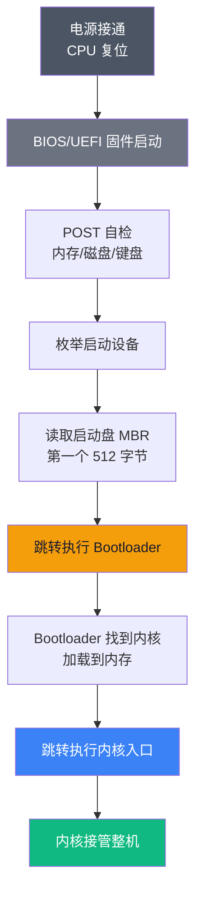
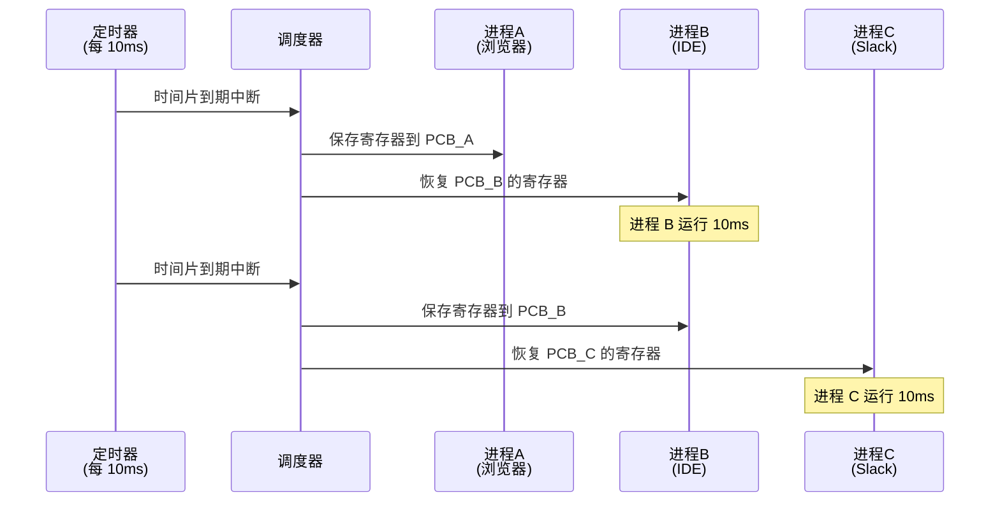
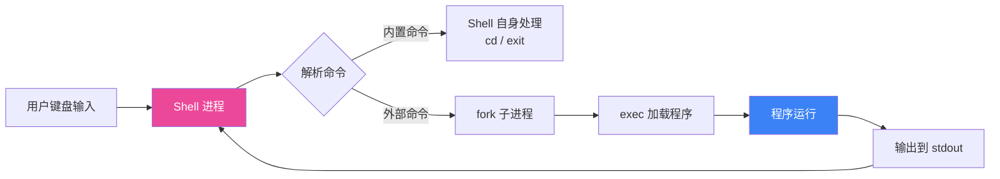

# 【化神·24】操作系统是怎么炼成的

> **码农修仙传 · 化神期 · 第24篇**
> 我是玄芯散人，带你从炼气修到大乘。

---

## 境界标识

```
╔══════════════════════════════════╗
║     化神期 · 第24篇               ║
║     操作系统是怎么炼成的          ║
║     预计阅读：15分钟              ║
╚══════════════════════════════════╝
```

---

## 修仙引入

你按下电源键。

不到一秒，屏幕亮起，UEFI 标志闪过，引导动画出现，登录界面等着你输入密码。这中间发生的事情比大多数人整个职业生涯写过的代码都多：BIOS 自检、引导扇区跳转、内核解压缩、设备枚举、中断控制器初始化、第一个用户进程拉起、显示服务启动……

前面 23 篇，我们一直站在"使用 OS"这一端——调 syscall、写多线程、读文件、起服务。但化神期要再往前走一步：**站到造物者的角度，看一个 OS 是怎么被"炼"出来的。**

打个比方。炼气期到元婴期，你从"住在宗门里"变成"理解宗门每一块砖怎么摆、每一道阵法怎么布"。但你仍然是使用者。化神期呢？你站在山巅，看着另一座宗门从无到有立起来——从打地基、起主殿、聚灵气、布阵法，到最后接纳弟子入门。

这就是 OS 工程的本质：不是写应用，是**造一个能运行应用的容器**。这一篇带你走完这条"造 OS"的最小路径：**Bootloader → 内核初始化 → 进程管理 → 内存管理 → 文件系统 → Shell**。这六块拼起来，就是一个能跑的最简 OS。

---

## 硬核主体

### 灵脉初启：Bootloader —— 通电到内核加载的那 0.1 秒

按下电源键后，CPU 跑的第一条指令并不是来自内核，而是固化在主板 ROM 里的 **BIOS** 或 **UEFI** 固件。它是先天之道，焊死在主板上，用户改不了。



关键节点是 **MBR（Master Boot Record）**——启动盘的第一个扇区，刚好 512 字节，最后两字节是魔数 `0x55AA`。BIOS 把这 512 字节加载到内存 `0x7C00`，然后跳过去执行。这段 512 字节，就是 **Bootloader**。

它要做的活只有一件：把真正的内核从硬盘搬到内存，然后把 CPU 交给内核。下面是一个最简的 x86 实模式 Bootloader：

```asm
; boot.asm —— 编译：nasm -f bin boot.asm -o boot.bin
; 写到一个空白 U 盘/磁盘镜像的第一个扇区

[bits 16]               ; 16 位实模式（CPU 通电的初始状态）
[org 0x7c00]            ; BIOS 把我们加载到内存 0x7C00 处

start:
    mov si, msg         ; SI 寄存器指向字符串
    call print          ; 调用下面的 print 子程序
    jmp $               ; 进入死循环，防止 CPU 跑飞

; --- 打印字符串子程序（BIOS teletype）---
print:
    lodsb               ; 从 [SI] 取一个字符到 AL，SI++
    or al, al           ; 测试是否为 0（字符串结束符）
    jz .done
    mov ah, 0x0E        ; BIOS 中断 0x10 的"输出字符"功能
    int 0x10            ; 触发 BIOS 中断（类似 syscall）
    jmp print
.done:
    ret

msg: db "Hello, OS!", 0

times 510 - ($ - $$) db 0   ; 填充到 510 字节
dw 0xAA55                   ; MBR 魔数（最后两字节，BIOS 据此识别这是引导扇区）
```

> 这 512 字节，藏着所有操作系统的种子。Linux、Windows、macOS 内核的"第一跳"，都是从这种级别的代码开始的。Linus 当年 1991 年写的 Linux 0.01，Bootloader 部分也是这个套路。

**修仙类比**：固件是天道（先天规则），Bootloader 是开宗祖师的第一缕神识。没有它，后面的内功都是空中楼阁。

---

### 开天辟地：内核初始化 —— 从 0 到 1 立规矩

Bootloader 把内核搬到内存后，真正的活才开始。内核初始化要做三件事：

1. **切换运行模式**（实模式 → 保护模式 → 长模式）
2. **建立中断体系**（GDT + IDT）
3. **初始化子系统**（内存、调度器、驱动）

x86 CPU 通电时是 16 位实模式，只能访问 1MB 内存。现代内核第一步就是把 CPU 切到 64 位长模式，下面是简化版的内核入口：

```c
// kernel/main.c —— 内核主入口
void kernel_main(void) {
    // 1. 加载 GDT（全局描述符表）—— CPU 段机制的"家规"
    gdt_load((uint64_t)&gdt_descriptor);

    // 2. 建立临时页表，启用分页
    paging_init();

    // 3. 切换到 64 位长模式
    enable_long_mode();

    // 4. 远跳转到 64 位入口
    jump_to_long_mode_entry();

    // 5. 初始化中断描述符表（IDT）
    idt_load((uint64_t)&idt_descriptor);
    idt_init();

    // 6. 初始化硬件抽象层（HAL）
    hal_init();          // 检测内存大小、初始化串口
    vga_init();          // 初始化 VGA 显示
    pit_init();          // 初始化可编程定时器（用于调度）

    // 7. 启动第一个用户进程
    kprint("OS booted. Welcome to %s\n", "xren.ren");
    shell_init();         // 拉起 Shell

    // 8. 让出 CPU，进入调度循环（这一行之后，永远不会再回来）
    schedule();
}
```

注意两个细节：

- `gdt_load`、`idt_load` 看着像函数，其实是**远跳转 + 加载段选择子**的内联汇编。
- `schedule()` 之后，内核的"主体代码"基本就跑完了。**剩下所有时间，都是调度器在轮转。**

**修仙类比**：内核初始化就是开宗立派——打地基（保护模式）、立家规（IDT）、招人手（子系统初始化）。做完这些，掌门就可以闭关了，让弟子们各司其职。

---

### 分身万千：进程管理 —— 让一台 CPU "同时"跑一千个程序

CPU 一次只能执行一个指令流。怎么让用户感觉"同时"跑着浏览器、IDE、Slack？

答案：**时间分片 + 上下文切换**。

进程（Process）= 程序代码 + 执行上下文（寄存器、PC、栈）+ 资源（内存、文件描述符）。内核用 **PCB（Process Control Block）** 记录这些：

```c
// include/process.h —— 进程控制块
typedef struct pcb {
    uint64_t pid;              // 进程 ID（道号）
    enum { READY, RUNNING, BLOCKED, ZOMBIE } state;  // 修炼状态
    uint64_t rsp;              // 当前栈指针（神识游走到哪）
    uint64_t cr3;              // 页表基址（灵气结界）
    struct pcb *next;          // 调度链表（队列中下一个）
    char name[32];             // 进程名（道号名称）
} PCB;

// kernel/sched.c —— 极简轮转调度器
PCB *current;                  // 当前正在运行的"值守弟子"
PCB ready_queue[64];           // 就绪队列
int current_idx = 0;

void schedule(void) {
    for (;;) {
        PCB *prev = current;
        PCB *next = ready_queue[(current_idx + 1) % 64];

        // 核心：上下文切换 —— 保存旧现场，加载新现场
        switch_to(prev, next);

        current = next;
        current_idx++;
    }
}

void switch_to(PCB *prev, PCB *next) {
    // 保存 prev 的所有寄存器到 prev->rsp 指向的栈
    // 加载 next 的栈到 CPU
    // 整个过程用内联汇编实现（约 20 行）
    __asm__ volatile (
        "pushq %%rbp\n"
        "movq %%rsp, %0\n"           // 保存 prev->rsp
        "movq %1, %%rsp\n"           // 加载 next->rsp
        "popq %%rbp\n"
        "jmp __switch_to_ret\n"
        : "=m"(prev->rsp)
        : "m"(next->rsp)
    );
}
```

经典问题：上下文切换要保存哪些寄存器？答案是**所有通用寄存器 + 段寄存器 + RIP + RFLAGS**。这就是为什么 Linux 的 `context_switch()` 是 Linux 内核最热的函数之一——一台繁忙服务器每秒切换上万次。



**修仙类比**：进程是宗门弟子，PCB 是弟子的**魂灯**（记录状态）。调度器就是掌门，每隔一段时间（约 10ms）切一次"值守弟子"，看上去像所有人同时在修炼，其实是轮流干活。

---

### 灵气分配：内存管理 —— 让每个进程都觉得自己有 64GB

如果每个进程都直接访问物理内存，会出现两个灾难：

1. **进程 A 误写进程 B 的内存**——稳定性崩盘
2. **进程看到的内存是零散的物理碎片**——写起来极难

解决方案：**虚拟内存**。每个进程都以为自己独享 0 ~ 2^64 的连续地址空间。CPU 通过 **MMU（内存管理单元）+ 页表**把虚拟地址翻译成物理地址，整个翻译过程对进程透明。

```c
// include/paging.h —— 分页机制
#define PAGE_SIZE 4096   // 一页 = 4KB

typedef uint64_t pte_t;  // 页表项（64 位）
typedef pte_t *pgtab_t;  // 页表（512 项）

// x86_64 四级页表：PML4 → PDPT → PD → PT → 物理页
pgtab_t kernel_pml4;  // 内核的顶级页表

void map_page(pgtab_t pml4, uint64_t vaddr, uint64_t paddr, uint64_t flags) {
    // 一级一级查页表，找不到就分配新页
    pte_t *pml4e = &pml4[(vaddr >> 39) & 0x1FF];
    if (!(*pml4e & PTE_P)) {
        *pml4e = (uint64_t)alloc_page() | PTE_P | PTE_U;
    }
    pgtab_t pdpt = (pgtab_t)(*pml4e & ~0xFFF);
    // ... 中间两级类似

    pte_t *pte = &pdpt[(vaddr >> 12) & 0x1FF];
    *pte = paddr | flags | PTE_P;  // 建立虚拟→物理的映射
}

// 用户进程视角 vs 实际物理内存
// 用户进程：0x00000000 - 0x00001000    → 物理 0x800000
//           0x00001000 - 0x00002000    → 物理 0x8CA000
// 进程看到的是连续的 0 - 4MB
// 物理上是离散的，碎片也无所谓
```

最关键的洞见：**虚拟内存是"骗局"，但骗局让所有人都过得好。** 操作系统对每个进程说："整个内存都是你的"，然后偷偷把实际物理页映射到这些虚拟地址上。进程不需要关心物理内存怎么摆，只需要按虚拟地址读写就行。

**修仙类比**：虚拟地址是**宗门令牌**，每个弟子凭令牌进入宗门的某个偏殿修炼，但偏殿是真实的物理空间，由宗门统一调度。弟子不需要知道偏殿在哪（碎片化无所谓），只需要拿令牌。

---

### 典籍收藏：文件系统 —— 把硬盘变成"文件树"

硬盘就是一堆扇区（512 字节/个），内核自己读没问题。但应用层只能看到 `/home/xuan/code.c` 这种"文件路径"——中间的翻译就是**文件系统（File System）**。

最简文件系统分五层：


**VFS（Virtual File System）** 是关键抽象——它对应用层提供统一的 `open/read/write/close` 接口，底层可以挂 ext4、FAT、NTFS、tmpfs 任何文件系统，应用完全无感。这就是经典的"接口稳定、实现可换"。

一个最简的 **RAMFS（基于内存的文件系统）**：

```c
// fs/ramfs.c —— 极简内存文件系统
typedef struct vnode {
    enum { V_FILE, V_DIR } type;
    char name[128];
    uint8_t *data;          // 文件内容（或目录项数组）
    size_t size;
    struct vnode *child;    // 目录用：第一个子节点
    struct vnode *sibling;  // 兄弟节点（链表）
} vnode_t;

vnode_t *root;  // 根目录 "/"

int ramfs_open(vnode_t *node, int flags) {
    return 0;  // 内存文件系统，"打开"是 no-op
}

ssize_t ramfs_read(vnode_t *node, void *buf, size_t count, off_t offset) {
    memcpy(buf, node->data + offset, count);
    return count;
}

ssize_t ramfs_write(vnode_t *node, const void *buf, size_t count, off_t offset) {
    memcpy(node->data + offset, buf, count);
    return count;
}
```

真实文件系统（ext4 / NTFS / APFS）比这复杂得多：超级块、inode、位图、Journal 日志、COW、写时复制、B+ 树索引……但骨架就是同一句话：**把"文件名 + 偏移"翻译成"块号 + 块内偏移"**。

**修仙类比**：硬盘是宗门**藏经阁**的物理书库（几十万个格子），文件系统是**图书管理员**。读者说"我要《XX 功法》第 5 章"，图书管理员翻译成"第 12345 号柜子，第 3 层，第 17 本"，再去取。读者不需要知道柜子怎么编号，管理员知道就行。

---

### 万法归口：Shell —— 用户与内核的对话

最后一块拼图：用户怎么跟内核说话？答案是 **Shell**——一个特殊的用户进程，负责：

1. 读一行输入
2. 解析（split 成命令 + 参数）
3. `fork()` 一个新进程 + `exec()` 加载对应程序
4. 父进程 `wait()` 子进程结束
5. 输出结果，回到第 1 步

```c
// shell/main.c —— 极简 Shell（约 30 行核心）
#include <unistd.h>
#include <sys/wait.h>

int main(void) {
    char buf[256];
    for (;;) {
        printf("$ ");                       // 打印提示符
        fgets(buf, sizeof(buf), stdin);     // 读一行输入

        // 解析命令：ls -l → argv = {"ls", "-l", NULL}
        char *argv[16];
        int argc = parse(buf, argv);

        if (strcmp(argv[0], "cd") == 0) {   // 内置命令：Shell 自己处理
            chdir(argv[1]);
            continue;
        }

        if (fork() == 0) {                  // 子进程分支
            execvp(argv[0], argv);          // 加载并执行程序
            exit(1);                         // exec 失败才会走到这
        }
        wait(NULL);                          // 父进程等待子进程结束
    }
}
```

这就是 Bash、Zsh、Fish、PowerShell 的核心骨架。所有丰富特性——管道 `|`、重定向 `>`、历史记录、命令补全、脚本语法——都是在这个骨架上搭起来的。



注意 `fork + exec` 这个组合：**fork 复制当前进程，exec 替换为新程序**。为什么要这么麻烦？因为 Linux 把"创建进程"和"加载程序"解耦了——这样可以实现管道（一个进程的 stdout 接另一个进程的 stdin）这种灵活组合。

**修仙类比**：Shell 是宗门的**接待弟子**。访客（用户）说要找谁、要做什么，接待弟子去叫对应的人（fork+exec）、安排他们去对应的地方（文件系统）、再把结果传回来（stdout）。没有接待弟子，宗门就是一座沉默的孤城。

---

### 把六块拼起来 —— 一个最简 OS 的全貌

到这里，一个能跑的最简 OS 已经成型。完整的启动序列：

```
1. 通电 → BIOS/UEFI 自检
2. 加载 MBR（512 字节 Bootloader）
3. Bootloader 加载内核到内存
4. 内核初始化（保护模式、长模式、GDT/IDT）
5. 初始化内存管理（页表 + 分配器）
6. 初始化进程管理（PCB + 调度器）
7. 挂载文件系统（VFS + ext4）
8. 拉起 Shell 进程（第一个用户进程）
9. Shell 进入 REPL 主循环，等待用户输入
```

整套加起来，Linux 0.01 大约 **8000 行 C + 几百行汇编**。现代 Linux 内核是 **3000 万行**的体量（绝大部分是驱动），但核心骨架就是这六块。

这六块对应着 OS 设计的六大经典问题：

| 问题 | 解决方案 |
|------|---------|
| CPU 通电后怎么跑到第一行用户代码？ | Bootloader |
| CPU 怎么从 16 位进 64 位？怎么响应中断？ | 内核初始化 |
| 一颗 CPU 怎么"同时"跑多个程序？ | 进程管理 + 调度 |
| 多个进程怎么安全共享内存？ | 虚拟内存 + 分页 |
| 字节流怎么组织成"文件"和"目录"？ | 文件系统 |
| 用户怎么跟内核对话？ | Shell + 系统调用 |

化神期看 OS，**看的是这六大问题的解法**，不是几百个 syscall 的清单。

---

## 修仙术语对照表

| 修仙术语 | 技术现实 | 详解 |
|---------|---------|------|
| 天道 / 先天规则 | BIOS / UEFI 固件 | CPU 通电后第一段代码，固化在主板 |
| 开宗祖师 | Bootloader | 加载内核的第一段可改代码 |
| 立宗规矩 | 内核初始化 + GDT/IDT | CPU 模式切换 + 中断体系 |
| 宗门弟子 | 进程 (Process) | 独立执行的程序实例 |
| 魂灯 | PCB (Process Control Block) | 进程状态、寄存器、栈、页表 |
| 掌门值守 | 调度器 (Scheduler) | 时间片轮转，决定谁占用 CPU |
| 宗门令牌 | 虚拟地址 | 进程看到的连续逻辑空间 |
| 偏殿 | 物理页 | 真实占用的 4KB 物理内存 |
| 藏经阁 | 硬盘 / SSD | 物理存储介质（扇区/块） |
| 图书管理员 | 文件系统 | 把文件名翻译成磁盘块号 |
| 接待弟子 | Shell | 用户与内核的中介 |
| 借书规矩 | 系统调用 (syscall) | 用户进程请求内核服务的唯一通道 |

---

## 突破条件

化神期第 24 篇，要真正"理解 OS 怎么炼成"，你需要做到：

- [ ] 能口述从按下电源键到 Shell 提示符出现的完整流程（八步）
- [ ] 能解释 CPU 模式切换（实模式 → 保护模式 → 长模式）的目的
- [ ] 能讲清楚进程、虚拟内存、文件系统各自解决了什么问题
- [ ] 能写出一个最小的 Bootloader（哪怕只在 QEMU 里跑）
- [ ] 能解释上下文切换发生了什么、PCB 存了哪些字段
- [ ] 试过 **xv6**、**Linux From Scratch** 或 **OSDev Wiki** 上的 tutorial
- [ ] 能在 5 分钟内画出 OS 的层级架构图（硬件 → 内核 → 系统调用 → 应用）
- [ ] 写完这篇文章后，敢说一句：**"我理解 OS 了"**

> 最后一条最难。理解 OS 不是背概念，而是能用 **1KB 内存 + 1 张图 + 100 行代码**讲清楚整个故事。能做到，就是化神期的"道"。

---

## 下期预告 + 互动

> **下一篇：【化神·25】框架设计的道与术**
>
> 操作系统炼完了，还有件事要做——把这种"造物"的思路，迁移到日常开发里。
> 从 MVC 到微服务，从控制反转到依赖注入，从接口稳定到实现可换，
> 化神期最后一篇，给你一套**造物的思维**——造 OS 的思路，怎么用来看框架、读源码、做架构。

现在问你：

> 🎮 **动手自测**：你尝试过写 Bootloader 或 toy OS 吗？哪怕只是跑过 QEMU + xv6？
> 在评论区报上你"造 OS"的经历——是从 MBR 开始手写？还是直接 fork xv6 修改？
>
> 💬 **话题**：你工作中最常打交道的"内核级"概念是什么？系统调用？epoll？mmap？copy-on-write？
> 挑一个聊聊，化神期的道友都在用同一套底层语言。
>
> 🔔 关注玄芯散人，化神期还剩最后一篇，下篇把"造物思维"带回日常框架设计。

> 我是玄芯散人，带你从炼气修到大乘。

---

*本文是「码农修仙传」系列第24篇。系列导航见 [xren.ren](https://xren.ren)*