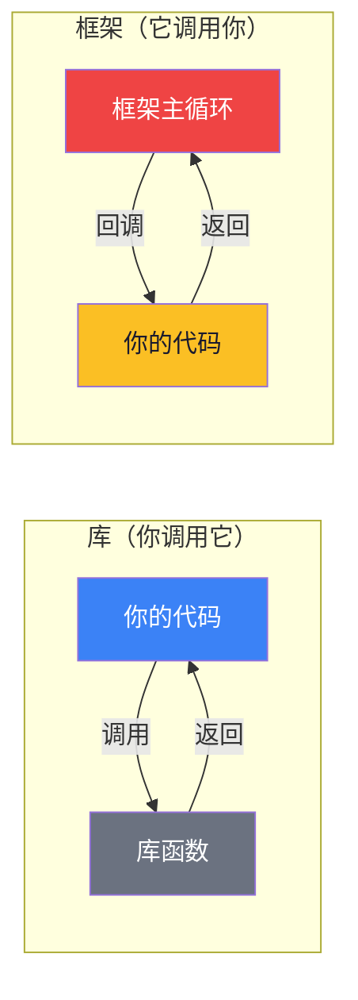
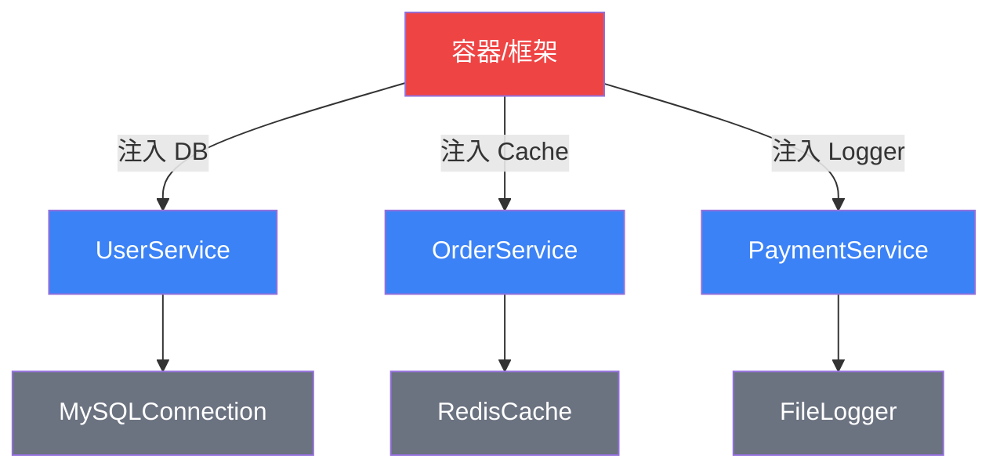
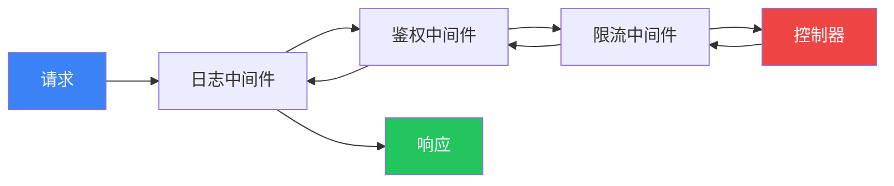

# 【化神·25】框架设计的道与术

> **码农修仙传 · 化神期 · 第25篇**
> 我是玄芯散人，带你从炼气修到大乘。

---

## 境界标识

```
╔══════════════════════════════════╗
║     化神期 · 第25篇              ║
║     框架设计的道与术             ║
║     预计阅读：8分钟               ║
╚══════════════════════════════════╝
```

---

## 修仙引入

你用 Flask 写过 API，用 Vue 写过页面，用 Spring Boot 写过后端。

你觉得框架很神奇——加几行注解就能实现路由，配置一下就有数据库连接池，写个装饰器就能加缓存。

但你是否想过：**这些框架是怎么被设计出来的？**

修仙小说里，化神期有一个标志：从"用法器"到"炼法器"。你不再只是用别人的框架，你开始理解框架为什么这样设计，甚至能自己造一个。

今天讲框架设计背后的核心原则——道与术。道是设计哲学，术是实现手法。道是心法，术是招式。

---

## 硬核主体

### 框架的本质——控制权的转移

先用一句话说清楚框架和库的区别：

**库是你调用它，框架是它调用你。**

```python
# 库：你主动调用
import requests
response = requests.get("https://xren.ren")  # 你决定什么时候调用

# 框架：它调用你
from flask import Flask
app = Flask(__name__)

@app.route("/")          # 你注册，框架决定什么时候调用你
def hello():
    return "Hello"
```

这就是**控制反转（Inversion of Control, IoC）**——框架设计的核心思想。你不再掌控流程，框架掌控流程，在合适的时机调用你的代码。

修仙类比：库是法器——你拿起来用，用完放下。框架是修炼阵法——你站在阵法里，阵法驱动灵力流转，你只是在关键节点注入灵力。



---

### 道：框架设计的四大原则

#### 原则一：约定优于配置（Convention over Configuration）

Rails 的核心理念：框架有默认约定，你遵循约定就不用配置。只有偏离约定时才需要额外配置。

```python
# Flask：需要手动配置路由
@app.route("/api/users")
def get_users():
    return [...]

# Django：约定好了，URLpatterns 自动映射
# 只要你把 view 放在约定位置，URL 命名遵循约定，框架自动找到
```

修仙类比：功法有标准经脉路线，按标准走就行。只有你想走偏门（自定义）时，才需要额外标注灵力走向。

#### 原则二：开闭原则（Open-Closed Principle）

框架对扩展开放，对修改关闭。你可以加新功能，但不需要改框架源码。

```python
# Flask 的扩展机制：你注册蓝图，不改框架代码
from flask import Blueprint

user_bp = Blueprint("users", __name__, url_prefix="/api/users")

@user_bp.route("/")
def list_users():
    return [...]

app.register_blueprint(user_bp)  # 注册扩展，不改Flask源码
```

修仙类比：阵法留好了"灵力接口"（扩展点），你可以往接口里注入新的灵力属性（插件），但不需要重新布阵（改源码）。

#### 原则三：依赖注入（Dependency Injection）

不要在代码里直接创建依赖，让外部（框架/容器）注入。

```python
# ❌ 紧耦合：直接创建依赖
class UserService:
    def __init__(self):
        self.db = MySQLConnection("localhost", "root", "123")  # 写死了

# ✅ 依赖注入：从外部接收依赖
class UserService:
    def __init__(self, db: Database):  # 抽象接口，不关心具体实现
        self.db = db

# 框架/容器负责注入
service = UserService(MySQLConnection(...))
```

修仙类比：你修炼时需要法器，但你不自己炼——你告诉宗门"我需要一把剑"，宗门给你什么剑你都能用。换把刀也能战斗，因为你的功法不绑死具体法器。



#### 原则四：关注点分离（Separation of Concerns）

框架把不同关注点分到不同层：路由层、业务层、数据层、展示层。每层只管自己的事。

```
请求进来 → 路由层（匹配URL）→ 中间件层（鉴权/日志）→ 控制器层（参数校验）→ 业务层（核心逻辑）→ 数据层（DB操作）→ 响应层（格式化输出）
```

修仙类比：修炼体系分层——炼气期管基础、筑基期管地基、金丹期管系统。每一境界只管自己的事，不越界。框架也一样，路由层不管数据库怎么查，业务层不管HTTP状态码。

---

### 术：框架的核心实现手法

#### 手法一：中间件模式——功法叠加

```python
# Express/Koa 的中间件洋葱模型
async function logger(ctx, next) {
    console.log(`→ ${ctx.url}`);
    await next();           // 交给下一层
    console.log(`← ${ctx.status}`);
}

async function auth(ctx, next) {
    if (!ctx.headers.token) {
        ctx.status = 401;
        return;              // 不调用next，链路终止
    }
    await next();
}

// 请求经过中间件链：logger → auth → controller → auth → logger
app.use(logger);
app.use(auth);
```

修仙类比：中间件就像功法叠加——先穿护甲（日志），再开护盾（鉴权），最后出招（控制器）。响应时反向卸装。



#### 手法二：生命周期钩子——天道节律

框架定义了生命周期，你在特定阶段注册回调。

```javascript
// Vue 组件生命周期
export default {
  created() { /* 组件创建，还没挂载DOM */ },
  mounted() { /* DOM挂载完成 */ },
  updated() { /* 数据更新后 */ },
  unmounted() { /* 组件销毁前 */ }
}
```

修仙类比：框架的天道节律——筑基时要过心魔劫，金丹时要过结丹劫。你不需要知道劫什么时候来，只要在劫来时准备好（注册回调）。

#### 手法三：反射与元数据——天道之眼

```python
# Python 装饰器收集路由信息
routes = {}

def route(path):
    def decorator(func):
        routes[path] = func    # 框架用"反射"收集所有路由
        return func
    return decorator

@route("/api/hello")
def hello():
    return "Hello"

# 框架启动时扫描所有注册的路由，建立路由表
# 这就是 Flask/Django 路由的核心原理
```

修仙类比：装饰器就像在天道法则上刻了符文（元数据），框架启动时用天眼扫一遍，把所有带符文的功法收集起来，建立索引。

---

### 从用框架到造框架——你的化神之路

| 阶段 | 修仙类比 | 技术能力 |
|------|---------|---------|
| 用框架 | 用别人炼好的法器 | 会用 Flask/Django/Vue |
| 读框架 | 研究法器的炼制方法 | 读懂框架源码 |
| 改框架 | 修补法器 | 写插件/中间件/扩展 |
| 造框架 | 自己炼制法器 | 设计并实现自己的框架 |

化神期的标志是第四阶段——**造框架**。不需要你造一个比 Spring 更强的框架，但你需要能设计一个解决特定问题的微型框架。

比如：
- 写一个 100 行的 HTTP 路由框架
- 写一个简单的 ORM
- 写一个插件系统

这些练习会逼你理解控制反转、依赖注入、中间件等核心概念。不是用它们，是理解它们为什么被设计出来。

---

## 修仙术语对照表

| 修仙术语 | 技术现实 | 本篇详解 |
|---------|---------|---------|
| 炼法器 | 设计框架 | 全篇主线 |
| 法器 | 框架/库 | §框架的本质 |
| 修炼阵法 | 框架运行时 | §框架的本质 |
| 控制反转 | IoC | §框架的本质 |
| 标准经脉路线 | 约定优于配置 | §原则一 |
| 灵力接口 | 扩展点 | §原则二 |
| 宗门给法器 | 依赖注入 | §原则三 |
| 功法叠加 | 中间件模式 | §手法一 |
| 天道节律 | 生命周期钩子 | §手法二 |
| 天道符文 | 装饰器/元数据 | §手法三 |

想查全系列术语？看[术语词典](/glossary)。

---

## 突破条件

化神期 → 渡劫期的突破：

- [ ] 读完过一个框架的核心源码（Flask/Express/Vue任选）
- [ ] 能解释IoC、DI、中间件、生命周期钩子的原理
- [ ] 自己写过一个小型框架或库（100行以上）
- [ ] 能在白板上画出请求从进入到响应的完整链路
- [ ] 开始思考"这个框架为什么这样设计"而不只是"怎么用"

> 当你不再问"这个框架怎么用"，而是问"如果是我，会怎么设计"——恭喜，化神的灵觉已经苏醒。

---

## 下期预告 + 互动

> **下一篇：【渡劫·26】冯·诺依曼架构**
>
> 化神期讲完了。接下来进入渡劫期——回到计算机的起源。
> 冯·诺依曼在1945年提出的架构，统治了计算机80年。
> 为什么这个架构如此强大？它有什么根本缺陷？
> 渡劫期带你回到文明的起点。

现在问你：

> 🎮 **挑战**：你用过哪些框架？能说出它们的IoC体现在哪里吗？
>
> 💬 **话题**：如果让你造一个框架解决你日常工作中的某个痛点，你会造什么？
>
> 🔔 关注玄芯散人，下一篇带你回到计算机的创世时刻。

> 我是玄芯散人，带你从炼气修到大乘。

---

*本文是「码农修仙传」系列第25篇。系列导航见 [xren.ren](https://xren.ren)*
