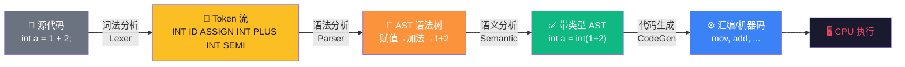

# 【金丹·09】编译器对你代码做了什么

> **码农修仙传 · 金丹期 · 第9篇**
> 我是玄芯散人，带你从炼气修到大乘。

---

## 境界标识

```
╔══════════════════════════════════╗
║     金丹期 · 第9篇               ║
║     编译器对你代码做了什么        ║
║     预计阅读：12分钟              ║
╚══════════════════════════════════╝
```

---

## 修仙引入

你写下 `int a = 1 + 2;`，按下回车，CPU 安静地吐出 `3`。

**这中间到底发生了什么？**

你以为是"代码→运行"两步。事实上，代码从你指尖到 CPU 执行，中间隔着一条四段流水线：词法分析、语法分析、语义分析、代码生成。每一步都有专门的角色在干活，每一步都可能出错，每一步都暗藏优化空间。

修仙者念动功法口诀，但天地只认灵力波动。**编译器就是那个把你的口诀翻译成灵力波动的功法长老。**

金丹期第一篇，我们就拆开这位长老的丹田，看看他是怎么把"人说的话"变成"机器懂的符箓"。

---

## 硬核主体

### 编译器的全貌——四段流水线

编译器的工作不是"一行代码变一行机器码"那么简单。它是一条严谨的流水线，每一段各司其职，前一段错了后一段必崩，前一段过了也只能保证这段不出错。

先上一张全景图，把四个阶段和它们的关系看清楚：



| 阶段 | 修仙类比 | 技术环节 | 产出 | 常见错误 |
|------|---------|---------|------|---------|
| 词法分析 | 拆字——把口诀拆成单字 | Lexer / Scanner | Token 流 | 未识别字符、引号未闭合 |
| 语法分析 | 理句——按语法规则组装 | Parser | AST 语法树 | 少分号、括号不匹配 |
| 语义分析 | 明意——检查含义是否通顺 | Semantic Analysis | 带类型的 AST | 类型不匹配、未声明变量 |
| 代码生成 | 成符——翻译成天地符文 | CodeGen | 汇编 / 机器码 | 一般不报，错了运行崩 |

四段流水线有一个朴素的原则：**前一步错，后一步必崩；前一步对，后一步也可能崩。** 词法分析错了直接报语法错误；词法过了语法错了报语法错误；语法过了语义错了报类型错误；语义也过了才到代码生成——这时候编译器一般不再报错，但生成的代码可能跑崩。

我们一段一段拆。

---

### 第一段：词法分析——拆解你的功法

词法分析是流水线第一站。它干的事情很朴素：**把源代码字符串拆成一串有意义的最小单位（Token）。**

什么是 Token？就是你代码里那些不能再拆的"原子"。看这段代码：

```c
// 输入：源代码原文
int a = 1 + 2;
```

词法分析器看完，吐出这串东西：

```
[int] [a] [=] [1] [+] [2] [;]
```

每个方括号就是一个 Token。Token 有四类：

| Token 类型 | 例子 | 修仙类比 |
|----------|------|---------|
| 关键字（Keyword） | int, if, return | 功法口诀里的固定术语——"掐诀""引气" |
| 标识符（Identifier） | a, b, sum | 你自己起的名字——功法名、弟子名 |
| 字面量（Literal） | 1, 2, "hello" | 直接给出的值——灵石数量、原话 |
| 运算符 / 分隔符（Operator/Punct） | +, =, ;, ( ) | 语法连接件——句读、停顿符 |

词法分析器是怎么把字符串切成 Token 的？答案是**有限状态机（FSM, Finite State Machine）**。

你可以把状态机理解成一个走迷宫的小人，从头开始读源代码，每读一个字符就根据当前状态决定下一步往哪走。比如读到 `i` 进入"可能关键字"状态，再读一个 `n` 进入"可能是 int"，再读一个 `t` 确认是 int 这个关键字——吐出一个 INT Token，回到初始状态。

```c
// 一个简化版的 int 关键字识别状态机
// 状态 0: 初始；状态 1: 看到 i；状态 2: 看到 in；状态 3: 看到 int
// 转换：当前状态 + 当前字符 → 下一状态
state = 0;
for (char c : source) {
    switch (state) {
        case 0: if (c == 'i') state = 1; break;
        case 1: if (c == 'n') state = 2; else 状态重置/接受; break;
        case 2: if (c == 't') state = 3; else 报错; break;
        case 3: /* 吐出 INT token */ state = 0; break;
    }
}
```

**词法分析阶段的常见错误：**

```c
int a = "hello  // 引号没闭合 → 词法分析器一直读到 EOF 才报错
```

报错信息通常是 `unterminated string literal` 或 `missing terminating "`。**注意：词法错误是最浅层的错误，编译器第一个逮住的就是它。**

---

### 第二段：语法分析——组装语法树

词法分析给了你一串 Token，但 Token 之间没关系——它只是一袋散乱的字。语法分析干的事：**根据语言的语法规则，把 Token 组装成一棵树。**

这棵树叫 **AST（Abstract Syntax Tree，抽象语法树）**。它就是你代码的结构。

还是那段 `int a = 1 + 2;`，AST 长这样：

```
        赋值语句 (DeclStmt)
       /              \
   int a           二元运算 (BinaryOp +)
                  /              \
          字面量 1              字面量 2
        (Literal 1)            (Literal 2)
```

注意几个点：

1. **括号是隐式的。** 树的左右子树天然带优先级，不需要括号。
2. **关键字 int 也成了节点的一部分。** 完整 AST 会包含变量声明的类型信息。
3. **它不是源代码本身，而是源代码的结构。** 源代码 `int a = 1 + 2;` 是文本，AST 是这文本的"骨架"。

语法分析器是怎么组装 AST 的？主流方法是**递归下降解析（Recursive Descent Parsing）**——为每条语法规则写一个函数，函数之间互相调用，像递归一样把 Token 流吃干净。

```python
# 简化版的递归下降解析器（伪代码）
def parse_expression(tokens):       # 解析表达式
    left = parse_term(tokens)        # 先解析项（乘除）
    if tokens.peek() in ('+', '-'):  # 再看加减
        op = tokens.consume()
        right = parse_expression(tokens)  # 递归
        return BinaryOp(op, left, right)
    return left

def parse_assignment(tokens):       # 解析赋值
    if tokens.peek_type() == 'INT':
        type_tok = tokens.consume()         # 吃掉 int
        name_tok = tokens.consume_ident()   # 吃掉 a
        tokens.expect('=')                  # 期待 =
        expr = parse_expression(tokens)     # 解析右边
        tokens.expect(';')                  # 期待 ;
        return DeclStmt(type_tok, name_tok, expr)
    # ...
```

**语法分析阶段的常见错误：**

```c
int a = 1 + 2   // 少分号
// Parser 报错：expected ';' before 'xxx'
```

```c
int a = 1 + ) 2 ;   // 括号错位
// Parser 报错：expected primary expression before ')' token
```

这些错误的特点：**报错位置不一定是真正错的位置。** Parser 看到错乱时已经"晕了"，它只能告诉你"我在某个位置看到不该出现的东西"。

---

### 第三段：语义分析——检查功法是否合理

语法树长得对，不代表语义没问题。语义分析这一步检查**"这句话在逻辑上通不通"**。

最常见的语义检查有三类：

**1. 类型检查（Type Checking）**

```c
int a = "hello";    // 语法对，语义错：int 不能装字符串
// Semantic Error: incompatible types when initializing
```

```python
"abc" + 1           # 字符串不能和数字相加
# TypeError: can only concatenate str to str
```

**2. 声明检查（Declaration Check）**

```c
int main() {
    a = 10;          // a 从未声明
    return 0;
}
// Error: 'a' undeclared (first use in this function)
```

**3. 作用域检查（Scope Check）**

```c
{
    int x = 10;
}
x = 20;              // x 在外层作用域不可见
// Error: 'x' undeclared
```

语义分析通常还会做这些事：
- **类型推导**：比如 `auto x = 10;` 推导成 `int`
- **常量折叠**：`1 + 2` 在编译期就算成 `3`
- **重载决议**：你写了多个同名函数，到底调哪个

金丹期要记住的核心：**语义分析能帮你抓出 90% 的"看着对、其实错"的 bug。** 重视编译器的语义错误，比你写一万个单元测试都管用。

---

### 第四段：代码生成——翻译成机器指令

代码生成是最后一段。语义分析后的 AST 是"正确的、高级的、与机器无关"的中间表示。代码生成要做的是：**把这棵树翻译成 CPU 能执行的指令。**

代码生成一般分三个子任务：

**1. 指令选择（Instruction Selection）**

选合适的 CPU 指令实现 AST 每个节点。

```c
// 高级表达式: a = 1 + 2
// 生成的汇编（x86 风格）：
mov eax, 1       ; 把 1 放入 eax 寄存器
add eax, 2       ; eax = eax + 2
mov [a], eax     ; 把 eax 存到变量 a 的内存地址
```

**2. 寄存器分配（Register Allocation）**

CPU 寄存器就那么几个（x86-64 一般 16 个通用寄存器），变量成千上万。寄存器分配要决定**哪些变量放在寄存器、哪些溢出到内存**。

这里有个著名的算法叫**图着色寄存器分配（Graph Coloring Register Allocation）**——把每个变量当成一个节点，如果两个变量不能同时在寄存器就画条边，然后给图着色，相邻节点不同色，色数 = 所需寄存器数。

**3. 指令优化（Instruction Optimization）**

编译器不是你写啥它就生成啥，它会偷偷优化。常见优化：

| 优化类型 | 修仙类比 | 例子 |
|---------|---------|------|
| 死代码消除 | 练功不练的招数删掉 | `int x = 1;` 后面没用到 x，整个删掉 |
| 常量折叠 | 算好的数不用再算 | `int x = 1 + 2;` → `int x = 3;` |
| 循环展开 | 把小循环展开成直线 | `for(i=0;i<4;i++) a[i]=0;` → 四条赋值 |
| 函数内联 | 把小函数抄到调用处 | `add(a,b)` → `t=a+b;`（省调用开销）|
| 公共子表达式消除 | 重复算的招数只算一次 | `(a+b)*c + (a+b)*d` → 算一次 `(a+b)` |

**优化后的代码和你写的代码可能差很多。** 这就是为什么有时候你 `printf` 一个变量的值，编译器说"这变量未使用"然后把整个 if 块删了——你以为会跑的代码根本没跑。

---

### 编译 vs 解释——功法翻译的两种流派

聊完编译，必须提一下它的孪生兄弟：解释。

- **编译型语言**：编译器一次性把整个源文件翻译成机器码，生成可执行文件，再运行。C、C++、Go、Rust 都属此类。
- **解释型语言**：解释器逐行读源代码，逐行翻译，逐行执行。Python、Ruby、JavaScript 传统意义上是。

但今天界限越来越模糊：

| 语言 | 实际策略 | 修仙类比 |
|------|---------|---------|
| Java | 编译成字节码，JVM 解释/即时编译(JIT) | 先把口诀翻成通用符文，再用灵力实时激活 |
| Python (CPython) | 编译成 .pyc 字节码，再由解释器执行 | 先编成草纸符文，再慢慢念 |
| JavaScript (V8) | 先解释执行，发现热点函数 JIT 编译 | 平时边念边译，遇到核心功法整段成符 |
| C# (.NET) | 编译成 IL，CLR 即时编译 | 同 Java |

**金丹期核心认知**：现代语言的"编译/解释"不是非此即彼，而是**多层翻译**。源码 → 中间表示 → 字节码 → 机器码，这条链上每一步都可以选"事先全翻译完"还是"运行时再翻译"。

这也是为什么 Java 程序启动慢但运行快、Python 程序启动快但运行慢——JIT 编译需要热身时间。

---

### 编译器和你的日常修炼

讲了这么多理论，回归实战。**编译器知识对中高级工程师有什么用？**

**1. 读懂报错。** 报错信息不是天书，它告诉你"哪一阶段挂了"。`syntax error` 是语法分析挂了，`type mismatch` 是语义分析挂了，`undefined reference` 是链接器挂了（链接器是编译之后的步骤，下一篇讲）。知道在哪一段挂了，调试就有方向。

**2. 性能调优。** 知道编译器做了什么优化，你才不会写出反优化的代码。比如：

```c
// 错误写法：volatile 让编译器无法优化
for (volatile int i = 0; i < 1000000; i++);

// 正确写法：让编译器放心优化
for (int i = 0; i < 1000000; i++);

// 还可以再优化：编译器可能自动循环展开 / 向量化
```

**3. 理解工具链。** GCC、Clang、MSVC 是不同的编译器，实现细节不同。比如 Clang 默认开启更多优化警告，MSVC 对 Windows API 调用有特殊优化路径。**用对编译器，能白嫖 10-30% 性能。**

**4. 进阶修炼的起点。** 想深入理解 LLVM？想写自己的 DSL？想搞 JIT 编译器？想研究 AOT 编译技术？所有这些的起点都是这一篇讲的四段流水线。**金丹期不是终点，是看世界的开始。**

---

## 修仙术语对照表

| 修仙术语 | 技术现实 | 本篇详解 |
|---------|---------|---------|
| 功法翻译官 | 编译器（Compiler） | 把源代码翻译成机器码的程序，全篇主线 |
| 拆字长老 | 词法分析器（Lexer/Scanner） | 把源代码拆成 Token 流 |
| 理句长老 | 语法分析器（Parser） | 把 Token 组装成 AST |
| 明意长老 | 语义分析器（Semantic Analyzer） | 检查类型、声明、作用域 |
| 成符长老 | 代码生成器（Code Generator） | 输出汇编 / 机器码 |
| 符文 / 符箓 | Token / 机器指令 | 编译器流水线上的最小单位 |
| 功法骨架图 | AST（抽象语法树） | 代码的结构化表示 |
| 灵力检查 | 类型检查 | 验证运算的合法性 |
| 功法裁缝 | 优化器（Optimizer） | 编译器偷偷改你的代码让它更快 |
| 通用符文 | 字节码（Bytecode） | 跨平台的中间表示 |
| 即时激活 | JIT 编译 | 运行时把字节码编译成机器码 |

---

## 突破条件

金丹期第一道关——理解编译器的四段流水线。全部勾选才算突破：

- [ ] 能完整画出"源代码 → Token → AST → 带类型 AST → 机器码"的流水线图
- [ ] 看一段简单代码，能口述它的 Token 流和 AST 结构
- [ ] 能区分词法错误、语法错误、语义错误，并能根据报错定位阶段
- [ ] 理解编译和解释的本质区别，能说出至少两种现代语言的混合策略
- [ ] 知道至少三种编译器优化（常量折叠、死代码消除、函数内联）
- [ ] 能解释为什么 Java 程序启动慢、Python 启动快但运行慢

> 六条全勾，金丹期的"编译之力"已成。下一道天劫——理解链接器、加载器、运行时，把从源码到执行的完整链路打通。

---

## 下期预告 + 互动

> **下一篇：【金丹·10】操作系统内核是天道规则——Ring 0 与 Ring 3 的禁区**

你以为编译器把代码翻译完就能跑？错。生成的可执行文件还要经过**链接器**缝合，经过**加载器**装入内存，经过**操作系统**调度 CPU 执行。

下一篇深入天道法则内部——内核态与用户态、系统调用、中断处理、调度器。**这是从"我的代码怎么跑"到"代码在系统里怎么活"的跨越。**

现在问你：

> 🎮 **互动 1**：你写代码时遇到过最深刻的编译器报错是什么？是词法、语法、还是语义错误？它教会了你什么？

> 🎮 **互动 2**：用 `gcc -S` 或 `clang -S` 把一段 C 代码编译成汇编贴出来，大家一起看看编译器把你的代码翻译成了什么样——亲眼看看函数内联、常量折叠这些优化到底长啥样。

> 🎮 **互动 3**：你理解"编译"和"解释"的区别吗？如果让你给一个完全没听过这两个概念的人讲，你会怎么讲？

评论区聊聊你的理解，互相印证修为。

> 我是玄芯散人，带你从炼气修到大乘。

---

*本文是「码农修仙传」系列第9篇。系列导航见 [xren.ren](https://xren.ren)*