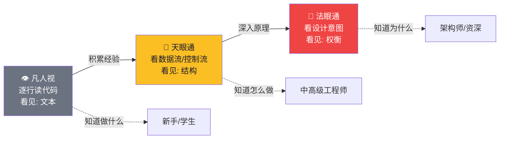
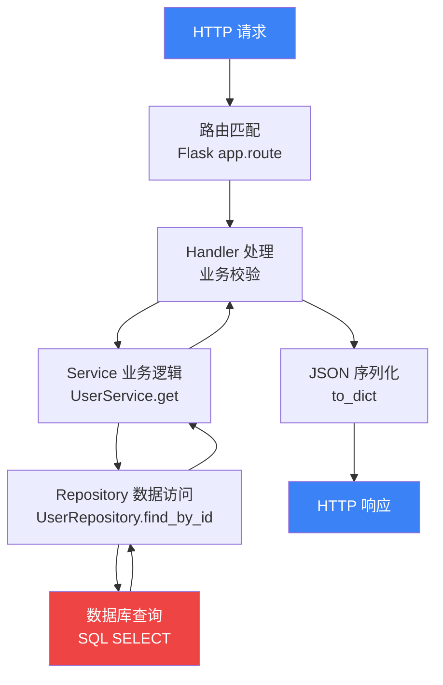
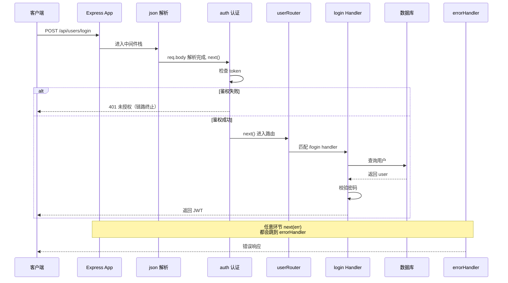

# 【金丹·11】为什么金丹期看代码像开天眼

> **码农修仙传 · 金丹期 · 第11篇**
> 我是玄芯散人，带你从炼气修到大乘。

---

## 境界标识

```
╔══════════════════════════════════╗
║     金丹期 · 第11篇              ║
║     为什么金丹期看代码像开天眼   ║
║     预计阅读：10分钟             ║
╚══════════════════════════════════╝
```

---

## 修仙引入

筑基期你看懂了天道运转：编译器如何翻译口诀，操作系统如何调度灵气，进程如何在内门与外门之间穿梭。金丹期头两篇又把天道法则的内部挖深了一层。

但**看懂天道运转 ≠ 能在实战中读懂别人的代码**。

当你接手一个 10 万行的新项目，IDE 一打开满屏的函数跳转、类继承、模块依赖——你本能反应是什么？是从 `main` 开始逐行读？还是先 Google 一遍"如何阅读开源项目"？

**真正的金丹期码农，看代码的方式根本不是逐行读。**

他们打开一个新项目，几秒钟扫一遍目录结构，再花几分钟跑一遍核心流程，整套架构已经在脑子里成型了。这种能力在修仙小说里叫"**开天眼**"——不是看见字面意思，而是**看到灵气流动、因果脉络、设计意图**。

金丹期这一篇不教你写代码，**教你读代码**。读代码的能力，决定了你能在公司混几年。

---

## 硬核主体

### 2.1 三副天眼——代码阅读的三个层次

修仙小说里修士有不同境界的眼：**凡人视**只能看见眼前物件；**天眼通**能看穿表象，看到灵气流动；**法眼通**能看穿因果，看到万物的来龙去脉。

读代码也有三个层次，你当前在哪一层？

#### 第一层：凡人视——逐行读字面意思

这是炼气期到筑基期初期的读法。打开一个文件，从第一行开始，逐行往下读，试图把每行都看懂。

```python
# 凡人视读法：从main开始逐行读
def main():
    config = load_config()           # 配置加载（不深入）
    db = connect_db(config['db'])    # 数据库连接（不深入）
    server = HTTPServer(...)
    server.serve_forever()           # 启动服务（不深入）
```

逐行读能让你"知道代码在做什么"。**但你永远读不完。** 一个 10 万行的项目，逐行读要读三个月，读完了也记不住——因为没结构。

凡人视最大的问题：**看不见结构**。你看到的是一维的代码文本，不知道这个文件在整个项目里算什么位置、这段逻辑在请求链路里处于哪一步、为什么这块要这么写而不是那样写。

#### 第二层：天眼通——看数据流和控制流

金丹期入门标志：**不逐行读，看结构。**

打开代码先做三件事：

1. **看目录结构**——项目分哪些模块，每个模块大致做什么
2. **找入口函数**——请求从哪里进，响应从哪里出
3. **画调用链**——入口函数调用了哪些关键函数，数据在哪里转折

```bash
# 项目结构一眼看懂
src/
├── main.py            # 入口
├── handlers/          # 业务处理（每个端点一个文件）
│   ├── user.py
│   ├── order.py
│   └── payment.py
├── services/          # 业务逻辑层
├── models/            # 数据模型
├── db/                # 数据库操作
└── utils/             # 工具函数
```

天眼通的能力：**给你一段新代码，你能在 10 分钟内画出它的数据流转图，知道数据从哪里来、到哪里去、经过哪些转换。**

这就是为什么金丹期工程师读新项目快——他们不读代码，他们读**结构**。

#### 第三层：法眼通——看设计意图和架构权衡

金丹期大成标志：**看代码不仅知道在做什么，还知道为什么这么写，知道换种写法会怎样。**

法眼通读代码会问这些问题：

- 这个设计用了什么模式？为什么选这个模式而不选另一个？
- 这个抽象的边界划在哪里？划得合理吗？
- 这里的性能瓶颈在哪？能不能优化？优化的代价是什么？
- 如果需求变了，改动会扩散到哪些文件？

举几个例子：

```python
# 同一个功能，三种写法暴露三种设计意图

# 写法 A：过程式
def get_user(user_id):
    db = connect_db()                                  # 自己连，自己关
    user = db.query("SELECT * FROM users WHERE id = ?", user_id)
    db.close()
    return user

# 写法 B：依赖注入
def get_user(user_id, db):                             # db 由调用方传入
    return db.query("SELECT * FROM users WHERE id = ?", user_id)

# 写法 C：仓储模式
class UserRepository:                                  # 把数据访问封装成类
    def __init__(self, db):
        self.db = db
    
    def get_by_id(self, user_id):
        return self.db.query("SELECT * FROM users WHERE id = ?", user_id)
```

凡人视觉得这三段差不多。天眼通能看出 A 不利于测试、B 依赖要上层传、C 把数据访问封装了。

**法眼通能看出：A 写法是为了快速验证想法的原型代码，B 写法是方便单元测试的设计，C 写法是企业级架构的标准形态**。它们的"对错"不是绝对的，**取决于项目阶段、团队规范、可测试性要求**。法眼通读者还能告诉你：把 A 重构成 C 需要哪些步骤、风险在哪里、值不值得重构。

用一张图把这三个层次看清楚：



金丹期的核心跃迁：**从凡人视到天眼通**。这是阅读能力从"读代码"升级到"读结构"的标志。**法眼通是元婴期才需要全力修的技能**，但金丹期要有意识地训练——遇到任何一段新代码，多问一句"为什么这么写"。

---

### 2.2 修炼天眼的四种功法

天眼不是天生的，是练出来的。读源码有四种功法：**自顶向下、自底向上、断点动态追踪、画图总结**。四种功法针对不同场景，配合使用才有效。

#### 功法一：自顶向下——从入口函数追到底

适合场景：**新接手一个项目，想理解整体流程**。

```python
# Flask 应用入口示例
from flask import Flask
app = Flask(__name__)

@app.route('/api/users/<int:user_id>')
def get_user(user_id):
    user = UserService.get(user_id)        # 调用服务层
    return jsonify(user.to_dict())          # 序列化返回

class UserService:
    @staticmethod
    def get(user_id):
        return UserRepository.find_by_id(user_id)  # 调用仓储层

class UserRepository:
    @staticmethod
    def find_by_id(user_id):
        return db.query("SELECT * FROM users WHERE id = ?", user_id)
```

追踪路径：

```
HTTP GET /api/users/123
  ↓ Flask 路由表匹配
  → get_user(123)               [handlers/user.py]
    → UserService.get(123)       [services/user.py]
      → UserRepository.find_by_id(123)  [repository/user.py]
        → SQL 查询
        ↑ 返回结果逐层回传
      ↑ 序列化为 JSON
  ↑ 返回 HTTP 响应
```

**自顶向下的关键：每层只追到"知道它做了什么"就停下，不要深入细节**。第一次读代码追求"广度"而非"深度"，先把骨架画清楚。细节留到第二轮再啃。

#### 功法二：自底向上——从最底层模块开始啃

适合场景：**想理解某个核心组件的实现原理**。

```python
# 比如想理解 SQLAlchemy 的连接池
# 自底向上从最基础的类开始：

class Connection:           # 1. 最基础的连接对象
    def execute(self, sql): ...

class Pool:                 # 2. 连接池（管理多个连接）
    def __init__(self, size=5):
        self._pool = Queue(size)  # 用队列管理连接
    def get(self):
        return self._pool.get()   # 取连接
    
class Engine:               # 3. 引擎（池 + SQL 生成）
    def __init__(self, pool):
        self.pool = pool
    def execute(self, sql):
        conn = self.pool.get()    # 先拿连接
        try:
            return conn.execute(sql)
        finally:
            self.pool.put(conn)   # 用完归还
```

自底向上的关键：**每读完一层，往上推一层**。Connection 是基础、Pool 是中间层、Engine 是上层封装。直到把所有层都串起来，理解整个组件的精妙之处。

修仙类比：**自顶向下是御剑飞行俯瞰全局，自底向上是闭关打坐从底层炼起**。前者适合快速建立全貌，后者适合钻深技术细节。

#### 功法三：断点调试——动态看代码如何运行

静态读代码读到头晕？用 debugger 跑起来，**亲眼看数据怎么流转**。

```python
# 在关键位置打断点
def get_user(user_id):
    user = UserService.get(user_id)  # ← 断点 1：调用前 user_id 是什么值
    return jsonify(user.to_dict())

class UserService:
    @staticmethod
    def get(user_id):
        return UserRepository.find_by_id(user_id)  # ← 断点 2：调用栈是什么
```

断点调试能看到的东西：

- **调用栈（Call Stack）**：当前函数被谁调用，调用深度多少，整条链路是啥
- **变量值**：传进来的参数是什么，局部变量当前值，对象的字段是什么
- **执行路径**：走了哪个 if 分支、跳过了哪段代码、有没有异常被吞掉

修仙类比：**自顶向下/自底向上是"用灵识扫描"，断点调试是"分出一缕元神附在代码里，看着灵气流过每一道关卡"**。两者的区别是：前者你站在外面看，后者你钻进代码里面看。

#### 功法四：画图——把代码结构可视化

**读代码最被低估的功夫是画图。**

很多人读完代码觉得自己懂了，过两天全忘了——因为脑子里的图是模糊的。**一张图胜过读十遍代码。**



画图的好处：

1. **强迫你思考结构**——画不出来说明没读懂
2. **一目了然**——比逐行读快 10 倍
3. **方便复盘**——以后忘了看一眼图就回忆起来
4. **沟通利器**——给别人讲项目时贴一张图胜过千言万语

四种功法对比：

| 功法 | 适用场景 | 修仙类比 | 关键工具 |
|------|---------|---------|---------|
| 自顶向下 | 新项目快速上手 | 御剑飞行俯瞰全局 | 调用栈、IDE 的"Go to definition" |
| 自底向上 | 理解核心模块 | 闭关打坐从底层炼起 | 类图、继承链 |
| 断点调试 | 理解复杂逻辑 | 分神附体看灵气流转 | pdb / IDE debugger |
| 画图 | 任何场景的最后一步 | 绘制山河图作为修炼笔记 | mermaid、draw.io、白板 |

实操建议：**接到新项目的第一天，用自顶向下读一遍骨架；第二天用断点调试跑核心流程；第三天画一张完整的调用链路图**。三步走完，这个项目就刻在你脑子里了。

---

### 2.3 天眼实战——用一张图看懂 Express

理论讲完了，来点实战。**用你刚学的四种功法，读懂一个 Express Web 框架的核心请求链路**。

假设你第一次看到这段 Express 代码：

```javascript
// app.js —— Express 应用的入口
const express = require('express');
const app = express();

app.use(express.json());                    // 中间件 1：解析 JSON 请求体
app.use(authMiddleware);                    // 中间件 2：身份认证
app.use('/api/users', userRouter);          // 挂载用户路由
app.use(errorHandler);                      // 错误处理中间件（放最后）

app.listen(3000, () => console.log('启动'));
```

**凡人视**会开始读 `express.json()` 的源码，研究怎么解析 JSON。读三天，你还在 JSON 解析器里打转，根本没碰到业务逻辑。

**天眼通**知道：**先看请求从哪到哪，中间经过什么，最终去了哪**。

#### 第一步：自顶向下追踪

```
HTTP POST /api/users/login { username, password }
  ↓
express() 创建 app 实例（一个函数 + 一组配置）
  ↓
app.use() 注册中间件（按顺序压入栈）
  ↓
请求进入，依次穿过中间件栈
  ↓
路由匹配 → 找到 /api/users → 交给 userRouter
  ↓
userRouter 内部再次匹配路径 → 找到 /login handler
  ↓
handler 处理 → 返回响应
  ↓
响应沿原路返回（反向穿过中间件栈）
```

#### 第二步：理解"中间件"是什么

**中间件是 Express 设计的精髓**——它就是一个函数 `(req, res, next) => {...}`，能改请求、能提前响应、能让请求继续往下一个中间件走。

```javascript
// 中间件的标准签名
function middleware(req, res, next) {
    // req: 请求对象（包含 headers、body、params 等）
    // res: 响应对象（用于返回数据）
    // next: 调用它，请求才会传到下一个中间件
    
    // 不调用 next() → 请求在这里终止
    // 调用 next(err) → 跳到错误处理中间件
}

// 一个完整的认证中间件示例
function authMiddleware(req, res, next) {
    const token = req.headers.authorization;          // 取 token
    if (!token) {
        return res.status(401).json({ error: '未授权' });  // 终止，不调 next
    }
    req.user = verifyToken(token);  // 解析后挂到 req 上
    next();  // 放行，让请求去下一个中间件
}
```

修仙类比：**中间件 = 功法叠加层**。每一层中间件都是一道关卡——验身份、记日志、压数据、查权限——你的请求像修仙者闯关，必须一道道过；中间件不调用 `next()`，就等于把请求"挡在了山门外"。

#### 第三步：画图把链路固化

读懂了，画一张完整图：



这张图的价值：

- 一眼看懂请求流向（从左到右）
- 一眼看懂中间件顺序（json → auth → router → handler）
- 一眼看懂错误如何被捕获（next(err) → errorHandler）
- 一眼看懂鉴权失败的早退路径（不调 next 直接返回 401）

**金丹期码农看代码，本质上就是把文字转成这种图的能力。** 看到代码 → 脑子里立刻浮现出图 → 用图和别人沟通 → 用图指导自己修改。这是阅读能力的天花板。

#### 实战要点

读完一个项目，你应当能回答这些问题：

1. **入口在哪**？（`main.js` / `app.py` / `server.go` / `cmd/xxx/main.go`）
2. **请求流向哪**？（路由表怎么配的，关键 handler 在哪）
3. **数据流向哪**？（DB 怎么连，数据在哪一层做转换，缓存怎么打）
4. **错误如何捕获**？（中间件、装饰器、try/catch 怎么用，全局兜底在哪）
5. **可扩展点在哪**？（插件机制、依赖注入、配置中心、热加载）

五个问题答得出来，就算"天眼通"入门了。

再往前一步，能回答**"如果需求变了，改动会扩散到哪些文件"**——恭喜，你已经是法眼通了。那是元婴期（架构师）的水准，但金丹期开始有这个意识，未来进阶会更顺。

---

## 修仙术语对照表

| 修仙术语 | 技术现实 | 本篇详解 |
|---------|---------|---------|
| 凡人视 | 逐行读代码、只见文本 | §2.1 第一层 |
| 天眼通 | 看数据流/控制流、看见结构 | §2.1 第二层 |
| 法眼通 | 看设计意图、架构权衡 | §2.1 第三层 |
| 御剑俯瞰 | 自顶向下读源码 | §2.2 功法一 |
| 闭关炼基 | 自底向上读源码 | §2.2 功法二 |
| 分神附体 | 断点调试（debugger） | §2.2 功法三 |
| 山河图 | 调用关系图 / 数据流图 | §2.2 功法四 |
| 功法叠加层 | 中间件（middleware） | §2.3 实战 |
| 闯关关卡 | 中间件链的每一层 | §2.3 实战 |
| 挡在山门外 | 中间件不调用 next() | §2.3 实战 |
| 灵识扫描 | 静态阅读代码 | §2.2 功法对比 |
| 早退路径 | 请求在中途被中断返回 | §2.3 时序图 |

---

## 突破条件

金丹期这一道关，是**从"会写"到"会读"的跨越**。要做到：

- [ ] 能区分"凡人视/天眼通/法眼通"三个层次，并定位自己当前在哪一层
- [ ] 拿到一个新项目，能在 1 小时内画出核心请求链路图
- [ ] 熟练使用至少 2 种读源码功法（自顶向下 / 自底向上 / 断点 / 画图）
- [ ] 读完过一个至少 1 万行的开源项目的核心源码（推荐：Flask、Express、gin、cobra）
- [ ] 能用 mermaid 画出一个 Web 框架的请求处理完整链路
- [ ] 能说出某段代码"为什么这么写"，而不只是"它在做什么"

> 最后一条是关键。从"做什么"到"为什么"——**这是金丹期向元婴期跃迁的标志**。能说"为什么"的码农，开始具备架构师气质；只会说"做什么"的，永远是高级 CRUD 工程师。

六条全勾，金丹期的"天眼"已成。下一道天劫，是金丹期的硬功夫——理解 CPU 缓存的三层塔。

---

## 下期预告 + 互动

> **下一篇：【金丹·12】CPU 缓存三层塔——为什么你的循环慢得像老牛**

金丹期真正的硬功夫开始了。

你写的 `for (i = 0; i < n; i++) sum += arr[i];` 为什么有时候跑得飞快，有时候慢得令人发指？答案藏在 CPU 芯片内部——**L1 / L2 / L3 三级缓存塔**。缓存命中与未命中，性能差 100 倍；缓存行、伪共享、缓存一致性协议，是性能优化的核心知识。

下一篇拆开 CPU 的硅片，看清楚 L1/L2/L3 的工作原理、空间局部性与时间局部性、MESI 缓存一致性协议，以及那个让无数多线程程序栽跟头的隐藏性能杀手——**伪共享**。

现在问你：

> 🎮 **互动 1**：你目前处于哪个层次？凡人视 / 天眼通 / 法眼通？说说你在哪个阶段卡住了？
>
> 💬 **互动 2**：你读源码最常用哪种功法？自顶向下、自底向上、断点调试、还是画图？评论区聊聊你的"读码兵器谱"。
>
> 🔔 关注玄芯散人，金丹期每篇都让你对系统多一层理解。下一篇带你钻进 CPU 缓存塔，看性能优化的底层秘密。

> 我是玄芯散人，带你从炼气修到大乘。

---

*本文是「码农修仙传」系列第11篇。系列导航见 [xren.ren](https://xren.ren)*