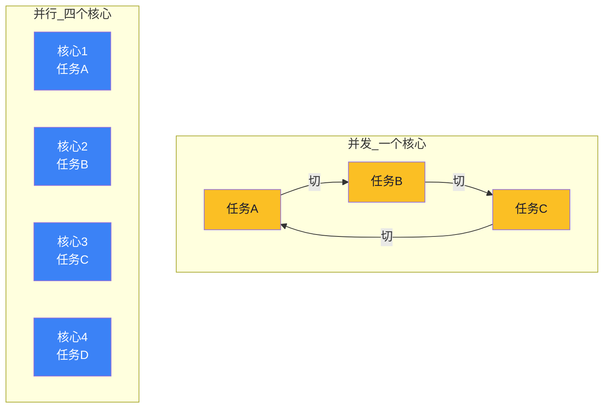
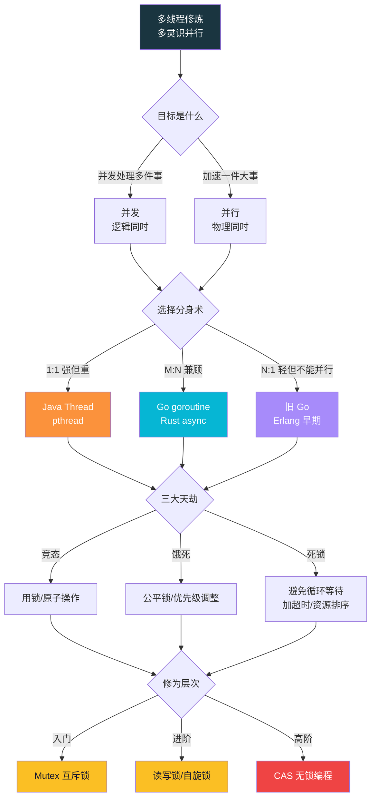

# 【金丹·13】线程模型与并发真相

> **码农修仙传 · 金丹期 · 第13篇**
> 我是玄芯散人，带你从炼气修到大乘。

---

## 境界标识

```
╔══════════════════════════════════╗
�     金丹期 · 第13篇              ║
║     线程模型与并发真相           ║
║     预计阅读：12分钟             ║
�══════════════════════════════════╝
```

---

## 修仙引入

筑基期你看了天道运行的规则，编译器、操作系统、内核一一过了一遍。金丹期第一篇讲的是编译器怎么翻译口诀，第9篇我们已经走过。

但金丹期真正的试炼不是翻译，是**分身**。

你的程序只有一个执行流时，世界很简单。但凡要做点正经事——服务端要扛住一万个请求，UI 不能卡死，后台要批量处理百万条数据——修仙者就必须施展**分身术**：一条灵识变多条，让它们同时跑不同的活。

听起来很美？现实是：**分身之间会争抢同一件法器，会互相等待，会莫名其妙死锁**。你以为的并行加速，常常变成十倍慢。

金丹期这一篇，讲清楚分身的真相——并发与并行、三种分身术、并发三毒、锁的家族，以及更高阶的无锁修炼。**读完这篇，你写的多线程代码，就不再是玄学。**

---

## 硬核主体

### 2.1 并发 vs 并行——分身术 vs 多人修炼

很多码农用了多年多线程，仍然混淆这两个概念。它们的区别，比你想的更根本。

**并发（Concurrency）**：一个 CPU 在多个任务之间快速切换，看起来像同时跑。**本质是逻辑上的"同时"。** 你一个人练三门功法，每门练五分钟换下一门——三门都在"推进"，但你一次只能练一门。

**并行（Parallelism）**：多个 CPU（或多核）真的同时跑多个任务。**本质是物理上的"同时"。** 三个人各练一门功法，三人都在练——这才是真正的并行。

看图理解：



修仙类比：

- **并发 = 分身术**：一个本体，元神切换修炼不同功法。看起来同时跑，本质是轮流。
- **并行 = 多人修炼**：多个独立修士，各占一个修炼位，真的同时推修为。

关键洞察：**并行一定并发，但并发不一定并行。** 单核 CPU 上跑一百个线程，本质都是并发——只是切得快，让你以为是并行。Go 语言的宣传语 "并发不是并行" 就是这个意思。

一个程序员写多线程代码，首先要问自己：**我想要的是并发（处理多件事）还是并行（加速一件事）？** 这决定了接下来的策略。

---

### 2.2 线程模型——三种分身术

筑基期你学了天道规则，金丹期要选**分身术的流派**。主流有三种：

| 模型 | 修仙类比 | 典型实现 | 优点 | 缺点 |
|------|---------|---------|------|------|
| **1:1** 内核线程 | 一个灵识对应一个天道位 | pthread (Linux)、Windows Thread、Java Thread | 真正并行，开箱即用 | 创建销毁开销大，几万线程系统崩 |
| **N:1** 用户线程 | 多个灵识共用一个天道位 | 早期 Go runtime、Erlang VM、绿色线程 | 极轻量，几百万协程 | 一个阻塞全阻塞，**无法并行** |
| **M:N** 混合 | 灵识和天道位灵活绑定 | Go goroutine（当前）、Rust Tokio 部分模式 | 兼顾轻量和并行 | 调度器复杂，调试困难 |

修仙类比解释：

**1:1 模型**——一个灵识占用一个天道位（内核线程）。天道位是稀缺资源，一台机器只有几十个。Java 的 Thread、Linux 的 pthread 都是这种。你开一千个线程试试？系统直接给你点颜色看。

**N:1 模型**——多个灵识（用户态协程）共享一个天道位。轻量到极致，可以创建几十万。但只要其中一个阻塞（比如做 syscall），整个天道位都被占住，所有灵识一起卡死。**能跑得快，但跑不了真并行。**

**M:N 模型**——天道位和灵识解耦，由调度器动态分配。Go 语言的 goroutine 是经典实现：你可以创建一百万个 goroutine，runtime 会聪明地分配到几千个 OS 线程上跑。**这就是为什么 Go 写高并发服务那么丝滑。**

```go
// Go 的 M:N 模型：轻松开 10 万个 goroutine
package main

import (
    "fmt"
    "time"
)

func worker(id int) {
    fmt.Printf("灵识 %d 开始修炼\n", id)
    time.Sleep(time.Second)  // 模拟修炼耗时
    fmt.Printf("灵识 %d 修炼完成\n", id)
}

func main() {
    // 启动 10 万个灵识（goroutine）
    // 如果是 Java 的 Thread，系统早已崩溃
    for i := 0; i < 100000; i++ {
        go worker(i)
    }
    time.Sleep(2 * time.Second)
    fmt.Println("天道位调度完成")
}
```

这段代码在 Go 里运行毫无压力——10 万个 goroutine 分布在几千个 OS 线程上调度。换成 Java 的 `Thread`，光创建就够系统喝一壶。**这就是 M:N 模型的优势：既轻量又并行。**

一个反直觉的事实：**线程不是越多越好。** 线程多了，调度开销反而吃掉所有性能收益。一般经验值：CPU 密集型任务，线程数 ≈ CPU 核数；IO 密集型任务，可以多一些（视 IO 等待时间而定）。Go 的 goroutine 之所以可以开很多，是因为它轻量——但即便如此，也不是越多越好。

---

### 2.3 并发三毒——竞态、饿死、死锁

分身术真正的苦难，源于**分身之间要共享资源**。两个灵识同时改一个全局变量、同时拿一件法器、同时抢一个修炼位——**结果不可预测**。

并发编程的三大天劫：**竞态条件、饿死、死锁**。

#### 毒一：竞态条件（Race Condition）

两个线程同时修改同一份数据，最终结果取决于谁先到——但你无法控制谁先到。

```python
import threading

counter = 0  # 共享资源：全局计数器

def increment():
    global counter
    for _ in range(100000):
        counter += 1  # �️ 这不是原子操作！

# 启两个分身同时跑
t1 = threading.Thread(target=increment)
t2 = threading.Thread(target=increment)
t1.start(); t2.start()
t1.join(); t2.join()

print(f"counter = {counter}")  # 期望 200000，实际 < 200000
```

**为什么 counter 不是 200000？**

`counter += 1` 在 CPU 层面是三步：**读（load）→ 改（add）→ 写（store）**。两个灵识同时执行：

```
灵识A: 读 counter=100
灵识B: 读 counter=100   ← 都读到旧值！
灵识A: 改 counter=101，写回
灵识B: 改 counter=101，写回  ← 把 A 的结果覆盖了
最终: counter=101，但应该 102
```

修仙类比：**两个灵识同时抢一份灵材，A 看了灵材，B 也看了灵材，A 拿了灵材炼化，B 也拿了同样的灵材炼化——两份炼化，最后只多了一份产物的灵力。**

#### 毒二：饿死（Starvation）

某个线程总是抢不到资源，长期处于等待状态。

最常见的场景：用锁的时候，某个线程优先级低，每次都抢不到锁；或者锁的实现不公平（某些实现偏向最近活跃的线程）。

修仙类比：修炼密室只有一间，所有人都想进去。但密室门卫（锁的实现）总是偏向已经进过的人——某些修为低的弟子一辈子都进不去。

#### 毒三：死锁（Deadlock）

**最恶心的并发毒。** 两个线程互相等待对方的资源，永远卡住。

死锁的四个必要条件（缺一不可）：

1. **互斥**：资源一次只能被一个线程占用。
2. **占有并等待**：线程拿着资源不释放，又去申请新资源。
3. **不可剥夺**：线程占有的资源不能被强制抢走。
4. **循环等待**：存在一个线程等待环路（A 等 B，B 等 A）。

经典例子——哲学家就餐问题：

```python
import threading

# 五位哲学家，五根筷子，每位哲学家需要两根才能吃饭
chopsticks = [threading.Lock() for _ in range(5)]

def philosopher(i):
    left = i
    right = (i + 1) % 5
    while True:
        chopsticks[left].acquire()    # 拿左边筷子
        chopsticks[right].acquire()   # 拿右边筷子——可能卡死
        print(f"哲学家 {i} 吃饭")
        chopsticks[right].release()
        chopsticks[left].release()

# 启 5 个线程，可能死锁
for i in range(5):
    threading.Thread(target=philosopher, args=(i,), daemon=True).start()
```

当五位哲学家同时拿起左边的筷子时，所有人都等着拿右边——而右边的筷子在别人手里。**死锁发生，所有线程永远卡住。**

修仙类比：分身 A 修炼需要"紫金葫芦"，分身 B 修炼需要"玉净瓶"。A 拿着葫芦等玉净瓶，B 拿着玉净瓶等葫芦——**两个人都不会主动放手，也抢不到对方手里的东西，于是天荒地老地等下去。**

---

### 2.4 锁的家族——解药与毒药

并发三毒的解药，主要靠**锁（Lock）**。但锁本身也是毒药——锁不好，bug 更隐蔽。

锁有三大家族：

**互斥锁（Mutex）**：最基础，同一时间只允许一个线程进入临界区。

```python
import threading

counter = 0
lock = threading.Lock()

def increment():
    global counter
    for _ in range(100000):
        with lock:        # 🔒 上锁
            counter += 1   # 临界区——一次只允许一个灵识进入
        # 锁自动释放

t1 = threading.Thread(target=increment)
t2 = threading.Thread(target=increment)
t1.start(); t2.start()
t1.join(); t2.join()
print(counter)  # 200000 ✅
```

修仙类比：**修炼密室的门锁**——里面有人修炼时，外面的人只能等着。

**自旋锁（Spinlock）**：不上锁就死循环等。锁等待时间短时效率高（避免线程切换），长时浪费 CPU。

修仙类比：**在修炼密室门口转圈等**，不走开也不睡。密室一开门立刻冲进去，但万一主人修炼三天三夜，你就空转三天三夜烧 CPU。

**读写锁（RWLock）**：读多写少场景优化。多个读可同时进入，写时独占。

修仙类比：**功法典籍室**——多人可以同时抄写（读），但有人要修订原文（写）时，所有人都得出去。

#### 锁的粒度——太粗太细都是坑

- **粒度太粗**：一个锁管太多资源 → 并发度低，性能差。
- **粒度太细**：每个小资源一个锁 → 容易死锁，代码复杂。

修仙类比：**粒度粗 = 一把钥匙管整个宗门**——所有弟子进出都卡一个门，效率低；**粒度细 = 每个修炼室单独锁**——灵活但门多了容易丢钥匙互相卡死。

实战经验：**能用粗粒度锁解决的，别用细粒度**。简单方案 > 聪明方案。

#### 锁的副作用

锁不是银弹。它会引发：

- **死锁**（前文说过）
- **活锁**：线程没死锁，但不断重试永远在动，永远没进展
- **优先级反转**：低优先级线程拿着锁，高优先级线程干等
- **性能损耗**：上下文切换、缓存失效（上一讲缓存塔讲过）

金丹期修士用锁，要慎之又慎：**能不用锁就别用锁**。

---

### 2.5 无锁编程——更高阶的修炼

锁的尽头是无锁（Lock-Free）。金丹后期的修士，开始玩**原子操作（Atomic Operation）**。

最核心的原子操作是 **CAS（Compare-And-Swap，比较并交换）**：

```c
// CAS 的逻辑（伪代码）
bool CAS(int* addr, int expected, int new_value) {
    if (*addr == expected) {        // 当前值符合预期？
        *addr = new_value;          // 是：换成新值
        return true;                // 成功
    }
    return false;                   // 否：失败，重试
}
```

CAS 是 CPU 硬件支持的**单条指令**，不会被中断。所以 `counter += 1` 可以这样无锁实现：

```c
#include <stdatomic.h>

atomic_int counter = 0;  // 原子类型变量

void increment(void* arg) {
    for (int i = 0; i < 100000; i++) {
        int old = atomic_load(&counter);
        // CAS：当前值是 old 吗？是就改成 old+1，否则重试
        while (!atomic_compare_exchange_weak(&counter, &old, old + 1)) {
            // old 已被 CAS 自动更新为最新值，继续循环
        }
    }
}
```

修仙类比：**修炼密室不用门锁，而用法术**——"如果密室无人（expected 符合），则推门进入并设置占用标记（new_value）；如果有人（不符合），则刷新'密室当前状态'后重试"。**整个过程不阻塞任何人，只是不断地"试探-确认-进入"。**

无锁的代价：

- 代码复杂，重试逻辑容易写错
- 高竞争时疯狂重试，反而更慢（活锁）
- ABA 问题：值被改回原值时 CAS 误判成功

CAS 在工程实战中是基石：Java 的 `AtomicInteger`、Go 的 `atomic` 包、Linux 内核的很多数据结构，背后都是 CAS。金丹后期要看得懂这些源码。

---

### 2.6 一张图总结——并发编程的全景

用一张 mermaid 图把这一篇的核心串起来：



**这张图的修炼顺序**：先理解并发/并行 → 选择分身术模型 → 警惕三大天劫 → 从锁入门 → 走向无锁。

---

## 修仙术语对照表

| 修仙术语 | 技术现实 | 本篇详解 |
|---------|---------|---------|
| 分身术 | 多线程/多协程 | §2.2 三种分身术 |
| 并发 | Concurrency，逻辑同时 | §2.1 并发 vs 并行 |
| 并行 | Parallelism，物理同时 | §2.1 并发 vs 并行 |
| 灵识 / 天道位 | 用户线程 / 内核线程 | §2.2 线程模型 |
| 1:1 模型 | 内核线程模型 | §2.2 三种分身术 |
| N:1 模型 | 用户态协程模型 | §2.2 三种分身术 |
| M:N 模型 | 混合调度模型（Go goroutine） | §2.2 三种分身术 |
| 竞态条件 | Race Condition | §2.3 三大天劫 |
| 饿死 | Starvation | §2.3 三大天劫 |
| 死锁 | Deadlock | §2.3 三大天劫 |
| 修炼密室门锁 | 互斥锁 Mutex | §2.4 锁的家族 |
| 门口转圈等 | 自旋锁 Spinlock | §2.4 锁的家族 |
| 功法典籍室 | 读写锁 RWLock | §2.4 锁的家族 |
| 试探-确认-进入 | CAS 比较并交换 | §2.5 无锁编程 |
| 活锁 | Livelock，CAS 高竞争 | §2.5 无锁编程 |

想查全系列术语？看 [术语词典](/glossary)。

---

## 突破条件

金丹期 → 元婴期的突破，看这五条（多线程是工程实战基础）：

- [ ] 能准确说出**并发 vs 并行**的区别，并各举一个场景
- [ ] 能画出 **1:1 / N:1 / M:N** 三种线程模型的对比，并说出 Go 选哪种、为什么
- [ ] 能写出一个**线程安全的计数器**（用锁或 CAS 都行）
- [ ] 能解释**死锁的四个必要条件**，并能识别代码中可能死锁的写法
- [ ] 知道 **CAS 是什么**，能写出无锁自增的伪代码

最后一条是关键。当你开始思考"这个并发 bug 用锁好还是 CAS 好"的时候——恭喜，元婴的灵觉开始苏醒了。

金丹期还剩一篇：**内存管理的灵力分配**（栈/堆/GC/泄漏），那是下一讲。元婴期开始进入硬件底层（嵌入式、CPU 架构、总线）——那是这个 IP 的主场。

---

## 下期预告 + 互动

> **下一篇：【金丹·14】内存管理：堆栈的灵力分配**
>
> 你的程序在内存里怎么存放数据？栈和堆的区别是什么？
> 为什么递归太深会栈溢出？为什么频繁 malloc/free 会有内存碎片？
> 内存管理是金丹期的最后一篇必修功法——掌控灵力分配，方能结丹稳固，叩开元婴之门。

现在问你：

> 🎮 **测一测**：你能脱口而出死锁的**四个必要条件**吗？在评论区默写一遍——写得出来，就算半个金丹期了。
>
> 💬 **实战分享**：你在工作 / 学习中遇到过最玄的并发 bug 是什么？死锁？竞态？性能反降？评论区讲讲，看看谁是同道中人。
>
> � 关注玄芯散人，修炼不迷路。下一篇讲栈堆和 GC。

> 我是玄芯散人，带你从炼气修到大乘。

---

*本文是「码农修仙传」系列第13篇。系列导航见 [xren.ren](https://xren.ren)*
