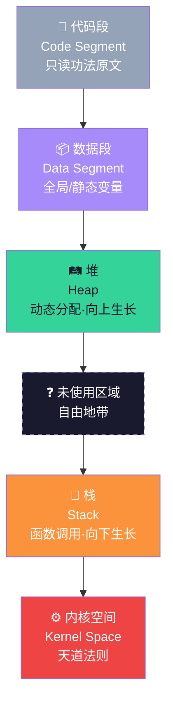
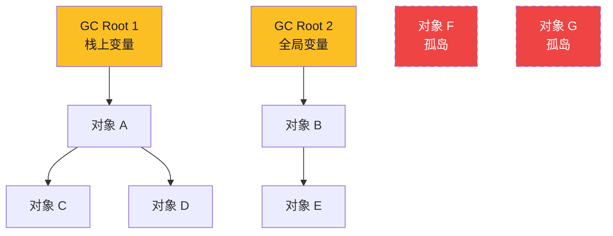

# 【金丹·14】内存管理：堆栈的灵力分配

> **码农修仙传 · 金丹期 · 第14篇**
> 我是玄芯散人，带你从炼气修到大乘。

---

## 境界标识

```
╔══════════════════════════════════╗
║     金丹期 · 第14篇               ║
║     内存管理：堆栈的灵力分配        ║
║     预计阅读：15分钟              ║
╚══════════════════════════════════╝
```

---

## 修仙引入

你有没有过这种经历：写了一段递归调用，运行时崩了，屏幕上寒光一闪——

```
Segmentation fault (core dumped)
```

或者写 C 代码，`malloc` 了一堆内存，程序越跑越慢，最后 OOM（Out of Memory）被天道斩杀。

又或者用 Java/Python 写了半天，从没手动释放过内存，却从没漏过——但某次大促，进程卡了十几秒，监控图上一条长长的大平线——这是 GC（Garbage Collection，垃圾回收）在渡劫。

这一切的根源，都在一个问题上：**你的程序在内存里是怎么放数据的？**

炼气期你只用管"代码能跑"，筑基期你懂了"代码怎么跑"。到了金丹期，你必须明白"代码在内存里怎么摆"——这就是内存管理。

修仙小说里，灵力分配是门高阶功法。灵力放在哪里、什么时候放、放多少、什么时候收回——稍有差池，轻则走火入魔，重则丹碎人亡。程序的内存管理，也是一模一样的道理。

今天这篇，我们把程序的内存当成一座灵山来巡——看清每一寸灵力是怎么分布、怎么回收、怎么泄漏的。

---

## 硬核主体

### 内存布局——程序的灵力分布图

先放下概念，咱们看一张图。这是任何一个 C 程序跑起来时，操作系统给它分配的内存全景：



我用了五张灵器图标注，每个区域对应不同的"灵力存放方式"：

| 区域 | 修仙类比 | 存什么 | 管理方式 |
|------|---------|--------|---------|
| 代码段 | 功法原文 | 程序指令（编译后的机器码） | 只读，运行时不可改 |
| 数据段 | 固定灵器 | 全局变量、静态变量 | 程序启动时分配，程序退出释放 |
| 栈 | 修炼栈台 | 局部变量、函数参数、返回地址 | 自动压栈/弹栈，函数结束即释放 |
| 堆 | 灵力矿藏 | 动态分配的内存（malloc/new） | 手动释放（C/C++）或 GC 自动（Java/Go） |
| 内核空间 | 天道禁区 | 系统调用、硬件交互 | 内核管理，用户程序不可直接访问 |

**记住一个核心要点：栈向下生长，堆向上生长。** 它们中间隔着"未使用区域"，这片区域就是程序的"灵力储备池"。如果两边都长到对方了，就会撞车——这就叫**栈溢出**或**堆溢出**，是程序崩溃的两大常见原因。

用一个具体例子感受一下：

```c
// 验证内存布局：每个变量住哪里？
#include <stdio.h>

int global_var = 100;              // 数据段：固定灵器
static int static_var = 200;       // 数据段：宗门密库

void explore() {
    int local_var = 300;           // 栈：修炼栈台
    int* heap_var = malloc(sizeof(int));  // 堆：灵力矿藏
    *heap_var = 400;

    printf("代码段   ≈ %p\n", (void*)main);     // 函数地址在代码段
    printf("数据段   ≈ %p\n", (void*)&global_var);
    printf("栈       ≈ %p\n", (void*)&local_var);  // 栈地址偏大
    printf("堆       ≈ %p\n", (void*)heap_var);   // 堆地址偏小
    // 千万别忘了 free，否则泄漏！
    free(heap_var);
}

int main() { explore(); return 0; }
```

在我的 Mac 上跑一遍，输出大概是这样：

```
代码段   ≈ 0x100003e5c
数据段   ≈ 0x100008008
栈       ≈ 0x16b3b79a4
堆       ≈ 0x136705cd0
```

栈地址是 `0x16b...`（偏大），堆地址是 `0x136...`（偏小），数据段和代码段挤在 `0x100...` 这一段。**一图就能看到内存是怎么分的**——这比背八股文直观多了。

---

### 栈——修炼栈台（FILO）

栈是程序里最"听话"的区域。**它全自动，不需要你管。** 函数调用时压一帧，函数返回时弹一帧，规规矩矩。

为啥叫"栈"？因为它遵循 **FILO（First In Last Out）** 原则——先压进去的，最后弹出来。

咱们看一段递归调用：

```c
#include <stdio.h>

void cultivate(int depth) {
    int local = depth;          // 每次调用都创建一个局部变量
    printf("修炼到第 %d 层，栈帧地址 %p\n", depth, (void*)&local);
    cultivate(depth + 1);        // 递归调用自己
}

int main() {
    cultivate(1);                // 从第一层开始
    return 0;
}
```

跑下去会发生什么？每次调用 `cultivate`，都会在栈上压一帧新的数据（参数、局部变量、返回地址）。**栈是固定大小的**（Linux 默认 8MB），压到一定深度就溢出了：

```
修炼到第 1 层，栈帧地址 0x16b3b79a4
修炼到第 2 层，栈帧地址 0x16b3b7984
...
修炼到第 9999 层，栈帧地址 ...
第 10000 层附近崩了：
Segmentation fault
```

看到了吗？栈地址是**递减**的——这就是"栈向下生长"。每一层比上一层低 32 字节（这帧的大小），压到 0 以下的禁区，操作系统就强制斩杀了。

**这就是栈溢出（Stack Overflow）的本质——你 stack 办得太高，超出天道允许的高度了。**

栈溢出的三大经典场景，记牢：

```c
// 场景1：递归太深（最常见）
void infinite_recursion() { infinite_recursion(); }  // 必崩

// 场景2：栈上分配了巨大数组
void huge_local() {
    int big[10000000];   // 40MB 栈上数组，8MB 栈直接炸
}

// 场景3：栈帧嵌套太深（递归代替循环）
void bad_recursion(int n) {
    if (n > 0) bad_recursion(n - 1);  // n=100000 就崩
}
```

栈的优缺点对照：

| 优点 | 缺点 |
|------|------|
| 分配/释放极快（移动一下栈指针） | 大小固定（Linux 默认 8MB，无法扩展） |
| 自动管理，绝不泄漏 | 不能跨函数共享（函数返回就释放） |
| 缓存友好（连续内存） | 递归太深会溢出 |

---

### 堆——灵力矿藏（自由分配）

栈自动管理很省心，但**它不适合存大对象、不适合跨函数共享、不适合大小不确定的内存**。这时候就需要"堆"——一片可以自由开采的灵力矿藏。

堆的特点是：**程序员（或 GC）手动决定什么时候分配、什么时候释放**。

C 语言里你用 `malloc/free`：

```c
#include <stdio.h>
#include <stdlib.h>
#include <string.h>

int main() {
    // 在堆上开一个 100 字节的"修炼密室"
    char* room = malloc(100);
    if (room == NULL) {           // 永远要检查！分配可能失败
        printf("灵力耗尽，OOM！\n");
        return 1;
    }

    strcpy(room, "码农修仙传");  // 使用这块内存
    printf("修炼密室里的内容：%s\n", room);

    free(room);                   // 必须释放！否则泄漏
    room = NULL;                  // 释放后置空，避免悬空指针
    return 0;
}
```

C++ 用 `new/delete`：

```cpp
// C++ 的版本
int* arr = new int[100];   // 堆上分配 100 个 int
// ... 使用 arr ...
delete[] arr;              // 必须 delete[] 而不是 delete
arr = nullptr;
```

Java/Go/Python 不用手动释放，但堆本身还是存在——只是由 GC 帮你管理。

堆的分配比栈慢得多。栈只是移动一下指针，堆要在"自由链表"里找一块合适的内存，可能还要做合并、分割、碎片整理。**频繁小分配是堆的性能杀手**。

这就是为什么有了**内存池（Memory Pool）**——程序一次性从堆申请一大块，然后自己管理小分配，避开频繁的 malloc/free。这就是矿藏里的"宗门仓库"。

---

### 内存碎片——矿藏挖空之后

堆还有个麻烦：**碎片**。

玩过 Windows 磁盘整理吗？一堆文件占满了磁盘，删来删去，最后空闲空间看着很多，但放不进一个大文件——这就是碎片。

堆也是一样的。频繁分配/释放不同大小的内存后，矿藏里会留下大大小小的空洞：


**外部碎片**：空闲内存加在一起够用，但被切成碎片，放不下大对象。

**内部碎片**：分配器为减少碎片，按 2 的幂向上对齐——你要 30 字节，分配 32 字节，浪费 2 字节。乘以百万次就是巨大的浪费。

碎片是 C/C++ 性能优化的核心难题。**Java/Go 因为有 GC 自带的整理机制，碎片问题没那么严重**——但换来的是 GC 暂停的代价。

---

### 垃圾回收——天道自动清理

Java/Go/Python/JavaScript 的同学从来没 `free` 过内存——这是因为背后有**垃圾回收（GC, Garbage Collection）**在干活。

GC 的核心问题只有一个：**怎么判断一块内存"没用了"？**

答案：**从 GC Root 出发，沿着引用链走，走不到的对象就是垃圾。**

什么是 GC Root？栈上的局部变量、全局变量、寄存器里的指针——这些是"绝对活着"的对象。从它们出发，能遍历到的对象就是活着的，遍历不到的就是死的。



加粗的方框是 GC Root，浅色是活着的对象，**虚线红色是孤岛**——C 没有 GC Root 引用它，也没人引用它，**它就是垃圾**，下次 GC 会被回收。

GC 三大主流算法：

| 算法 | 原理 | 优点 | 缺点 |
|------|------|------|------|
| 标记-清除 | 从根遍历，标记活的，清除死的 | 简单 | 碎片多 |
| 标记-整理 | 标记完，把活的挪到一起，紧凑排列 | 无碎片 | 移动对象，开销大 |
| 复制算法 | 把活的全复制到另一半，旧的整块释放 | 无碎片，速度快 | 浪费一半空间 |
| 分代收集 | 按对象年龄分区，新生代用复制，老年代用标记-整理 | 平衡效率 | 实现复杂 |

**Java 的 HotSpot、Go 的 runtime、JavaScript 的 V8 都用分代收集**——这就是为啥 GC 被称为"现代语言的自动灵气管理"。

但 GC 不是免费的。**GC 暂停（Stop The World）是程序的痛**：GC 干活时，所有业务线程都得停等。生产事故里，**最常见的 GC 问题就是 STW 太长导致接口超时**。

一个真实的惨案：某电商大促，订单服务 GC 暂停 12 秒，监控直接红线，损失几百万单。**GC 是把双刃剑——你不用手动释放了，但代价是程序会突然停顿。**

---

### 内存泄漏——灵力流失之毒

GC 也不是万能的。**GC 只能回收"没人引用"的对象——如果对象还在被引用着，GC 也救不了你。**

这就是**内存泄漏（Memory Leak）**：分配了内存，逻辑上不用了，但代码里还留着引用，GC 永远不会回收。程序跑得越久，内存占用越大，最后 OOM。

修仙类比：**你开了一个修炼密室，但忘了关门——灵力持续泄漏，整个洞府的灵力都慢慢空了。**

内存泄漏的五大经典场景，记牢：

```python
# 场景1：循环引用（GC 也救不了）
class Node:
    def __init__(self):
        self.ref = None

a = Node()
b = Node()
a.ref = b         # a 引用 b
b.ref = a         # b 引用 a
del a; del b       # 外部引用没了，但 a 和 b 互相引用，永远活着
# Python 的引用计数 GC 解不开死循环 → 内存泄漏！
```

```javascript
// 场景2：未清除的定时器/事件监听
class LeakyApp {
    constructor() {
        this.handle = setInterval(() => {
            console.log("每秒都在泄漏...");
        }, 1000);
        // 卸载组件时忘了 clearInterval(handle) → 回调永远活着
    }
}
```

```java
// 场景3：未关闭的资源（最常见）
public void readFile() throws IOException {
    FileInputStream fis = new FileInputStream("large.bin");
    // ... 读文件 ...
    // 异常路径忘了 close() → 文件句柄泄漏
}
// 正确写法：try-with-resources
public void readFileSafe() throws IOException {
    try (FileInputStream fis = new FileInputStream("large.bin")) {
        // 自动关闭
    }
}
```

```c
// 场景4：丢失的指针（C 语言经典）
void leak() {
    int* p = malloc(sizeof(int) * 100);
    p = malloc(sizeof(int) * 200);  // 第一次的 100 个 int 永远找不到了
    free(p);
}
```

```javascript
// 场景5：闭包捕获
function createHandler() {
    const hugeData = new Array(1000000).fill("data");
    return function() {
        // hugeData 被闭包捕获，永远不会释放
        console.log("I still hold hugeData!");
    };
}
```

**怎么排查内存泄漏？** 三个工具必会：

1. **Valgrind**（C/C++）：`valgrind --leak-check=full ./program`，能精确定位每一处泄漏
2. **Chrome DevTools Heap Snapshot**（JS）：拍两张快照对比，找出只增不减的对象
3. **Java Flight Recorder / VisualVM**：监控堆内存，泄漏的对象会一直涨

排查内存泄漏的口诀：**拍两次快照，对比增量，只涨不降的就是嫌疑人。**

---

## 修仙术语对照表

| 修仙概念 | 技术现实 | 一句话解释 |
|---------|---------|-----------|
| 内存布局 | 程序的虚拟地址空间分段 | 代码、数据、栈、堆各占一区 |
| 修炼栈台 | 栈（Stack） | 自动管理，函数调用压栈，返回弹栈 |
| 灵力矿藏 | 堆（Heap） | 手动或 GC 管理的动态内存 |
| Stack Overflow | 栈溢出 | 递归太深或栈帧太大，超出栈空间 |
| 内存碎片 | 堆碎片 | 频繁分配释放后，空闲内存零散不连续 |
| malloc/free | 手动内存管理 | C/C++ 中分配和释放堆内存 |
| 垃圾回收（GC） | 天道自动清理 | 自动识别并释放不可达对象 |
| GC Root | 引用起点 | 栈变量、全局变量、寄存器里的指针 |
| 标记-清除算法 | 基础 GC 算法 | 标记活对象，清除死对象 |
| 分代收集 | 现代 GC 策略 | 按对象年龄分区，新老对象用不同算法 |
| 内存泄漏 | 灵力流失 | 引用未断开，GC 无法回收 |
| 循环引用 | 死循环引用 | 两个对象互相引用，外部引用断开后仍存活 |
| 内存池 | 自主管理子区 | 一次性申请大块内存，自己分配小块，性能更好 |
| 悬空指针 | dangling pointer | free 后未置 NULL，再使用就崩 |
| Stop The World | GC 全局暂停 | GC 运行时所有业务线程暂停 |

---

## 突破条件

金丹期 → 元婴期的关键，是能"看穿程序的内存"。下面五条，你勾了几条？

- [ ] 能画出 C 程序的内存布局图（代码段、数据段、栈、堆）
- [ ] 理解栈和堆的本质区别（自动 vs 手动，向下 vs 向上生长）
- [ ] 能解释栈溢出的成因（递归太深、栈帧太大）
- [ ] 知道什么是内存碎片，以及为什么会产生
- [ ] 能解释 GC 的基本原理（标记-清除 / 分代收集）
- [ ] 能识别五大常见内存泄漏场景
- [ ] 会用至少一种内存检测工具（Valgrind / DevTools / JFR）

>**最后一条是关键。** 工具用熟了，内存泄漏就不是玄学——它就是一份可以打印出来的报告。

五条全勾，你就能叩开元婴期的大门。**元婴期是码农修仙传的主场——我们将深入 CPU 微架构、汇编、缓存行、SIMD、操作系统内核。** 这些都是把"高级语言"还原到"机器码"的硬功夫。

---

## 下期预告 + 互动

> **下一篇：【金丹·15】……（金丹期最后 1 篇）**

金丹期马上要收尾了。第 15 篇，我们将总结金丹期的全部修炼——编译器、内核、缓存、线程、内存——这五座灵山如何协同运行，再为下一阶段（**元婴期 = 硬件底层主场**）做铺垫。

现在问你：

> 🎮 **互动一**：你被栈溢出/内存泄漏坑过吗？是因为什么场景？评论区说说你的"灵力流失"惨案。
>
> 💬 **互动二**：你平时用什么工具排查内存问题？Valgrind？DevTools？JFR？来推荐你的"内存探测法器"。

> 我是玄芯散人，带你从炼气修到大乘。

---

*本文是「码农修仙传」系列第14篇。系列导航见 [xren.ren](https://xren.ren)*
