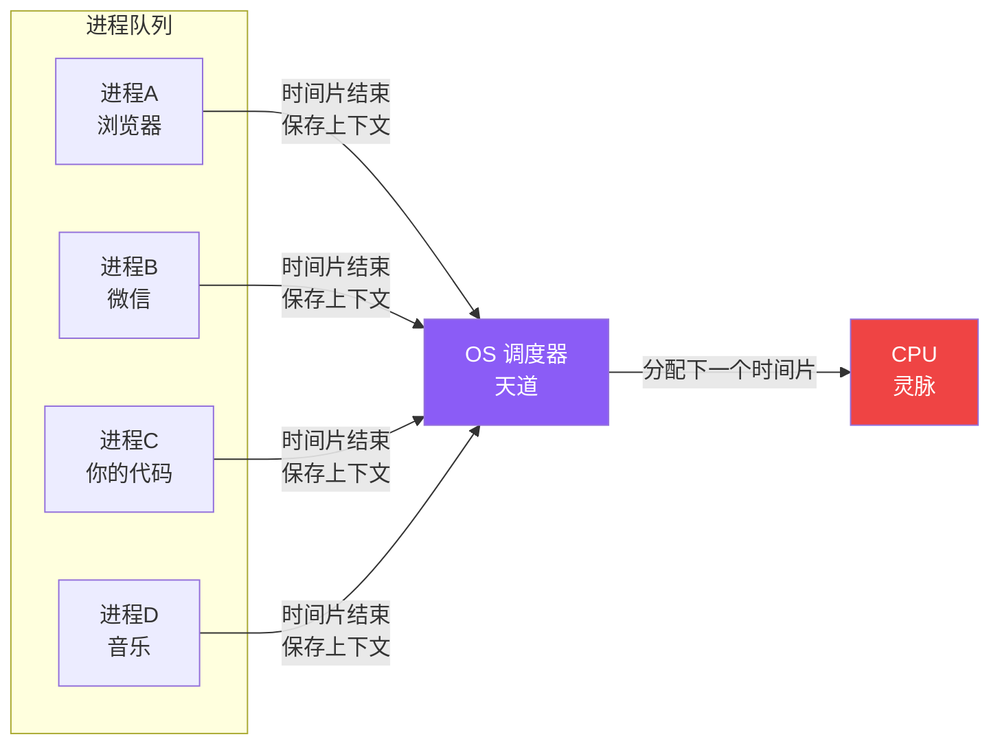

# 【筑基·05】你的代码在CPU里跑了一圈

> **码农修仙传 · 筑基期 · 第5篇**
> 我是玄芯散人，带你从炼气修到大乘。

---

## 境界标识

```
╔══════════════════════════════════╗
║     筑基期 · 第5篇               ║
║     你的代码在CPU里跑了一圈       ║
║     预计阅读：10分钟              ║
╚══════════════════════════════════╝
```

---

## 修仙引入

你写了一行 `a = 1 + 2`，回车，得到 3。

整个过程不到一毫秒。但如果你能在那一刻按下时间暂停键，往里看一眼——

这一行代码跑过了**编辑器、编译器、操作系统、内存、CPU 总线、寄存器、ALU**，再原路返回，最终在你的屏幕上显示出那个 "3"。

修真小说里，筑基期最重要的能力叫**「内视」**——能用神识看清自己经脉里灵气的走向，知道灵气从哪里来、流经哪里、汇入何处。

对应到编程，筑基期要修的就是这种"内视"——**看清一行代码从键盘到屏幕到底跑过哪些节点**。今天我们跟着 `int a = 1 + 2;` 这一行，跑完一整圈。

---

## 硬核主体

### 一行代码的十站旅程

先看全景。一行 C 代码从你敲下回车键到屏幕上显示出"3"，中间过了**十个驿站**：


十个驿站，每个都有自己的"修仙名号"：

| 驿站 | 修仙类比 | 技术环节 | 耗时占比 |
|------|---------|---------|---------|
| ① 敲代码 | 在纸上写下功法口诀 | 编辑器里输入源代码文本 | 你说了算 |
| ② 编译 | 功法口诀被翻译成天地规则 | 编译器：词法分析 → 语法分析 → 生成汇编 | ms 级 |
| ③ 机器码 | 天地规则化为符文 | 生成可执行的二进制文件 | 一次性 |
| ④ 加载 | 符文被送入灵脉 | OS 把可执行文件加载到内存 | ms 级 |
| ⑤ 取指 | 灵脉中灵力流动 | CPU 从内存取指令 | ns 级 |
| ⑥ 解码 | 符文被解读 | CPU 解析指令类型 | ns 级 |
| ⑦ 执行 | 灵力在经脉中运算 | ALU 算数运算 | ns 级 |
| ⑧ 写回 | 结果写入丹田 | 写回寄存器 / 内存 | ns 级 |
| ⑨ 程序读 | 丹田反馈到神识 | 程序通过变量读取结果 | ns 级 |
| ⑩ 屏幕 | 神识显化为外象 | stdout 输出到显示器 | ms 级 |

注意最后一行：**CPU 内部那几步加起来只要几纳秒，但代码从编辑器到屏幕的整条链路却是毫秒级**。换句话说，**90% 的时间花在了"CPU 之外"**——编译、加载、显示这些"周边开销"上。

这也是为什么"快"的代码要尽量减少 CPU 不参与的工作——比如少用高级语言的动态特性，少做磁盘 IO，因为 CPU 算得再快，磁盘一卡就是几十毫秒。

---

### CPU 的取指-执行循环

现在我们重点看第⑤-⑧步——**CPU 内部到底在干什么**。

现代 CPU 的核心运作遵循冯·诺依曼架构的指令周期：**取指 → 解码 → 执行 → 访存 → 写回**。五步一个循环，每条指令都跑完这五步。

把这一行 C 代码拆开看：

```c
// 源码：你写的
int a = 1 + 2;
```

编译器把它翻译成 ARM64 汇编（精简后的核心部分）：

```asm
; 编译产物：CPU 真正执行的指令
mov  w0, #1          ; 第一步：把"1"放入寄存器 w0
mov  w1, #2          ; 第二步：把"2"放入寄存器 w1
add  w0, w0, w1      ; 第三步：w0 = w0 + w1，算出 3
str  w0, [sp, #4]    ; 第四步：把 3 存到栈上变量 a 的位置
```

你写的一行 C 代码，CPU 实际跑了**四条汇编指令**。每一条都完整经过取指-解码-执行-访存-写回这五步。

用修仙的视角看 CPU 这五步：

| CPU 步骤 | 修仙类比 | 含义 |
|---------|---------|------|
| **Fetch 取指** | 从丹田引灵 | CPU 通过地址总线从内存读一条指令到指令寄存器 |
| **Decode 解码** | 辨识灵气属性 | 控制单元解析这条指令是干什么的（加法？跳转？存数？） |
| **Execute 执行** | 运功炼化 | ALU 做实际运算（1+2 这种纯计算） |
| **Memory 访存** | 进出丹府 | 从内存读数据（load）或准备写数据（store） |
| **Write Back 写回** | 灵力归丹田 | 把运算结果存到寄存器 |

这五步在现代 CPU 里并不是串行的——**流水线（pipeline）**让不同指令的不同阶段可以并行。CPU 里有 N 个阶段槽，当前指令在解码时，下一条已经在取指了。

修仙类比：流水线的奥义在于"边引灵边运功"。你从丹田引灵的同时，可以已经在炼化上一缕灵气；这缕灵气在写回丹田的同时，下一缕已经在运功。**多条灵气同时处在不同阶段**，这就是流水线——CPU 速度能跑这么快的根本原因。

但流水线的代价是**分支预测失败**会清空流水线。如果 CPU 猜错了下一条指令，整个流水线要重灌，损失几十个周期。这就是为什么 `if/else` 多、写不清楚的代码会"卡"——不是 CPU 慢，是它猜错了。

**进阶：现代 CPU 怎么把流水线用到极致**

光有流水线还不够，CPU 还搞了三件更骚的事：

- **超标量（Superscalar）**：一个周期发多条指令。修仙类比——同一时刻丹田里有多条灵气同时被炼化。
- **乱序执行（Out-of-Order Execution）**：指令不按顺序跑。CPU 看哪个数据先到就先算哪个，不卡着等。修仙类比——经脉里哪条灵气先走完就走完，不按起手顺序。
- **分支预测（Branch Prediction）**：猜下一条指令。猜对了白赚十几周期，猜错了清空流水线。修仙类比——天道预判你下一个动作，提前把灵气备好；猜错了就要重新调度。

这三件事加在一起，让现代 CPU 的 IPC（Instructions Per Cycle）能到 3-4 ——也就是说一周期实际跑 3-4 条指令。但**只要遇到缓存未命中、分支预测失败、数据依赖**这三类"流水线冒险"，立刻打回 0.1 IPC。

程序员能做的就是**减少这三类冒险**——少写复杂分支、保持数据紧凑、避免随机访问。这些我们在数据结构篇会继续展开。

---

### 寄存器、缓存、内存——速度差 1000 倍的三层丹田

CPU 算完 `1 + 2 = 3` 之后，结果存在哪？答案是**寄存器**——CPU 内部最快的存储单元，零延迟。

但寄存器很贵。CPU 里只有几十个寄存器（ARM64 是 31 个通用寄存器），放不下所有数据。所以 CPU 设计了一个**多层存储体系**，越靠近 CPU 越快、越小、越贵：

| 层级 | 修仙类比 | 容量（典型） | 访问延迟 | 速度差 |
|------|---------|------------|---------|--------|
| **寄存器** | 神识即时可达 | ~32 个 × 8 字节 | 0 周期（< 1ns） | 1× |
| **L1 缓存** | 上丹田（眉心） | 32-64 KB | ~1ns（3-5 周期） | 5× |
| **L2 缓存** | 中丹田（膻中） | 256 KB - 1 MB | ~4ns（10-14 周期） | 50× |
| **L3 缓存** | 下丹田（脐下） | 4 - 64 MB | ~12ns（40-70 周期） | 200× |
| **主内存** | 丹府仓库 | 8 - 64 GB | ~80ns（200+ 周期） | 1000× |
| **SSD** | 宗门宝库 | 几百 GB - TB | 50-150 μs | 100,000× |
| **机械硬盘** | 远古遗迹 | TB 级 | 5-15 ms | 10,000,000× |

注意**速度差那一列**——从寄存器到内存，已经差了 1000 倍。如果数据落到 SSD，差 10 万倍；落到机械硬盘，差 1000 万倍。

修仙类比三层丹田的实感：

> **寄存器 = 神识可达**：你想到某个数字，这个数字就在你脑子里。零延迟。
>
> **L1 缓存 = 上丹田**：意识一动就到，但容量极小。眉心那点空间，只够放眼下最关键的几缕灵气。
>
> **主内存 = 丹府仓库**：要拿到东西，得走出丹田、走过经脉、到仓库里取。来回要走一段路。
>
> **磁盘 = 宗门宝库**：在深山老林，要走很远的路才能到。如果你要的丹药在宝库深处，得花几十毫秒走一趟——这段时间 CPU 啥也干不了，只能干等。

程序员做性能优化，核心就一句话：**让数据尽量待在离 CPU 近的地方**。

- 不要在循环里反复创建对象（每次创建都到"丹府仓库"取内存）
- 数组按行访问比按列访问快（CPU 一次加载一整块缓存行，按行访问能复用）
- 用 `StringBuilder` 而不是字符串拼接（避免反复分配新内存）

这些优化技巧看似零散，本质都是**减少"丹府仓库"的往返次数**。

这就是为什么"局部性原理"（Locality）这么重要——CPU 加载数据时不是只加载你要的那个字节，而是把**周围一块数据**一起搬进缓存。如果你接下来访问的地址就在这块缓存里，那就是缓存命中；如果跑到了千里之外，就是缓存未命中，要重新从内存加载。

**修仙类比**：灵气从丹府引到上丹田时，宗门不是只引你要的那一缕，而是把那一带几十缕灵气都搬过来了。如果你接下来要炼化的正好是这一带的，那就是命中；如果要的是千里之外丹府的某缕特殊灵气，那就只能重新走一趟——这就是未命中。

---

### 操作系统在背后做了什么

你以为你的程序独占 CPU？**错。**

你的进程在跑的同时，操作系统里还有浏览器、微信、IDE、音乐播放器……可能几百个进程在排队等 CPU。

修真小说里，宗门弟子都用同一座灵脉修炼。每个人练功都觉得自己"独占灵脉"，但实际上宗门（天道）在背后极快地切换每个人的修炼状态——这个月给张三练，下个月给李四练，谁都察觉不到。

OS 的**时间片轮转调度**就是这个机制：



每个进程跑 1-10 ms（一个"时间片"），就被强制打断——CPU 把它的所有寄存器状态、PC 指针、栈指针**全部保存**到内存里，然后加载下一个进程的状态。这个动作叫**上下文切换（Context Switch）**。

代价：上下文切换本身要 1-10 μs 时间。如果系统里有几百个进程，OS 一秒钟可能切换几千次——这就是为什么进程数太多的服务器会变慢。

修仙类比：
- **进程 = 宗门弟子**：每个弟子都觉得自己在独占灵脉
- **时间片 = 一次闭关时间**：宗门给每个弟子分配的修炼时段（比如 5 息）
- **上下文切换 = 换弟子时的清场**：上一个弟子要把修炼进度收好，下一个弟子要把自己的状态摆好
- **OS 调度器 = 天道**：绝对公平地分配灵脉，谁也挑不出毛病

但还有更狠的——**虚拟内存**。

你写的 C 程序里访问一个指针 `int *p = 0x12345678`，访问的是这个地址。但实际上**这个地址是假的**——OS 给每个进程画了一张大饼，让每个进程以为自己独占了 4GB 内存空间。真实物理内存可能只有 8GB，但 OS 让几百个进程都觉得自己独占全部。

底层机制是 **MMU（内存管理单元）** 做的地址翻译。每次你访问一个虚拟地址，MMU 都查一张表，把它翻译成真实的物理地址。如果翻译不到，触发**缺页中断**——OS 把磁盘上的那块数据搬到内存，再返回给你。

修仙类比：

> **虚拟内存 = 心象世界**：修仙者内观时看到的丹田、识海是"心象"，并非真实。但心象世界有自己的逻辑和规则，你可以安心在内修行。你以为你在心象里走了 10 里路，其实真实肉身根本没动。
>
> **物理内存 = 真实肉身所在的灵气空间**：那个才几丈见方。但因为心象的扩展性，你感觉自己在浩瀚宇宙里行走。
>
> **缺页中断 = 心象与肉身割裂**：你以为在修炼的某个动作，实际上对应到肉身是一个全新的姿势，需要 OS（天道）重新对齐。这就是为什么"打开一个大程序很慢"——不是程序逻辑慢，是 OS 在做地址翻译、对齐心象和肉身。

---

## 修仙术语对照表

本篇用到的修仙术语，跟技术现实的对应关系：

| 修仙术语 | 技术现实 | 本篇详解 |
|---------|---------|---------|
| 内视经脉 | 理解代码执行的完整链路 | 全篇主线 |
| 十站驿站 | 代码从编辑器到屏幕的十个环节 | §十站旅程 |
| 取指-解码-执行-访存-写回 | CPU 指令周期的五个阶段 | §取指-执行循环 |
| 流水线 | CPU 多指令并行执行 | §取指-执行循环 |
| 分支预测失败 | 流水线冲刷（pipeline stall） | §取指-执行循环 |
| 三层丹田 | 寄存器 / 缓存 / 主内存三层体系 | §速度差 1000 倍 |
| 神识即时可达 | 寄存器（零延迟访问） | §三层丹田 |
| 局部性原理 | CPU 缓存利用规律 | §三层丹田 |
| 丹府仓库 | 主内存（DRAM） | §三层丹田 |
| 宗门宝库 | SSD / 磁盘 | §三层丹田 |
| 灵脉被分配 | CPU 时间片调度 | §OS 调度 |
| 上下文切换 | Context Switch（保存/恢复寄存器） | §OS 调度 |
| 天道（调度器） | OS Scheduler | §OS 调度 |
| 心象世界 | 虚拟内存（Virtual Memory） | §OS 调度 |
| MMU 地址翻译 | 心象对齐肉身 | §OS 调度 |
| 缺页中断 | 心象动作需对齐真实肉身 | §OS 调度 |

想查全系列术语？看 [术语词典](/glossary)。

---

## 突破条件

筑基·05 → 筑基·06 的突破，看这五条：

- [ ] 能不假思索地画出代码从编辑器到屏幕的十个驿站
- [ ] 理解 CPU 的取指-解码-执行-访存-写回五阶段，并能说出流水线的意义
- [ ] 能默写出寄存器、L1/L2/L3、主内存的速度阶梯（知道差 1000 倍这个量级）
- [ ] 理解为什么需要缓存、什么是缓存命中 / 未命中
- [ ] 知道 OS 在背后做了进程调度和虚拟内存两件大事

五条全勾，你才真正"内视"到了代码在 CPU 里的运行真相。

> 筑基四座地基（数据结构、操作系统、数据库、计算机网络），本篇打的是"操作系统"这块地基的第一锹土。下一篇继续往深里挖——**数据结构怎么选，直接决定 CPU 要跑多少趟**。

---

## 下期预告 + 互动

> **下一篇：【筑基·06】数据结构就是功法——为什么 ArrayList 比 LinkedList 快**
>
> 你的代码跑起来了，但跑得快不快，**7 成取决于你用什么数据结构**。
> 下一篇讲清楚：数组、链表、哈希表、栈、队列——每种数据结构都是一件法器，
> 选错了法器，再牛的功法也打不出伤害。

现在问你：

> 🎮 **自测**：你能默写出"代码从键盘到屏幕的十个驿站"吗？试着用一句话说清楚第⑤-⑧ 步（CPU 内部）在干啥。评论区写下你的答案！
>
> 💬 **话题**：你之前以为 CPU 跑代码是"一瞬间"还是"一长串"？知道真相后有没有颠覆感？说出来分享！
>
> 🔔 关注玄芯散人，筑基期修炼不迷路。下一篇带你认清数据结构这件"法器"。

> 我是玄芯散人，带你从炼气修到大乘。

---

*本文是「码农修仙传」系列第5篇。系列导航见 [xren.ren](https://xren.ren)*